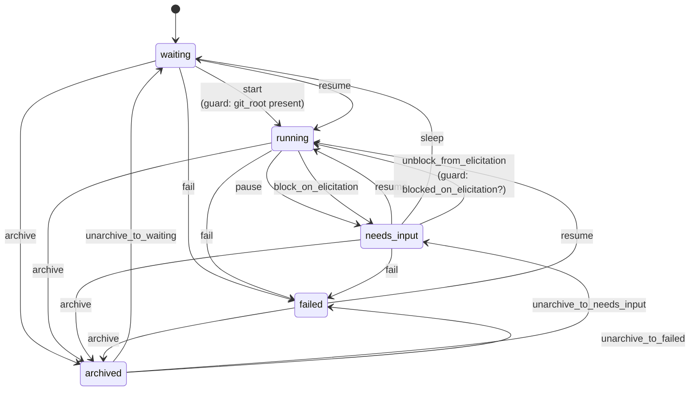

Every session is in exactly one of five states. The transitions between them are enforced by
AASM in `app/models/concerns/session_state_machine.rb`, and each one carries side effects that
are as important as the state change itself.

## The states

| State | DB value | Meaning |
| --- | --- | --- |
| `waiting` | 1 | Queued, or dormant awaiting a scheduled wake-up. The initial state. |
| `running` | 0 | An agent process is alive and a monitoring job owns it. |
| `needs_input` | 2 | The agent's turn ended, or it's blocked on an elicitation. This is your to-do list: agents archive themselves on completion, and a session waiting on its own PR archives when that PR merges, so what stays here is meant to need you. See [goals](/sessions/goals/). |
| `failed` | 4 | Terminal error. Resumable. |
| `archived` | 3 | In the trash. Restorable until the clone is reaped. |

The integer values are load-bearing (they're the existing ActiveRecord enum). A sixth state,
`corrupted` (5), was removed — sessions now go to `failed` instead.

## The full machine


```mermaid
stateDiagram-v2
    [*] --> waiting

    waiting --> running: start<br/>(guard: git_root present)
    running --> needs_input: pause
    needs_input --> running: resume
    waiting --> running: resume
    failed --> running: resume
    needs_input --> waiting: sleep

    running --> needs_input: block_on_elicitation
    needs_input --> running: unblock_from_elicitation<br/>(guard: blocked_on_elicitation?)

    waiting --> failed: fail
    running --> failed: fail
    needs_input --> failed: fail

    waiting --> archived: archive
    running --> archived: archive
    needs_input --> archived: archive
    failed --> archived: archive

    archived --> waiting: unarchive_to_waiting
    archived --> needs_input: unarchive_to_needs_input
    archived --> failed: unarchive_to_failed
```

:::note[The old `docs/SESSION_STATE_MACHINE.md` was missing five of these]
It documented `start`, `sleep`, `pause`, `resume`, `fail`, and `archive`. It did not
document `block_on_elicitation`, `unblock_from_elicitation`, or the three `unarchive_to_*`
events. It also claimed you cannot archive a running session — you can; `archive` transitions
from `waiting`, `running`, `needs_input`, *and* `failed` (the UI exposes this as force-archiving
a stuck session).
:::

## The events, and what they actually do

### `start` — `waiting → running`

Guarded on `git_root` being present. Resets the elapsed-time counter and logs.

### `pause` — `running → needs_input`

Fired when the agent's turn ends (the process exits normally). This is the workhorse
transition, and it does seven things beyond changing status:

1. `warn_if_pr_goal_captured_no_url` — if the session's goal mentions a pull request and
   `custom_metadata["github_pull_request_urls"]` is still empty, write one `warning` log to the
   timeline. `GithubPrUrlHook` only records a PR it can see the session open, and an empty list is
   otherwise indistinguishable from "no PR to record" — see
   [transcript hooks](/extend/transcript-hooks/). Never raises, and once per **session**, not once
   per event: `fail` and `archive` call it too, and the dedup is on the warning log itself, so a
   session that pauses, warns, and later archives says it once.
2. `cleanup_running_job` — clears `running_job_id`.
3. `fire_ao_event_triggers("session_needs_input")` — wakes anything watching this session.
4. `enqueue_debounced_needs_input_push_notification` — see below.
5. `enqueue_session_inference_if_needed` — LLM-generates a title and category if still pending.
6. `enqueue_status_summary_refresh` — the **only** automatic trigger for the
   [Status summary](/sessions/status-summary/). The generator still refuses when the session has
   not moved since the last one, so a transition that added no transcript costs nothing.
7. `execute_pending_sleep` — if a wake-up was scheduled while the session was *running*, the
   sleep was deferred to here; now it fires.

Steps 3–6 are skipped for one kind of session: a **status-summary fork**, which is Zimmer's own
throwaway (marked in metadata by `SessionStatusSummaryGenerator::FORK_MARKER`). Its pause means its
one turn is finished, so it is harvested and archived instead of notifying anyone or landing in the
action queue.

The debounce is worth understanding. Sessions sometimes flap `running → needs_input →
running` between turns, and without debouncing every flap would push a notification. So the
push job is enqueued with a 60-second delay (`NEEDS_INPUT_DEBOUNCE`) carrying a monotonic
marker from `custom_metadata["needs_input_count"]`. If the session churns during the window,
the marker won't match and the deferred job no-ops.

### `resume` — `waiting | needs_input | failed → running`

Unguarded, deliberately. The preconditions for resuming — a clone on disk, a runtime
session id to resume into, a live process to reattach to — are established or validated by
`AgentSessionJob`, which recovers what it can and fails the session with a specific
`failure_reason` when it cannot. The state machine does not re-check them, so a resume you
ask for is a resume the job gets to attempt.
Clears a pile of stale state: MCP failure flags, the `paused_by` marker, the
`blocked_on_elicitation` and `lost_elicitation` markers, any `pending_sleep`, and, importantly, it
cancels pending one-time wake-up triggers targeting this session, so a scheduled wake
doesn't fire on a session you already resumed by hand.

#### A system-recovery resume keeps the wake-ups

That cancellation is right for a *deliberate* resume and wrong for a recovery one. When Zimmer
restarts a session's process after an interruption — a deployment restart, an orphaned process, a
hung process reaped, a health-monitor retry — the session did not choose to wake, so the wake-ups
it was sleeping on are still exactly what it is waiting for. Consuming them there is how an
orchestrator gets stranded: it comes back with nothing armed, ends its turn, and sits in
`needs_input` indefinitely with children it was supposed to be watching.

Recovery paths therefore call `Session#resume_for_system_recovery!` rather than `resume!`. It sets
the transient `system_recovery_resume` flag for the duration of the transition, and
`cancel_pending_one_time_wake_triggers` takes a preserve branch instead:

- The pending conditions are **left armed** — nothing is consumed.
- If one of them is a one-time *schedule* (a `wake_me_up_later` deadline backstop), `pending_sleep`
  is set so the session returns to `waiting` once the recovery turn ends. A wall-clock wake fires
  regardless of what else happens, so sleeping on it cannot strand the session.
- If the only pending wakes are session-scoped `ao_event` watchers, the session comes to rest in
  `needs_input` with those watchers still armed. A watched session may have reached the state being
  watched for *during* the outage, and that transition is not replayed — so sleeping would trade a
  long stall for an indefinite one. `Trigger#follow_up_session!` delivers to a `needs_input` session
  just as well, and the operator can see it in the meantime.

That re-sleep is conditional at execution time as well as at resume time. It is recorded as
`pending_sleep` plus a `pending_sleep_requires_wake` marker, and `execute_pending_sleep` drops it
rather than sleeping if nothing is armed by the time the turn ends. A backstop whose wall time
elapsed during the outage is due the moment recovery resumes the session, so it can fire mid-turn,
destroy its siblings and hand off to a new turn without ever pausing — and sleeping on that stale
intent would leave the session in `waiting` with nothing armed and no `paused_by`, invisible to both
recovery sweeps. A deliberate sleep (`POST /api/v1/sessions/:id/sleep` on a running session) carries
no marker and is always executed, because arming nothing is exactly what it means.

One recovery path deliberately does *not* preserve: when `continue_recovered_session` finds a queued
user message, it delivers that instead of the recovery prompt, via a normal `resume!`. A waiting
user message means someone has taken the session over, which is the case the cancelling semantics
are for.

The invariant this restores: a session that was in `waiting` with wake-ups registered does not
silently end up in `needs_input` with none.

### `sleep` — `needs_input → waiting`

The "wake me up later" path. The session goes dormant and a one-time schedule trigger will
resume it. If the wake-up is scheduled while the session is *running*,
`metadata["pending_sleep"] = true` is set and the actual transition happens on the next `pause`.

Agents reach this through the `wake_me_up_later` MCP tool, but Zimmer also uses it on its own
behalf: `AuthOutageParkService` parks a session here when the login pool runs dry, which is what
keeps a quota-blocked session out of the heartbeat sweep's reach. See
[Agent harness auth](/auth/harness/#when-the-pool-runs-dry).

### `block_on_elicitation` / `unblock_from_elicitation` — `running ⇄ needs_input`

This pair exists because an elicitation is *not* a turn ending. An MCP server made a
synchronous request and is blocked waiting for the human; the agent process is still alive.
So `block_on_elicitation` surfaces the session as `needs_input` (to get it on your homepage and
into the notification path) but does not call `cleanup_running_job` — killing
the process would break the round-trip.

A metadata marker (`blocked_on_elicitation`) distinguishes this from a real pause, and guards
the flip back.

:::caution[Stranded elicitation blocks are a real failure mode]
If the reactive unblock is missed — a swallowed `AASM::InvalidTransition` from a state race, or
the MCP server crashing mid-round-trip — the marker is left set with nothing to clear it, and
the session sits in `needs_input` showing a phantom "blocked on elicitation".

`CleanupExpiredElicitationsJob` sweeps for this every 5 minutes and calls
`clear_stale_elicitation_block!`, which strips the marker and leaves the session
in `needs_input`; flipping it to `running` would create a phantom running session with no
monitoring job. A minutes-old stranded block has no live round-trip to resume into.

Leaving it there and saying nothing is its own lie, though — a session parked in `needs_input`
with no banner reads as merely idle. So a stranded `needs_input` session gets a
`lost_elicitation` marker naming what happened, which the session page renders as a banner. See
[Elicitation](/sessions/elicitation/#when-a-round-trip-ends-without-an-answer).
:::

### `fail` — `waiting | running | needs_input → failed`

Cleans up the running job, fires `session_failed` triggers, enqueues a push notification
that bypasses the per-session opt-in, and — like `pause` — enqueues a
[Status summary](/sessions/status-summary/) refresh. The reasoning behind the unconditional push:
by the time `fail!` fires, retries are already exhausted, so this is a final non-self-resolving
event. A silent status flip would be worse than an unwanted push.

A status-summary fork that fails is harvested (recording the failure on the source session's
summary) instead of notifying, exactly as on `pause`.

It also runs `warn_if_pr_goal_captured_no_url`, last in the callback so nothing above it can be
skipped. A session that dies mid-turn never reaches `pause`, so a PR it opened and never named
would be recorded nowhere at all ([#313](https://github.com/tadasant/zimmer/issues/313)).

### `archive` — any state → `archived`

Sets `archived_at`, retires any messages still queued for the session, dismisses notifications,
fires `session_archived` triggers, cleans up triggers watching this session, sets a trash expiry,
and — last, for the same reason as on `fail` — runs `warn_if_pr_goal_captured_no_url`. A session trashed straight from `needs_input`
is one nobody is coming back to, so this is where a PR opened and never recorded gets said out
loud.

Neither this nor `fail` is literally terminal — `resume` runs from `failed` and the three
`unarchive_to_*` events from `archived` — so the warning keeps `pause`'s point-in-time honesty:
it says what was true when it was written ("no PR URL **yet**") and, because the dedup is
once-per-session, it is not retracted if the session is later revived and does open one.

Status-summary forks are carved out inside the hook rather than at the call site. The generator
strips the goal a fork inherits, but only in `prepare_fork` — a fork abandoned before that point
still carries the source's "open a PR", so the goal check alone would not have covered it.

#### The archive line names who did it

Every other transition has one obvious cause. `archive` has six unrelated callers — the web UI,
the REST API, the MCP API, `HealthMonitorService`'s stale-session sweep, status-summary fork
cleanup, and a session archiving itself — and they all used to leave the same five words in the
timeline. So "why did my session get archived?" could not be answered from the session page:
a human clicking **Trash** and another agent archiving the session out from under its own
unfinished work looked identical, and telling them apart meant reading a different session's raw
transcript off disk.

Callers set `session.archive_actor` immediately before `archive!`, and the line names it:

```
[State Machine] Session moved to trash by session #5225 via the MCP API
[State Machine] Session moved to trash by a user in the web UI
[State Machine] Session moved to trash by Zimmer's stale-session sweep (untouched for 7 days)
```

The actor is transient, never persisted, and never inferred. An archive from a console or a test
says `by an unrecorded caller` rather than claiming an actor it does not have.

On the MCP API the actor is **self-declared**, through the same `acting_session_id` argument
`follow_up` uses and for the same reason: the API key is shared by the whole fleet, so nothing
about the request identifies the caller. An archive that declares nothing is logged as
`by an undeclared MCP API caller` — which still answers the question that matters, because a
human archiving a session does it from the web UI. The injected self-session server names itself
separately (`via the self-session MCP server`), since its tool group narrows the *actions* a
session may take, not the `session_id` it may aim them at.

#### Archiving retires the message queue

Archiving ends every path by which a queued message could still be delivered.
`EnqueuedMessageProcessorService` claims `pending` rows only, and for a live session the only
thing that calls it is `AgentSessionJob`'s end-of-turn drain — which an archived session never
reaches, because the monitoring loop sees `archived?` and terminates the process instead of
pausing.

Those rows used to stay `pending` anyway, and that is what made a dropped message silent. Every
reader of the queue — the panel on the session page, `GET /api/v1/sessions/:id/enqueued_messages`,
the MCP `manage_enqueued_messages` list — treats `pending` as *still going to be sent*. So did the
sender: `follow_up` without `force_immediate` auto-queues onto a running session and answers
*"Message queued (session is running). It will be sent when the agent completes its current
task"*, which is a promise rather than a receipt.

The window is not exotic. Goals routinely tell an agent to archive itself once its work is done,
so a session that is `running` when you queue a message may legitimately never become idle again:
it goes `running` → `archived` and the queue never drains. Any two messages arriving inside one
agent turn can hit it. Production session 6073 did — a user's second Slack message queued behind
their first, the session archived at the end of that same turn, and the message sat `pending` in a
queue nobody would ever drain.

So `archive` moves them to `undelivered`, a fourth, terminal status alongside
`pending`/`processing`/`sent`. Three things follow from that:

- The queue can no longer misreport itself. `undelivered` is not `pending`, so the claim query
  cannot take it — including after an `unarchive_to_*`, where a weeks-old message would otherwise
  arrive as if it had just been sent.
- The archive line names what was lost, next to the unresolved-PR clause and for the same reason:

  ```
  [State Machine] Session moved to trash by session #5225 via the MCP API — 1 queued message was
  never delivered and is now marked undelivered: "What do you mean I pulled yellow onion?..."
  ```

- An alert fires, deduped per session. Unlike the unresolved-PR clause this *is* an anomaly: a
  message was accepted and never delivered, and the only reason to find that out from a user
  noticing is that nothing else said it.

The row itself is kept, not destroyed — its content is the thing the sender was promised delivery
of — and the session page lists it, marked as never delivered. That listing sits outside the
follow-up form rather than inside the live queue panel, because the form is hidden once a session
is archived, which is the state these rows exist in.

#### Archiving over a queued message is refused, and `force` is the way through

Retiring the messages records the loss; it does not undo it, and recording a discard is not the
same as intending one. So an archive over a non-empty queue is **refused**, on every surface — the
MCP `archive` and `bulk_archive` actions, `POST /api/v1/sessions/:id/archive`, and the web UI's
**Trash** button:

```
Cannot archive session 6073: 1 queued message has not been delivered. Archiving discards it.

  1. What do you mean I pulled yellow onion? I didn't do that, add it back

Do not archive. If you are this session, end your turn instead — the queued message is delivered
as your next turn, and archiving after that succeeds because the queue is empty. If you are
archiving another session, leave it alone and let it consume what you sent it.

Only if you have read the message above and are deliberately discarding it: re-call with
"force": true. That is not the recommended path — the message was accepted from someone who was
told it would be delivered, and forcing throws it away.
```

The refusal leads with what not to do, because for the caller that meets it most — a session
archiving itself at the end of a turn — not archiving is free and correct. An agent self-archives
because it believes its work is finished, and a message that landed mid-turn is exactly the
evidence that the belief is stale. It ends its turn instead, the pause drains the queue, the
message arrives as the next turn, and the archive succeeds after that because the queue is empty.

**`force` is the deliberate override**, off by default, for a caller that has read the message and
is choosing to discard it. It is named last in the error and hedged in its own schema description,
because it exists for the exception rather than the rule. Forcing does not make the discard
invisible: the messages are still retired to `undelivered`, the archive line still names them, and
the alert still fires — so what was thrown away stays readable afterwards.

Every state that can archive is covered, `needs_input` and `failed` included. Nothing drains their
queues, which makes the discard there certain rather than merely likely — and a refusal without an
override would leave those sessions permanently un-archivable, which is why `force` and the full
coverage are one design rather than two. The same reasoning puts `force` on the narrowed
`self_session` schema: a session archiving itself is the caller that meets the refusal most, and
would otherwise be the one caller with no way past it.

The surfaces differ only in how `force` is expressed, not in whether the discard is refused:

| Surface | Refusal | Override |
| --- | --- | --- |
| MCP `archive` | `ToolError` naming the messages | `"force": true` |
| MCP `bulk_archive` | per-session error, batch continues | `"force": true`, applied to the whole batch |
| `POST /api/v1/sessions/:id/archive` | 422 with the same text | `force: true` |
| `POST /api/v1/sessions/bulk_archive` | per-session entry in `errors`, batch continues | `force: true`, whole batch |
| Web **Trash** | flash naming what would be lost | an **Archive anyway** button that re-posts with `force` |
| Web bulk archive | skipped, and the count is reported | none — archive those individually to confirm |

The web bulk action deliberately has no force: a bulk selection is not a claim to have read each
session's queue, and there is no per-session confirmation to hang an override on. Every Trash
affordance — the session header, the session card, the mobile joystick — posts to the same
controller action, so the two-step covers all of them without touching any of them.

**System-initiated archives do not consult the guard at all.** `HealthMonitorService`'s stale
sweep, status-summary fork cleanup, and `SessionStatusSummaryHarvestJob` archive unconditionally.
That asymmetry is deliberate: a refusal those callers could hit would be a fleet-wide stuck state
with no human in the loop to clear it, and none of them is a caller that could reconsider and let
the message land. Their discards are still recorded, because the retirement runs on the transition
itself rather than at the call site.

#### …and what the archive cost

Archiving is what takes a session out of `GitHubPullRequestPollerJob`'s scope — `with_github_prs`
excludes archived sessions — so it also ends any chance of the merge message the PR goals in
`config/goals.json` promise the session: *"the pull-request poller sends this session a message
when the PR merges, and THAT MESSAGE IS YOUR SIGNAL TO ARCHIVE"*. A session archived before the
poller's next pass never receives it.

When the session still has tracked PRs that Zimmer never saw reach a terminal state (`merged` or
`closed`), the archive line says so and names them:

```
[State Machine] Session moved to trash by session #5225 via the MCP API — 1 tracked pull request
had not reached a terminal state, so no merge notification will be delivered for it:
https://github.com/tadasant/strad/pull/152
```

This rides on the archive line rather than raising a `warning` of its own, deliberately. A merge
gate archives the producing session within seconds of merging — well inside the poller's
30-second cadence — so an unresolved PR at archive time is the common case rather than an anomaly
worth alerting on. What it is worth is one sentence in the place someone asking where their
session went is already looking.

The clone is not deleted immediately. `DeferredCloneCleanupJob` runs after a short undo
window and then either deletes the clone (if it's clean) or preserves unpushed artifacts for
`TRASH_RETENTION_PERIOD`, which is `4.days`. `EmptyTrashJob` deletes them once that expires.

If artifact extraction fails outright, the clone is kept — it is then the only copy of that
session's unpushed work — and the job writes the same `4.days` deadline on the session and a
`warning` log the session's owner can see. Unarchive inside that window finds the clone on disk and
restores it as it stands; `EmptyTrashJob` reaps it, its Docker resources and its artifacts at the
deadline. The deadline is anchored to `archived_at` here rather than inherited from whatever is
already on the row: a retry that reaches this branch after an earlier run cleared `trash_after`
would otherwise leave the clone to `StaleCloneCleanupJob`, which reaps it — unpreserved, and without
tearing Docker down — an hour after archive. The cost of the hold is
[a limitation](/limitations/#a-failed-artifact-preservation-holds-a-whole-clone-for-four-days).

Preservation does not take the working tree entirely on faith. A tree that is 50 or more deleted
tracked files and almost nothing else is not uncommitted work — it is a clone that an interrupted
recursive delete mangled — so `CloneArtifactService` drops those deletions from `working_tree.patch`
(keeping the additions and modifications), logs at `.warn`, and records `dropped_deletions` in the
artifact metadata.

The deletions are filtered out of the diff already in memory, not by re-running `git` with
`--diff-filter=d`. The guard fires precisely when a concurrent recursive delete is gutting that
clone, so a second `chdir` into it raced the delete: the directory was gone 11 ms after the warning
and the whole preservation died on `ENOENT`
([#425](https://github.com/tadasant/zimmer/issues/425)). Nothing re-enters a clone the guard has
just proven is being deleted.

`.warn` rather than `.error` because this refusal is self-healing — the corruption is dropped, the
real work still travels in the bundle and the filtered patch, and the deleted files come back from
`HEAD` — and routing it through `StructuredLogger#error` paged on every clone the guard successfully
defused. `DeferredCloneCleanupJob` stamps the drop on the session as
`mangled_clone_dropped_deletions`, and `MangledCloneReportJob` sums a day of them into one line, so
the frequency stays [countable without paging](/operate/background-jobs/).

Unarchive applies the same test before it replays a patch, because patches captured before the guard
existed are still on disk. There it refuses the patch **whole** rather than filtering it: git can
re-take a filtered diff from a live clone, but nothing can cheaply split a patch file, so a legacy
patch's additions are declined along with its deletions. And after restoring artifacts,
`UnarchiveSessionService` checks the clone it produced: if the agent root's `subdirectory` is gone,
or the tree is now overwhelmingly deletions, it puts the clone back to the commit it was checked out
at before the restore (which unwinds a fast-forwarded bundle too, so damage carried by *commits* is
reverted rather than reset onto) and deletes what the restore added. A clone missing its root
subdirectory fails `air prepare` with `ENOENT` and takes the session down with it, so a pristine
clone is the better of the two losses.

In both cases the artifacts stay on disk and the session log records where — unarchive clears
`trash_after`, so nothing else will ever reap them, and the path is the only way back to whatever
real work the patch held. See [issue #411](https://github.com/tadasant/zimmer/issues/411) and
[the limitation this does not close](/limitations/#an-interrupted-clone-delete-still-mangles-a-live-working-tree).

The session's [scratch directory](/sessions/spawning/) and prompt attachments are on the trash
schedule too, not the undo-window one: nothing can rebuild them from a remote the way a clone is
rebuilt, so they are kept for the whole time archive is undoable and reaped by `EmptyTrashJob`.
That is why a clean-clone session can still hold a `trash_after` — it is the deadline for whatever
is still retained, which is not always the clone. See
[how long scratch lasts](/limitations/#a-sessions-scratch-directory-survives-archive-but-only-for-the-trash-window).

:::danger[The Undo button doesn't work]
[Issue #12](https://github.com/tadasant/zimmer/issues/12): the archive `turbo_stream` response
never renders the flash toast, so there is no toast and no Undo affordance — even though the
`undo_archive` endpoint still works. The undo window is unusable from the UI.
:::

## Side effects are swallowed by design — but no longer silently

Almost every callback in the state machine is wrapped in a bare `rescue` (`preserve_debug_info` is
the exception — it only logs). That part is deliberate and unchanged: a broken notification service should not be able to wedge a session in `running`,
so a failed side effect never aborts the transition. The consequence is still real — cleanup
can not happen while the state advances anyway.

What changed is that swallowing no longer means silence. All 22 callbacks route their rescue
through one helper:

```ruby
rescue => e
  report_swallowed_side_effect(__method__, e, alert: true)
end
```

`alert: true` logs **and** raises an operational alert via `AlertService` (the same
`#eng-alerts` seam the trigger pollers and `SystemHealthMonitorJob` use). `alert: false` logs
only. The split is by consequence, not by severity of the exception:

| | Callbacks | Why |
| --- | --- | --- |
| **Alerts** | `set_archived_at`, `cleanup_running_job`, `clear_stale_mcp_failure_metadata`, `clear_auth_recovery_budget`, `execute_pending_sleep`, `cancel_pending_one_time_wake_triggers`, `clear_pending_sleep`, `set_blocked_on_elicitation_marker`, `cleanup_watched_session_ao_event_triggers`, `fire_ao_event_triggers`, `clear_trash_expiry` | The failure leaves persistent state inconsistent and nothing reconciles it — a resumed session that re-fails on a stale MCP flag, an armed wake-up that fires into live work, a restored session still queued for deletion. |
| **Logs only** | `reset_elapsed_time_counter`, `log_state_change`, `clear_blocked_on_elicitation_marker`, `clear_paused_by_metadata`, `mark_notifications_stale`, `dismiss_notifications`, `enqueue_failure_push_notification`, `enqueue_debounced_needs_input_push_notification`, `enqueue_session_inference_if_needed`, `set_trash_expiry`, `enqueue_deferred_cleanup` | Cosmetic, best-effort by construction, or already covered by a reconciling sweep — `CleanupExpiredElicitationsJob` for a stranded elicitation marker, `StaleCloneCleanupJob` for a nil `trash_after`, `EmptyTrashJob` for a missed cleanup enqueue. A second alert path to an event that already self-heals is just noise. |

The alert's dedup key is the **callback name, not the session**. A sick database hits the same
callback for every session in flight; collapsing them into one page per
`AlertService::DEDUP_WINDOW` is the difference between a signal and a flood.

Note this covers reporting only. The transition itself stays atomic: a swallowed error is
still swallowed, never re-raised into the middle of a transition.

:::note
A failed one-time scheduled wake is still destroyed silently — that is a separate path from
these callbacks and is tracked in [Limitations](/limitations/#a-failed-one-time-wake-is-gone-forever).
:::

## Who else moves sessions around

The state machine is not the only actor:

- **`HeartbeatSweepJob`** (every 30s) re-nudges `needs_input` sessions with `heartbeat_enabled`
  by injecting a heartbeat prompt and resuming them. It skips sessions blocked on an
  elicitation or with pending enqueued messages — resuming those would spawn a second process.
- **`CleanupOrphanedSessionsJob`** (every 5 min) catches sessions marked `running` whose process
  is gone.
- **`ZombieReaperJob`** (every 5 min) reaps dead child processes that nothing is waiting on. It
  deliberately leaves alone any pid a live waiter has claimed — see
  [Background jobs](/operate/background-jobs/#the-zombie-reaper-only-takes-what-nobody-is-waiting-for).
  Reaping a pid the monitoring loop was waiting on used to drop the session into `needs_input`
  with no explanation, because the loop lost the exit status it needed to route through
  `handle_exit`.
- **`SessionRecoveryService`** handles hung and interrupted sessions on a best-effort basis;
  `SigtermRetryService` covers gracefully SIGTERM'd sessions (deploys) with a bounded retry
  ladder (`MAX_RETRIES = 3`); an abnormal signal death (SIGKILL from an OOM kill, SIGSEGV, …)
  is instead resumed by `ProcessLifecycleManager#handle_signal_death`
  (`MAX_SIGNAL_DEATH_RETRIES = 3`) — see [Spawning](/sessions/spawning/#when-the-process-exits).

## How a process actually gets terminated

Pausing, archiving, following up and recovery all end in the same place:
`ProcessTerminationService#terminate`, given the session's `process_pid`. It walks a ladder and
stops at the first rung that works.

1. **SIGTERM to the process group** (`-pid`). Agent children are spawned with `pgroup: true`, so
   this reaches the leader and every grandchild it started — MCP servers, `node`, `gh`.
2. **SIGTERM to the leader alone**, if the group could not be signalled (no such group, or not
   ours).
3. **SIGKILL**, group first and then the leader, if it is still alive after its SIGTERM grace.
4. **A group SIGKILL sweep**, once the leader is confirmed dead.

Two details are load-bearing.

**Liveness is answered by reaping, not by signal 0.** `Process.kill(0, pid)` succeeds for a child
of ours that has already exited — an unreaped child holds its pid as a zombie until someone waits
on it. So the service asks `waitpid(pid, WNOHANG)` instead: a status back means the child had
exited and is now collected, `nil` means it is genuinely still running, and `ECHILD` means it is
not our child, where signal 0 is the right answer and is used as the fallback. Once a pid is
reaped it is never probed again — it belongs to the OS and can be recycled.

Before this, every liveness check answered "still running" for a child that died on the first
SIGTERM: termination burned ~15–25s of `sleep` in a GoodJob thread, sent two redundant SIGTERMs
and two SIGKILLs, and then reported `:error` for a kill that had worked.

**The group SIGKILL sweep is deliberate.** Grandchildren are reparented to init when the leader
dies; nothing else cleans them up. They received the group SIGTERM in step 1, so the sweep gives
the group one more second to drain, then SIGKILLs it — and skips silently when the group is
already empty, which is the common case. A group we may not signal, or a sweep that fails, never
downgrades the result: the leader is dead either way, and that is what the caller acted on.

## What the dashboard shows you

The dashboard opens on the sessions that are waiting for you and nothing else: **`needs_input`
only**, out of the box. That is the point of the queue. Everything else — the run you started
five minutes ago, the failures you already read, the trash — is one tick away in the **Filters**
section in the sidebar.

Filters is a single form covering four things: the search box, the **status** multi-select, the
**scheduling class** narrowing, and an **Advanced** disclosure holding the agent-root, genesis and
transcript-contents controls. One form, one Apply, and the whole filter state travels together.

**Status is a multi-select over the five states, and selecting none means every status.** There is
no separate trash toggle: `archived` is simply one of the five, so trash visibility is answered by
the same control as everything else rather than by a second toggle arguing with it.

| You want | Tick |
| --- | --- |
| The queue (the default) | `Needs input` |
| Live work | `Waiting` + `Running` |
| The trash | `Archived` |
| Everything | nothing |

Two behaviours are worth knowing:

- **A selection persists.** Applying the form writes the statuses and the scheduling class to a
  `sessions_filters` cookie, so the choice survives a reload and a bare visit to `/` — the same
  shape of preference as the view-mode cookie. **Reset filters** deletes it and returns you to
  `needs_input` only.
- **The ticked boxes describe the result set in every view, search included.** Searching does not
  quietly widen the status filter. That means a search from the default view returns `needs_input`
  matches only — to search the trash, tick `Archived`; to search everything, tick nothing. The
  status summary sits directly above the search box so the narrowing is visible rather than
  surprising.

The **scheduling class** is a filter rather than a search: it narrows whichever view you are in
and leaves the category grid in place. A free-text query, an agent root, or a genesis *is* a
search, and replaces the grid with a flat result list.

The equivalent for an agent is `quick_search_sessions`, whose `status` argument takes one status
or an array of them.

## Manual refresh

The dashboard's refresh controls are the human counterpart to those background actors. There
are four of them, and they all end up in `SessionsController`:

| Control | Action | Scope |
| --- | --- | --- |
| The per-card icon next to a session's status badge | `#refresh` | that one session |
| "Refresh all" in the header | `#refresh_all` | every non-archived session outside a frozen category |
| The icon in a category section header | `#refresh_category` | that category's non-archived sessions |
| The icon in the **Starred** group header | `#refresh_starred` | every non-archived favorited session |

`#refresh_starred` deliberately does *not* skip frozen categories the way `#refresh_all` does.
The Starred group renders every favorited session regardless of its category, so the button acts
on exactly the cards sitting under it — starring is a per-session opt-in that outranks the
category's parked flag.

The per-card icon is hidden for a `running` session. A running session is already streaming into
its card; there is nothing a refresh would tell you that the card does not.

### How the dashboard answers

Every mutating dashboard control — the four refresh buttons plus Trash, Undo, Restore, bulk
trash, Pause and the category moves — responds to a Turbo request with a Turbo Stream, not a
redirect. The stream replaces one element: `#flash`, the layout's single toast container
(`app/views/shared/_flash.html.erb`). The cards themselves are not in the response, because they
re-render on their own over the `sessions_index_individual` and `session_<id>_status` broadcast
channels. The redirect existed only to carry the message.

Two actions stream a card as well, because a broadcast cannot reach one:

- **Trash** removes the card it just archived, and streams the "Session moved to trash." toast
  carrying the **Undo** button. The toast needs the `#flash` target to land in — before that id
  existed, the card vanished with no way to undo it.
- **Undo** prepends the card back into the grid it belongs to (`#sessions_grid` for
  Uncategorized, `#category_grid_<id>` for a category). Its own restore broadcast is a `replace`,
  and there is nothing left in the DOM to replace.

`#archive`, `#unarchive` and `#pause` stream one more thing: the session page's own status badge
and header actions. `Session#broadcast_status_change` already pushes both over the cable, but a
broadcast is fire-and-forget and this whole change exists because a cable can be silently dead.
The direct reply to the user's click cannot be lost, so a status-changing action carries its
chrome rather than trusting the socket. Both targets are absent when the click came from a
dashboard card, where those streams are a no-op.

That chrome is what makes trashing from the session page itself work: it leaves you on the page,
with the toast and its **Undo**, and the button you just clicked turns into **Restore**. Only the
dashboard card's Trash takes something out from under you, and all it takes is the card.

A stream only happens if the client asks for one, and that is a client-side property, not a
controller one. The card's Trash link carries `data-turbo-method`, so Turbo builds the request
and sends `Accept: text/vnd.turbo-stream.html`. The detail header's Trash button — the one the
session drawer puts in front of you — builds its own form in `archive_countdown_controller`
instead, and has to submit it with `requestSubmit()`. A native `form.submit()` fires no `submit`
event, so Turbo never sees the submission: the browser POSTs for real, `#archive` answers on its
`format.html` branch, and the redirect reloads the dashboard from the top, discarding the scroll
offset the drawer was opened over.

Every one of these actions keeps its `format.html` branch, which still redirects with a real
flash. That is what a non-Turbo client — and most of the controller test suite — gets.

The session detail page is on the same footing: it carries a `cable-reconnect` Stimulus
controller that watches each `<turbo-cable-stream-source>` for the `connected` attribute
turbo-rails sets and clears, and re-subscribes any source still dark after a grace window
(backing off up to 30s). It replaced a `<meta http-equiv="refresh">` that fired on a
five-second timing window whether or not the cable had actually dropped — and, being a
top-level navigation, dismissed the session drawer along with the user's place in it.
`Session#recently_recovered?` now only decides whether to *show* the recovery banner.

It does not replace `stream-visibility-recovery` — the two answer different failures. A socket
that dies while the page stays visible has missed nothing, so cable-reconnect re-subscribes that
source in place. A page that was hidden (backgrounded PWA, bfcache restore) and came back with a
dead socket has also *missed content*, and re-subscribing would not bring it back, so
`stream-visibility-recovery` handles that case in two steps: reopen the ActionCable consumer,
which re-subscribes every subscription on the connection and restores live updates without
rendering anything, then **backfill** the gap.

### The reopen backfill

iOS suspends a backgrounded standalone PWA. The process stops and the WebSocket dies with it, so
on a real reopen the socket is *always* dead and the dead-socket branch runs every single time.
That branch used to be a full replacing `Turbo.visit`, which is exactly why the app appeared to
reload whenever the user switched back to it. Checking `consumer.connection.isOpen()` first did
not fix that — it only made the case that never happens (socket survived the hide) free.

The branch now fetches the page the server would render and reconciles it into the live document,
region by region, without navigating. `app/javascript/lib/live_region_backfill.js` does the
reconcile; the regions declare themselves in the markup with `data-live-region`, and the values
mirror what `BroadcastService` does to them:

| Value | Broadcasts do | Backfill does | Examples |
| --- | --- | --- | --- |
| `append` | append children | append children the page lacks, by id | the timeline |
| `replace` | replace the element | replace it when the server's copy differs | status badge, header actions, metadata, provenance, enqueued messages, the composer |
| `sync` | add, replace and remove children | reconcile children by id, in the server's order | the dashboard's session grids, elicitation banners |

The strategy has to match what the broadcasts actually do, and getting it wrong is silent in one
direction: elicitation banners are appended when raised *and removed when answered*, so marking
them `append` would leave a dead approval prompt on screen after a reopen.

Three rules keep the backfill from taking something away from the reader:

- **A region in use is never swapped.** Anything containing the focused element, or a field holding
  a value the server did not render — a half-typed follow-up, a staged attachment — is skipped.
- **An `append` region never removes.** Older pages pulled in by infinite scroll are not in the
  server's tail render, and are left where they are. The one exception is a child marked
  `data-live-transient` (the empty-state placeholder), which a broadcast would have removed too.
- **A `sync` region showing a different page is skipped.** The dashboard's category sections page
  inside their own `<turbo-frame>` without changing `window.location`, so re-fetching that URL
  returns page 1 — and syncing it would throw away the page the reader had paged to. Each grid
  records its page in `data-live-page`, and a mismatch means hands off.

Appending by id needs rows that *have* ids, and timeline rows are not records — a row is a `Log`,
an MCP log, or one of the several OpenTranscripts events a transcript line fans out into.
`SessionsHelper#timeline_item_dom_id` derives one from what the row is, and the derivation is
constrained by having to agree across both render paths. In particular it excludes
`transcript_index`: `BroadcastService` normalizes without one, so including it would give every
live-streamed row a different id from its own re-render — and the backfill would then append a
second copy of everything that had arrived over the socket. `test/helpers/sessions_helper_test.rb`
asserts the two paths agree, and `test/system/pwa_reopen_recovery_test.rb` asserts a live-arrived
row is not duplicated by a reopen.

Three exits are worth knowing about. A socket that reports itself open is left alone entirely and
the reopen costs nothing. A socket still mid-handshake is left to finish rather than torn down and
restarted. And a backfill that cannot run to completion — the fetch failed or timed out (10s), the
URL now redirects because you were signed out, or the reconcile itself threw part-way — falls back
to a replacing visit, because a page left half-recovered and quiet is worse than one that lost its
place.

`isOpen()` is a `readyState` read, which is its limit — see
[Limitations](/limitations/#a-zombie-websocket-is-not-detected-on-pwa-reopen).

A Turbo 8 morph was tried for this and rejected. Morphing reconciles the whole live DOM against the
server's HTML, and Stimulus controllers here keep state in value attributes the server does not
render — `log_level_filter_controller` writes its own `level-value` in `connect()`. Idiomorph
removes any attribute missing from the server's markup, so that state reverts to its default and
the controller then acts on it: in testing, a morph reverted the log filter to `minimal` and hid
every item in the timeline. A morph also closes a `<details>` the reader opened, for the same
reason. The region-scoped backfill avoids both by touching only what broadcasts touch.

What a refresh *does* depends on the session's state:

- `failed` → restart it (`#resume_failed_session`, or `restart_with_continue_prompt` in bulk).
- `needs_input` → in bulk, continue it, unless the user paused it by hand (`paused_by: "user"`).
- `waiting` → send the automated continue nudge (`AutomatedPrompts::SYSTEM_RECOVERY`), the same
  prompt every recovery path uses. See below.
- `running`, and any `waiting` session excluded below → re-read the transcript from disk.

### Refreshing a `waiting` session nudges it

A `waiting` session has no live process, so re-reading its transcript tells the user nothing.
What they want from "refresh" is for the session to get moving again, so `Session#continue_nudge_on_refresh?`
routes it through `restart_with_continue_prompt` instead.

Two kinds of `waiting` session are excluded, because for them a nudge would be wrong rather than
merely useless:

- **Never started** (`session_id` blank). There is no conversation to continue — the session is
  still queued and the spawn pipeline owns it.
- **Deliberately asleep** (`Session#awaiting_scheduled_wake?`). A one-time wake-up targeting this
  session that is still *ahead* of it — from `wake_me_up_later` or
  `wake_me_up_when_session_changes_state` — means the agent chose to sleep until a specific
  moment. Nudging it would fire the work early, and worse: `restart_with_continue_prompt` resumes
  the session, and `resume`'s `cancel_pending_one_time_wake_triggers` callback *consumes* the
  pending condition, so a premature refresh would delete the wake-up it was waiting on. If the
  trigger table can't be read, the session is treated as asleep, so a database error never wakes
  a sleeper.

Both excluded kinds fall through to the plain transcript refresh. The rule is identical for the
single-session icon and for all three bulk controls, so "refresh all starred" over a mix of
statuses does the right per-session thing.

:::note[An overdue wake-up is a stall, not sleep]
"Still ahead of it" is doing real work in that second bullet, and it is deliberately *narrower*
than what `cancel_pending_one_time_wake_triggers` consumes on resume.

A one-time schedule whose moment has already passed without firing — a stopped scheduler, a
GoodJob backlog, a crashed trigger job — describes a session that is **stuck**, which is exactly
the session refresh exists to rescue. Treating it as "asleep" would make refresh a no-op on the
one case that most needs it. So sleeping means *the scheduler has yet to reach it*, read through
the same `TriggerCondition#schedule_due?` the firing path uses. A session-scoped `ao_event` wake
has no time component — it fires whenever the watched session transitions — so an unfired one is
always still ahead.

The cancel-on-resume path keeps the broader reading, and should: once a session is resumed by
hand, an overdue wake-up firing later would land on an already-active session.
:::

Bulk refresh asks this about a whole set of candidates at once via
`Session.ids_awaiting_scheduled_wake`, which answers in one query rather than one per waiting
session.
