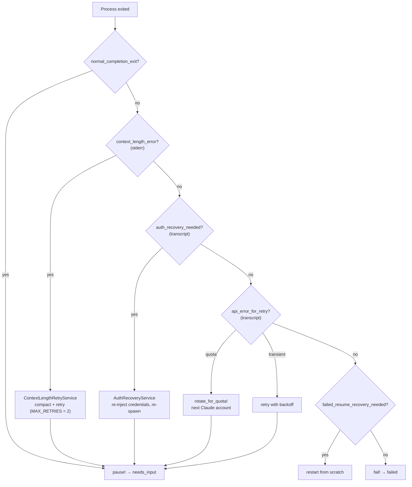

`app/jobs/agent_session_job.rb` is the biggest file in the repo (~3,000 lines) and it is where
Zimmer stops being a Rails app and starts being a process supervisor.

## What gets spawned

**Claude Code:**

```bash
claude --dangerously-skip-permissions \
  --disallowedTools Monitor ScheduleWakeup "Bash(sleep *)" "Skill(schedule)" AskUserQuestion \
  [--model MODEL] [--append-system-prompt SYSTEM_PROMPT] [--mcp-config PATH] \
  (--session-id UUID | --resume UUID) \
  -- <prompt>
```

**Codex:**

```bash
codex exec --json --dangerously-bypass-approvals-and-sandbox \
  --cd <working_dir> [-m MODEL] \
  --output-last-message <wd>/codex_last_message.txt [-i image]... \
  <prompt>
```

Both are spawned with `pgroup: true` (so the whole process group can be killed as a unit),
stdin and stdout to `/dev/null`, and stderr to `claude_stderr.log` / `codex_stderr.log` inside
the clone.

### Why those tools are disallowed

`Monitor`, `ScheduleWakeup`, `Bash(sleep *)`, and `Skill(schedule)` are all blocked because they
are *Claude Code's own* ways of waiting, and they don't survive Zimmer. A background sleep loop
dies when the container is recreated on deploy; a `ScheduleWakeup` doesn't create an AO trigger
that AO can track. Agents are pointed at Zimmer's own MCP wake tools instead.
`AskUserQuestion` is blocked because an interactive prompt would stall an autonomous session
forever.

### Runtime differences that leak

| | Claude Code | Codex |
| --- | --- | --- |
| Session ID | Zimmer generates it, passes `--session-id` | Codex mints its own; Zimmer captures it from the transcript |
| MCP config | `--mcp-config <path>` | `~/.codex/config.toml` (no flag) |
| System prompt | `--append-system-prompt` | Written into `AGENTS.md` below a marker |
| Resume | `--resume UUID` | `codex exec resume UUID` — and no `--cd` (the subcommand rejects it) |
| Transcript | plain `.jsonl` | zstd-compressed `.jsonl.zst` rollouts |

The `mints_own_session_id?` flag on the transcript normalizer is what keeps these straight.
Getting it wrong corrupts forked sessions — Claude's session id must *not* be rewritten from the
transcript, or a fork collides on the unique index.

### Large prompts and images switch transport

If images are attached, or the prompt exceeds `LARGE_PROMPT_THRESHOLD` (100 KB), the Claude
adapter switches to stream-json mode and feeds the payload through an `IO.pipe` written on a
background thread. A regular file doesn't work here — the CLI reads nothing from it.

## The spawn environment

Shared scrubbing (`CliSpawnEnv`):

- Loads a per-clone `.env` file if present (1 MB cap).
- Clears inherited env vars — `DATABASE_*`, `RAILS_ENV`, `GEM_*`, `RUBY*`, and a sweep of
  everything prefixed `BUNDLE*`. Without this the agent would inherit Zimmer's own database
  credentials and Ruby toolchain.
- Sets `AO_SESSION_SCRATCH_DIR` — a durable per-session scratch directory.

Claude adds (`ClaudeSpawnEnv`): `ENABLE_TOOL_SEARCH=false` (baseline; the `mcp_tool_search`
extension flips it), `CLAUDE_CODE_DISABLE_CRON=1`, `CLAUDE_CODE_DISABLE_AUTO_MEMORY=1`,
`CLAUDE_CODE_AUTO_COMPACT_WINDOW` (default 1,000,000), and when MCP is on: `MCP_TIMEOUT=180000`,
a clone-local `NPM_CONFIG_CACHE`, and `ELICITATION_SESSION_ID`.

Codex adds `RUST_LOG=warn,rmcp=info` and `CODEX_HOME`.

:::caution[Two spawn-env asymmetries]
`ELICITATION_SESSION_ID` is injected only by `ClaudeSpawnEnv`. Codex sessions never get it,
so [elicitations silently no-op for Codex](/limitations/#elicitations-silently-do-nothing-on-codex).

Likewise, `Ao::ExtensionRegistry.spawn_env_contributions` is called only from `ClaudeSpawnEnv` —
`CodexRuntimeAdapter#spawn_process` never consults it, so extension env contributions are
unreachable for Codex, despite the hook receiving a `runtime` context that implies otherwise.
:::

## The monitor loop

Once spawned, the job loops: check the process is alive, poll the transcript file, broadcast new
messages, repeat. There is a 0.15 second sleep between each broadcast — it must exceed
SolidCable's 100 ms polling interval, and it's a real throughput cost on a bursty transcript.
Tracked in [#108](https://github.com/tadasant/zimmer/issues/108).

Two independent output channels:

- **stderr → session logs.** A thread tails the stderr file by byte offset every 0.5 s into a
  `LogBuffer`, flushed every 5 iterations.
- **transcript → UI.** `TranscriptPollerService` reads the JSONL, normalizes it, and pushes Turbo
  Streams. See [Transcripts](/sessions/transcripts/).

stdout is discarded for both runtimes, even though both CLIs are launched with a JSON
streaming flag. The transcript file on disk is the only source of truth.

## When the process exits

`ProcessLifecycleManager#handle_exit` asks the runtime's retry strategy five questions:



:::danger[Every one of those questions is answered by a regex against CLI prose]
There is no structured exit signal. Zimmer determines *why* a session died by string-matching
English:

- Quota exhaustion (which triggers account rotation): `/hit your\b.*\blimit\b.*\bresets\b/i`
- Auth loss: `/not logged in|please run\s*\/login/i`
- Context overflow: a pattern list

When Anthropic changed "hit your limit" to "hit your session limit" on 2026-06-14, account
rotation silently stopped firing and the system retried six times against an already-capped
account before giving up — with no log saying rotation should have happened. That outage is
written up in the code. See
[Known limitations](/limitations/#failure-classification-is-regex-against-cli-prose).
Tracked in [#53](https://github.com/tadasant/zimmer/issues/53).
:::

## Metadata races

Session `metadata` is a JSON blob, and the job mutates it with a non-atomic read-modify-write.
The code says so out loud (`agent_session_job.rb:1073-1078`), and recommends PostgreSQL's `jsonb`
operators as the real fix. Correctness-adjacent flags live in there anyway
(`interrupt_terminate_pid`, `pending_follow_up_prompt`), described in the code as "best-effort
FAST PATH, not the correctness guarantee." Lost updates are possible.

## Stale job supersession

A monitoring job whose lock is older than `STALE_UNLOCKED_JOB_AGE` (2 minutes) is *superseded* by
a new one. Without this, "follow-up jobs silently skip execution because they see a stale
'running' job." A two-minute magic number is the thing standing between you and a
dropped prompt. Tracked in [#71](https://github.com/tadasant/zimmer/issues/71).
