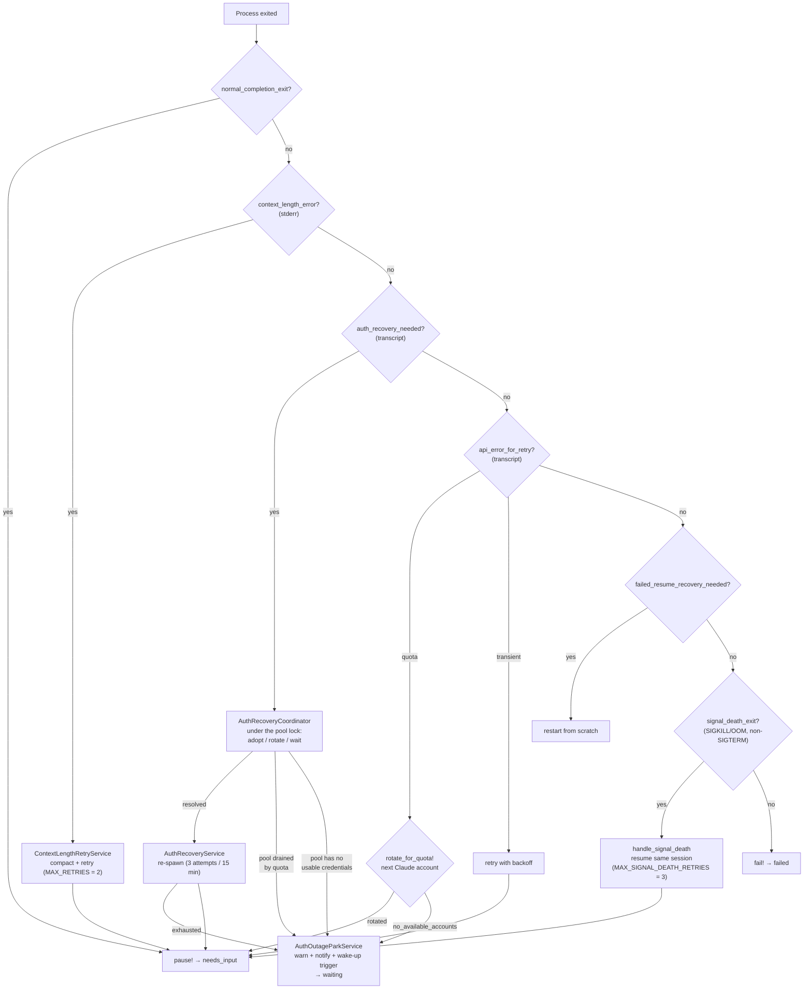

`app/jobs/agent_session_job.rb` is the biggest file in the repo (~3,000 lines) and it is where
Zimmer stops being a Rails app and starts being a process supervisor.

## What gets spawned

**Claude Code:**

```bash
claude --dangerously-skip-permissions \
  --disallowedTools Monitor ScheduleWakeup "Bash(sleep *)" "Skill(schedule)" AskUserQuestion \
  [--model MODEL] [--append-system-prompt SYSTEM_PROMPT] [--mcp-config PATH] \
  (--session-id UUID | --resume UUID) \
  -- <prompt>
```

**Codex:**

```bash
codex exec --json --dangerously-bypass-approvals-and-sandbox \
  --cd <working_dir> [-m MODEL] \
  --output-last-message <wd>/codex_last_message.txt [-i image]... \
  <prompt>
```

Both are spawned with `pgroup: true` (so the whole process group can be killed as a unit),
stdin and stdout to `/dev/null`, and stderr to `claude_stderr.log` / `codex_stderr.log` inside
the **working directory** — which is the clone root for a session without an agent root, and the
agent root's subdirectory for one with.

That distinction matters beyond spawn time. Everything that reconnects to a running process it
did not spawn — a job resuming monitoring, `ProcessLifecycleManager` after a recovery spawn, the
interrupt and terminate paths — has to rebuild this path, and both context-length recovery and
failed-resume recovery are *detected* by reading the log. Rebuild it from the clone root, or with
the wrong runtime's filename, and those recoveries quietly stop firing. So there is exactly one
way to ask: `Session#stderr_log_path`, which resolves the working directory and gets the filename
from the session's own adapter class (`RuntimeCliAdapter.stderr_log_filename`).

### Why those tools are disallowed

`Monitor`, `ScheduleWakeup`, `Bash(sleep *)`, and `Skill(schedule)` are all blocked because they
are *Claude Code's own* ways of waiting, and they don't survive Zimmer. A background sleep loop
dies when the container is recreated on deploy; a `ScheduleWakeup` doesn't create a Zimmer trigger
that Zimmer can track. Agents are pointed at Zimmer's own MCP wake tools instead.
`AskUserQuestion` is blocked because an interactive prompt would stall an autonomous session
forever.

### Runtime differences that leak

| | Claude Code | Codex |
| --- | --- | --- |
| Session ID | Zimmer generates it, passes `--session-id` | Codex mints its own; Zimmer captures it from the transcript |
| MCP config | `--mcp-config <path>` | `~/.codex/config.toml` (no flag) |
| System prompt | `--append-system-prompt` | Written into `AGENTS.md` below a marker |
| Resume | `--resume UUID` | `codex exec resume UUID` — and no `--cd` (the subcommand rejects it) |
| Transcript | plain `.jsonl` | zstd-compressed `.jsonl.zst` rollouts |

The `mints_own_session_id?` flag on the transcript normalizer is what keeps these straight.
Getting it wrong corrupts forked sessions — Claude's session id must *not* be rewritten from the
transcript, or a fork collides on the unique index.

### What Zimmer appends to every prompt

`AgentSessionJob#build_prompt_with_goal` is the one prompt builder for both the initial spawn and
every follow-up turn, so anything it appends rides along on every turn:

| Block | When |
| --- | --- |
| The goal suffix | `session.goal` is set — a goal ID resolves to its description, free text passes through |
| `<session-notes>` | `session_notes` is non-blank |
| `<session-timeline>` | the session (or an ancestor) has a human-authored message — see [The Human Timeline](/sessions/timeline/) |

A blank base prompt is returned untouched, which is what lets the initial-spawn guard catch a
task-less spawn instead of launching an agent on a bare goal string.

### Large prompts and images switch transport

If images are attached, or the prompt exceeds `LARGE_PROMPT_THRESHOLD` (100 KB), the Claude
adapter switches to stream-json mode and feeds the payload through an `IO.pipe` written on a
background thread. A regular file doesn't work here — the CLI reads nothing from it.

## The spawn environment

Shared scrubbing (`CliSpawnEnv`):

- Loads a per-clone `.env` file if present (1 MB cap).
- Clears inherited env vars — `DATABASE_*`, `RAILS_ENV`, `GEM_*`, `RUBY*`, and a sweep of
  everything prefixed `BUNDLE*`. Without this the agent would inherit Zimmer's own database
  credentials and Ruby toolchain. Four values are cleared for their own reasons:
  `ZIMMER_OPERATOR_SSH_KEY` (the agent gets the key's *path*, not its material),
  `ZIMMER_PARAMS_RESOLVER_SERVICE_ACCOUNT_KEY_JSON` (the
  [Parameter Store](/operate/secrets-parameter-store/) resolver credential — Zimmer resolves
  `${VAR}` with it and injects the *results* a session's MCP servers need, so the session
  itself never needs a key that reads every production secret value), and
  `SENTRY_DSN_BACKEND` (the production error DSN — an agent running `bin/rails` in a clone
  would otherwise report that clone's exceptions as
  [production errors](/operate/observability/#only-production-and-staging-may-report)), and
  `ALERTS_ENABLED` (the explicit opt-in that overrides
  [`AlertService`'s environment gate](/operate/background-jobs/#who-is-allowed-to-page) — an
  instance that sets it to page must not hand that permission to every agent it spawns).
  A value in the clone's `.env` always wins.

  **This list is a denylist, not an allowlist.** Sessions are plain child processes of the
  worker, so anything else in Zimmer's environment is inherited verbatim — a new secret in
  `env.secret` is one `env` away from a transcript until it is named here.
- Sets `AO_SESSION_SCRATCH_DIR` — a durable per-session scratch directory.
- Sets `ELICITATION_REQUEST_URL` and `ELICITATION_SESSION_ID` — where an MCP
  server sends an [approval request](/sessions/elicitation/#where-the-request-goes-and-what-happens-when-it-cant-get-there),
  and who is asking. A value in the clone's `.env` wins.
- Sets `SSH_PRIVATE_KEY_PATH` — the [operator SSH key](/operate/provisioning/#the-ssh-identity-an-agent-session-holds)
  the session authenticates with, when one is configured. The key file is written by
  `OperatorSshKeyProvisioner`; this exports its path, because an `ssh-*` MCP server looks for
  `SSH_AUTH_SOCK` and `SSH_PRIVATE_KEY_PATH` and nowhere else. A value in the clone's `.env` wins.
  (Claude's stdio MCP servers inherit the variable from the CLI; Codex's do not, so the Codex
  post-processor forwards it explicitly through `env_vars`.)

Claude adds (`ClaudeSpawnEnv`): `ENABLE_TOOL_SEARCH=false` (baseline; the `mcp_tool_search`
extension flips it), `CLAUDE_CODE_DISABLE_CRON=1`, `CLAUDE_CODE_DISABLE_AUTO_MEMORY=1`,
`CLAUDE_CODE_AUTO_COMPACT_WINDOW` (default 1,000,000), and when MCP is on: `MCP_TIMEOUT=180000`,
and a clone-local `NPM_CONFIG_CACHE`.

Codex adds `RUST_LOG=warn,rmcp=info` and `CODEX_HOME`.

:::caution[A spawn-env asymmetry]
`Zimmer::ExtensionRegistry.spawn_env_contributions` is called only from `ClaudeSpawnEnv` —
`CodexRuntimeAdapter#spawn_process` never consults it, so extension env contributions are
unreachable for Codex, despite the hook receiving a `runtime` context that implies otherwise.

The elicitation variables used to be the other half of this pair. They now come from `CliSpawnEnv`,
which both runtimes include.
:::

## The boot-tasks readiness gate

The last thing the job does before launching the CLI is check that the container it is running
in has finished its background boot tasks.

`bin/docker-entrypoint` runs `claude update` and `bin/ensure-playwright-browsers` in a
backgrounded block, deliberately: they are network-bound and can take 30s+, and running them in
the foreground would hold Rails behind them until Kamal's health check gave up. The cost is a
window. `~/.local` is a named volume that survives the deploy, so it shadows the CLI baked into
the new image — until `claude update` finishes, the binary on disk is the *previous* deploy's.

The entrypoint writes a marker file when that block completes, whatever the outcome, and exports
its path as `ZIMMER_BOOT_TASKS_MARKER`. `BootTasksReadiness.await` blocks on the marker and the
spawn path reports the result into the session's log.

| Outcome | What the session sees |
| --- | --- |
| Marker already present | Nothing. The overwhelmingly common case — the clone, `air prepare`, and MCP setup have already overlapped with the update. |
| Marker appeared after a wait | An info line naming the wait: `Waited 4.2s for container boot tasks…` |
| Marker says a task failed | A **warning**: the CLI may be the image's version rather than the latest. Spawns anyway. |
| Marker never appeared | A **warning** naming the deadline, in the session log and in the process log. Spawns anyway. |

Three properties are deliberate, because each of their opposites is worse than a stale CLI:

- **Nothing here blocks Rails boot.** This is read on the spawn path only. `/up` answers on
  schedule no matter what the background block is doing.
- **The wait is bounded, and bounded from process start rather than from the call.** If
  `claude update` hangs the marker never lands, and after `ZIMMER_BOOT_TASKS_TIMEOUT_SECONDS`
  (default 120) sessions spawn regardless. Because the deadline is anchored to when the process
  booted, the mechanism is inert once the container has been up longer than that — a session
  started an hour into a deploy never waits, and never can. A worker that refuses to spawn until
  a hung `npm` returns would be a worse outage than the bug.
- **The gate is off unless the entrypoint armed it.** Development, test, and `bin/dev` never run
  the entrypoint, so the variable is unset and `await` returns immediately without touching the
  filesystem.

The marker is per container, in `/tmp`, which is what you want: `web` and `worker` are separate
containers running the same entrypoint, and each one gates on its own boot tasks. Sessions spawn
in `worker`.

## The monitor loop

Once spawned, the job loops: check the process is alive, poll the transcript file, broadcast new
messages, repeat. Consecutive broadcasts are spaced apart, because a subscriber only sees SolidCable
messages when its poll thread wakes: two broadcasts published inside one poll window can arrive
coalesced, which is how a timeline renders messages out of order.

The spacing is *derived* from that window rather than restated:
`TranscriptPollerService.broadcast_spacing` reads `SolidCable.polling_interval` — the same accessor
the cable adapter itself sleeps on, parsed from `config/cable.yml` — and multiplies it by
`BROADCAST_SPACING_MARGIN` (1.5). With the configured 100 ms interval that is the 150 ms this used
to hardcode, but changing `cable.yml` now moves the spacing with it instead of silently breaking the
relationship (#108). It remains a real throughput cost on a bursty transcript.

Two independent output channels:

- **stderr → session logs.** A thread tails the stderr file by byte offset every 0.5 s into a
  `LogBuffer`, flushed every 5 iterations.
- **transcript → UI.** `TranscriptPollerService` reads the JSONL, normalizes it, and pushes Turbo
  Streams. See [Transcripts](/sessions/transcripts/).

stdout is discarded for both runtimes, even though both CLIs are launched with a JSON
streaming flag. The transcript file on disk is the only source of truth.

## When the process exits

`ProcessLifecycleManager#handle_exit` asks the runtime's retry strategy a series of
questions, then — as a last recovery branch before giving up — checks for an abnormal
signal death:


```mermaid
flowchart TD
    E["Process exited"] --> N{"normal_completion_exit?"}
    N -->|yes| P["pause! → needs_input"]
    N -->|no| C{"context_length_error?<br/>(stderr)"}
    C -->|yes| CR["ContextLengthRetryService<br/>compact + retry (MAX_RETRIES = 2)"]
    C -->|no| A{"auth_recovery_needed?<br/>(transcript)"}
    A -->|yes| AC["AuthRecoveryCoordinator<br/>under the pool lock:<br/>adopt / rotate / wait"]
    AC -->|resolved| AR["AuthRecoveryService<br/>re-spawn (3 attempts / 15 min)"]
    AC -->|"pool drained<br/>by quota"| PARK["AuthOutageParkService<br/>warn + notify + wake-up trigger<br/>→ waiting"]
    AC -->|"pool has no<br/>usable credentials"| PARK
    AR -->|exhausted| PARK
    A -->|no| Q{"api_error_for_retry?<br/>(transcript)"}
    Q -->|quota| RO{"rotate_for_quota!<br/>next Claude account"}
    RO -->|rotated| P
    RO -->|no_available_accounts| PARK
    Q -->|transient| RT["retry with backoff"]
    Q -->|no| F{"failed_resume_recovery_needed?"}
    F -->|yes| FR["restart from scratch"]
    F -->|no| SD{"signal_death_exit?<br/>(SIGKILL/OOM, non-SIGTERM)"}
    SD -->|yes| SDR["handle_signal_death<br/>resume same session<br/>(MAX_SIGNAL_DEATH_RETRIES = 3)"]
    SD -->|no| FAIL["fail! → failed"]
    CR --> P
    AR --> P
    RT --> P
    SDR --> P
```

The auth branch does not re-inject blindly. `AuthRecoveryCoordinator` takes a per-runtime advisory
lock on the account pool and picks one of three answers: **adopt** the account the pool already
rotated to while this session was running (free — it is another session's rotation), **rotate** away
from the identity the runtime just rejected (re-injecting it would reproduce the wall), or **wait**
for a rotation another process has in flight rather than starting a competing one. Which identity
the session was spawned with is recorded in `metadata["auth_identity_email"]` at injection time;
comparing it against the pool's current account is what tells those apart. Decision tree in
[Agent harness auth](/auth/harness/#the-recovery-decision-tree).

When the login pool has nothing usable left — every account `quota_exceeded`, or an identity the
runtime keeps rejecting — the session is **parked** rather than looped or failed:
`AuthOutageParkService` explains the outage in the session log and the session-page banner, sends a
push notification, and schedules a one-time wake-up trigger keyed off the real quota reset time.
Creating that trigger sleeps the session, so it sits in `waiting` where the heartbeat sweep cannot
nudge it. `QuotaResetCheckerJob` usually wakes it earlier, as soon as the accounts come back. Which
of the two park reasons it gets follows the pool's shape rather than the code path that arrived
there — `QUOTA_EXHAUSTED` ("wait for reset") when something is merely throttled,
`AUTH_UNRECOVERABLE` ("re-authenticate") when nothing is. Full detail in
[Agent harness auth](/auth/harness/#when-the-pool-runs-dry).

A non-SIGTERM signaled exit — most commonly a cgroup **OOM kill** (SIGKILL) of a
long-running, large-transcript session — is treated as recoverable rather than
terminal: `handle_signal_death` resumes the existing runtime session id immediately
(seconds, versus the ~15-minute stuck-session sweep), bounded by
`MAX_SIGNAL_DEATH_RETRIES` so an OOM crash-loop can't resume forever. The counter is
reset once a resumed process runs stably, so a session that OOMs occasionally gets a
fresh per-incident budget. Exhausting it fails with `failure_reason:
signal_death_retries_exhausted`. AO-initiated SIGKILLs (the hung-process terminator
escalating SIGTERM→SIGKILL) are excluded by the `recovery_termination_initiated` guard
upstream of this check.

:::danger[Every one of those questions is answered by a regex against CLI prose]
There is no structured exit signal. Zimmer determines *why* a session died by string-matching
English:

- Quota exhaustion (which triggers account rotation): `/hit your\b.*\blimit\b.*\bresets\b/i`
- Auth loss: `/not logged in|please run\s*\/login/i`
- Context overflow: a pattern list

When Anthropic changed "hit your limit" to "hit your session limit" on 2026-06-14, account
rotation silently stopped firing and the system retried six times against an already-capped
account before giving up — with no log saying rotation should have happened. That outage is
written up in the code. See
[Known limitations](/limitations/#failure-classification-is-regex-against-cli-prose).
Tracked in [#53](https://github.com/tadasant/zimmer/issues/53).
:::

## Metadata races

Session `metadata` and `custom_metadata` are JSON blobs that several processes write at once: the
job's monitoring loop, the web process, the GitHub pollers, and the transcript hooks. Writing one by
rebuilding the whole column from a snapshot — `update!(metadata: session.metadata.merge(...))` —
erases any key another writer set since that snapshot was read. `session.reload` first narrows the
window; it does not close it.

Most of those writers use `Session#merge_metadata!` / `#remove_metadata!` (and the
`custom_metadata` equivalents) instead. Those push the merge into PostgreSQL as one statement —
`(metadata::jsonb - ARRAY[…]) || '{…}'::jsonb` — so keys the caller never named survive.

```ruby
session.merge_metadata!("process_pid" => pid, "runtime_started" => true)
session.merge_metadata!({ "process_pid" => pid }, [ "interrupt_terminate_pid" ]) # merge + remove
session.remove_metadata!(Session::SIGTERM_RETRY_METADATA_KEYS)
```

What that buys and what it doesn't:

- **Does:** a write stops being destructive to keys it didn't name. `interrupt_terminate_pid` (lose it
  and a "Send now" terminates nothing), `pending_follow_up_prompt` (lose it and a user's message never
  reaches the agent), and `github_pull_request_urls` (lose it and no GitHub integration engages) now
  survive a concurrent writer.
- **Doesn't:** serialize two writers of the *same* key — last writer still wins. And atomicity is a
  property of *every* writer to the row, not of one key: a caller that still does a whole-column
  read-modify-write can erase a key no matter how carefully that key was written. Three groups still
  do. The terminal failure paths (`failure_reason`, `exit_status`) — the session is being failed at
  that point, so a lost neighbouring key changes nothing. The `resume!` state-machine callbacks
  (`clear_pending_sleep`, `clear_paused_by_metadata`), which write with `update_column` and fire no
  callbacks at all today. And **`TranscriptPollerService`**, which batches `metadata` into the same
  `update!` as `transcript` and `last_timeline_entry_at` on every poll of a live turn — the worker's
  single most frequent metadata writer. That last one is the honest asterisk on the line above: a key
  set in the window between its `reload` and its `update!` is still lost, so `interrupt_terminate_pid`
  is *harder* to lose than it was, not impossible. Splitting that batched write is what would close
  it, at the cost of a second write and an extra index broadcast on the hottest loop in the app.

Two deliberate differences from `update!`: model validations don't run (which is what makes these
usable on terminal paths, where a stale-catalog validation error would otherwise block a session from
recording why it failed), and the `after_update_commit` broadcast callbacks are re-dispatched
explicitly by the concern rather than fired by Active Record.

## Stale job supersession

A monitoring job whose lock is older than `STALE_UNLOCKED_JOB_AGE` (2 minutes) is *superseded* by
a new one. Without this, "follow-up jobs silently skip execution because they see a stale
'running' job." A two-minute magic number is the thing standing between you and a
dropped prompt. Tracked in [#71](https://github.com/tadasant/zimmer/issues/71).
