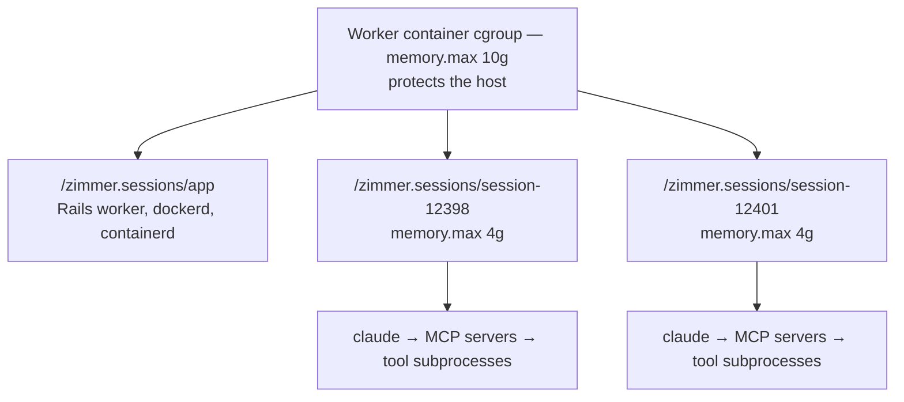
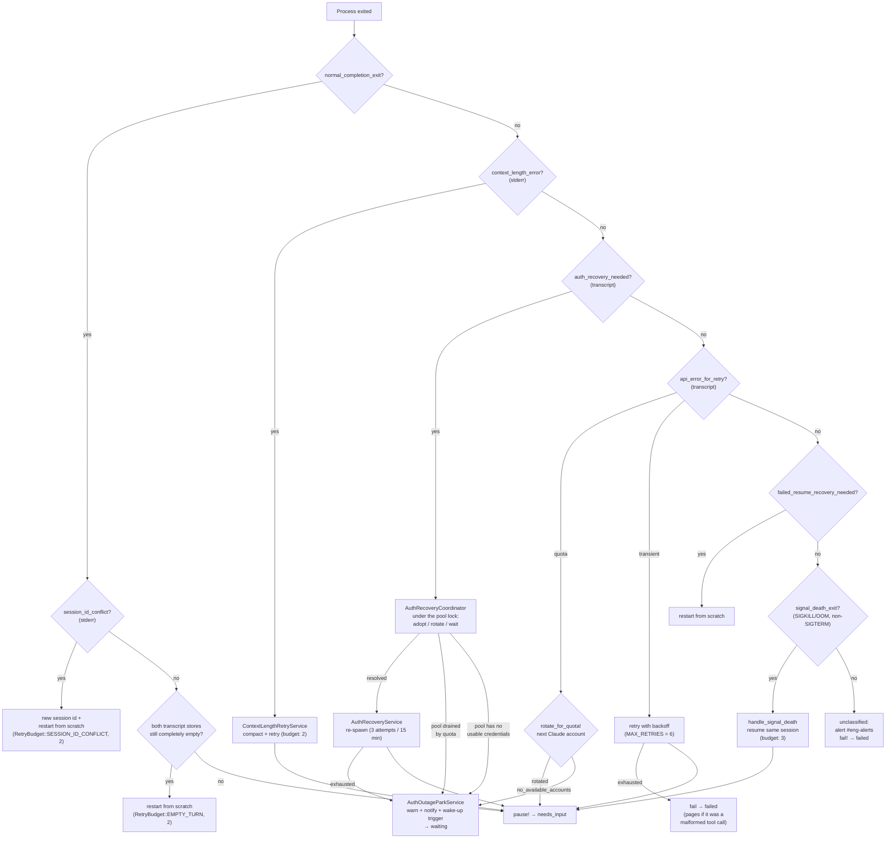

`app/jobs/agent_session_job.rb` is the biggest file in the repo (~3,000 lines) and it is where
Zimmer stops being a Rails app and starts being a process supervisor.

Its first decision is whether the turn may run at all. Every path that spends Claude quota — a first
start, a follow-up, a fired wake trigger, a poller message, a restart — reaches this job, and for a
**spot** session the job asks `SpotSessionHold` before doing anything else. A refused turn is
deferred, not dropped: the job re-enqueues itself with the prompt and attachments intact and the
session goes back to `waiting`. See [Spot and priority](/sessions/spot-and-priority/). Only
`clone_only` (no agent is spawned) and `resume_monitoring` (re-attaching to a process already
running) skip the check, because neither spends anything.

Ahead of that gate sits a shorter question: **is this session in the trash?** `archived` is
terminal, so an archived session takes no turn — the job logs why on the session's own timeline
and stops, without spawning anything and without re-enqueuing itself. That refusal is what ends
the spot re-check chain when a held session is archived mid-hold: the hold's delayed job is left
in the queue and simply refused on its next fire, rather than holding the session again and
scheduling another. It applies to every route in, not just the spot one — a recovery nudge, a
fired wake, a poller message and a restart all arrive at the same door. `resume_monitoring` is
the one exemption, and it is deliberate: that job re-attaches to a process that is *already*
running, and the monitoring loop's own archived check is what terminates it. Standing it down
would leave a live agent nobody is watching. Unarchiving is unaffected — every unarchive path
leaves `archived` before it enqueues anything, so an unarchived session's follow-up reads as a
live session here.

That guard is the **delivery-time** half of the answer, and it cannot be the whole one. It reads
the row this job loaded, and by the time the job runs the row can already say `running` — because
a recovery sweep put it there. Every sweep decides from a session object it read earlier
(`CleanupOrphanedSessionsJob` and `DeploymentRecoveryJob` iterate `paused_by = 'recovery'`;
`SessionRecoveryService` has been holding its session since before it started killing a hung pid),
so a session archived in the meantime still looked resumable and `resume!` wrote `running` straight
over the archived row. Session 6335 was archived at 07:35:34 and had a fresh agent process,
injected credentials and five connected MCP servers two seconds later
([#554](https://github.com/tadasant/zimmer/issues/554)).

So there is a **selection-time** half too: `Session#claim_system_recovery_turn!`. It re-reads the
row `FOR UPDATE` before deciding — inside the caller's transaction, so the lock is still held when
the job is enqueued and no archive can land in between. It answers `:archived` (terminal),
`:not_resumable` (the session is already `running`; somebody else is driving it, and a second agent
process is its own defect) or `:claimed`, and the enqueuer starts a turn only on `:claimed`. Both
refusals are decided *before* the caller's block runs, so a refused claim writes nothing at all —
which is what lets a caller skip the enqueue without needing a rollback to be correct. The refusal
is recorded on the session's own timeline, where "why did nothing happen to this session" is asked
from.

A refused claim leaves `paused_by` in place on purpose. It is the marker both sweeps select on, and
an archived session is already invisible to them — so there is no loop to bound, and dropping it
would sabotage the recovery still owed to the session if a human restores it from the trash.

Every enqueuer in this family routes through it: `SessionContinuation#continue_recovered_session`
(both sweeps and `RecoveryContinuationJob`), `SessionRecoveryService#auto_restart_session`,
`StrandedSleepRescue`, `HealthMonitorService#retry_failed_sessions` and
`AgentSessionJob#auto_continue_after_interrupt`. The last two were the tail of it
([#753](https://github.com/tadasant/zimmer/issues/753)). Their windows are narrow rather than
minutes wide, and neither is zero: the failed-session retry reads its relation once and then works
from those objects, so every session past the first waits out a `Dir.exist?` stat on the clone
volume and a full resume-and-enqueue for each session ahead of it (and `with_db_retry` can replay
the whole block against a row that has moved), while the auto-continue's window spans that same
`Dir.exist?` during SIGTERM shutdown — which is a deploy, and a deploy is when somebody is most
likely to be emptying the trash.

The failed-session retry adds one thing the others do not need: it says why. A refused claim comes
back in the `skipped` list of `POST /health/retry_sessions`, `POST /api/v1/health/retry_sessions`
and the `action_health` MCP tool, next to the reason, and in the health dashboard's flash — because
an operator who clicked Retry on one session cannot tell a silent no-op from a bug.

Neither half covers the window that opens *after* the turn is claimed, so there is a third check
at **spawn time**. The delivery-time guard reads the row at the top of the job, and the claim's
lock closes only the window where the archive lands before it — but between that read and the
actual spawn sit the clone, the AIR prepare, the MCP setup, the boot-tasks wait and credential
injection, which on a first start is minutes of wall clock. Session 13221 archived one second
after its recovery turn was claimed and reached the spawn 94 seconds later, by which point the
clone cleanup archiving enqueued had already deleted the clone: opening the runtime's stderr log
raised `ENOENT`, which surfaced as a `spawn_failed` **error** for a session that had simply
finished ([#884](https://github.com/tadasant/zimmer/issues/884)). So the job re-reads the row
immediately before handing the turn to `ProcessLifecycleManager`, and an archived session stands
down there instead — quietly, at `info`, with no `spawn_failed` marker, because a session in the
trash taking no turn is the correct outcome rather than a fault. A **live** session whose clone
has gone missing still fails loudly *at this spawn*: that session should run, and re-cloning it is
[#817](https://github.com/tadasant/zimmer/issues/817). (A continuation spawn — a SIGTERM retry, a
compaction — answers the same question at `warning` instead; `ProcessLifecycleManager` is deciding
what to do about a turn that has already run.)

The spawn-time check closes the window at one point; the setup ahead of it is the rest of it.
`AirPrepareService#prepare!` shells out with the clone as its working directory and rescues only
its two domain errors, and the credential injection writes into that clone — so a clone deleted a
few seconds earlier raises `ENOENT` inside the setup rather than at the spawn, and lands in
`#perform`'s catch-all rescue. That rescue is the **fourth** check: it re-reads the row, and for an
archived session it records what happened on the session's timeline at `warning` and in the backend
log at `warn`, then returns. It does **not** stamp `failure_reason`, does **not** log at `error`,
and — the two decisions worth stating — does **not** re-raise
([#886](https://github.com/tadasant/zimmer/issues/886)). The re-raise is the reporting path
(sentry-rails captures terminal ActiveJob failures, and ActiveJob logs them at `error`, which is
what the log-based alert rule reads), so quietening the session's own logs while still raising
would remove neither page; and the GoodJob retry it feeds has nothing to accomplish, since a retry
re-enters the job only to be stood down again — by the delivery-time guard on a start, or by the
monitoring loop's own archived check on a `resume_monitoring` job. The gate is the **row**, not the
exception class and not where in the turn it fired — a deleted clone surfaces as whatever the step
that touched it wraps it in, and a session that archives *itself* is still in this job's teardown
tail when the cleanup deletes the clone under it. So the full exception, message and backtrace go
to the backend log at `warn`, where a genuine bug that coincided with an archive is greppable but
no longer paged; that trade is recorded in [Limitations](/limitations/). A session that is **not**
archived keeps the whole loud path: the `failure_reason` stamp, the `error` logs, and the re-raise.

Where that loud path comes to *rest* depends on whether an agent ever existed. A turn that raised
before any process was spawned, carrying a prompt nobody has seen, parks in `needs_input` with
`failure_reason: "undelivered_turn"` instead of failing — `failed` is not in the homepage's action
queue and nothing sweeps it, so a follow-up that dies in setup used to be dropped in silence
([#439](https://github.com/tadasant/zimmer/issues/439)). The three exception classes this job
declares a `retry_on` for are excluded while an attempt is still queued, since the re-raise below is
what schedules it. Everything else about the loud path is unchanged, the re-raise included. See
[A turn that never started parks instead of failing](/sessions/lifecycle/#a-turn-that-never-started-parks-instead-of-failing).

:::caution[Other resumers lock by hand, or not at all]
`SpotSessionPause.resume!`, `AuthOutageParkService.resume_parked!` and `SpotSessionHold.rearm!` are
not part of this family: each takes its own row lock and re-checks under it rather than routing
through the claim. The queued-message branch above the guard
(`continue_with_queued_user_message`) is unguarded, but bounded: archiving strands pending messages,
and `EnqueuedMessageProcessorService` takes its own lock and refuses an archived session.
:::

`#perform` carries one further guard, below the archived guard, the pause guard and the spot gate
and above the point where the job records itself as started: a turn being resumed with an
`AutomatedPrompts::SYSTEM_RECOVERY` nudge is handed to the session's queued message instead, when it
has one. It is the choke point every automated resume funnels through, and the reasoning — why it is
scoped to the nudge, why the session has to be `running` for the handoff to be safe, and what
happens to the session's armed wakes — is in
[A queued message outranks an injected recovery nudge](/sessions/lifecycle/#a-queued-message-outranks-an-injected-recovery-nudge).

## What gets spawned

**Claude Code:**

```bash
claude --dangerously-skip-permissions \
  --disallowedTools Monitor ScheduleWakeup "Bash(sleep *)" "Skill(schedule)" AskUserQuestion \
  [--model MODEL] [--append-system-prompt SYSTEM_PROMPT] [--mcp-config PATH] \
  (--session-id UUID | --resume UUID) \
  -- <prompt>
```

**Codex:**

```bash
codex exec --json --dangerously-bypass-approvals-and-sandbox \
  --cd <working_dir> [-m MODEL] \
  --output-last-message <wd>/codex_last_message.txt [-i image]... \
  <prompt>
```

Both are spawned with `pgroup: true` (so the whole process group can be killed as a unit),
stdin and stdout to `/dev/null`, and stderr to `claude_stderr.log` / `codex_stderr.log` inside
the **working directory** — which is the clone root for a session without an agent root, and the
agent root's subdirectory for one with.

That subdirectory is frozen onto the session row when the session is created, so every clone the
job makes — the first one, and the recreation after a reaper took it — also offers
`GitCloneService` the path the root declares in the catalog *now*, and adopts it if the stored one
is no longer in the tree. Without that, renaming an agent root's directory strands every session
created before the rename ([#921](https://github.com/tadasant/zimmer/issues/921)); with it, a root
that moved its directory under a name the catalog still carries resolves on its own. See
[the router root's two names](/air/agent-roots/#the-router-roots-two-names).

The recreation after a reaper took it also goes back to the *same path* the session was using, via
`SessionClonePath.for_recreate`. The runtime names its transcript directory after the cwd, so a
re-clone at a fresh path re-writes the whole conversation under a new slug and abandons the old
copy — see [a re-clone lands where the old one was](/sessions/transcripts/#a-re-clone-lands-where-the-old-one-was).

That distinction matters beyond spawn time. Everything that reconnects to a running process it
did not spawn — a job resuming monitoring, `ProcessLifecycleManager` after a recovery spawn, the
interrupt and terminate paths — has to rebuild this path, and both context-length recovery and
failed-resume recovery are *detected* by reading the log. Rebuild it from the clone root, or with
the wrong runtime's filename, and those recoveries quietly stop firing. So there is exactly one
way to ask: `Session#stderr_log_path`, which resolves the working directory and gets the filename
from the session's own adapter class (`RuntimeCliAdapter.stderr_log_filename`).

### Why those tools are disallowed

`Monitor`, `ScheduleWakeup`, `Bash(sleep *)`, and `Skill(schedule)` are all blocked because they
are *Claude Code's own* ways of waiting, and they don't survive Zimmer. A background sleep loop
dies when the container is recreated on deploy; a `ScheduleWakeup` doesn't create a Zimmer trigger
that Zimmer can track. Agents are pointed at Zimmer's own MCP wake tools instead.
`AskUserQuestion` is blocked because an interactive prompt would stall an autonomous session
forever.

### Runtime differences that leak

| | Claude Code | Codex |
| --- | --- | --- |
| Session ID | Zimmer generates it, passes `--session-id` | Codex mints its own; Zimmer captures it from the transcript |
| MCP config | `--mcp-config <path>` | `~/.codex/config.toml` (no flag) |
| System prompt | `--append-system-prompt` | Written into `AGENTS.md` below a marker |
| Resume | `--resume UUID` | `codex exec resume UUID` — and no `--cd` (the subcommand rejects it) |
| Transcript | plain `.jsonl` | zstd-compressed `.jsonl.zst` rollouts |

The `mints_own_session_id?` flag on the transcript normalizer is what keeps these straight.
Getting it wrong corrupts forked sessions — Claude's session id must *not* be rewritten from the
transcript, or a fork collides on the unique index.

### What Zimmer appends to every prompt

`AgentSessionJob#build_prompt_with_goal` is the one prompt builder for both the initial spawn and
every follow-up turn, so anything it appends rides along on every turn:

| Block | When |
| --- | --- |
| The goal suffix | `session.goal` is set — a goal ID resolves to its description, free text passes through |
| `<session-notes>` | `session_notes` is non-blank |
| `<unavailable-mcp-servers>` | a server this session was configured with failed to connect |

**Provenance is not appended.** The session hierarchy and the human-message record are served by the
`get_session_provenance` MCP tool, on demand, rather than injected — and that tool's description is
where the caveats they have to be read with are stated. See [Hierarchy and human
messages](/sessions/hierarchy-and-human-messages/#where-they-show-up).

A blank base prompt is returned untouched, which is what lets the initial-spawn guard catch a
task-less spawn instead of launching an agent on a bare goal string.

### Large prompts and images switch transport

If images are attached, or the prompt exceeds `LARGE_PROMPT_THRESHOLD` (100 KB), the Claude
adapter switches to stream-json mode and feeds the payload through an `IO.pipe` written on a
background thread. A regular file doesn't work here — the CLI reads nothing from it.

## The pre-clone disk guard

Every session's working directory is a git clone under `ClonesDirectory.base`, created by
`GitCloneService` on the `waiting → running` path. `CloneDiskGuard.ensure_space!` runs immediately
before the clone starts, and it does two things in order: it asks
[`OrphanCloneFilesystemCleanupJob`](/operate/background-jobs/#clone-pruning-has-a-second-urgent-gear)
to reclaim space, and — only if that is not enough — it refuses the clone with a message naming the
volume, the shortfall, and what to do about it. The refusal is a
`GitCloneService::InsufficientDiskSpaceError`, a `GitError` subclass that is deliberately **not**
classified transient: retrying a full disk on a five-second backoff accomplishes nothing, so
`AgentSessionJob` fails the session and surfaces the message rather than rescheduling.

Without the guard, a clone into a full volume died partway with whatever errno git happened to
surface, left a half-written directory behind, and — because that volume also holds every session's
scratch directory and prompt attachments — degraded every other session on the host at the same
time.

**How much space it asks for.** A flat threshold fits this badly: a 50 MB repo and a 5 GB monorepo
have very different needs. So the requirement is derived from the `.git` directory of the most
recently written existing clone of the *same repository*, times `SIZE_SAFETY_FACTOR` (2 — one copy
for the object store, one for the checked-out tree). `.git` specifically, not the whole tree: the
tree also holds whatever the previous session installed (`node_modules`, `vendor/bundle`, build
output), none of which the next `git clone --single-branch` will re-download, so sizing it would
inflate the requirement by an amount that has nothing to do with the clone.

That measurement is bounded on four sides, because a sizing routine that errs pessimistically
blocks every session on the host:

| Bound | Value | Why |
| --- | --- | --- |
| `MINIMUM_FREE_BYTES` | 2 GiB, `CLONE_MINIMUM_FREE_BYTES` | Floor. A repo never cloned before, or one that cannot be measured, still has to clear it. Overridable so a small host has a lever that is not a redeploy |
| `MAXIMUM_REQUIRED_BYTES` | 10 GiB | Absolute ceiling. A prior clone that grew pathologically must not become a requirement no healthy disk can satisfy |
| `MAX_VOLUME_FRACTION` | 0.25 | Relative ceiling. Without it the 2 GiB floor alone turns a 3 GiB disk that was cloning small repos perfectly well into one where nothing can launch |
| `CLONE_SIZING_TIMEOUT_SECONDS` | 5s | The `du` runs on the launch path; exceeding the deadline falls back to the floor |

The `du` is skipped entirely when free space already exceeds `MAXIMUM_REQUIRED_BYTES` — no
requirement can ask for more than that, so a healthy host pays one `df` and nothing else.

**It fails open.** If free space cannot be determined at all — `df` missing, unparsable, or timing
out — the guard permits the clone. A broken measurement must never be the reason no session can
start; a clone that dies on `ENOSPC` is strictly better than that.

## A copied clone sheds what it cannot relocate

Most clones are created by `git clone`. Two are created by copying an existing one: `ForkSessionService`
gives a fork a copy of its source tree, and `bin/rails clones:relocate` copies a clone to a new base
directory. Both rewrite the session's path-bearing metadata in lockstep with the copy — and neither
can rewrite what is *inside* the tree.

A Python virtualenv is the case where that matters, because it is not relocatable. Every console
script in `<venv>/bin` opens with a shebang naming the interpreter by absolute path:

```
$ head -1 .venv/bin/pytest
#!/home/rails/.zimmer/clones/repo-main-1787709410-c2ba6679/.venv/bin/python
```

Copied into a clone at a different path, that shim still execs the *old* clone's interpreter, which
imports the *old* clone's sources. The `.pth` files for editable installs are written relative to the
venv, so they follow the copy and resolve correctly — which is what makes the failure so hard to
read. `uv run python -c "import pkg; print(pkg.__file__)"` reports the new clone and looks healthy,
while `uv run pytest` runs the previous checkout. It surfaces as an `ImportError` naming a symbol
that plainly exists in the file the error points at, because the path in the error is a different
checkout of the same repository. Worse, it is silently *stale* rather than broken: two checkouts that
have not diverged produce a green suite against the wrong tree.

`NonRelocatableClonePaths` finds those directories so the copy can leave them behind. A virtualenv is
matched by its `pyvenv.cfg` marker (PEP 405) rather than by name, so an environment called `env` or
`.direnv/python-3.13` is found and a source directory that merely happens to be called `venv` is
kept. Both copy paths apply it, and both log which paths they dropped.

Dropping rather than rewriting is the deliberate call. `uv sync` against a warm cache rebuilds an
environment in seconds, and a clone that arrives without one fails immediately and legibly where a
clone that arrives with a stale one fails silently.

**Nothing is deleted.** Detection reads the source tree and returns fnmatch patterns; the copy applies
them while writing the destination. That is the whole safety argument for a task that copies **live**
sessions' clones by design — "copy, never move, so a live session's cwd is never pulled out from under
it". Skipping a directory while writing the destination cannot touch the source.

The fix is prospective. A clone that was relocated before it shipped still holds a stale environment;
`rm -rf .venv && uv sync` is the repair, and the session doing the work is the one that notices.

## Each session gets its own memory bound

The worker container runs every agent session on the box, plus the Rails worker, plus the
nested `dockerd`/`containerd`, in **one** cgroup under **one** `memory.max` — 10 GiB in
production. Nothing partitioned that budget, so one session's runaway command could spend
all of it and the kernel would then pick a victim by size rather than by blame. On
2026-09-02 a session's own `bash` reached 6.5 GiB of anonymous RSS in a `… | head` pipeline
and was OOM-killed at the container cap ([#815](https://github.com/tadasant/zimmer/issues/815)).
Nothing else died that time, and that was luck: the same cgroup filling the same way can
take `bundle` or the inner daemon instead, which is
[#719](https://github.com/tadasant/zimmer/issues/719) and
[#502](https://github.com/tadasant/zimmer/issues/502).

So each session now runs in its own cgroup with its own `memory.max`
(`SessionMemoryCgroup`). A runaway command exhausts **its own** budget, and the kernel's
kill lands inside the cgroup that caused it. The container cap still exists and still
protects the host; this is the layer underneath it.


```mermaid
flowchart TD
  host["Worker container cgroup — memory.max 10g<br/>protects the host"]
  host --> app["/zimmer.sessions/app<br/>Rails worker, dockerd, containerd"]
  host --> s1["/zimmer.sessions/session-12398<br/>memory.max 4g"]
  host --> s2["/zimmer.sessions/session-12401<br/>memory.max 4g"]
  s1 --> a1["claude → MCP servers → tool subprocesses"]
  s2 --> a2["claude → MCP servers → tool subprocesses"]
```

**How a process gets in.** cgroup v2 has no `Process.spawn` option for this, so the child
puts itself in: the adapters wrap the runtime's argv in a two-line `sh` that writes its own
pid to `cgroup.procs` and then `exec`s the real command. `exec` keeps the pid, so the
process group, the recorded `process_pid` and every signal path are unchanged. Descendants
inherit the cgroup — which is the whole point, because the runaway was a grandchild, not
the agent.

**The setup that needs root** is in `bin/docker-entrypoint`, which runs as root only in the
[nested-Docker worker](/operate/nested-docker/). It creates `/sys/fs/cgroup/zimmer.sessions`,
enables the memory controller on it, hands it to uid 1000, and moves the app into a
`zimmer.sessions/app` sibling. That last step is load-bearing rather than tidy: migrating a
process needs write access to the `cgroup.procs` of the **common ancestor** of source and
destination, so with the app left where it starts, uid 1000 could create session cgroups and
then not move anything into them.

**Sizing.** `ZIMMER_SESSION_MEMORY_MAX_MB` — 4096 in production, 1024 on staging (whose
worker cap is 2g, so a 4 GiB bound would never trip). It deliberately does *not* sum to the
container cap: six sessions at 4 GiB is 24 GiB against 10g. It bounds **one** runaway, which
is the failure that has actually happened; an admission-control budget would have to sit near
1.5 GiB and would start killing sessions that work today. A healthy worker was measured at
1.6 GiB of anonymous memory with three concurrent sessions — the Rails worker included — so
4 GiB is roughly an order of magnitude of headroom. `0` disables the bound entirely — not by writing `max` into
`memory.max` but by taking the whole mechanism out of the spawn path, since an operator reaching
for the break-glass in an incident may well be reaching for it because of the wrapper. It is set at
deploy time, never on the box.

**What you see when it fires.** Three things, depending on what died:

| What the kernel killed | What happens |
| --- | --- |
| A **tool subprocess** — the agent survives | `SessionMemoryWatch` (driven from the monitor loop, every 10s) notices `memory.events`' `oom_kill` counter move and writes a session log saying the limit was reached and that the agent's bare `Killed` / exit 137 is this, not a bug in its command. |
| The **agent process** itself | `ProcessLifecycleManager#handle_signal_death` reads the same counter. A count that moved *since the last observation* is this death, so the session log names the bound instead of hedging "likely OOM", and the resume carries `AutomatedPrompts.memory_limit_recovery` — which tells the agent what the limit was and to stream large output rather than hold it, instead of nudging it to re-run the command that just died. |
| Anything, seen from outside | The cgroup is named `session-<id>`, so the kernel's own `oom-kill:` line carries `oom_memcg=/zimmer.sessions/session-12398`. That is the attribution #815 could not establish: on a shared-cgroup worker there was no path from "a process was OOM-killed" to "this session did it". |

There is deliberately **no `memory.high`** watermark. It would reclaim and throttle before
the hard limit, which sounds gentler — but the memory at issue is anonymous and the worker
has no swap, so there is nothing to reclaim, and all it would buy is a long allocator stall
followed by the same kill. Early warning comes from polling `memory.current` instead: one
log line when a session crosses 75% of its bound.

`ZombieReaperJob` sweeps session cgroups, because `rmdir` refuses while any pid is still inside
and a worker killed mid-deploy never gets to clean up after itself. It removes one only when it is
empty **and** its session is archived or gone: a session between turns has an empty cgroup and is
not finished with it, and sweeping that would reset the counters the next turn reads. The counters
can restart anyway — a deploy takes every cgroup in the container with it — so the two readers key
their "already reported" baseline to the cgroup's *incarnation* (its inode paired with its creation
time; the inode alone is not enough, because a filesystem is free to hand the same one straight
back). Without that, a session that OOMs, idles, and OOMs again loses the second report.

Where this is **not** in force, and what it is not, is in
[Limitations](/limitations/#a-sessions-memory-bound-needs-the-nested-docker-worker).

## The spawn environment

Shared scrubbing (`CliSpawnEnv`):

- Loads a per-clone `.env` file if present (1 MB cap).
- Clears inherited env vars — `DATABASE_*`, `RAILS_ENV`, `GEM_*`, `RUBY*`, and a sweep of
  everything prefixed `BUNDLE*`. Without this the agent would inherit Zimmer's own database
  credentials and Ruby toolchain. Four values are cleared for their own reasons:
  `ZIMMER_OPERATOR_SSH_KEY` (the agent gets the key's *path*, not its material),
  `ZIMMER_PARAMS_RESOLVER_SERVICE_ACCOUNT_KEY_JSON` (the
  [Parameter Store](/operate/secrets-parameter-store/) resolver credential — Zimmer resolves
  `${VAR}` with it and injects the *results* a session's MCP servers need, so the session
  itself never needs a key that reads every production secret value), and
  `SENTRY_DSN_BACKEND` (the production error DSN — an agent running `bin/rails` in a clone
  would otherwise report that clone's exceptions as
  [production errors](/operate/observability/#only-production-and-staging-may-report)), and
  `ALERTS_ENABLED` (the explicit opt-in that overrides
  [`AlertService`'s environment gate](/operate/background-jobs/#who-is-allowed-to-page) — an
  instance that sets it to page must not hand that permission to every agent it spawns).
  A value in the clone's `.env` always wins.

  **This list is a denylist, not an allowlist.** Sessions are plain child processes of the
  worker, so anything else in Zimmer's environment is inherited verbatim — a new secret in
  `env.secret` is one `env` away from a transcript until it is named here.
- Sets `AO_SESSION_SCRATCH_DIR` — a durable per-session scratch directory. It lives on the
  `zimmer_data` volume, so it survives restarts and deploys, and it survives an archive/unarchive
  round trip intact. It is deleted when the session's trash retention expires — see
  [how long scratch lasts](/limitations/#a-sessions-scratch-directory-survives-archive-but-only-for-the-trash-window).
- Sets `ELICITATION_REQUEST_URL` and `ELICITATION_SESSION_ID` — where an MCP
  server sends an [approval request](/sessions/elicitation/#where-the-request-goes-and-what-happens-when-it-cant-get-there),
  and who is asking. A value in the clone's `.env` wins. This reaches the CLI, and on
  Claude Code the stdio MCP servers that inherit its environment; on **both** runtimes the
  stdio servers also get the two values from their own `env` table in the generated config,
  written by `RuntimeConfigPostProcessor#inject_elicitation_env!`. That second channel exists
  for the same reason as the `SSH_PRIVATE_KEY_PATH` forwarding below — Codex inherits neither —
  though the mechanism differs: a literal `env` table rather than Codex's `env_vars` forwarding,
  so it also overrides a stale copy in a catalog entry's own `env`.
- Sets `SSH_PRIVATE_KEY_PATH` — the [operator SSH key](/operate/provisioning/#the-ssh-identity-an-agent-session-holds)
  the session authenticates with, when one is configured. The key file is written by
  `OperatorSshKeyProvisioner`; this exports its path, because an `ssh-*` MCP server looks for
  `SSH_AUTH_SOCK` and `SSH_PRIVATE_KEY_PATH` and nowhere else. A value in the clone's `.env` wins.
  (Claude's stdio MCP servers inherit the variable from the CLI; Codex's do not, so the Codex
  post-processor forwards it explicitly through `env_vars`.)

Claude adds (`ClaudeSpawnEnv`): `ENABLE_TOOL_SEARCH` (see below),
`CLAUDE_CODE_DISABLE_CRON=1`, `CLAUDE_CODE_DISABLE_AUTO_MEMORY=1`,
`CLAUDE_CODE_AUTO_COMPACT_WINDOW` (default 1,000,000), and when MCP is on: `MCP_TIMEOUT=180000`,
a clone-local `NPM_CONFIG_CACHE`, and one filesystem side effect — `NpxBinExecutableGuard` restores
the execute bit on any bin target that lost it, in every npx cache root the clone has: the shared
one and each per-server root an isolated server was given
([MCP servers](/air/mcp-servers/#timeouts-and-caching)). The MCP servers themselves do not depend on
inheriting that variable: each `npx` entry carries its own copy, written into the config file.

With [session-scoped credentials](/auth/harness/#session-scoped-credentials-the-db-owns-the-chain)
on, Claude also sets `CLAUDE_CONFIG_DIR` — a durable per-session directory at
`~/.zimmer/claude-config/<session_id>`, alongside the scratch dir and reaped on the same schedule —
and `CLAUDE_CODE_OAUTH_TOKEN`, the current account's subscription **access** token. The child gets
no refresh token, so it cannot rotate the subscription chain. Both are omitted when the setting is
off, and omitted together when the pool has no current account holding a token, in which case the
session reads the shared `~/.claude/.credentials.json` as before.

Codex adds `RUST_LOG=warn,rmcp=info` and `CODEX_HOME`.

### MCP tool search

`ENABLE_TOOL_SEARCH` is the one variable here an operator sets: it tracks the **MCP tool search**
toggle at Settings → Experimental (`AppSetting#mcp_tool_search_enabled`), and it is **on by
default**. On, Claude Code searches an attached MCP server's tools on demand; off, it loads every
attached server's full tool schemas up front, which with several servers attached is a large,
unavoidable context cost at the start of every session.

It is a Claude Code flag and nothing else reads it — `CodexRuntimeAdapter` never runs
`ClaudeSpawnEnv`, so a Codex child never sees the variable at all, whatever the setting says.

Every session is tagged with what this setting was when it started and when it last ran, and the
Costs page compares the two cohorts. See
[Experimental settings](/operate/costs/#experimental-settings).

The setting is a plain column rather than a [Zimmer Extension](/extend/extensions/) on purpose. It
used to be the `mcp_tool_search` extension, which could not work in a deployed container:
`.dockerignore` excludes `/app/extensions/*/`, so the class was absent from the image and the old
`ENABLE_TOOL_SEARCH=false` baseline always stood in production. A column ships with the image. An
enabled extension can still override the variable through the spawn-env seam below — extension
contributions are merged last.

:::caution[A spawn-env asymmetry]
`Zimmer::ExtensionRegistry.spawn_env_contributions` is called only from `ClaudeSpawnEnv` —
`CodexRuntimeAdapter#spawn_process` never consults it, so extension env contributions are
unreachable for Codex, despite the hook receiving a `runtime` context that implies otherwise.

The elicitation variables used to be the other half of this pair. They now come from `CliSpawnEnv`,
which both runtimes include.
:::

## The boot-tasks readiness gate

The last thing the job does before launching the CLI is check that the container it is running
in has finished its background boot tasks.

`bin/docker-entrypoint` runs `claude update` and `bin/ensure-playwright-browsers` in a
backgrounded block, deliberately: they are network-bound and can take 30s+, and running them in
the foreground would hold Rails behind them until Kamal's health check gave up. The cost is a
window. `~/.local` is a named volume that survives the deploy, so it shadows the CLI baked into
the new image — until `claude update` finishes, the binary on disk is the *previous* deploy's.

The entrypoint writes a marker file when that block completes, whatever the outcome, and exports
its path as `ZIMMER_BOOT_TASKS_MARKER`. `BootTasksReadiness.await` blocks on the marker and the
spawn path reports the result into the session's log.

| Outcome | What the session sees |
| --- | --- |
| Marker already present | Nothing. The overwhelmingly common case — the clone, `air prepare`, and MCP setup have already overlapped with the update. |
| Marker appeared after a wait | An info line naming the wait: `Waited 4.2s for container boot tasks…` |
| Marker says a task failed | A **warning**: the CLI may be the image's version rather than the latest. Spawns anyway. |
| Marker never appeared | A **warning** naming the deadline, in the session log and in the process log. Spawns anyway. |

Three properties are deliberate, because each of their opposites is worse than a stale CLI:

- **Nothing here blocks Rails boot.** This is read on the spawn path only. `/up` answers on
  schedule no matter what the background block is doing.
- **The wait is bounded, and bounded from process start rather than from the call.** If
  `claude update` hangs the marker never lands, and after `ZIMMER_BOOT_TASKS_TIMEOUT_SECONDS`
  (default 120) sessions spawn regardless. Because the deadline is anchored to when the process
  booted, the mechanism is inert once the container has been up longer than that — a session
  started an hour into a deploy never waits, and never can. A worker that refuses to spawn until
  a hung `npm` returns would be a worse outage than the bug.
- **The gate is off unless the entrypoint armed it.** Development, test, and `bin/dev` never run
  the entrypoint, so the variable is unset and `await` returns immediately without touching the
  filesystem.

The marker is per container, in `/tmp`, which is what you want: `web` and `worker` are separate
containers running the same entrypoint, and each one gates on its own boot tasks. Sessions spawn
in `worker`.

## The monitor loop

Once spawned, the job loops: check the process is alive, poll the transcript file, broadcast new
messages, repeat. Consecutive broadcasts are spaced apart, because a subscriber only sees SolidCable
messages when its poll thread wakes: two broadcasts published inside one poll window can arrive
coalesced, which is how a timeline renders messages out of order.

The spacing is *derived* from that window rather than restated:
`TranscriptPollerService.broadcast_spacing` reads `SolidCable.polling_interval` — the same accessor
the cable adapter itself sleeps on, parsed from `config/cable.yml` — and multiplies it by
`BROADCAST_SPACING_MARGIN` (1.5). With the configured 100 ms interval that is the 150 ms this used
to hardcode, but changing `cable.yml` now moves the spacing with it instead of silently breaking the
relationship (#108). It remains a real throughput cost on a bursty transcript.

Two independent output channels:

- **stderr → session logs.** A thread tails the stderr file by byte offset every 0.5 s into a
  `LogBuffer`, flushed every `LOG_FLUSH_EVERY_ITERATIONS` (5) iterations and once more on the way out.
- **transcript → UI.** `TranscriptPollerService` reads the JSONL, normalizes it, and pushes Turbo
  Streams. See [Transcripts](/sessions/transcripts/).

stdout is discarded for both runtimes, even though both CLIs are launched with a JSON
streaming flag. The transcript file on disk is the only source of truth.

### Every exit polls the transcript one last time

The loop leaves through several doors — the session was archived, it was paused into
`needs_input`, an interrupt asked for this turn, another job took ownership, the process exited on
its own. **Every door that ends the turn polls the transcript before it stops supervising.** (The
one exception proves the rule: the elicitation-blocked branch that finds the agent process already
dead just breaks, because the tool call it was guarding is lost either way.) The reason is the same
each time: the runtime writes to the JSONL continuously, so whatever landed since the last
routine poll exists only in that file, and `session.transcript` — the copy the UI renders — would
stop short of it.

The `archived?` door is the one where that loss is permanent, and it is also the likeliest to hit.
The ordinary way a session reaches it is the agent **archiving itself**, so the closing message a
human is waiting to read is written in the same turn as the `action_session` call, and in the
seconds after it. Nothing polls an archived session again, so anything missed here is missed for
good, short of a human pressing **Refresh** on the session while the file is still there. Session
13908 rendered two timeline items for a 58-message conversation, and the answer a human was waiting
on was gone.

That door polls **after** `terminate_process`, not before, which is the whole point. The runtime
keeps writing while it is being shut down: session 13918 archived itself at 23:48:27 and wrote its
closing message at 23:48:39, twelve seconds later, inside the termination. `terminate_process`
blocks until the process is confirmed gone — SIGTERM, a grace window, then SIGKILL — so by the time
it returns the file is final and one read captures everything. A poll placed before it would have
captured the archive call and still lost the answer.

### The streaming thread is asked to stop, never killed

`start_log_streaming` hands back an `AgentSessionJob::LogStream`, not a bare `Thread`.
Every place that used to end the thread — a recovery spawn replacing the process, and the
job's own `ensure` — calls `LogStream#stop!`, which raises a `Concurrent::AtomicBoolean`
the loop checks at the top of each iteration and then waits up to `LOG_STREAM_STOP_TIMEOUT`
(5 s) for the thread to finish on its own. It never escalates to `Thread#kill`.

**The rule this encodes: never end a thread that touches the database asynchronously.** `Thread#kill`
lands at an arbitrary point inside Active Record, and one of those points leaves an adapter connected
and marked verified but with no type map — which the next thread to take that pooled connection dies
on, casting its result. In production the victim was a GoodJob scheduler thread in the job-claim query
([#706](https://github.com/tadasant/zimmer/issues/706)). The mechanism is written out in full, against
line numbers in the vendored gem, in the comment on `AgentSessionJob::LogStream`; the underlying Active
Record race is [rails/rails#51780](https://github.com/rails/rails/issues/51780), still open. The same
rule governs `PeriodicCatalogRefresher#stop!` in the web container.

Two consequences worth knowing. A thread that overruns its stop timeout is **abandoned rather than
killed** — logged at `warn`, and left to finish on its own. And a stopped thread does not drain its
stderr file: a recovery respawn truncates that exact path, so the offset it holds is no longer
meaningful. Both are recorded on the [Limitations](/limitations/) page.

## When the process exits

`ProcessLifecycleManager#handle_exit` asks the runtime's retry strategy a series of
questions, then — as a last recovery branch before giving up — checks for an abnormal
signal death:


```mermaid
flowchart TD
    E["Process exited"] --> N{"normal_completion_exit?"}
    N -->|yes| SI{"session_id_conflict?<br/>(stderr)"}
    SI -->|yes| SIR["new session id +<br/>restart from scratch<br/>(RetryBudget::SESSION_ID_CONFLICT, 2)"]
    SI -->|no| ET{"both transcript stores<br/>still completely empty?"}
    ET -->|yes| ETR["restart from scratch<br/>(RetryBudget::EMPTY_TURN, 2)"]
    ET -->|no| P["pause! → needs_input"]
    N -->|no| C{"context_length_error?<br/>(stderr)"}
    C -->|yes| CR["ContextLengthRetryService<br/>compact + retry (budget: 2)"]
    C -->|no| A{"auth_recovery_needed?<br/>(transcript)"}
    A -->|yes| AC["AuthRecoveryCoordinator<br/>under the pool lock:<br/>adopt / rotate / wait"]
    AC -->|resolved| AR["AuthRecoveryService<br/>re-spawn (3 attempts / 15 min)"]
    AC -->|"pool drained<br/>by quota"| PARK["AuthOutageParkService<br/>warn + notify + wake-up trigger<br/>→ waiting"]
    AC -->|"pool has no<br/>usable credentials"| PARK
    AR -->|exhausted| PARK
    A -->|no| Q{"api_error_for_retry?<br/>(transcript)"}
    Q -->|quota| RO{"rotate_for_quota!<br/>next Claude account"}
    RO -->|rotated| P
    RO -->|no_available_accounts| PARK
    Q -->|transient| RT["retry with backoff<br/>(MAX_RETRIES = 6)"]
    RT -->|exhausted| RTF["fail → failed<br/>(pages if it was a<br/>malformed tool call)"]
    Q -->|no| F{"failed_resume_recovery_needed?"}
    F -->|yes| FR["restart from scratch"]
    F -->|no| SD{"signal_death_exit?<br/>(SIGKILL/OOM, non-SIGTERM)"}
    SD -->|yes| SDR["handle_signal_death<br/>resume same session<br/>(budget: 3)"]
    SD -->|no| FAIL["unclassified:<br/>alert #eng-alerts<br/>fail! → failed"]
    CR --> P
    AR --> P
    RT --> P
    SDR --> P
```

The diagram draws the recovery questions once, on the abnormal-exit branch, but `handle_exit` asks
them on **both**: a normal-completion exit runs the same context-length, auth, API-error and
failed-resume checks before it parks, which is how a failure that arrives with Claude's exit 1 —
`session_id_conflict?`, and the malformed tool call below — reaches them at all.

**Two doors onto the same ladder.** The monitoring loop notices a dead agent process two ways.
Normally `wait_nonblock` reaps a status and everything above follows from it. When something else
reaped the process first — the zombie reaper, another job, `init` after a parent died — a signal-0
liveness check catches it instead, and `ProcessLifecycleManager#handle_unreaped_exit` answers that
one.

It runs the *evidence-driven* half of the same ladder: the context-length, auth, API-error and
failed-resume checks, the held-session-id and empty-turn restarts, and the terminal-API-error
backstop — none of which read an exit code. What it does not do is invent a status. Nobody reaped
this process, so `SIGTERM retry`, `handle_signal_death` and the unclassified-failure tail are
unreachable from here by design: a synthesised 0 would assert a completion nobody saw, and a
synthesised signal would spend a resume budget on a death that may not have happened. The absence
of a status is not evidence of failure, so a stop with no evidence behind it parks the session in
`needs_input`, exactly as this branch always did.

The auth branch does not re-inject blindly. `AuthRecoveryCoordinator` takes a per-runtime advisory
lock on the account pool and picks one of three answers: **adopt** the account the pool already
rotated to while this session was running (free — it is another session's rotation), **rotate** away
from the identity the runtime just rejected (re-injecting it would reproduce the wall), or **wait**
for a rotation another process has in flight rather than starting a competing one. Which identity
the session was spawned with is recorded in `metadata["auth_identity_email"]` at injection time;
comparing it against the pool's current account is what tells those apart. Decision tree in
[Agent harness auth](/auth/harness/#the-recovery-decision-tree).

When the login pool has nothing usable left — every account `quota_exceeded`, or an identity the
runtime keeps rejecting — the session is **parked** rather than looped or failed:
`AuthOutageParkService` explains the outage in the session log and the session-page banner, sends a
push notification, and schedules a one-time wake-up trigger keyed off the real quota reset time.
Creating that trigger sleeps the session, so it sits in `waiting` where the heartbeat sweep cannot
nudge it. `QuotaResetCheckerJob` usually wakes it earlier, as soon as the accounts come back. Which
of the two park reasons it gets follows the pool's shape rather than the code path that arrived
there — `QUOTA_EXHAUSTED` ("wait for reset") when something is merely throttled,
`AUTH_UNRECOVERABLE` ("re-authenticate") when nothing is. Full detail in
[Agent harness auth](/auth/harness/#when-the-pool-runs-dry).

A non-SIGTERM signaled exit — most commonly a cgroup **OOM kill** (SIGKILL) of a
long-running, large-transcript session — is treated as recoverable rather than
terminal: `handle_signal_death` resumes the existing runtime session id immediately
(seconds, versus the ~15-minute stuck-session sweep), bounded by
`RetryBudget::SIGNAL_DEATH` so an OOM crash-loop can't resume forever. The counter is
reset once a resumed process runs stably, so a session that OOMs occasionally gets a
fresh per-incident budget. Exhausting it fails with `failure_reason:
signal_death_retries_exhausted`. AO-initiated SIGKILLs (the hung-process terminator
escalating SIGTERM→SIGKILL) are excluded by the `recovery_termination_initiated` guard
upstream of this check.

Failed resume is separate from process death. Claude reports it as a successful
exit with "No conversation found"; Codex reports it as a failed exit with "no
rollout found". In both cases Zimmer starts a fresh runtime process — under a
**new runtime session id**, on the same Zimmer session. The failed resume is
itself the proof there was no conversation under the old id to preserve, and
re-asserting an id the runtime has already written a file for is refused as
"already in use" (see [A transcript with no conversation in
it](#a-transcript-with-no-conversation-in-it-wedges-a-session-id)). The prompt for that fresh start is chosen from the most
durable in-flight source: `active_follow_up_prompt`, then `sent_message`, then
`pending_follow_up_prompt`, then the original `session.prompt`. `AgentSessionJob`
sets `active_follow_up_prompt` to the exact expanded runtime prompt for every
follow-up turn before it clears the pending marker, including automated deploy
continuations and status-summary forks that never had a pending marker. That slot
is removed when the turn finishes normally — but on **one** path only, the
`:needs_input` branch of the exit decision. The monitoring loop's two fallback
exits leave it set, so the slot is a reliable *recovery source* and an unreliable
"this turn never ran" signal. `AuthOutageParkService.park_undelivered_turn!`,
which guards those fallbacks, therefore checks the persisted transcript for the
prompt rather than trusting the slot's presence — see
[When the pool runs dry](/auth/harness/#the-park-has-to-survive-the-paths-that-do-not-know-about-it).

A turn that ends with the runtime having written **no conversation at all** is the general backstop
behind every specific branch above. A normal-looking exit over a transcript with no message in it is
not a completed turn — it is what "the agent never got going" looks like from the outside — so
Zimmer restarts it from scratch under a new runtime session id, bounded by
`RetryBudget::EMPTY_TURN`. "No conversation" is asked of both stores
(`RuntimeConversationPresence`): Zimmer's polled `session.transcript` *and* the runtime's own file on
disk, so a lagging poller can never be enough to abandon a real conversation. The invariant it restores: a failure Zimmer chose to retry never leaves the session at
rest with an empty transcript and nothing driving it forward. Before it existed, a five-second npm
hiccup during MCP connect could park a session in `needs_input` with a blank transcript until a
human noticed and typed "continue".

Two supporting rules make that reachable rather than theoretical. `runtime_started` is set the
moment a pid is recorded, before the runtime has written a line — so when Zimmer kills a process
that persisted no conversation, `AgentSessionJob#terminate_process` clears the flag, and the next
turn spawns fresh instead of issuing a `--resume` that is dead on arrival. And when the runtime
refuses a `--session-id` because that id is still held, Zimmer either resumes the conversation that
id names or mints a new one, rather than reading the refusal — which Claude reports with its "turn
complete" exit code 1 — as a finished turn.

Every replacement process is monitored. The recovery paths spawn through the same
`AgentProcessLiveness` guard `#spawn` uses, and the job cleans up the lifecycle manager's current pid
rather than its own stale local copy — otherwise a replacement outlives the job that spawned it,
stays on the clone, and keeps the runtime session id reserved.

When the job itself finishes, it reports the terminal status it actually reached. A job whose
monitor loop already moved the session to `failed` closes its log at `warning` naming the
`failure_reason`, `exit_status`, and `exception_message` it recorded — not `Session job completed
successfully`. That success line was previously written unconditionally, so a Codex session killed
by a failed resume ended its log claiming it had finished fine, which is precisely what a frozen
session looks like from the outside.

A failed session's teardown then says what is on disk, having looked. Zimmer keeps a failed session's clone for debugging and recovery, and the last line of that session's log is where a person decides whether anything is left to recover — so *which* line it is rests on a `directory?` stat of the recorded path, not on the presence of `metadata["clone_path"]` alone, which only records where a clone was once made. (`directory?` rather than `exists?`, for the same reason the archived-spawn guard above asks it that way: a half-unlinked tree can leave a plain file behind.) When the tree is there the line names the path and says archiving the session cleans it up. When it is not, the line says so, asks for no cleanup — there is no clone directory left to delete — and points at what survives instead: the session record, its prompt and whatever transcript Zimmer had polled, none of which lived in the clone. And when the stat itself raises, the line claims neither, at `warning`, rather than guessing. Before that, a session that failed *because* its clone directory had vanished was told four seconds later that the clone had been preserved for debugging ([#816](https://github.com/tadasant/zimmer/issues/816)).

:::danger[Every one of those questions is answered by a regex against CLI prose]
There is no structured exit signal. Zimmer determines *why* a session died by string-matching
English:

- Quota exhaustion (which triggers account rotation): `/hit your\b.*\blimit\b.*\bresets\b/i`
- Auth loss: `/not logged in|please run\s*\/login/i`
- Context overflow: a pattern list

When Anthropic changed "hit your limit" to "hit your session limit" on 2026-06-14, account
rotation silently stopped firing and the system retried six times against an already-capped
account before giving up — with no log saying rotation should have happened. That outage is
written up in the code. See
[Known limitations](/limitations/#failure-classification-is-regex-against-cli-prose).
Tracked in [#53](https://github.com/tadasant/zimmer/issues/53).

Falling off the end of that list is now loud. When none of the questions above answer yes,
`UnclassifiedFailureReporter` logs and raises an `#eng-alerts` alert carrying the stderr tail
and any transcript API-error text no pattern matched, before the session fails as it always
did. It also fires on the inverse: a classifier that says a recovery path applies while that
path's service reports it does not. Dedup is keyed on the failure *shape* — runtime plus exit
status, never the session — so a fleet-wide wave of one unknown mode is one page per hour, while
a new shape pages on its own. A new failure mode that happens to share an already-seen runtime
and exit code is suppressed for the rest of the window; the loud log is what catches that one.

Two scoping notes. *This* alert covers the **failure** branch only — a Claude exit 0 or 1 is a normal
completion and never reaches it — but the normal-completion branch is not silent: it asks the same
recovery questions and then the terminal-API-error backstop below, which pages on an unrecognized
wording of its own. What lands in `needs_input` quietly is a turn that wrote real output and simply
did not say anything Zimmer recognises as trouble. And a runtime whose strategy classifies nothing —
Codex, until #3779 characterizes its transcript envelope — answers `classifies_exits? => false` and
gets the loud log without the page, because for it "no classifier matched" is the designed-for path
rather than news.
:::

### A transcript with no conversation in it wedges a session id

Claude Code writes an `ai-title` record into the transcript early, and independently of any message.
A first job killed in its opening seconds — an MCP server that would not connect, a deploy, an OOM —
therefore leaves a ~126-byte file holding one record and no conversation. The runtime then
disagrees with itself about that id, and both answers are refusals:

```
--session-id <id>   ->  Error: Session ID <id> is already in use.        (the file exists)
--resume <id>       ->  No conversation found with session ID: <id>      (it holds no message)
```

The id is simultaneously **too present to create and too empty to resume**, so a recovery that
re-asserts it cannot succeed no matter how many times it runs. That is why "has the runtime written
a conversation" means *at least one message record* rather than *any bytes*: each runtime's
normalizer answers `conversation_record?` with a deny-list of the bookkeeping it writes around a
conversation (Claude Code's `ai-title`, `queue-operation`, `attachment`, `last-prompt`, `mode`,
`atis-latch`, `pr-link`, `summary`, `file-history-snapshot`; Codex's `session_meta` and
`turn_context`), so a record type the
list has not met counts as conversation — over-reporting costs one wasted resume, under-reporting
abandons real history.

Four places act on that answer:

- **Failed-resume and empty-turn recovery** restart under a **new** runtime session id, because both
  have already established there is nothing under the old one to keep.
- **`AgentSessionJob`'s spawn decision** asks the same question *before* it builds `--resume`.
  `runtime_started` cannot answer it — the flag is written the moment a pid is recorded, so a first
  job killed in its opening seconds leaves it true over an id no conversation was ever filed under.
  When neither store holds a conversation the turn spawns fresh instead, carrying its prompt —
  asked only when there is a prompt to carry, since a fresh spawn with nothing to say would be worse
  than a resume that might work. The recoveries above still catch everything this misses; asking here just means a doomed process and a
  recovery budget are not spent learning what the transcript already says
  ([#401](https://github.com/tadasant/zimmer/issues/401)).
- **`ProcessLifecycleManager#spawn`** checks, before an initial (`--session-id`) spawn, whether a
  transcript already holds the id it is about to assert. If one does and it carries no conversation,
  the spawn takes a new id rather than spending the conflict budget discovering the refusal. This is
  the first-launch case: a session that had never run, colliding with a stub written under its own
  freshly minted id.
- **`ForkSessionService`** declines to copy a message-free transcript to the fork's resume path, and
  leaves `runtime_started` off to match, so the fork spawns fresh instead of inheriting an
  unresumable-but-existing transcript under a brand-new id.

Without those, the session burned its `RetryBudget::SESSION_ID_CONFLICT` budget and failed
permanently, dropping whatever request it carried: `failed` sessions reject `follow_up`, the
status-summary fork died of the same fault on its own new id, and nothing in any queue read as "a
request was lost" ([#519](https://github.com/tadasant/zimmer/issues/519)).

Starting fresh is only half of a recovery, though, because of *what* a restart says. Every restart
path for a session that has already run — the web UI's button, `POST /api/v1/sessions/:id/restart`,
`action_session` with `restart`, the deploy and orphan sweeps, the heartbeat — sends a **nudge**
(all three restart doors send `session.prompt` instead when setup failed before the prompt ever
reached the runtime): `AutomatedPrompts::SYSTEM_RECOVERY`
("you may have been interrupted, continue where you left off") or `AutomatedPrompts::HEARTBEAT`
("keep making progress toward the goal"). `AutomatedPrompts.nudge?` is the predicate for that class
of prompt: one that names no task of its own and means something only when read against a
conversation that already exists. In a conversation that exists, a nudge is exactly right. In one
that does not, it names nothing at all, so the agent starts over with nothing to do and comes to
rest again looking finished.

So when the spawn decision above concludes there is nothing to resume **and** the turn it was handed
is a nudge, it replays the work that never happened instead — `metadata["sent_message"]` first, then
`session.prompt`. The order matters: a message a human typed in the web UI is cleared only once
transcript polling sees it land, so one still sitting on a session with no conversation is a turn
nobody ever received, and replaying the original prompt over it would drop what they asked for. The
replacement is skipped when the best candidate is itself a nudge, which is not hypothetical —
`HeartbeatSweepJob` overwrites `session.prompt` with its own beat, and swapping one nudge for
another recovers nothing while logging that it did. A human's own follow-up is never substituted:
their words go through as written, even into a conversation with no history behind them.
`Sessions::RestartUnstartedTurn` makes the same substitution from the recovery side, off a chain
that differs in two ways worth knowing: it also consults `pending_follow_up_prompt` (already folded
into this turn's prompt by the time the spawn decision runs), and it does not screen out a nudge
candidate, because it is not reached on the path that writes one into the prompt column.

Whatever is chosen also overwrites `active_follow_up_prompt`, so a fresh start later in the same
turn replays the work rather than putting the nudge back — that slot is what
`ProcessLifecycleManager#recovery_prompt` prefers.

One more piece of bookkeeping travels with the downgrade, for runtimes that mint their own id.
Codex ignores the id Zimmer hands it and writes a new rollout, and
`CodexTranscriptSource#find_main_transcript` prefers the file whose name carries the stored id — so
starting fresh without releasing that id would leave the poller reading the rollout the turn just
abandoned, and Zimmer would report an empty transcript over work that really happened. The id is
dropped here for the same reason `fresh_start!` drops it.

### Not every "API error" in the transcript is the API

`api_error_for_retry?` reads the transcript's `isApiErrorMessage` entries, and Claude Code writes one
of those for a failure that never left the machine: a tool call the model emitted that will not
parse. The CLI re-prompts the model in-turn — *"Your tool call was malformed and could not be
parsed. Please retry."* — and when that second attempt also fails it synthesises an assistant entry
of its own (`model: "<synthetic>"`, `isApiErrorMessage: true`, and **no `error` field at all**) and
exits 1, its turn-finished convention.

That untyped entry is why `ApiErrorRetryService::MALFORMED_TOOL_CALL_PATTERNS` matches prose rather
than an error type: there is no error type to read. It sits on the transient side because an
unparseable tool call is a **sampling artifact, not a permanent condition** — and the CLI's own
in-turn retry does not settle that, since it re-prompts the same model with the same context, which
is the worst conditions for escaping the failure mode. A respawn is a materially different draw.

What a retry cannot fix is a *deterministically* unserializable payload — an oversized tool argument
that fails identically every time. `MAX_RETRIES` bounds that, and a ladder spent this way fails the
session **and** pages `#eng-alerts` under "Malformed tool call survived every retry", deduped per
runtime. Deliberately louder than the generic exhausted ladder, which just fails with
`api_error_retries_exhausted`: an exhausted 5xx ladder means the API was down for half an hour, but
an exhausted malformed-tool-call ladder means Zimmer classified something as transient that isn't.

:::caution[Why this needed a classifier of its own]
On 2026-08-25, production session 8878 finished an episode of real, paid work, downloaded the
resulting MP3, and died on the upload — the last step — with

```json
{"isApiErrorMessage":true,"message":{"model":"<synthetic>","content":[{"type":"text",
  "text":"The model's tool call could not be parsed (retry also failed)."}]}}
```

The entry carried no error type and no classifier owned the wording, so nothing retried it.
`handle_exit` fell through to the terminal-API-error backstop, failed the session with
`failure_reason: terminal_api_error`, and paged as an unknown failure mode. The alerting was
correct — an unrecognized wording is supposed to be news — and the missing classifier behind it was
the defect. One concrete instance of the general problem in
[#53](https://github.com/tadasant/zimmer/issues/53); the fix is
[#668](https://github.com/tadasant/zimmer/issues/668).
:::

## Retry budgets

Seven of those recovery branches are bounded, and every one of them is bounded the same
way: a counter in `session.metadata`, a maximum, a timestamp of the last attempt, and a
set of keys a reset clears. `RetryBudget` (`app/services/retry_budget.rb`) is where each
of those is declared, once:

| Budget | Counter key | Max | Last-attempt stamp | Spent by |
| --- | --- | --- | --- | --- |
| `RetryBudget::SIGTERM` | `sigterm_retry_count` | 3 | `last_sigterm_at` | `SigtermRetryService` |
| `RetryBudget::API_ERROR` | `api_error_retry_count` | 6 | `last_api_error_retry_at` | `ApiErrorRetryService` |
| `RetryBudget::SIGNAL_DEATH` | `signal_death_retry_count` | 3 | `last_signal_death_at` | `ProcessLifecycleManager#handle_signal_death` |
| `RetryBudget::MCP_CONNECTION` | `mcp_retry_count` | 3 | `mcp_last_retry_at` | `AgentSessionJob#schedule_mcp_retry` |
| `RetryBudget::CONTEXT_LENGTH` | `compact_retry_count` | 2 | `last_compact_at` | `ContextLengthRetryService` |
| `RetryBudget::SESSION_ID_CONFLICT` | `session_id_conflict_count` | 2 | `last_session_id_conflict_at` | `ProcessLifecycleManager#handle_session_id_conflict` |
| `RetryBudget::EMPTY_TURN` | `empty_turn_recovery_count` | 2 | `last_empty_turn_recovery_at` | `ProcessLifecycleManager#handle_empty_turn`, `Sessions::RestartUnstartedTurn` |

**A budget is per-incident, not per-lifetime.** Step 5 of the monitor loop walks
`RetryBudget.all` every iteration and hands back any budget whose process has run for
`RetryBudget::DEFAULT_RESET_AFTER` (60 s) without a fresh attempt, logging
`"<budget> reset (was N) - process stable for Ns"` into the session log. Without that, a
session alive for days accumulates toward its maximum across unrelated incidents hours
apart and then fails permanently on one it should have survived — which is exactly what
`session_id_conflict_count` and `empty_turn_recovery_count` did until they became budgets
([#727](https://github.com/tadasant/zimmer/issues/727)).

**One budget does not take the 60-second window: `RetryBudget::EMPTY_TURN`, which waits
`RetryBudget::EMPTY_TURN_RESET_AFTER` (30 min).** Every other budget is spent by a process
that got going and then broke, so "this process has been up a minute" is real evidence the
incident is over. The empty-turn branch is the mirror image — it fires only while *neither*
transcript store holds a conversation, so a process that is merely up proves nothing, and a
runtime can spend the whole `McpStartupTimeout::SECONDS` (180 s) bringing MCP servers up
before it writes its first line. Handing that budget back inside the startup window is what
would turn a bounded empty-session failure into an unbounded restart loop, one cycle per
timeout. The session-id conflict budget needs no such widening: the refusal is a *spawn-time*
one, reported and exited within seconds, so two conflicts in one turn arrive seconds apart and
no reset can land between them.

A reset clears the counter and the stamp and nothing else. State that is *diagnosis* or
*position* rather than budget survives it deliberately: `mcp_failed_servers` (which
servers failed), `api_error_last_checked_line` and `context_length_last_checked_line`
(transcript scan positions — re-reading old errors misclassifies them), and
`pending_compact_continuation` (a continuation the compact still owes the user).

Failing to *reset* a counter is logged at WARN, not ERROR: the session simply keeps a
stale budget and the next stable stretch clears it, which is not worth
[paging anyone](/operate/observability/#a-failure-the-code-recovered-from-is-logged-at-warn-not-error).

Adding a sixth failure class means adding a declaration. That is what puts it in the
reset loop and on [the health surface](/operate/observability/#retry-budgets-on-the-health-surface)
— neither is a separate thing to remember.

## Metadata races

Session `metadata` and `custom_metadata` are JSON blobs that several processes write at once: the
job's monitoring loop, the web process, the GitHub pollers, and the transcript hooks. Writing one by
rebuilding the whole column from a snapshot — `update!(metadata: session.metadata.merge(...))` —
erases any key another writer set since that snapshot was read. `session.reload` first narrows the
window; it does not close it.

Every writer in `app/` uses `Session#merge_metadata!` / `#remove_metadata!` (and the
`custom_metadata` equivalents) instead. Those push the merge into PostgreSQL as one statement —
`(metadata::jsonb - ARRAY[…]) || '{…}'::jsonb` — so keys the caller never named survive.

```ruby
session.merge_metadata!("process_pid" => pid, "runtime_started" => true)
session.merge_metadata!({ "process_pid" => pid }, [ "interrupt_terminate_pid" ]) # merge + remove
session.remove_metadata!(Session::SIGTERM_RETRY_METADATA_KEYS)
```

What that buys and what it doesn't:

- **Does:** a write stops being destructive to keys it didn't name. `interrupt_terminate_pid` (lose it
  and a "Send now" terminates nothing), `pending_follow_up_prompt` (lose it and a user's message never
  reaches the agent), and `github_pull_request_urls` (lose it and no GitHub integration engages)
  survive *that* writer.
- **Doesn't:** serialize two writers of the *same* key — last writer still wins.

Atomicity is a property of *every* writer to the row, not of one key: one caller doing a
whole-column read-modify-write erases a key no matter how carefully that key was written. That is why
the rule is enforced rather than recommended. `NoWholeColumnMetadataWritersTest`
(`test/models/concerns/no_whole_column_metadata_writers_test.rb`) scans every file under `app/` on
each CI run and fails on the whole-column shape, so a new one costs whoever adds it a line in that
test's allowlist and a reason the site cannot race. The allowlist holds creation paths, where the row
does not exist yet, and two value objects with a `metadata` field of their own.

**`TranscriptPollerService`** is the one worth knowing about, because it is the worker's single most
frequent metadata writer — it writes on every poll of a live turn. Its metadata merge is its own
statement, and `transcript` and `last_timeline_entry_at` go in a second one, which is what makes a key
set between its `reload` and its write survive. The cost is that second write and an extra index
broadcast on the hottest loop in the app.

What is left is in
[Two writers of the same key](/limitations/#two-writers-of-the-same-session-metadata-key-still-lose-one-of-them).

Two deliberate differences from `update!`: model validations don't run (which is what makes these
usable on terminal paths, where a stale-catalog validation error would otherwise block a session from
recording why it failed), and the `after_update_commit` broadcast callbacks are re-dispatched
explicitly by the concern rather than fired by Active Record.

## Stale job supersession

A session records the job driving its current turn in `running_job_id`, and the next job for that
session has to decide what to do about it: stand down, so one turn runs at a time, or supersede it,
because the worker that was running it is gone. Both wrong answers are silent. Respect a corpse and
the user's follow-up prompt disappears with no error anywhere; supersede a job that was merely slow
and two agent processes run against one clone.

`JobLiveness` (`app/services/job_liveness.rb`) makes that call from evidence rather than from
elapsed time, classifying the recorded `good_jobs` row as one of:

| Status | Means | Next job |
| --- | --- | --- |
| `running` | Locked by a GoodJob capsule that is demonstrably alive | Stands down |
| `queued` | Enqueued, not yet picked up — a worker will get to it | Stands down |
| `scheduled` | Parked on a future retry backoff (e.g. the transient-clone retry) | Stands down |
| `dead_worker` | Locked by a capsule that is gone: SIGKILL, OOM, evicted container | Supersedes |
| `interrupted` | Started, then lost its lock — usually a dead worker, sometimes a [phantom re-pick](/sessions/lifecycle/#a-live-execution-is-not-an-interruption) | Supersedes |
| `abandoned` | Sat queued and unclaimed past `ABANDONED_QUEUED_JOB_AGE` (30 min) | Supersedes |

Liveness is asked of the database, not of the operating system. Zimmer runs the Kamal `web` and
`worker` roles as separate containers with separate PID namespaces, and Kamal can spread roles
across hosts, so `Process.kill(0, pid)` answers about the caller's namespace: ESRCH for a healthy
worker elsewhere, and "alive" for whatever unrelated process recycled the PID. GoodJob already
keeps a registry every container can read — `good_job_processes`, refreshed on a 30-second
heartbeat and, where GoodJob's `advisory_lock_heartbeat` is enabled, pinned by a session-scoped
Postgres advisory lock that dies with the worker's connection. `GoodJob::Process.active` is the
union of those two signals, and that is the probe. GoodJob's default enables the lock in
development only, so production and staging run on the heartbeat branch alone.

Existence is not liveness, so `GoodJob::Process.exists?` is the wrong question: a SIGKILLed worker
leaves its row behind until some later capsule boots and runs `GoodJob::Process.cleanup`, so asking
whether a row is there reports a dead worker as alive — which is how a follow-up prompt gets
dropped.

`ABANDONED_QUEUED_JOB_AGE` is the one remaining clock, and it is a backstop rather than the
mechanism: every ordinary death is caught by the two checks above, and this horizon exists so a job
enqueued onto a queue no live capsule serves cannot wedge a session forever. It is deliberately far
longer than any plausible queue delay, because crossing it early double-runs an agent.

Three callers ask this question, and they deliberately do not all ask the same one, because they are
not deciding the same thing:

- **`AgentSessionJob`** reads the full status. It is deciding whether to run a rival agent *right
  now*, so it stands down on anything live, including a job that has merely been queued a long time.
- **`DeploymentRecoveryJob`** uses `JobLiveness.alive?`. It runs after a deploy has replaced the
  container holding the lock, which is exactly the case a `locked_by_id`-is-present test misses.
- **`CleanupOrphanedSessionsJob`** uses only `JobLiveness.lock_holder_alive?` and keeps its own
  5-minute age gate. It is the periodic safety net whose whole purpose is to un-stick a session
  nobody is driving; deferring to `ABANDONED_QUEUED_JOB_AGE` would make it wait half an hour to do
  the one thing it exists for. Only the lock-holder question — where "the row exists" is a bad proxy
  for "the worker is alive" — is shared.

Two residual gaps, in opposite directions — how long a heartbeat-only deployment takes to notice a
killed worker, and how a live worker can be mistaken for a dead one — are in
[Known limitations](/limitations/#a-killed-worker-reads-as-alive-for-up-to-5-minutes-and-a-follow-up-sent-in-that-window-is-dropped).

## One live agent process per session

Superseding a job is not the same as ending the turn it was running. The agent CLI is a child of the
worker process, and the `ensure` block that terminates it only runs if the job thread is alive to run
it. A worker killed by SIGKILL or OOM, or a job thread killed at GoodJob's shutdown timeout, leaves
its agent process running and unsupervised. `JobLiveness` then correctly reports the job as
`dead_worker` or `interrupted` — nothing is executing that row — the next job supersedes it, clones
again and spawns. Two agents now hold one session: same feature branch, same
`$AO_SESSION_SCRATCH_DIR`, same conversation resumed from a shared prefix, each believing it is
alone. That is what [#395](https://github.com/tadasant/zimmer/issues/395) recorded, for sixteen
minutes.

The fix is not to supersede less eagerly — that side of the decision drops prompts, and the table
above is the best evidence available about a *job*. It is to ask a second, different question at the
point of spawn: is the process the previous turn started still running? `ProcessLifecycleManager#spawn`
is the single chokepoint every new turn passes through, and it calls `AgentProcessLiveness`
(`app/services/agent_process_liveness.rb`) before launching anything.

That check is a PID check, which the section above rules out — for two reasons, both about a pid
whose provenance was never recorded. So the provenance is recorded. `Session#record_agent_process!`
writes `process_pid` and, in the same statement so they cannot drift, a `process_identity` holding:

- the kernel's **boot id** (`/proc/sys/kernel/random/boot_id`), a random UUID regenerated on every
  boot of every machine;
- the **PID namespace** of the process that spawned it (`/proc/self/ns/pid`); and
- the process's **start time** (field 22 of `/proc/<pid>/stat`), which distinguishes the process we
  started from any later process that inherits its number.

The boot id is not decoration. An nsfs inode number is unique only within one running kernel:
`pid:[4026531836]` is the *initial* namespace on every Linux host, and the numbers restart after a
reboot — when the start-time ticks have restarted from zero too. Namespace alone would compare equal
across two hosts running the same role, and across a reboot of one. The three together mean "this
kernel, this boot, this namespace, this process".

| Status | Means | At spawn |
| --- | --- | --- |
| `none` | Nothing has been recorded for this session yet | Spawns |
| `unknown` | Recorded on another boot or in another PID namespace, or `/proc` is unavailable | Spawns, signals nothing |
| `dead` | Same kernel and namespace, process gone — or an exited-but-unreaped zombie | Spawns |
| `recycled` | Same kernel and namespace, number in use, but by a different process | Spawns, signals nothing |
| `alive` | Same kernel and namespace, present, and provably the process we spawned | Terminates it, then spawns |

Only `alive` acts, and it terminates rather than refusing. The call carries the user's prompt, so
standing down here would trade a rare double-run for a silently dropped turn — the failure the whole
supersede design exists to avoid. If the termination fails, that is logged and the spawn proceeds
anyway.

It does not page. Two things reach that branch and they are not distinguishable at that point: a
genuinely orphaned process, and a previous turn that was a second or two from exiting on its own when
a fast worker picked up the next one. Terminating is right in both cases — by the time this runs, the
previous turn is over — but alerting on it would be a false alarm most of the time. The record is a
warning in the session log and a structured log line.

`#spawn` is the right place for it and `#perform` is not. Every new turn's process comes through
`#spawn`, and only new turns do: the monitoring-resume path deliberately reconnects to the recorded
process and calls `#resume_monitoring` instead, so a check placed earlier in the job would terminate
the very process that path exists to adopt. One case is knowingly swept up — an agent held alive
across an MCP elicitation, which the monitoring loop keeps running on purpose so the in-flight tool
call stays open, is terminated like any other, and that tool call is lost. A new turn is arriving
either way, and two agents is the worse outcome.

This is the guarantee of last resort, not the first line. A job that is still running its monitoring
loop ends its own turn when ownership moves — the loop reloads the session every iteration and
terminates its process when `running_job_id` no longer names it — and an interrupt targets a specific
pid through `metadata["interrupt_terminate_pid"]`. Both require the old job to still be alive. The
spawn guard is what holds when it is not.

The same ownership question is asked one level down, in `ProcessLifecycleManager#handle_exit`. Several
of its branches answer a process exit by spawning a replacement — the SIGTERM retry, the signal-death
retry, compaction, the API-error retry — and each is right only while this job still owns the turn.
Once `running_job_id` names another job, the exit being handled is very often one that job *caused*
(the spawn guard terminating this turn's process is exactly that), so a respawn would put a second
agent back on the clone the guard just cleared. `handle_exit` stands down with `:aborted` instead.

### The owner that replaces nothing

The monitoring loop's backstop rests on a premise: the job that took `running_job_id` did so because
it is running a turn of its own, so this turn's process is surplus. That premise fails for exactly
one kind of owner — a job enqueued with `resume_monitoring: true`, which spawns nothing and exists
only to re-attach to a process someone else started. Terminating for one of those does not prevent an
orphan; it destroys the only live agent on the session, and the adopting job then reports a
reconnection to a process that is already gone.

That is what [#489](https://github.com/tadasant/zimmer/issues/489) recorded. Orphan detection spawned
a fresh turn; a recovery sweep, reading the session a moment earlier, saw the *pre-deploy* pid and
enqueued a monitoring job for it; the monitoring job's ownership claim fired the backstop, which
SIGTERMed the turn that had been running for thirty-five seconds; and the session settled into
`needs_input` having produced nothing — indistinguishable, from the outside, from a turn that
finished.

Three things hold it shut, at the three points the race passes through:

- **The backstop asks what the new owner is for.** `AgentJobIntent.monitor_only?`
  (`app/services/agent_job_intent.rb`) reads the successor's own serialized arguments — intent fixed
  at enqueue time, not inferred from session state, which is the thing that is racing. For a
  monitoring owner the loop still exits, so only one job ever supervises a process, but it leaves the
  process running to be adopted. Any unknown answer is `false`, which is the pre-existing kill.
- **A monitoring job is pinned to a pid.** `AgentSessionJob.enqueue_for_monitoring` takes
  `monitor_pid:` — the pid its enqueuer looked at when it decided there was something to adopt.
  `metadata["process_pid"]` is a single slot that the next spawn overwrites, so a job that re-reads it
  seconds later can adopt a process nobody decided about. If the two disagree when the job runs, it
  stands down *before* claiming ownership, and touches nothing.
- **Recovery takes ownership conditionally.** `SessionRecoveryService` claims `running_job_id` for the
  job it enqueues, because the session it is rescuing is by definition recorded as owned by a job that
  is gone. That claim is now a compare-and-set on both facts the decision was made from — the owning
  job and the process pid. If either moved, another job is driving the session, and recovery stands
  down and leaves it alone. The next sweep re-decides against current state.

Adoption itself is still refused for a pid the recorded `process_identity` disowns, so a monitoring
job that does reach a dead or recycled process reports the failure rather than a reconnection.
