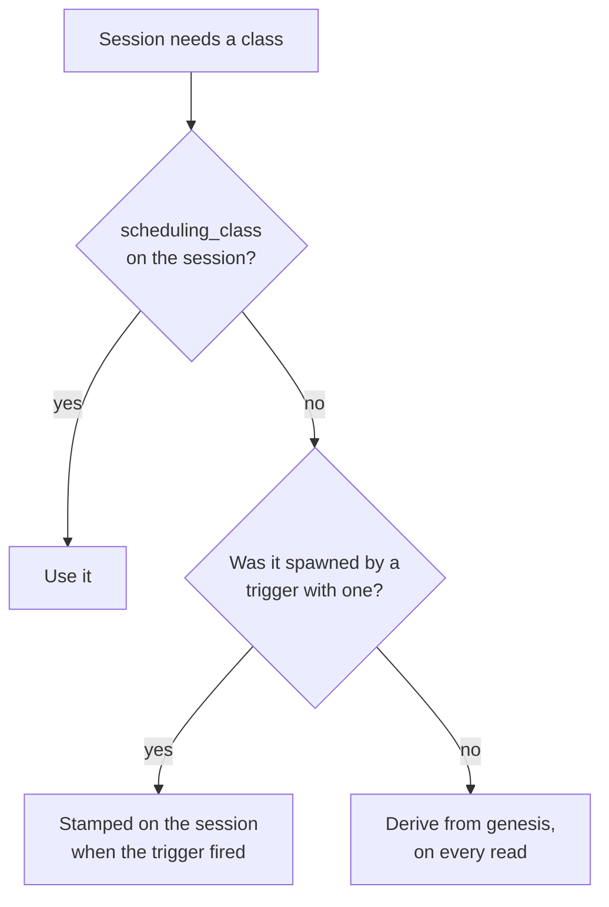
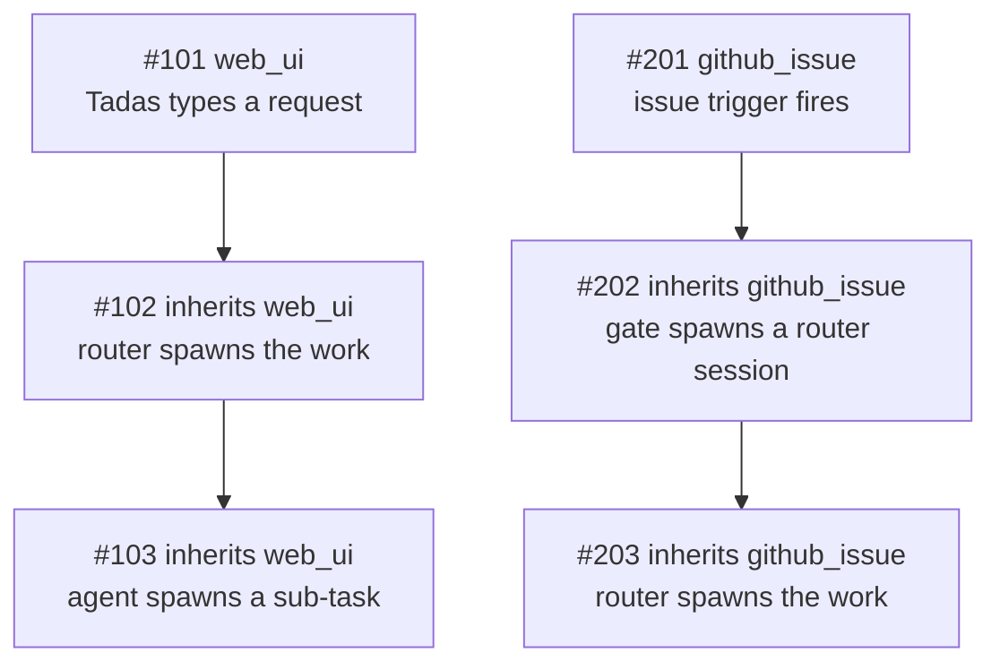

Quota is finite and the work is not. On a busy afternoon a merge gate, three scheduled sweeps and a
label poller can be spending the same 5-hour window that the thing you actually asked for needs.

Zimmer's answer is to classify sessions by where they came from, and to let the automated ones wait.

| Class | Behavior |
| --- | --- |
| **priority** | Starts whenever it is ready. Never consulted about quota or concurrency. |
| **spot** | Starts while every quota window has non-reserved capacity for it, the fleet's burn rate is inside that window's pacing curve, and a session slot is free. Otherwise it waits and starts later. **And stops if a window runs out of room while it is running.** |

A held or paused spot session is **deferred, never cancelled**. Nothing is lost.

Zimmer models each quota window in **dollars**: a calibrated estimate of what a full window is worth
in Opus spend, a **priority reserve** carved out of it, and a non-reserved remainder that spot work is
expected to consume *in full* before the window rolls over. The operator sets the reserve as a
percentage on `/quotas`; the dollar figure beside it is derived. A deployment sitting idle should be
idle because it has genuinely spent its budget, never because the gate was being careful.

## Where the class comes from

Three things can decide a session's class. The first one that speaks wins:

| Order | Source | Set it | Scope |
| --- | --- | --- | --- |
| 1 | **The session itself** — `sessions.scheduling_class` | **Scheduling class** on the new-session form, **Run as spot** on any Quick Router surface, `scheduling_class` on `start_session` / `POST /api/v1/sessions`; afterwards `action_session` (`change_scheduling_class`), `PATCH /api/v1/sessions/:id`, or the button on the hold banner | That one session, and anything it spawns |
| 2 | **The trigger that fired it** — `triggers.scheduling_class` | The trigger's edit form, or `action_trigger` | Every session that trigger spawns from now on |
| 3 | **Its genesis** — the default for where the work came from | `/quotas` (only for the origins no trigger produces) | Every deriving session of that genesis, past and future |

Most sessions never touch 1 or 2: both columns are NULL, and the class is derived. That is what keeps
the defaults live rather than frozen into history.

### The Quick Router's spot opt-in

The Quick Router is the fastest way into Zimmer, and everything it creates is `web_ui` genesis —
priority. That is right for the usual case and wrong for the one it kept forcing: a long unattended
sweep you are not waiting on, typed into the same box, competing for quota with work someone is
watching.

Every Quick Router surface carries a **Run as spot** checkbox, unchecked by default:

| Surface | Where the checkbox is |
| --- | --- |
| The chat-bubble Quick Router panel, on every page | Under the prompt, above **Submit** / **Submit & Open** — both submit paths read it |
| The dashboard's inline prompt (`md:` and wider) | At the right of the attach-button row |
| The dashboard's full-screen prompt overlay (phones) | Above the **Submit** button |
| The mobile joystick's **Quick Router** petal | Opens the chat-bubble panel, so it inherits that one |

Leaving it unchecked submits no class at all: `sessions.scheduling_class` stays NULL and the session
keeps deriving from `web_ui`, exactly as before — so promoting or demoting `web_ui` on `/quotas`
still moves these sessions, which stamping "priority" on the row would have quietly stopped. Only an
explicit tick writes anything.

The choice is per submission rather than a preference. The box clears when the surface closes — a
submit, the phone overlay closing, the panel being dismissed with Escape, the backdrop or the X. A
half-typed prompt is kept across a close and the class deliberately is not: re-ticking a box is
cheap, and a tick left over from an hour ago would silently park the next prompt behind the gate.

**A spot submission lands at the top of the spot queue.** Choosing spot here is a statement about
quota, not about importance — a human typed this one seconds ago. Leaving it at the default
precedence of `0` would file it beneath every automated spot session already ranked above `0`, and
behind every older session tied at `0`, so `SessionsController` ranks it with
`Session.precedence_above_top_spot` instead: a few points above the highest spot session currently
queued. Each checkbox says so, and it is re-rankable afterwards from the [Ranked view](#the-ranked-view)
like any other spot session. An unchecked submission is untouched, including the chat bubble's
ordinary child-sits-just-above-its-parent bump.

## Genesis

A session's **genesis** is where its line of work ultimately came from — not who physically inserted
the row. It is a column on `sessions`, assigned once at creation.

| Genesis | Means | Default class | Class set on |
| --- | --- | --- | --- |
| `web_ui` | A human typed it into the Zimmer web app: the new-session form, the dashboard quick prompt, the chat bubble, or the **Invoke** button on a trigger. | priority | `/quotas` |
| `slack` | A Slack trigger fired on a DM or a channel message. | priority | the trigger |
| `github_issue` | A `github_issue` trigger fired — the feed the issue-work gate reads. | spot | the trigger |
| `github_label` | A `github_label` trigger fired — the `ready to merge` feed the PR merge gate reads. | spot | the trigger |
| `schedule` | A cron-scheduled trigger fired. | spot | the trigger |
| `ao_event` | A session-state trigger fired because another session changed state. | spot | the trigger |
| `api` | Created over `POST /api/v1/sessions` or MCP `start_session` **with no parent session**, or fired by hand over `POST /api/v1/triggers/:id/invoke` / `action_trigger`'s `invoke`. | spot | `/quotas` |
| `unknown` | Origin could not be established — chiefly rows created before genesis was recorded. | priority | `/quotas` |

Five of the eight kinds restate a trigger condition type, so their class lives on the **trigger**, not
in a global per-kind setting: one noisy Slack trigger can be spot without demoting the eleven other
Slack triggers that have a human waiting on the answer. The three that no trigger produces keep a
per-kind setting on `/quotas`.

Two of the defaults are policy calls worth stating plainly:

- **`unknown` is priority on purpose.** A session Zimmer cannot explain is never one it throttles.
  The failure mode of the classifier is "runs anyway", not "silently held".
- **`schedule` and `ao_event` are spot** because recurring automation runs again by definition, so a
  deferred run costs little. Set the trigger to priority if that is wrong for a particular one.

### Genesis is inherited

A session created *with a parent* takes its parent's genesis verbatim. That single rule is what makes
the classification safe to act on:

Holding `#103` would strand a request Tadas is waiting on. Holding `#203` is exactly the intent. Both
fall out of the same rule, with no special-casing of agent roots — which matters, because the gate
roots (`issue-work-gate`, `pr-merge-gate`) live in a deployment's own catalog, not in Zimmer.

An **explicitly declared** genesis outranks inheritance. The chat bubble is the case that needs it: it
carries a parent so the conversation threads, but a human typed the message, so it declares `web_ui`
rather than inheriting spot from whatever session was on screen.

Forks inherit through `metadata["forked_from_session_id"]`, the only lineage edge a fork has.

An explicit `scheduling_class` is inherited the same way. A router told to run one long batch as spot
spawns children that are also spot, without every spawn call having to repeat it — and without moving
any other session that shares the genesis.

### Where you see it

Genesis appears on every node of the **Session hierarchy** panel, as a `genesis · class` pill beside
the agent-root pill — so "this whole branch is spot" is readable at a glance, and an outlier stands
out. It is also on every dashboard card, in `get_session`, and in `quick_search_sessions`.

## Stored only when someone chose it

`sessions.scheduling_class` is NULL on most sessions. When it is, `Session#priority_class` resolves
from the stored genesis on every read, through the per-genesis override map in
`AppSetting#genesis_class_overrides`.

That sparseness is the design. Promoting `web_ui` to spot reclassifies **every deriving session of
that genesis, including ones that already exist** — which is what changing a default has to mean. A
class denormalized onto every row at creation would only ever apply to sessions created after the
click, and would freeze today's defaults into all of history.

The flip side, stated plainly: **changing a trigger's class does not move sessions it already
spawned.** The trigger's selector is read once, when it fires, and stamped on the session. Sessions
already created — including ones still `waiting` behind the gate — keep the class they started with.
To move one of those, move that session: the **Make this session priority** button on its hold banner,
the **Scheduling class** selector on its detail page, `action_session` with
`change_scheduling_class`, or `PATCH /api/v1/sessions/:id`.

## The gate

With gating on, a spot session takes a turn — its first or its next — while **all three** of these
hold, for **both** windows.

| Check | What it means | Reason when it fails |
| --- | --- | --- |
| **The cap** | What the fleet plus this session is projected to spend over the next ten minutes keeps total spend inside the window's non-reserved budget. This is what protects the priority reserve, and it is absolute. | `at_utilization_limit` |
| **The pace** | The fleet's burn rate, including this session's, is inside `remaining spot budget / time left in the window` — the rate that reaches 100% of the budget exactly as the window rolls over. | `at_utilization_limit` |
| **A free slot** | Fewer sessions are running than **Max sessions at once**. Skipped only for a session that is *already* `running` when the gate runs — it is counted in the fleet itself. | `fleet_at_cap` |

### Why a curve rather than a target

The gate used to compare pooled utilization against a flat target percentage: under it, spot work ran
flat out; at it, everything stopped. Three problems followed.

A percentage says nothing about **how much capacity is left** — "76% of a 65% target" cannot be
compared to "keep $200 back for priority work", so a reserve could not be expressed at all. A hard
target **wastes capacity**: work burned through the allowance early and then idled for hours. And it
**bursts and then idles**, when what is wanted is some work happening at every hour of the day.

The pacing curve is self-correcting in both directions, because its numerator is what is *left* and
its denominator is the time *left to spend it in*. Spend below the curve and the sustainable rate
rises, releasing more work; run ahead of it and the rate falls, holding work back until the window
catches up. No cliff at either end.

### There is always room for one session

A session is not infinitely divisible. If the sustainable rate were below what a single session
burns, the pace check alone would admit nothing and leave the whole budget unspent — the opposite of
what the model is for. So **when nothing at all is running, the pace check is waived** and only the
cap applies: one session runs, gets ahead of the curve, and the next admission waits for the curve to
catch up. A duty cycle rather than an outage.

The waiver keys on the whole fleet being idle, not on spot sessions being idle — priority work
running *is* work happening, and it spends against the same window. And the **reserve is never
waived**: an idle fleet facing a spent budget is still held.

### Before the first calibration

`QuotaCapacityCalibrationJob` needs a window with measurable spend and utilization before it can
price one. Until then a window has no dollar figure, and the model reasons in **fractions of the
window** instead: every quantity means the same thing on a 0–1 scale, the cap and the curve work
identically, and only the burn-rate projection is unavailable. Every surface says which mode a window
is in — an estimate is never presented as a measurement, and "not calibrated" is never rendered as
`$0.00`.

The same checks decide for a session that is **already running**, which is what makes the budget a
ceiling rather than only a starting line — see [The budget is a
ceiling](#the-budget-is-a-ceiling).

### The concurrency limit

**Max sessions at once** (default 10) is what bounds how fast the quota can be spent, and its
semantics are deliberately asymmetric:

- **Priority sessions are never held by it.** A priority session starts whenever it is ready, even
  with every slot taken.
- **Priority sessions still count toward it.** The number counted is every running Claude Code
  session, whatever its class. (Codex sessions spend nothing against a Claude account, so they do not
  take a slot.)
- **So ten running priority sessions leave zero spot slots** — priority work is meant to crowd spot
  work out, and that is the intent rather than a side effect.

It is checked **when a session starts** and never again. Lowering the limit under a running fleet
holds the next start; it never interrupts work already underway.

### Read across the whole pool, not one account

Utilization is the **pool average** — every Claude Code account's latest reading, averaged. It is the
same number `/quotas` prints as **Avg 5-Hour Utilization (effective)** and **Avg 7-Day Utilization**
in its Account Pool section, computed once in `ClaudeAccountPool` and read by both, so the page's
headline figure and the gate's decision cannot disagree.

Deciding on a single account meant one account at its cap stopped the whole fleet while the rest of
the pool sat idle. Rotation moves work off a refused account onto the accounts that still have
headroom, so the quota a deployment can actually spend is the pool's, not whichever account happens
to be serving this minute.

**Every account counts, whatever its status** — `active`, `quota_exceeded` and `needs_reauth` alike.
An account in `needs_reauth` is one Zimmer cannot serve from *right now*, not one whose quota is
spent: its windows keep draining while it waits for a human, and its headroom is real again the
moment they log back in. Leaving it out would shrink the denominator to the serving accounts and make
the average jump every time an account fell out of the pool or came back.

The average carries one correction, and it is the page's rule rather than a second one invented for
the gate: an account whose **7-day window is spent counts as 100%** in the 5-hour figure, because its
5-hour headroom cannot be served. Without it, a dead account's empty 5-hour counter would read as room
to spend.

An account with no reading at all contributes nothing and is left out of the denominator too — the
decision says how many of the pool's accounts it averaged. When nothing has a readable window the
gate falls open on `no_snapshot`.

### When the pool comes back

The Account Pool section leads with the answer to "when does work get unblocked?", as a clock
ticking down by the second to a wall-clock time. It comes off the same `ClaudeAccountPool` measure
as the figures below it.

An account can serve a request when **both** of its windows have room, so the moment it comes back
is the later of the two resets it is actually waiting on — a window that already has room
contributes nothing, because that room is there now. The pool's moment is the earliest of those
across its accounts.

That is the whole of the rule, and it is worth being concrete about why it is not two separate
answers. An account sitting on an empty 5-hour window with its week spent comes back the moment its
week does, whatever its 5-hour window is doing; an account over its 5-hour cap with plenty of week
left comes back when the 5-hour window rolls. Measuring the two windows separately — a "next usable
5-hour reset" over the accounts with weekly allowance left, and a 7-day reset over the rest — cannot
express the first of those, so a pool whose soonest relief was a weekly reset twenty minutes out
would advertise a 5-hour rollover hours later.

The banner has three states, and the empty ones say which emptiness they are:

- **A countdown**, when every account with a reading is out of capacity and at least one of them can
  say when it returns. It names the wall-clock moment beside the clock and how many accounts are
  out.
- **"Work is not blocked"**, when an account has room on both windows right now. There is nothing to
  count down to, and a clock ticking toward the next rollover would read as a wait that is not one.
- **"Nothing here says when work resumes"**, when everything with a reading is out and none of them
  recorded a reset time. A zeroed clock would read as "any moment now".

The tick is driven in the browser from an absolute ISO-8601 instant in the markup
(`unblock_countdown_controller.js`), not from a duration the server rendered — /quotas is a page
people leave open, and "in 22m" is right for one second and wrong for every second after it. The
server renders the same clock string from the same instant, so the first paint is already correct
and the page still tells the truth if JavaScript never runs. When the deadline passes while the page
is open the clock stops at `now` and says the reading is stale rather than counting into a negative
wait.

Under the weekly average, **Next 7-day reset** still describes its own window: it is measured only
over accounts whose week *is* spent, because those are the ones a weekly rollover returns to
service. It is the detail behind the headline, not the headline — an account whose week returns at
noon but whose 5-hour window is spent until 2pm is not servable at noon. When no account is
weekly-blocked the note says that rather than naming a rollover on an account that was never
blocked. It reports the soonest reset *recorded* among the spent accounts and counts them
separately, because a spent window does not always carry a reset timestamp — when none of them does,
the note is the count alone.

Nothing here counts a reset time that has already passed. A past timestamp describes a window that
has already rolled over, which is the same rule the counters follow, so it is not something the pool
is waiting for.

The times are rendered as UTC on the server and rewritten to the reader's own clock in the browser
(the `local-time` Stimulus controller), which names the zone it converted to; the UTC reading stays
on hover, and stays on screen if JavaScript never runs.

Targets and the concurrency limit are set together on the Claude Code tab of `/quotas`, on the same
page as the windows they are measured against, and all three are settable over MCP with
`action_spot_policy` (`set_gating`).

### Fail-open

Every uncertain condition **allows** the session, and the reason is named so the UI can say which:

| Reason | Meaning |
| --- | --- |
| `gating_disabled` | The toggle is off. |
| `no_snapshot` | No Claude Code quota reading to decide on. |
| `unavailable` | The gate could not be evaluated at all. |
| `within_limits` | Both windows have room and are inside their curves, with a slot free. |
| `at_utilization_limit` | **Held.** A window's non-reserved budget is spent, or the fleet is running ahead of that window's pacing curve. |
| `fleet_at_cap` | **Held.** Every session slot is taken — by spot work, priority work, or both. |

A monitoring gap must not become an outage of all automated work.

### Three ceilings, two reason strings

`at_utilization_limit` covers **two** ceilings that behave differently, and the difference matters:
only one of them stops work that is already running.

| `Decision#ceiling` | What it means | Does it pause running spot sessions? | What lifts it |
| --- | --- | --- | --- |
| `fleet_cap` | Every session slot is taken. No window is involved. | No | A running session finishes |
| `spot_budget` | A window's non-reserved budget is spent. | **Yes** | The window rolls over |
| `pacing_curve` | The budget has room, but the fleet is spending it faster than the window can carry. | No | The fleet's burn falls |

The two window ceilings share one reason string because `at_utilization_limit` is **persisted** on
sessions — it is written into `spot_pause_reason` and read back by the banner on every session
carrying it, so splitting the string would make those banners unreadable. `Decision#ceiling` derives
the distinction instead, and `/quotas` and `get_spot_policy` both report it.

`SpotHoldExplanation` turns it into the two sentences those surfaces render: *why it's held*, and
*held until*.

### "Held until" is a condition, not a clock

Only `spot_budget` has a time in it. The other two are conditions, and Zimmer states them as
conditions rather than reaching for the nearest plausible number.

The pacing curve is the case worth spelling out. The sustainable rate is *the budget left divided by
the time left*, so while the fleet burns faster than that rate the numerator falls faster than the
denominator and **the rate keeps dropping**. Waiting widens the gap. What lifts a pacing hold is the
fleet's burn falling, which means running sessions ending — and nothing in the model predicts when
that happens.

So the surfaces say: *"When the fleet's burn falls to or below $X/min"*, where `$X` is the sustainable
rate less what the next session is itself projected to spend — the gate tests the sum of the two, and
`Window#within_pace?` is `<=`. The budget and a free slot still have to hold, and the sentence says
so. The window's rollover is offered after it, labelled as an **upper bound on the wait rather than a
forecast of it** — the rollover refills the budget, so the hold cannot outlast it.

When one session on its own is priced above the whole sustainable rate, there is no fleet burn low
enough to admit it and the copy says so: nothing fits beside the work already in flight, and with
nothing running at all the [idle-fleet waiver](#there-is-always-room-for-one-session) admits one
session so the deployment runs in a duty cycle.

A hold can involve both window ceilings at once — one window's budget spent while the other is only
ahead of its curve. `Decision#ceiling` reports `spot_budget` then, because that is the stricter of
the two, and `Decision#budget_spent_windows` is what the copy names: saying "the 5-hour and weekly
windows' budget is spent" would be false of the second, and bounding the wait on the weekly rollover
would over-claim a window that clears as soon as the fleet slows.

### What "hold" does

A held session stays in `waiting` — the status Zimmer already uses for "created, not started" — and
`AgentSessionJob` re-enqueues itself after ten minutes plus a little jitter. GoodJob persists the
delayed job in Postgres, so the retry survives a worker restart or a deploy. When a slot frees, or
the curve catches up, the same job starts the session normally.

A re-check job that a worker shutdown catches *mid-pickup* is re-enqueued verbatim rather than
treated as an interrupted session — see [`waiting` is two different situations, and neither is a
recovery](/sessions/lifecycle/#waiting-is-three-different-situations-and-none-of-them-is-a-recovery).
The chain has no redundancy along it: each re-check is what forges the next one. So when a link is
lost, a sweep re-forges it — see [A hold that loses its re-check](#a-hold-that-loses-its-re-check).

Archiving a held session ends it deliberately. The delayed job is left in the queue — nothing
cancels it — but `AgentSessionJob` refuses an archived session before it reaches the gate, so
that job fires once, logs why it stopped, and schedules nothing further. The hold record is left
on the session as it stands: it is the history of why the session sat in the queue until it was
trashed, and an archived session shows no hold banner anyway.

The jitter matters at a backlog: without it, sessions held in the same minute re-check in the same
minute forever, every one of them reading the same fleet size before any of them has started.

#### Consecutive holds back off

Jitter spreads a held population out. It does not make it smaller — and the size is what matters to
the queue. A flat ten-minute interval means *N* held sessions put a fixed *N* / 10 min of
`AgentSessionJob` work onto the `agents` queue for as long as the hold lasts, an arrival rate that
cannot fall when the deployment is struggling. That is what it is for: on 2026-08-20, ~80
quota-held sessions re-checking every ~11 minutes held a standing ~8 jobs/min against sixteen
`agents` threads, eleven of them occupied for hours by live sessions. When a host-latency episode
pushed each re-check into the tens of seconds, arrivals outran service and the GoodJob ready queue
grew without draining until `SystemHealthMonitorJob` paged.

So each *consecutive* hold doubles the interval — 10m, 20m, then on until the ceiling clamps it — and
the ceiling depends on why the session is held, because the two reasons clear on very different
timescales:

| Hold reason | Ceiling | Why |
| --- | --- | --- |
| `at_utilization_limit` | 1 hour | A pool window comes back down over hours. Re-checking more often than this cannot learn anything new, and this is the reason that produces the long-lived holds. |
| `fleet_at_cap` | 30 minutes | A slot frees whenever any running session ends, which is unpredictable and often soon. |

So a utilization ladder runs 10m, 20m, 40m, 60m, 60m…, and a fleet-cap one 10m, 20m, 30m, 30m….

Jitter is added *after* the ceiling, so a population pinned at the ceiling still spreads out. The
ladder resets in two situations, and both are the caller saying so rather than anything inferred
here:

- **The session gets through.** `spot_hold_count` is one of the `spot_hold_*` metadata keys cleared
  on start, so the next outage begins again at ten minutes rather than resuming where the last one
  left off.
- **A person asks for this session directly.** Restart, `action_session`'s `restart_from_scratch`
  and `POST /api/v1/sessions/:id/restart` all except the same keys from the metadata they carry
  forward. They have to: those paths re-enter the gate looking *exactly* like a scheduled re-check —
  no prompt, no resume flag — so without it they would read as another consecutive hold and push the
  ladder up, making someone who asked for the session now wait longer than if they had left it
  alone.

Restarting resets the ladder; it does not *bypass* the gate. A session the gate still refuses is
held again, back at ten minutes. The lever that starts it now is **Make this session priority**.

The cost is real and is not hidden: a session can now sleep longer than it strictly had to, up to
its ceiling, if the condition clears early. That is bounded, visible as `spot_hold_retry_at` on the
session's detail page, and a human who wants it now can make the one session priority — which is
what the hold banner already says.

Refusing instead would mean the gate silently deletes work: a `github_issue` trigger that fires once
during a busy afternoon would never run at all.

### A hold that loses its re-check

The ladder above is a chain of single delayed jobs, and until 2026-08-31 it had no redundancy
anywhere along it. A hold is a promise — *"re-checking at 02:43:15"* — kept by exactly one job, and
each re-check is what enqueues the next one. Lose one link and the session waits forever, in a state
indistinguishable at a glance from a session merely queued.

That is not hypothetical. Session 7507 was held for the 145th time at `02:12:30Z`; the hold record
committed, and 23 seconds later the worker was gone. GoodJob re-picked the row and raised
`InterruptError`, and the hold's own log line never reached the database — it was still in the
in-memory `LogBuffer`, which is how we know the execution died *between* the metadata write and the
flush, taking the un-enqueued re-check with it. At `02:43:15Z` nothing happened, and nothing ever
would have. Eleven hours later the session page was still showing a human `5 of 5 session slots
taken` while the live gate said `within_limits` at 1 of 5.

Two changes make that recoverable rather than terminal.

**The durable record is the session, not the job.** `spot_hold_retry_at` on the session is what the
ladder rests on, and `SpotHoldSweepJob` reconciles it against reality every five minutes. A hold
more than ten minutes past its own re-check time, with no `AgentSessionJob` still queued against
that session, is a broken ladder: the sweep advances the stamp under a row lock and enqueues the
turn again. The advanced stamp is its own idempotency key, so the next pass leaves the session
alone. It re-arms at most ten a pass, spread over three minutes, so a recovered backlog walks back
onto the ladder rather than hitting the gate at once.

A re-arm is a **re-check, not an admission**: it puts the same turn back through the gate, which
decides again. If the gate is open the session runs; if it is still closed the session is held
again, with a fresh re-check behind it.

**The refused prompt is recorded on the session too.** *"Deferred, never dropped"* is the promise the
hold makes, and while the only copy of the prompt was the delayed job's argument list, a lost job
broke it. A deferred resume now writes `spot_hold_prompt` alongside the rest of the hold record, so
the sweep replays the real turn. A hold recorded before that — every session stranded today — has no
prompt to replay and comes back on a recovery nudge instead, which is said out loud in its log.

**An interrupt no longer mistakes a hold for a stranded session.** A held session is dormant on
purpose, exactly like a ceiling pause or an auth-outage park, and `AgentSessionJob`'s interrupt
recovery now recognises it as such. It used to read only the *pause* record (`spot_pause_reason`),
so a held session — `spot_hold_reason`, a different population with a different resume owner — fell
through to the recovery path and was stamped `paused_by: "recovery"` on top of its hold. Session
7507 was: twelve auto-continue attempts against a clone deleted days earlier, then abandoned at
`02:54:32Z`, leaving it in `waiting` holding a re-check that had already been lost.

### A hold lasts as long as the number does

There is no escape hatch and no deadline: while a window is ahead of its curve or out of budget, spot
work waits. That is the intent — but the curve is what makes the wait short. A window ahead of pace
is back inside it as soon as the clock moves far enough, which is minutes rather than hours, and a
window whose budget is genuinely spent waits for the rollover. Both are visible on `/quotas` the
whole time, in dollars. Promoting one session to priority is the lever for a single piece of work
that cannot wait.

### Every turn is gated, not just the first

The gate used to read "is this a first start?", and everything else — a fired `wake_me_up_later`
backstop, a queued follow-up, a Slack or GitHub poller message, a heartbeat nudge, a restart — went
straight through. All of those arrive at `AgentSessionJob` carrying a prompt, and every one of them
begins a **new turn that spends fresh quota**. On 2026-08-22 a spot session woke on its own backstop
trigger and ran a full turn while this gate was reporting `at_utilization_limit` at 87% of a 65%
target, force-pausing 22 running spot sessions and holding 141 more at the starting line.

So the admission check covers every turn. While a window has no room for spot work, the only way a
spot-designated session runs is to be **promoted to priority first**. Two things still pass through,
because neither spends anything:

| Passes through | Why |
| --- | --- |
| `clone_only` | Sets up a clone and configures MCP. No agent is spawned. |
| `resume_monitoring` | Re-attaches to a process that is **already running**. Holding it would orphan that process, not save a token. |

One hold reason is skipped for a session that is **already `running`** when the gate runs:
**`fleet_at_cap`**. Its deliverer has flipped it to `running`, so it is counted in the running fleet
itself — refusing it for a full fleet would refuse it on the strength of its own slot, and would
refuse every session the ceiling sweep resumes (those are flipped to `running` before their jobs
run). The utilization reading has no such problem: the pool's windows are measured independently of
this session.

That exemption is keyed on the session's **status**, not on "this turn carries a prompt". A turn the
gate has already deferred once is sitting in `waiting` and holds no slot, so its re-check is an
admission like any other and the concurrency limit applies to it in full.

**A deferred turn is not a lost turn.** The prompt that woke the session, and any images or files
attached to it, are re-enqueued verbatim on the same backed-off re-check as a first-start hold —
GoodJob persists that delayed job in Postgres, so it survives a worker restart or a deploy. The
session goes back to dormant `waiting` (not `needs_input`: nobody has to do anything about it), and
nothing announces it as needing a human — no push notification, and no `session_needs_input` event
that would wake a parent watching this session about a turn that never ran.

Two details keep that true when something delivers to the session *again* during a hold, which can
last the best part of an hour — a second child waking its orchestrator, say:

- **The gate takes custody of the prompt**, so `pending_follow_up_prompt` is dropped. That marker
  means "no job has picked this up yet" and `AgentSessionJob` prefers it over its own argument;
  left in place, the second delivery's marker would overwrite the first, and the first deferred job
  would deliver the second prompt and discard its own.
- **A second refused turn is queued, not given a second job.** Two jobs racing one session means the
  concurrency guard drops whichever loses, so the later prompt goes into `enqueued_messages` — the
  durable queue Zimmer already drains at a session's next turn boundary — and is delivered after the
  turn ahead of it. The hold record is left alone in that case: the re-check it names is the one
  that will actually fire, and a queued prompt is not another rung on the backoff ladder.

The session detail page shows a **Held for quota headroom** banner — **Next turn held for quota
headroom** when it was a resume — naming the reason, the next check time, and how to run it now.
`get_session` reports the same through `spot_hold_reason` / `spot_hold_retry_at` /
`spot_hold_count`, and says explicitly that the queued prompt is still coming.

## The budget is a ceiling

Admission alone made the budget a **floor under when new spot work stops**, not a ceiling on what
spot work spends. A session admitted with room to spare goes on running, and a fleet of them carries
the window straight past the line: on 2026-08-20 the spot gate card read *"Holding spot sessions:
5-hour window at 89% of its 80% target"* while twelve sessions ran and three accounts sat in
`quota_exceeded`. The gate had stopped admitting and then watched the work already in flight climb
toward 100%.

So `SpotCeilingSweepJob` re-evaluates the same decision every five minutes and applies it to running
sessions:

| The gate says | What happens to running spot sessions |
| --- | --- |
| `at_utilization_limit`, ceiling `spot_budget` | Every running spot session is **paused**. |
| `at_utilization_limit`, ceiling `pacing_curve` | Nothing. The pace is an admission device: killing a running turn to enforce a curve spends a lost tool call protecting nothing, since the same money is spent either way, just later. It is also what keeps the idle-fleet waiver coherent — otherwise the sweep would pause the session the waiver had just admitted, and the two would flap. |
| `fleet_at_cap` | Nothing. A running session already holds its slot; pausing it would free that slot only for another spot session the same cap would hold. |
| anything else | Sessions dormant in the queue are **resumed**, highest precedence first (oldest pause first within a tie). |

`SpotSessionPause` reads `Decision#stops_running_work?`, not `held?`, which is what draws that
first line. A fleet merely ahead of the curve is throttled at the door and never interrupted.

Priority sessions are never paused, on any reading. Nor are Codex sessions (they spend nothing
against a Claude window) or status-summary forks (Zimmer's own seconds-long bookkeeping).

### What a pause does

The session's CLI process is terminated and the session goes dormant in **`waiting`** — the same
shape a `wake_me_up_later` sleep leaves behind, reached the same way (`pending_sleep` is set, and the
pause callback carries it needs_input → waiting).

`waiting`, not `needs_input`, is deliberate: a session in `needs_input` lands on the homepage action
queue, which is for work a human must act on. A quota pause is not — and ten of them at once would
bury the sessions that genuinely need a person.

Pausing interrupts a turn. What the agent had already written to disk stays written; the tool call in
flight is lost, along with any reasoning not yet flushed to the transcript. That cost is paid once
per pause, and it is recorded rather than silent:

| Where | What it says |
| --- | --- |
| `metadata` | `spot_pause_at`, `spot_pause_reason`, `spot_pause_detail` (the gate's own sentence), `spot_pause_count`, and `paused_by: spot_quota` |
| The session log | A warning line naming the window, what it ran out of, and what brings the session back |
| The session page | A **Paused mid-run for quota headroom** banner, with the same **Make this session priority** button the hold banner carries |
| MCP | `get_session` reports the pause, why, and when it resumes |

`paused_by: spot_quota` is what keeps the recovery sweeps out of it: it is neither `user` (which stops
auto-continues) nor `recovery` (which would have `DeploymentRecoveryJob` resume the session straight
back into the window that stopped it). A **Refresh all** on the dashboard skips these sessions for the
same reason.

### What brings it back

The next sweep that finds the gate open resumes them, with the standard system-recovery nudge telling
the agent to pick up where it left off. Two things shape which and how many:

- **A resume margin.** Resumption decides against a reserve WIDENED by `SpotGateService::RESUME_MARGIN_PCT`
  (5 points of the window): with a 20% reserve, a paused session resumes only once the fleet is inside
  a **25%** reserve. Holding a session that never started costs nothing, so admission uses the plain
  reserve; resuming one that was interrupted mid-turn costs a lost tool call, so it waits for real
  headroom rather than resuming the instant the fleet dips under the curve and pushing it straight
  back over. The margin is applied as extra reserve, so the money it protects is the same money the
  reserve protects — and the reserve the page shows is still the one the operator set.
- **A batch of five per sweep**, and never more than the free slots under **Max sessions at once**. A
  window that has just come back down is at its most fragile — every session resumed starts spending
  again immediately — so the fleet walks back up over successive sweeps rather than restoring all at
  once. Sessions past the batch keep their place at the front of the next one.

A session someone promotes to **priority** while it sleeps is resumed by the next sweep whatever the
windows say, because priority work is never gated on quota.

One thing outranks even that: a session with a **wake-up still ahead of it** is left alone. See
[A pause outranks precedence](#a-pause-outranks-precedence) below.

### Joining the queue on purpose

The same dormancy is reachable deliberately, and it is the answer to "this session should wait, and
no time I could name is the right one". **Pause Until → Spot Queue** on a session card, in the
detail header, or in the phone's bottom sheet — `pause_into_spot_queue` on `action_session` for an
agent — sleeps the session and hands it to this sweep with **no wake-up trigger and no wall-clock
time at all**.

It is the same record and the same resume path as a ceiling pause, with three differences, because
nothing interrupted this session:

- `spot_pause_reason` is `user_spot_queue`, so the banner, `get_session` and the session log all say
  a human parked it rather than describing a turn it never lost. It is also left out of the
  "spot sessions asleep in the queue" count on `/quotas`, which is about what the ceiling cost.
- A session that resolves to **priority** is set to `spot`, since the sweep resumes a non-spot
  sleeper on its very next pass. **Make this session priority** on the banner reverses it, and that
  next sweep resumes the session — which is the intended way back out.
- The panel's **Resume with** box still applies: with no trigger to hang the prompt on, it rides on
  the session and is delivered when the sweep reaches it, in place of the recovery nudge.

Its place in line is whatever `precedence` the session already carries — parking it does not
re-rank it. Any unfired wake-up armed from the same control is cancelled, because picking the queue
after picking a time means "not then, this instead".

The sweep runs every five minutes, but what bounds how fast the ceiling reacts is the **reading**, not
the sweep: utilization comes from quota snapshots, which land when `ClaudeUsageSamplerJob` samples
(every 15 minutes), when an account rotates, and when someone opens `/quotas`.

## Precedence: ranking the spot queue

`scheduling_class` answers "does this session wait for quota headroom". It says nothing about which
of the waiting ones goes first — and with a permanently long spot queue that is the question that
actually decides what gets done.

`precedence` is that ordering. Every session carries one; only spot sessions are ordered by it.

- **Higher is handled sooner, on an absolute scale.** 100000 comes before 50, and 50 comes before 0.
  It is not a 1..N rank and nothing renumbers it — values are sparse on purpose, so there is always
  room to slot work between two existing entries. Ties break on `created_at`, oldest first.
- **It lives on every session, priority ones included.** A priority session demoted to spot has to
  land somewhere sensible, and a spot session promoted to priority has to keep its place for when it
  is demoted back. A column populated for half the rows would lose that on every round trip.
- **A spawn lands just above its parent.** `start_session` with no `precedence` puts the new session
  one point above the session named in `parent_session_id`, so the child that finishes its parent's
  job runs before unrelated work queued beneath it and a tree of work stays contiguous. Name a value
  only when you mean to move the work relative to everything else in the queue.
- **A trigger can predefine one**, alongside the class it already carries, so a feed is ranked once
  rather than one spawned session at a time.

### A pause outranks precedence

Precedence answers *which* waiting session goes first. It does not answer *whether* a session may
start at all, and one thing overrides it unconditionally: a **wall-clock pause**.

A session that a human paused until a time with **Pause Until**, or that an agent slept with
`wake_me_up_later`, sits in `waiting` and keeps whatever precedence it had. Nothing in the columns
distinguishes it from a session merely queued behind the gate — both are `waiting` spot sessions with
a number. So the rule is enforced on the *start*, not on the ordering:

**A session paused until a time it has not reached does not start, whatever its precedence and
whatever its scheduling class.** It stays in the queue, at its rank, and the selector takes the next
candidate.

:::note[A pause is a floor, not a promotion]
"Not before this time" is the whole of what a pause says. It does not say "and then run regardless of
the queue" — the spot queue stays the scheduler for spot work. When the wake comes due it delivers a
prompt like any other turn, and that turn answers to the spot gate: a spot session whose window has
no room for it is held and stays dormant in `waiting`, to be started by the queue in precedence order,
while a priority session goes straight through because priority work is never gated on quota.

So the two mechanisms compose in one direction only. A pause can keep a session out of a queue slot
it would otherwise have taken; it can never take one the queue was not going to give.
:::

Five places could otherwise have started it early, and each declines:

| Who | What it does instead |
| --- | --- |
| `AgentSessionJob` (a first start — a spot-hold re-check, a fleet slot opening) | Stands down and logs why, without re-arming the re-check timer. The armed wake is the next event in the session's life. |
| `SpotSessionPause` (the ceiling sweep, every 5 minutes) | Skips it *before* the promotion branch, so promoting a paused session to priority does not start it either. Counted as `held`. |
| `AuthOutageParkService` (the un-park sweep, every 15 minutes) | Skips it. This one matters twice over: its resume goes through `resume!`, whose `cancel_pending_one_time_wake_triggers` callback would have destroyed the pause without a trace. |
| `action_session restart` — the start path in the `awaken-waiting-sessions` skill | Refuses with an error naming the pause and telling the caller to take the next candidate. |
| `POST /api/v1/sessions/:id/restart` — the same door for a script or an integration | Refuses the same way, with the same sentence. |
| A fleet-maintenance agent working the ranked queue | `quick_search_sessions` marks the row `**Paused:** yes` with the wake time, so the agent skips it deliberately — and the two rows above refuse regardless of what the agent decides. |

The last row is the reason the guards are code rather than only prompt text. The fleet-wake
selector is an agent reading a skill, which is a judgement; the refusals are a guarantee that holds
for any caller — the skill, a script, a future integration.

Both `restart` doors refuse at the surface rather than deeper down, because each resumes the session
*before* it enqueues anything and `resume`'s `cancel_pending_one_time_wake_triggers` callback consumes
the pause on the way past. A guard further in would arrive after the pause was already gone.

Two paths deliberately still consume the pause, because both mean *a caller is taking this session
over* rather than a selector working a list: the web UI's **Restart** button, and a `follow_up`
addressed to the session directly.

The pause is a **deferral, not a cancellation**, and its expiry is what makes that true. Past its
moment the wake is no longer "ahead of" the session, every guard above stops applying, and the
session is an ordinary queue candidate again — reachable both by its own wake firing and by the spot
sweep, whichever gets there first. Sleeping means *the scheduler has yet to reach it*, read through
the same `TriggerCondition#schedule_due?` the firing path uses, so an overdue wake describes a stuck
session rather than a resting one.

**Only a wall-clock pause blocks a start.** `Session#awaiting_scheduled_wake?` — the broader reading
a [refresh](/sessions/lifecycle/#refreshing-a-waiting-session-nudges-it) uses — also counts a
session-scoped `ao_event` watcher, and that one has no time component at all: if the watched session
fails or is archived it is "still ahead" forever. Declining to *nudge* on that is free; declining to
*start* on it would put a session permanently beyond every automated path on the strength of one dead
watcher. So the start guards read `Session#paused_until_scheduled_time?`, which counts only unfired
one-time schedules.

### The Ranked view

`/?view=ranked` — a fourth dashboard view beside Categories, Last Touched and Created, and the only
one that is a management screen rather than a reading one. Priority sessions stack above the queue,
the spot queue is listed under them highest-precedence first, and both halves are editable in place:

| Do this | And | Which means |
| --- | --- | --- |
| Type a number in a row's precedence field and press **Enter** | the row moves to its new position immediately, with no page load | `PATCH /sessions/:id/update_precedence` |
| **Drag** a row between two others | it takes the **midpoint** of the two values it was dropped between | `PATCH /sessions/:id/reorder_precedence`, which is handed the two neighbours and derives the value |
| Drag between two **adjacent** values, where no midpoint exists | the neighbours are nudged one apart each, and the dropped row takes the middle of the gap that opens | the same request — 21 and 20 become 22 and 19 |
| Open a row's **⋮** menu and press **Demote to spot** on a priority row | it lands `SLOT_GAP` (5) above the current top of the spot queue | `PATCH /sessions/:id/update_scheduling_class` with `place=top_of_spot` |
| Open a row's **⋮** menu and press **Promote to priority** on a spot row | it moves up to the priority section, keeping its rank for a later demotion, **and starts** | the same endpoint, plus `Sessions::StartNow` |
| Open a row's **⋮** menu and press **Start now** | the session's queued turn is taken now instead of when the scheduler gets to it | `POST /sessions/:id/start_now` |
| Open a row's **⋮** menu and press **Trash** | the session is archived and the row leaves the queue | `POST /sessions/:id/archive` — the same action every other Trash affordance posts to, speed bump and Undo toast included |

Every write is optimistic: the row moves first and the server's answer corrects the numbers behind
it, including any neighbour that was nudged. A write that fails rolls the row back and reloads,
because the server's order is the only one that counts.

The nudge is what keeps an integer column usable without a renumbering pass — one extra write per
drag, and no global compaction ever. A nudge can push a neighbour onto the value of the row beyond
it; that is left alone deliberately, since equal precedence is legal and cascading the nudge upward
would turn one drag into an unbounded write. The next drag into that spot separates them.

The Ranked view opens on `waiting`, `running`, `needs_input` and `failed` rather than the dashboard's
usual `needs_input`-only default: its whole subject is work that has not started. An explicitly
chosen filter still wins, as everywhere else.

Each row carries one visible control — a **⋮** overflow menu holding promote/demote, **Start now**,
a link to the session and **Trash**. The row itself is the reading surface: a drag handle, the rank,
the status and the title. On a phone the row is two lines (title above, rank and status below),
because a single line at 375px leaves the title about eighty pixels.

The **title opens the session in the dashboard's right-side drawer** rather than navigating away —
the same drawer a card's **View** button opens, on the same `session-drawer#open` action. It stays a
real `<a href>`, so middle-click, ⌘/Ctrl-click and "Open in new tab" still open the session in a new
tab: only a plain, unmodified left click is intercepted, and below the `sm` breakpoint the drawer
declines entirely and a phone gets the full session page.

#### Starting a queued session now

`Sessions::StartNow` is the operation behind **Start now**, and the one a promote to priority
performs on the row it just promoted. It exists because the hold banner's "Make this one session
priority to start it now" was not true: promoting removed the *reason* a session was held and changed
nothing about *when* it would next be asked, so a session somebody had just decided was urgent went
on waiting out a re-check up to an hour away.

A waiting session is dormant in one of three shapes, and each has its own door back in:

| Shape | What starts it |
| --- | --- |
| Held at the starting line by [SpotSessionHold](#what-hold-does) | its **already-queued** delayed `AgentSessionJob` is rescheduled to now, through GoodJob's own `reschedule_job` |
| …and it is still `spot` | the gate is asked again *now* rather than in forty minutes — it is not bypassed. A window still over its target holds the session again, and the message says so rather than claiming a start it cannot promise. Promotion is what removes the gate, which is what the hold banner has always pointed at |
| Paused mid-run by the ceiling, or parked from **Pause Until → Spot Queue** | `SpotSessionPause`'s own resume — the same locked re-check the sweep performs, restoring the prompt a human left with the park |
| Neither, and it has **never** run | a fresh `AgentSessionJob` — the one branch that builds a turn out of nothing rather than moving one that exists |
| Neither: it has run before and has nothing scheduled | nothing, from a promote. It is stranded rather than queued, so **Start now** sends it the same continue nudge Refresh does |

The first row is the one worth internalizing. A held session is **not** a session with nothing
scheduled: the gate takes custody of the refused turn and rides it — prompt, images and files — on a
delayed job. Enqueuing a fresh job alongside it would leave two jobs for one session, and only the
first is protected. `AgentSessionJob`'s concurrency guard stands a job down while `running_job_id`
points at a *live* job, but the deferred one fires whenever it likes, and a session that has already
finished its turn and gone back to `waiting` has no live job to stand it down. That second turn would
run for real, re-delivering a prompt that was already delivered. Pulling the queued job forward keeps
it at one job, one turn, prompt intact.

That last-but-one row is the only one that has to rebuild the turn's *attachments* too.
`AgentSessionJob` receives images and files exclusively as job arguments, so a job built from
scratch starts with none — which is how a session whose prompt was "here is the screenshot, fix
this" came to be started with the prompt and without the screenshot. `Sessions::StartNow` re-reads
them from the durable volume, where they sit keyed by session id, and says in the session's log what
the turn is carrying. It leaves out anything a **queued follow-up** already owns: both live in the
same per-session directory, and a screenshot attached to a message somebody queued for later belongs
to that message, not to the turn before it. The other rows must *not* re-read storage — their job
already carries its own copy.

A session **asleep on a wake-up it has not reached** is refused rather than started. The wake is that
session's next event and it carries its own prompt; starting underneath it would race the two.
`AgentSessionJob` refuses such a start on its own — this only says so before the click.

So is a session whose queue could not be **read**. An unreadable queue looks exactly like an empty
one, and a held session that has never run would then take the "enqueue its first turn" branch on the
strength of it — producing the second turn the whole design exists to avoid. The hold record is left
alone on every path that does not actually start something, so a session that turns out to have
nothing queued keeps the banner explaining why it is dormant.

#### The queue stays live

Rows subscribe to the `sessions_ranked` Turbo Stream. It is a separate stream from the card grid's
`sessions_index_individual` because a ranked row is not a card and is not keyed on `dom_id` — which
is exactly why the queue's statuses used to go stale until the page was reloaded.

Two kinds of message travel on it.

**A status change replaces one element per row: the status pill** (`_ranked_row_status`, written by
`Session#broadcast_ranked_row`). That bound is the design, not a shortcut. The row around the pill
holds two pieces of state the server does not own — a precedence the user may be halfway through
typing, and the row's position while SortableJS is dragging it — so replacing the whole row would let
a background status change destroy an interaction in progress. A `running` session's pill carries a
spinner, so the queue reads at a glance as "these are the ones actually moving"; it arrives and
leaves with the pill, because the pill is the thing being replaced.

**A membership change sends an envelope** (`_ranked_delivery`, written by
`Session#broadcast_ranked_membership` on create, on a status change and on a scheduling-class
change). The server cannot decide whether a row belongs on your screen, because one stream serves
every open page and each has its own filters — the operator watching live work and the one who ticked
"Archived" to go through the trash are on the same channel, and a session going archived means
"leave" to the first and "stay, relabelled" to the second. So the envelope carries the session's
filterable facts plus the row already rendered inside an inert `<template>`, and
`ranked-queue#deliveryTargetConnected` decides:

| The page's filters say | What happens |
| --- | --- |
| the status is excluded now | the row leaves |
| the scheduling class no longer matches its section | the row moves sections |
| it is admitted and not on the page | the row is inserted, in precedence order |
| anything else | the envelope is discarded |

The row travels in a `<template>` so its ids are never in the document until the page accepts it —
an envelope for a session you filter out cannot leave a stray `ranked_row_<id>` behind, and one for a
row already on screen cannot duplicate it. The envelope is consumed and removed either way.

**Neither kind is sent for a status-summary fork.** Those are Zimmer's own bookkeeping sessions (see
[the Status summary](/sessions/status-summary/)), and every server-rendered session list already
drops them with `Session.excluding_status_summary_forks` — so a stream that carried them would put
rows on the queue that a reload then took away. The exclusion lives inside
`Session#broadcast_ranked_membership` and `#broadcast_ranked_row` rather than on the callbacks that
call them: a fork's status changes reach both methods through `broadcast_status_change`, which calls
them directly, so a guard on the callback registration covered only the create and scheduling-class
paths.

Three rules keep that safe, and each costs a little freshness:

- **Deliveries are held during a drag** and flushed on drop, so nothing is inserted or removed under
  a moving pointer.
- **A row holding focus or a half-typed value is never moved or removed** — the same rule the
  reconnect backfill applies. A delivery never writes a precedence input belonging to a row it is not
  moving, so an uncommitted number cannot be clobbered at all.
- **A section already at its 200-row cap takes no insert**, because the server truncates at the same
  number and says on the page that it has.

What it still deliberately does not do:

- **No re-sorting.** Precedence, not status, decides the order. A precedence someone changes in
  another tab does not move rows here — that would move a row out from under a pointer for a number
  nobody on this page typed.
- **No inserting into a narrowed page.** A search query, an agent-root filter or a genesis filter
  cannot be evaluated client-side for a session the page has never rendered, so `live_insert` is off
  whenever one is in force and the page declines rather than guessing. *Removal* stays sound under
  all three: a row on screen already matched them, and neither a status nor a class change alters
  that.

The section header counts and the "nothing here" placeholders are recounted by a `MutationObserver`
in `ranked_queue_controller.js`, so they stay true whether the row arrived or left via a broadcast, a
promote or a demote.

None of the remaining staleness is permanent. Both lists are `data-live-region="sync"`, so a page
whose socket died — every reopen of the installed iOS PWA — is reconciled against a fresh render on
reconnect, which recovers the order, the grouping and any row the stream never delivered. The
reconciler skips a row holding focus or a dirty field, so it cannot eat a precedence someone is
halfway through typing either. See [the reopen backfill](/sessions/lifecycle/#the-reopen-backfill).

### Precedence decides who gets the headroom back

Two sweeps hand out recovered capacity, and both read precedence:

- The **fleet wake** starts quota-parked spot sessions, in precedence order — see
  [When the pool runs dry](/auth/harness/#when-the-pool-runs-dry).
- **`SpotSessionPause`** puts back the spot sessions the ceiling paused mid-run when a window comes
  back down, highest precedence first, oldest pause within a tie. Its budget is bounded by the free
  slots and `MAX_RESUMES_PER_SWEEP`, and that budget is usually smaller than the population it holds
  — so the order is what decides which work resumes, which is the same question the ranked queue
  answers.

The two populations are different (`auth_outage_reason` parks versus `paused_by: "spot_quota"`) and
neither can start the other's sessions.

### Quick filters

Three one-click filter states sit above the search box, because they are the ones worth reaching
without touching five checkboxes: **All** (every status, both classes), **All Unarchived** (every
status but the trash), and **All Priority Unarchived**. Each is a complete filter state rather than a
control that combines with the others, and each persists exactly as pressing **Apply filters** does.

## MCP parity

| Capability | Web UI | MCP |
| --- | --- | --- |
| Read a session's genesis and class | Hierarchy panel, dashboard card | `get_session` |
| Filter by class or genesis | Dashboard segmented control | `quick_search_sessions` (`priority_class`, `genesis`) |
| Read the windows, the concurrency limit, and the current decision | Spot gate card on the Claude Code tab of `/quotas` | `get_spot_policy` |
| Read each window's estimated capacity, dollars remaining, dollars reserved, and spot budget left | Account Pool section and spot gate card on `/quotas` | `get_spot_policy` |
| Read the fleet's burn rate and the sustainable rate the curve allows | Spot gate card on `/quotas` | `get_spot_policy` |
| Read the $/min of each harness + model combination | Burn rate table on `/costs` | `get_costs` |
| Read which of the three ceilings is holding spot work, and what lifts it | Spot gate card on `/quotas` | `get_spot_policy` |
| Read how many spot sessions are asleep in the spot queue | Spot gate card on `/quotas` | `get_spot_policy` |
| Read why one session was paused mid-run, and what resumes it | Banner on the session page | `get_session` |
| Toggle gating, set the two priority reserves, set the max sessions at once | `/quotas` | `action_spot_policy` (`set_gating`) |
| One-click promote a genesis (non-trigger kinds only) | `/quotas` | `action_spot_policy` (`promote_genesis` / `demote_genesis`) |
| Reset all genesis classes | `/quotas` | `action_spot_policy` (`reset_genesis_classes`) |
| Set a trigger's class | Trigger edit form | `action_trigger` (`scheduling_class`) |
| Read a trigger's class | Trigger page, `/triggers` badge | `search_triggers`, `get_spot_policy` |
| Choose a class when spawning | **Scheduling class** on the new-session form; **Run as spot** on every Quick Router surface | `start_session` (`scheduling_class`) |
| Change one session's class | **Scheduling class** on the session detail page, or **Make this session priority** on the hold banner | `action_session` (`change_scheduling_class`) |
| Start a queued session now, without waiting out its re-check | **Start now** in the Ranked view's ⋮ menu; promoting a waiting row does it too | `action_session` (`start_now`, or as a side effect of `change_scheduling_class` to `priority`) |
| Park a session in the spot queue with no wake-up time | **Pause Until → Spot Queue** (card menu, detail header, phone sheet) | `action_session` (`pause_into_spot_queue`) |
| Stop a *running* session's turn while parking it | **Pause Until** does it unconditionally | `action_session` (`pause_into_spot_queue` with `halt: true`; the default lets the turn finish, and `self_session` does not offer it) |
| Rank a session in the spot queue | **Precedence** on the session detail page; the Ranked view's inline field, drag handle and ⋮ menu | `action_session` (`change_precedence`, or `precedence` alongside `change_scheduling_class`) |
| Choose a rank when spawning | **Precedence** on the new-session form | `start_session` (`precedence`) |
| Predefine the rank a trigger's sessions get | **Precedence** on the trigger edit form | `action_trigger` (`precedence`) |
| Read a session's rank | Ranked view, session detail page | `get_session`, `quick_search_sessions` |
| Read the spot queue in the order it will be worked | Ranked view | `quick_search_sessions` (`status: "waiting"`, `priority_class: "spot"`, `order: "precedence"`) |

The page and the tool render the **same** decision — `SpotGateService.evaluate`, of which there is
exactly one — so the card's badge and the tool's answer cannot disagree.

Both MCP tools are in the **`health`** group, not `sessions`: they are about the deployment's quota
posture rather than about one session, and a `self_session` connection has no business rewriting the
global policy from inside a session it is being throttled by.
