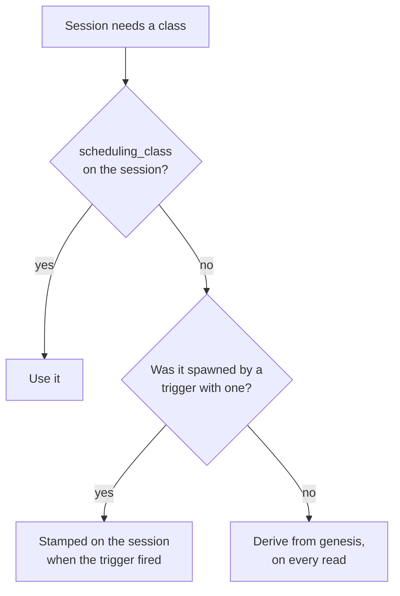
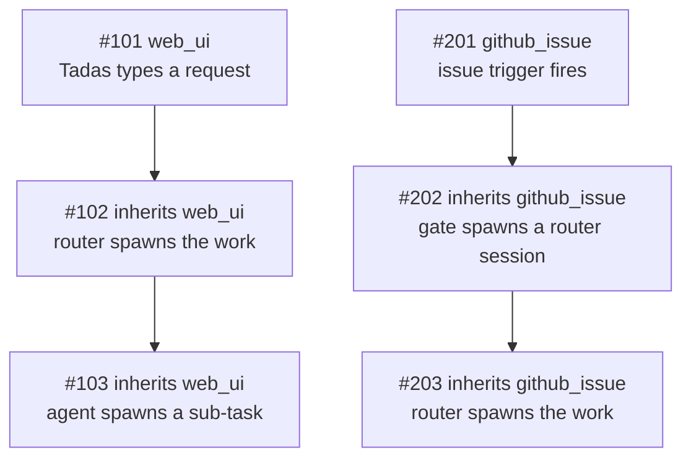

Quota is finite and the work is not. On a busy afternoon a merge gate, three scheduled sweeps and a
label poller can be spending the same 5-hour window that the thing you actually asked for needs.

Zimmer's answer is to classify sessions by where they came from, and to let the automated ones wait.

| Class | Behavior |
| --- | --- |
| **priority** | Starts whenever it is ready. Never consulted about quota. |
| **spot** | Fills the fleet up to the number of concurrent sessions the Claude Code quota can carry. Past that it waits and starts later. |

A held spot session is **deferred, never cancelled**. Nothing is lost.

The ceilings on `/quotas` are a **target to reach, not a line to stay clear of**. A deployment
sitting idle should be idle because its windows are at 80%, never because the gate was being
careful.

## Where the class comes from

Three things can decide a session's class. The first one that speaks wins:

| Order | Source | Set it | Scope |
| --- | --- | --- | --- |
| 1 | **The session itself** — `sessions.scheduling_class` | `scheduling_class` on `start_session` / `POST /api/v1/sessions`; afterwards `action_session` (`change_scheduling_class`), `PATCH /api/v1/sessions/:id`, or the button on the hold banner | That one session, and anything it spawns |
| 2 | **The trigger that fired it** — `triggers.scheduling_class` | The trigger's edit form, or `action_trigger` | Every session that trigger spawns from now on |
| 3 | **Its genesis** — the default for where the work came from | `/quotas` (only for the origins no trigger produces) | Every deriving session of that genesis, past and future |

Most sessions never touch 1 or 2: both columns are NULL, and the class is derived. That is what keeps
the defaults live rather than frozen into history.



## Genesis

A session's **genesis** is where its line of work ultimately came from — not who physically inserted
the row. It is a column on `sessions`, assigned once at creation.

| Genesis | Means | Default class | Class set on |
| --- | --- | --- | --- |
| `web_ui` | A human typed it into the Zimmer web app: the new-session form, the dashboard quick prompt, the chat bubble, or the **Invoke** button on a trigger. | priority | `/quotas` |
| `slack` | A Slack trigger fired on a DM or a channel message. | priority | the trigger |
| `github_issue` | A `github_issue` trigger fired — the feed the issue-work gate reads. | spot | the trigger |
| `github_label` | A `github_label` trigger fired — the `ready to merge` feed the PR merge gate reads. | spot | the trigger |
| `schedule` | A cron-scheduled trigger fired. | spot | the trigger |
| `ao_event` | A session-state trigger fired because another session changed state. | spot | the trigger |
| `api` | Created over `POST /api/v1/sessions` or MCP `start_session` **with no parent session**. | spot | `/quotas` |
| `unknown` | Origin could not be established — chiefly rows created before genesis was recorded. | priority | `/quotas` |

Five of the eight kinds restate a trigger condition type, so their class lives on the **trigger**, not
in a global per-kind setting: one noisy Slack trigger can be spot without demoting the eleven other
Slack triggers that have a human waiting on the answer. The three that no trigger produces keep a
per-kind setting on `/quotas`.

Two of the defaults are policy calls worth stating plainly:

- **`unknown` is priority on purpose.** A session Zimmer cannot explain is never one it throttles.
  The failure mode of the classifier is "runs anyway", not "silently held".
- **`schedule` and `ao_event` are spot** because recurring automation runs again by definition, so a
  deferred run costs little. Set the trigger to priority if that is wrong for a particular one.

### Genesis is inherited

A session created *with a parent* takes its parent's genesis verbatim. That single rule is what makes
the classification safe to act on:



Holding `#103` would strand a request Tadas is waiting on. Holding `#203` is exactly the intent. Both
fall out of the same rule, with no special-casing of agent roots — which matters, because the gate
roots (`issue-work-gate`, `pr-merge-gate`) live in a deployment's own catalog, not in Zimmer.

An **explicitly declared** genesis outranks inheritance. The chat bubble is the case that needs it: it
carries a parent so the conversation threads, but a human typed the message, so it declares `web_ui`
rather than inheriting spot from whatever session was on screen.

Forks inherit through `metadata["forked_from_session_id"]`, the only lineage edge a fork has.

An explicit `scheduling_class` is inherited the same way. A router told to run one long batch as spot
spawns children that are also spot, without every spawn call having to repeat it — and without moving
any other session that shares the genesis.

### Where you see it

Genesis appears on every node of the **Session hierarchy** panel, as a `genesis · class` pill beside
the agent-root pill — so "this whole branch is spot" is readable at a glance, and an outlier stands
out. It is also on every dashboard card, in `get_session`, and in `quick_search_sessions`.

## Stored only when someone chose it

`sessions.scheduling_class` is NULL on most sessions. When it is, `Session#priority_class` resolves
from the stored genesis on every read, through the per-genesis override map in
`AppSetting#genesis_class_overrides`.

That sparseness is the design. Promoting `web_ui` to spot reclassifies **every deriving session of
that genesis, including ones that already exist** — which is what changing a default has to mean. A
class denormalized onto every row at creation would only ever apply to sessions created after the
click, and would freeze today's defaults into all of history.

The flip side, stated plainly: **changing a trigger's class does not move sessions it already
spawned.** The trigger's selector is read once, when it fires, and stamped on the session. Sessions
already created — including ones still `waiting` behind the gate — keep the class they started with.
To move one of those, move that session: the **Make this session priority** button on its hold banner,
the **Scheduling class** selector on its detail page, `action_session` with
`change_scheduling_class`, or `PATCH /api/v1/sessions/:id`.

## The usage rate

**Claude Code usage rate per active session** is the fraction of a quota window one running session
consumes per hour:

```
rate = Σ(utilization consumed) / Σ(active sessions × hours elapsed)
```

Both sums run over consecutive pairs of `ClaudeAccountQuotaSnapshot` rows inside a rolling 6-hour
lookback. The numerator is the *rise* in `utilization_5h` (or `utilization_7d`) between two readings.
The denominator is session-hours: the mean of the two readings' `active_session_count` times the
hours between them. A rate of `0.02` means one session running for one hour consumes 2% of the
5-hour window.

`active_session_count` is recorded on the snapshot row at capture time, because session status is
mutable and keeps no history — a reading taken today cannot be attributed to a session count
tomorrow.

A pair is **skipped** rather than guessed at when:

- the window reset between the readings, or utilization fell (Anthropic's counters are sliding
  windows; they go down on their own, and differencing across that boundary measures nothing);
- either reading predates `active_session_count`, so the pair has no denominator;
- nothing was running, so there is no one to attribute the usage to.

A rate is only acted on once it clears **both** floors: at least 3 usable pairs, and at least one
full observed session-hour behind them. Three pairs taken while a single session ran for forty
minutes is an anecdote, and an anecdote does not get to hold a queue — production held 25 sessions
for a day on 0.75 session-hours of evidence. Below the floors the gate falls open on
`insufficient_data`.

`ClaudeUsageSamplerJob` runs every 15 minutes and takes a reading of the account that is actually
serving. Before it existed, the only *scheduled* readings were of `quota_exceeded` accounts — whose
utilization is pinned at the cap and therefore useless as a rate signal.

## The gate is a saturating controller

With gating on, the question is not "would one more session be risky" but **how many spot sessions
can run at once and land a window on its target by the time the decision is re-made**:

```
capacity = (target − utilization now) / (rate × control interval)
```

A spot session starts while the running fleet **plus itself** fits inside that capacity. So a queue
of waiting work fills the fleet in parallel and the windows climb to their targets quickly, rather
than one session being released at a time.

The **control interval** is 10 minutes: how long a decision has to stay good, because a held session
re-checks that often and every new session re-evaluates from scratch. It is deliberately far shorter
than a window's life. Extrapolating a burn rate to a weekly window's reset says "if this fleet burns
continuously for the next 24 hours", which nothing does — and it makes the gate harshest right after
a window opens, when there is the most room to spend. Ten minutes is a claim a rate measured over a
few hours can actually support.

### One accelerator, two brakes

The capacity rule is the accelerator. Two brakes bound it, and both are checked
**before** the forecast, because both are statements about measured fact rather than about
extrapolation:

| Brake | What it does | Reason it reports |
| --- | --- | --- |
| **The hard stop** | A window that has *actually reached* its target stops spot work until the number comes back down. The forecast governs the ramp toward the target; this governs arrival at it — and it holds even when no rate can be measured, which is the one case the forecast fails open on. | `at_utilization_limit` |
| **The fleet cap** | No more than **Max sessions at once** (10 by default) run concurrently. This is what bounds how fast the quota can be spent. | `fleet_at_cap` |

The cap's semantics are deliberate and asymmetric:

- **Priority sessions are never held by it.** A priority session starts whenever it is ready,
  even with the fleet full.
- **Priority sessions still count toward it.** The number counted is every running Claude Code
  session, not just the spot ones.
- **So ten running priority sessions leave zero spot slots** — priority work is meant to crowd
  spot work out, and that is the intent rather than a side effect.

Neither brake flaps. Utilization dipping a hair under the target does not release the queue,
because capacity is the room for a *whole* session's burn over the control interval — at
production's measured rate, about seven points of the 5-hour window. The band is derived from the
burn rather than picked, so it widens exactly when sessions are expensive and narrows when they are
cheap, and it needs no state to remember that it was holding.

### Sized against the pool, not the serving account

Zimmer rotates accounts automatically when the serving one is refused, so "can this deployment
absorb more work" is a question about the **pool**. The gate sizes every usable account — `active`,
with credentials, the same pool `AccountRotationService` picks from — and uses the roomiest. Holding
a queue because the current account is at 69% while three spares sit under 50% starves the work for
capacity that is right there.

An account already marked `quota_exceeded` is not in that pool and gets no vote. When nothing is
available at all, the serving account's own reading is what is left to forecast from, so a fully
spent deployment holds rather than falling through to "no snapshot".

Targets are set on the Claude Code tab of `/quotas` (5-hour and weekly, both default 80%), on the
same page as the windows they are measured against, alongside **Max sessions at once** (default 10).
All three are `spot_*` columns on `app_settings`, and all three are settable over MCP with
`action_spot_policy` (`set_gating`).

### Fail-open

Every uncertain condition **allows** the session, and the reason is named so the UI can say which:

| Reason | Meaning |
| --- | --- |
| `gating_disabled` | The toggle is off. |
| `insufficient_data` | Too few sample pairs, or too little observed session activity behind them. |
| `no_snapshot` | No Claude Code quota reading to size capacity from. |
| `unavailable` | The gate could not be evaluated at all. |
| `within_capacity` | The fleet is under the concurrency the quota can carry, and under the cap. |
| `at_capacity` | **Held.** The fleet is at the concurrency the quota can carry. |
| `at_utilization_limit` | **Held.** A window has reached its target; spot work waits for utilization to come down. |
| `fleet_at_cap` | **Held.** Every session slot is taken — by spot work, priority work, or both. |

A monitoring gap must not become an outage of all automated work.

### What "hold" does

A held session stays in `waiting` — the status Zimmer already uses for "created, not started" — and
`AgentSessionJob` re-enqueues itself after one control interval plus a little jitter. GoodJob
persists the delayed job in Postgres, so the retry survives a worker restart or a deploy. When
capacity opens, or simply when the 5-hour window resets, the same job starts the session normally.

The jitter matters at a backlog: without it, sessions held in the same minute re-check in the same
minute forever, every one of them reading the same fleet size before any of them has started.

Refusing instead would mean the gate silently deletes work: a `github_issue` trigger that fires once
during a busy afternoon would never run at all.

### The starvation floor

Nothing in a forecast bounds how long a hold can last — production held one session for 23 hours.
So a session held longer than **2 hours** starts anyway, once nothing is running. Both halves
matter: the deadline is what guarantees the queue eventually moves, and the empty fleet is what
keeps the floor from becoming a second, unbudgeted way to run work while the deployment is busy.

**Only a session's first start is gated.** Follow-ups, monitoring resumes and clone-only setups pass
straight through. Interrupting a conversation already underway strands it half-done and wastes the
tokens already spent on it — the decision point that means something is "should this work begin".

The session detail page shows a **Held for quota headroom** banner naming the reason, the next check
time, and how to start it now.

## MCP parity

| Capability | Web UI | MCP |
| --- | --- | --- |
| Read a session's genesis and class | Hierarchy panel, dashboard card | `get_session` |
| Filter by class or genesis | Dashboard segmented control | `quick_search_sessions` (`priority_class`, `genesis`) |
| Read the usage rate, the capacity, and the current decision | Spot gate card on the Claude Code tab of `/quotas` | `get_spot_policy` |
| Toggle gating, set the window targets, set the max sessions at once | `/quotas` | `action_spot_policy` (`set_gating`) |
| One-click promote a genesis (non-trigger kinds only) | `/quotas` | `action_spot_policy` (`promote_genesis` / `demote_genesis`) |
| Reset all genesis classes | `/quotas` | `action_spot_policy` (`reset_genesis_classes`) |
| Set a trigger's class | Trigger edit form | `action_trigger` (`scheduling_class`) |
| Read a trigger's class | Trigger page, `/triggers` badge | `search_triggers`, `get_spot_policy` |
| Choose a class when spawning | **Scheduling class** on the new-session form | `start_session` (`scheduling_class`) |
| Change one session's class | **Scheduling class** on the session detail page, or **Make this session priority** on the hold banner | `action_session` (`change_scheduling_class`) |

The page and the tool render the **same** decision — `SpotGateService.current_decision`, the answer
for a session starting right now. They used to ask different questions, which is how the card came
to show a green "headroom available" badge directly above the line "a spot session starting right
now would be held".

Both MCP tools are in the **`health`** group, not `sessions`: they are about the deployment's quota
posture rather than about one session, and a `self_session` connection has no business rewriting the
global policy from inside a session it is being throttled by.
