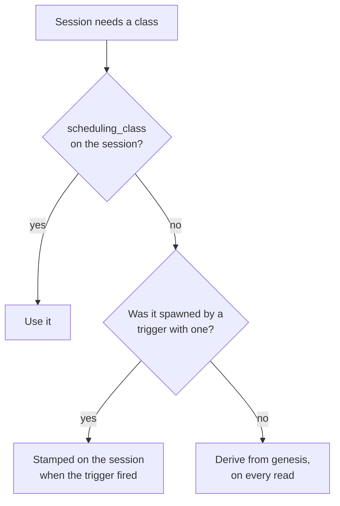
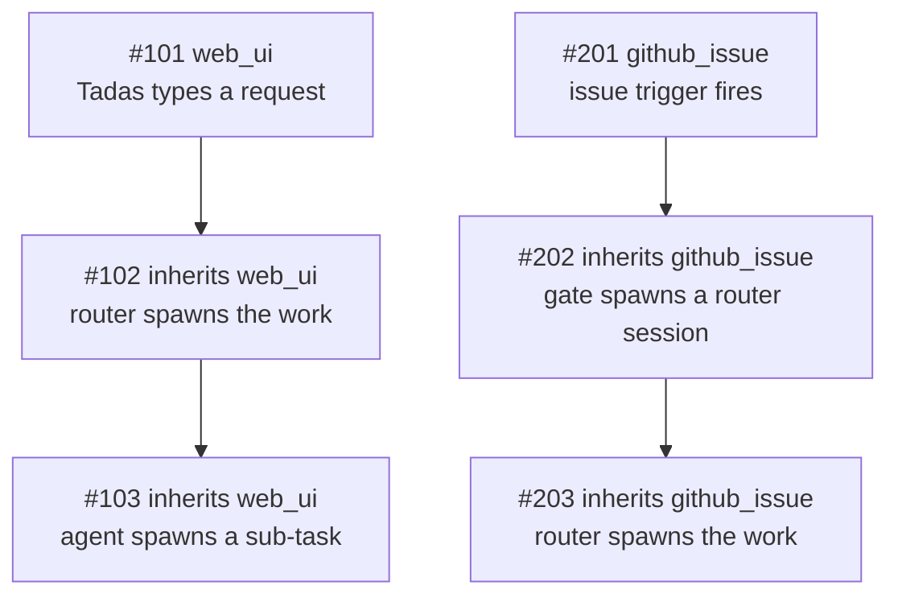

Quota is finite and the work is not. On a busy afternoon a merge gate, three scheduled sweeps and a
label poller can be spending the same 5-hour window that the thing you actually asked for needs.

Zimmer's answer is to classify sessions by where they came from, and to let the automated ones wait.

| Class | Behavior |
| --- | --- |
| **priority** | Starts whenever it is ready. Never consulted about quota or concurrency. |
| **spot** | Starts while the Claude Code account pool averages under both window targets and a session slot is free. Otherwise it waits and starts later. **And stops if a window reaches its target while it is running.** |

A held or paused spot session is **deferred, never cancelled**. Nothing is lost.

The targets on `/quotas` are a **level to reach, not a line to stay clear of**. A deployment sitting
idle should be idle because its windows are at 80%, never because the gate was being careful.

## Where the class comes from

Three things can decide a session's class. The first one that speaks wins:

| Order | Source | Set it | Scope |
| --- | --- | --- | --- |
| 1 | **The session itself** — `sessions.scheduling_class` | `scheduling_class` on `start_session` / `POST /api/v1/sessions`; afterwards `action_session` (`change_scheduling_class`), `PATCH /api/v1/sessions/:id`, or the button on the hold banner | That one session, and anything it spawns |
| 2 | **The trigger that fired it** — `triggers.scheduling_class` | The trigger's edit form, or `action_trigger` | Every session that trigger spawns from now on |
| 3 | **Its genesis** — the default for where the work came from | `/quotas` (only for the origins no trigger produces) | Every deriving session of that genesis, past and future |

Most sessions never touch 1 or 2: both columns are NULL, and the class is derived. That is what keeps
the defaults live rather than frozen into history.

## Genesis

A session's **genesis** is where its line of work ultimately came from — not who physically inserted
the row. It is a column on `sessions`, assigned once at creation.

| Genesis | Means | Default class | Class set on |
| --- | --- | --- | --- |
| `web_ui` | A human typed it into the Zimmer web app: the new-session form, the dashboard quick prompt, the chat bubble, or the **Invoke** button on a trigger. | priority | `/quotas` |
| `slack` | A Slack trigger fired on a DM or a channel message. | priority | the trigger |
| `github_issue` | A `github_issue` trigger fired — the feed the issue-work gate reads. | spot | the trigger |
| `github_label` | A `github_label` trigger fired — the `ready to merge` feed the PR merge gate reads. | spot | the trigger |
| `schedule` | A cron-scheduled trigger fired. | spot | the trigger |
| `ao_event` | A session-state trigger fired because another session changed state. | spot | the trigger |
| `api` | Created over `POST /api/v1/sessions` or MCP `start_session` **with no parent session**, or fired by hand over `POST /api/v1/triggers/:id/invoke` / `action_trigger`'s `invoke`. | spot | `/quotas` |
| `unknown` | Origin could not be established — chiefly rows created before genesis was recorded. | priority | `/quotas` |

Five of the eight kinds restate a trigger condition type, so their class lives on the **trigger**, not
in a global per-kind setting: one noisy Slack trigger can be spot without demoting the eleven other
Slack triggers that have a human waiting on the answer. The three that no trigger produces keep a
per-kind setting on `/quotas`.

Two of the defaults are policy calls worth stating plainly:

- **`unknown` is priority on purpose.** A session Zimmer cannot explain is never one it throttles.
  The failure mode of the classifier is "runs anyway", not "silently held".
- **`schedule` and `ao_event` are spot** because recurring automation runs again by definition, so a
  deferred run costs little. Set the trigger to priority if that is wrong for a particular one.

### Genesis is inherited

A session created *with a parent* takes its parent's genesis verbatim. That single rule is what makes
the classification safe to act on:

Holding `#103` would strand a request Tadas is waiting on. Holding `#203` is exactly the intent. Both
fall out of the same rule, with no special-casing of agent roots — which matters, because the gate
roots (`issue-work-gate`, `pr-merge-gate`) live in a deployment's own catalog, not in Zimmer.

An **explicitly declared** genesis outranks inheritance. The chat bubble is the case that needs it: it
carries a parent so the conversation threads, but a human typed the message, so it declares `web_ui`
rather than inheriting spot from whatever session was on screen.

Forks inherit through `metadata["forked_from_session_id"]`, the only lineage edge a fork has.

An explicit `scheduling_class` is inherited the same way. A router told to run one long batch as spot
spawns children that are also spot, without every spawn call having to repeat it — and without moving
any other session that shares the genesis.

### Where you see it

Genesis appears on every node of the **Session hierarchy** panel, as a `genesis · class` pill beside
the agent-root pill — so "this whole branch is spot" is readable at a glance, and an outlier stands
out. It is also on every dashboard card, in `get_session`, and in `quick_search_sessions`.

## Stored only when someone chose it

`sessions.scheduling_class` is NULL on most sessions. When it is, `Session#priority_class` resolves
from the stored genesis on every read, through the per-genesis override map in
`AppSetting#genesis_class_overrides`.

That sparseness is the design. Promoting `web_ui` to spot reclassifies **every deriving session of
that genesis, including ones that already exist** — which is what changing a default has to mean. A
class denormalized onto every row at creation would only ever apply to sessions created after the
click, and would freeze today's defaults into all of history.

The flip side, stated plainly: **changing a trigger's class does not move sessions it already
spawned.** The trigger's selector is read once, when it fires, and stamped on the session. Sessions
already created — including ones still `waiting` behind the gate — keep the class they started with.
To move one of those, move that session: the **Make this session priority** button on its hold banner,
the **Scheduling class** selector on its detail page, `action_session` with
`change_scheduling_class`, or `PATCH /api/v1/sessions/:id`.

## The gate

With gating on, a spot session takes a turn — its first or its next — while **both** of these hold.
Neither is a forecast: both are statements about numbers that have already been read.

| Check | What it means | Reason when it fails |
| --- | --- | --- |
| **Under the targets** | The Claude Code account pool averages below the 5-hour *and* weekly targets, as last read. When either average reaches its target, spot work pauses until utilization comes back down. | `at_utilization_limit` |
| **A free slot** | Fewer sessions are running than **Max sessions at once**. Applies to a first start only — a resuming session is already counted in the running fleet. | `fleet_at_cap` |

There is no rate, no projection and no horizon. The gate holds work when a window *has arrived* at
its target, not when it might. Utilization falls on its own — Anthropic's counters are sliding
windows — so the pause ends when the number does, on the next re-check.

The same two checks decide for a session that is **already running**, which is what makes a target a
ceiling rather than only a starting line — see [The target is a ceiling](#the-target-is-a-ceiling).

### The concurrency limit

**Max sessions at once** (default 10) is what bounds how fast the quota can be spent, and its
semantics are deliberately asymmetric:

- **Priority sessions are never held by it.** A priority session starts whenever it is ready, even
  with every slot taken.
- **Priority sessions still count toward it.** The number counted is every running Claude Code
  session, whatever its class. (Codex sessions spend nothing against a Claude account, so they do not
  take a slot.)
- **So ten running priority sessions leave zero spot slots** — priority work is meant to crowd spot
  work out, and that is the intent rather than a side effect.

It is checked **when a session starts** and never again. Lowering the limit under a running fleet
holds the next start; it never interrupts work already underway.

### Read across the whole pool, not one account

Utilization is the **pool average** — every Claude Code account's latest reading, averaged. It is the
same number `/quotas` prints as **Avg 5-Hour Utilization (effective)** and **Avg 7-Day Utilization**
in its Account Pool section, computed once in `ClaudeAccountPool` and read by both, so the page's
headline figure and the gate's decision cannot disagree.

Deciding on a single account meant one account at its cap stopped the whole fleet while the rest of
the pool sat idle. Rotation moves work off a refused account onto the accounts that still have
headroom, so the quota a deployment can actually spend is the pool's, not whichever account happens
to be serving this minute.

**Every account counts, whatever its status** — `active`, `quota_exceeded` and `needs_reauth` alike.
An account in `needs_reauth` is one Zimmer cannot serve from *right now*, not one whose quota is
spent: its windows keep draining while it waits for a human, and its headroom is real again the
moment they log back in. Leaving it out would shrink the denominator to the serving accounts and make
the average jump every time an account fell out of the pool or came back.

The average carries one correction, and it is the page's rule rather than a second one invented for
the gate: an account whose **7-day window is spent counts as 100%** in the 5-hour figure, because its
5-hour headroom cannot be served. Without it, a dead account's empty 5-hour counter would read as room
to spend.

An account with no reading at all contributes nothing and is left out of the denominator too — the
decision says how many of the pool's accounts it averaged. When nothing has a readable window the
gate falls open on `no_snapshot`.

### When the pool comes back

The Account Pool section leads with the answer to "when does work get unblocked?", as a clock
ticking down by the second to a wall-clock time. It comes off the same `ClaudeAccountPool` measure
as the figures below it.

An account can serve a request when **both** of its windows have room, so the moment it comes back
is the later of the two resets it is actually waiting on — a window that already has room
contributes nothing, because that room is there now. The pool's moment is the earliest of those
across its accounts.

That is the whole of the rule, and it is worth being concrete about why it is not two separate
answers. An account sitting on an empty 5-hour window with its week spent comes back the moment its
week does, whatever its 5-hour window is doing; an account over its 5-hour cap with plenty of week
left comes back when the 5-hour window rolls. Measuring the two windows separately — a "next usable
5-hour reset" over the accounts with weekly allowance left, and a 7-day reset over the rest — cannot
express the first of those, so a pool whose soonest relief was a weekly reset twenty minutes out
would advertise a 5-hour rollover hours later.

The banner has three states, and the empty ones say which emptiness they are:

- **A countdown**, when every account with a reading is out of capacity and at least one of them can
  say when it returns. It names the wall-clock moment beside the clock and how many accounts are
  out.
- **"Work is not blocked"**, when an account has room on both windows right now. There is nothing to
  count down to, and a clock ticking toward the next rollover would read as a wait that is not one.
- **"Nothing here says when work resumes"**, when everything with a reading is out and none of them
  recorded a reset time. A zeroed clock would read as "any moment now".

The tick is driven in the browser from an absolute ISO-8601 instant in the markup
(`unblock_countdown_controller.js`), not from a duration the server rendered — /quotas is a page
people leave open, and "in 22m" is right for one second and wrong for every second after it. The
server renders the same clock string from the same instant, so the first paint is already correct
and the page still tells the truth if JavaScript never runs. When the deadline passes while the page
is open the clock stops at `now` and says the reading is stale rather than counting into a negative
wait.

Under the weekly average, **Next 7-day reset** still describes its own window: it is measured only
over accounts whose week *is* spent, because those are the ones a weekly rollover returns to
service. It is the detail behind the headline, not the headline — an account whose week returns at
noon but whose 5-hour window is spent until 2pm is not servable at noon. When no account is
weekly-blocked the note says that rather than naming a rollover on an account that was never
blocked. It reports the soonest reset *recorded* among the spent accounts and counts them
separately, because a spent window does not always carry a reset timestamp — when none of them does,
the note is the count alone.

Nothing here counts a reset time that has already passed. A past timestamp describes a window that
has already rolled over, which is the same rule the counters follow, so it is not something the pool
is waiting for.

The times are rendered as UTC on the server and rewritten to the reader's own clock in the browser
(the `local-time` Stimulus controller), which names the zone it converted to; the UTC reading stays
on hover, and stays on screen if JavaScript never runs.

Targets and the concurrency limit are set together on the Claude Code tab of `/quotas`, on the same
page as the windows they are measured against, and all three are settable over MCP with
`action_spot_policy` (`set_gating`).

### Fail-open

Every uncertain condition **allows** the session, and the reason is named so the UI can say which:

| Reason | Meaning |
| --- | --- |
| `gating_disabled` | The toggle is off. |
| `no_snapshot` | No Claude Code quota reading to decide on. |
| `unavailable` | The gate could not be evaluated at all. |
| `within_limits` | The pool is under both targets, with a slot free. |
| `at_utilization_limit` | **Held.** A window's pool average has reached its target; spot work waits for utilization to come down. |
| `fleet_at_cap` | **Held.** Every session slot is taken — by spot work, priority work, or both. |

A monitoring gap must not become an outage of all automated work.

### What "hold" does

A held session stays in `waiting` — the status Zimmer already uses for "created, not started" — and
`AgentSessionJob` re-enqueues itself after ten minutes plus a little jitter. GoodJob persists the
delayed job in Postgres, so the retry survives a worker restart or a deploy. When a slot frees, or
utilization falls back under the target, the same job starts the session normally.

A re-check job that a worker shutdown catches *mid-pickup* is re-enqueued verbatim rather than
treated as an interrupted session — see [`waiting` is two different situations, and neither is a
recovery](/sessions/lifecycle/#waiting-is-three-different-situations-and-none-of-them-is-a-recovery).
Only the re-check job schedules the next re-check, so anything that ends the chain strands the
session for good.

The jitter matters at a backlog: without it, sessions held in the same minute re-check in the same
minute forever, every one of them reading the same fleet size before any of them has started.

#### Consecutive holds back off

Jitter spreads a held population out. It does not make it smaller — and the size is what matters to
the queue. A flat ten-minute interval means *N* held sessions put a fixed *N* / 10 min of
`AgentSessionJob` work onto the `agents` queue for as long as the hold lasts, an arrival rate that
cannot fall when the deployment is struggling. That is what it is for: on 2026-08-20, ~80
quota-held sessions re-checking every ~11 minutes held a standing ~8 jobs/min against sixteen
`agents` threads, eleven of them occupied for hours by live sessions. When a host-latency episode
pushed each re-check into the tens of seconds, arrivals outran service and the GoodJob ready queue
grew without draining until `SystemHealthMonitorJob` paged.

So each *consecutive* hold doubles the interval — 10m, 20m, then on until the ceiling clamps it — and
the ceiling depends on why the session is held, because the two reasons clear on very different
timescales:

| Hold reason | Ceiling | Why |
| --- | --- | --- |
| `at_utilization_limit` | 1 hour | A pool window comes back down over hours. Re-checking more often than this cannot learn anything new, and this is the reason that produces the long-lived holds. |
| `fleet_at_cap` | 30 minutes | A slot frees whenever any running session ends, which is unpredictable and often soon. |

So a utilization ladder runs 10m, 20m, 40m, 60m, 60m…, and a fleet-cap one 10m, 20m, 30m, 30m….

Jitter is added *after* the ceiling, so a population pinned at the ceiling still spreads out. The
ladder resets in two situations, and both are the caller saying so rather than anything inferred
here:

- **The session gets through.** `spot_hold_count` is one of the `spot_hold_*` metadata keys cleared
  on start, so the next outage begins again at ten minutes rather than resuming where the last one
  left off.
- **A person asks for this session directly.** Restart, `action_session`'s `restart_from_scratch`
  and `POST /api/v1/sessions/:id/restart` all except the same keys from the metadata they carry
  forward. They have to: those paths re-enter the gate looking *exactly* like a scheduled re-check —
  no prompt, no resume flag — so without it they would read as another consecutive hold and push the
  ladder up, making someone who asked for the session now wait longer than if they had left it
  alone.

Restarting resets the ladder; it does not *bypass* the gate. A session the gate still refuses is
held again, back at ten minutes. The lever that starts it now is **Make this session priority**.

The cost is real and is not hidden: a session can now sleep longer than it strictly had to, up to
its ceiling, if the condition clears early. That is bounded, visible as `spot_hold_retry_at` on the
session's detail page, and a human who wants it now can make the one session priority — which is
what the hold banner already says.

Refusing instead would mean the gate silently deletes work: a `github_issue` trigger that fires once
during a busy afternoon would never run at all.

### A hold lasts as long as the number does

There is no escape hatch and no deadline: while the pool average sits at a target, spot work waits. That
is the intent — the pause is meant to last exactly as long as the utilization that caused it. The
5-hour window falls on its own within hours; a weekly window pinned near its target can hold a queue
for considerably longer, which is the cost of a hard stop and is visible on `/quotas` the whole time.
Promoting one session to priority is the lever for a single piece of work that cannot wait.

### Every turn is gated, not just the first

The gate used to read "is this a first start?", and everything else — a fired `wake_me_up_later`
backstop, a queued follow-up, a Slack or GitHub poller message, a heartbeat nudge, a restart — went
straight through. All of those arrive at `AgentSessionJob` carrying a prompt, and every one of them
begins a **new turn that spends fresh quota**. On 2026-08-22 a spot session woke on its own backstop
trigger and ran a full turn while this gate was reporting `at_utilization_limit` at 87% of a 65%
target, force-pausing 22 running spot sessions and holding 141 more at the starting line.

So the admission check covers every turn. While a window sits at its target, the only way a
spot-designated session runs is to be **promoted to priority first**. Two things still pass through,
because neither spends anything:

| Passes through | Why |
| --- | --- |
| `clone_only` | Sets up a clone and configures MCP. No agent is spawned. |
| `resume_monitoring` | Re-attaches to a process that is **already running**. Holding it would orphan that process, not save a token. |

One hold reason does not apply to a resume: **`fleet_at_cap`**. A session resuming has already been
flipped to `running` by whoever delivered the turn, so it is counted in the running fleet itself —
refusing it for a full fleet would refuse it on the strength of its own slot, and would refuse every
session the ceiling sweep resumes (those are flipped to `running` before their jobs run). The
utilization reading has no such problem: the pool's windows are measured independently of this
session.

**A deferred turn is not a lost turn.** The prompt that woke the session, and any images or files
attached to it, are re-enqueued verbatim on the same backed-off re-check as a first-start hold —
GoodJob persists that delayed job in Postgres, so it survives a worker restart or a deploy. The
session goes back to dormant `waiting` (not `needs_input`: nobody has to do anything about it), and
nothing announces it as needing a human — no push notification, and no `session_needs_input` event
that would wake a parent watching this session about a turn that never ran.

The session detail page shows a **Held for quota headroom** banner — **Next turn held for quota
headroom** when it was a resume — naming the reason, the next check time, and how to run it now.
`get_session` reports the same through `spot_hold_reason` / `spot_hold_retry_at` /
`spot_hold_count`, and says explicitly that the queued prompt is still coming.

## The target is a ceiling

Admission alone made the target a **floor under when new spot work stops**, not a ceiling on what
spot work spends. A session admitted at 79% goes on running, and a fleet of them carries the window
straight past the line: on 2026-08-20 the spot gate card read *"Holding spot sessions: 5-hour window
at 89% of its 80% target"* while twelve sessions ran and three accounts sat in `quota_exceeded`. The
gate had stopped admitting at 80% and then watched the work already in flight climb toward 100%.

So `SpotCeilingSweepJob` re-evaluates the same decision every five minutes and applies it to running
sessions:

| The gate says | What happens to running spot sessions |
| --- | --- |
| `at_utilization_limit` | Every running spot session is **paused**. |
| `fleet_at_cap` | Nothing. A running session already holds its slot; pausing it would free that slot only for another spot session the same cap would hold. |
| anything else | Sessions paused by an earlier sweep are **resumed**, oldest pause first. |

Priority sessions are never paused, on any reading. Nor are Codex sessions (they spend nothing
against a Claude window) or status-summary forks (Zimmer's own seconds-long bookkeeping).

### What a pause does

The session's CLI process is terminated and the session goes dormant in **`waiting`** — the same
shape a `wake_me_up_later` sleep leaves behind, reached the same way (`pending_sleep` is set, and the
pause callback carries it needs_input → waiting).

`waiting`, not `needs_input`, is deliberate: a session in `needs_input` lands on the homepage action
queue, which is for work a human must act on. A quota pause is not — and ten of them at once would
bury the sessions that genuinely need a person.

Pausing interrupts a turn. What the agent had already written to disk stays written; the tool call in
flight is lost, along with any reasoning not yet flushed to the transcript. That cost is paid once
per pause, and it is recorded rather than silent:

| Where | What it says |
| --- | --- |
| `metadata` | `spot_pause_at`, `spot_pause_reason`, `spot_pause_detail` (the gate's own sentence), `spot_pause_count`, and `paused_by: spot_quota` |
| The session log | A warning line naming the window, the target, and what brings the session back |
| The session page | A **Paused mid-run for quota headroom** banner, with the same **Make this session priority** button the hold banner carries |
| MCP | `get_session` reports the pause, why, and when it resumes |

`paused_by: spot_quota` is what keeps the recovery sweeps out of it: it is neither `user` (which stops
auto-continues) nor `recovery` (which would have `DeploymentRecoveryJob` resume the session straight
back into the window that stopped it). A **Refresh all** on the dashboard skips these sessions for the
same reason.

### What brings it back

The next sweep that finds the gate open resumes them, with the standard system-recovery nudge telling
the agent to pick up where it left off. Two things shape which and how many:

- **A resume margin.** Resumption decides against targets lowered by `SpotGateService::RESUME_MARGIN_PCT`
  (5 points): with an 80% target, a paused session resumes when the pool reaches **75%**. Holding a
  session that never started costs nothing, so admission uses the plain target; resuming one that was
  interrupted mid-turn costs a lost tool call, so it waits for real headroom rather than resuming at
  79.9% and pushing the window straight back over.
- **A batch of five per sweep**, and never more than the free slots under **Max sessions at once**. A
  window that has just come back down is at its most fragile — every session resumed starts spending
  again immediately — so the fleet walks back up over successive sweeps rather than restoring all at
  once. Sessions past the batch keep their place at the front of the next one.

A session someone promotes to **priority** while it sleeps is resumed by the next sweep whatever the
windows say, because priority work is never gated on quota.

The sweep runs every five minutes, but what bounds how fast the ceiling reacts is the **reading**, not
the sweep: utilization comes from quota snapshots, which land when `ClaudeUsageSamplerJob` samples
(every 15 minutes), when an account rotates, and when someone opens `/quotas`.

## Precedence: ranking the spot queue

`scheduling_class` answers "does this session wait for quota headroom". It says nothing about which
of the waiting ones goes first — and with a permanently long spot queue that is the question that
actually decides what gets done.

`precedence` is that ordering. Every session carries one; only spot sessions are ordered by it.

- **Higher is handled sooner, on an absolute scale.** 100000 comes before 50, and 50 comes before 0.
  It is not a 1..N rank and nothing renumbers it — values are sparse on purpose, so there is always
  room to slot work between two existing entries. Ties break on `created_at`, oldest first.
- **It lives on every session, priority ones included.** A priority session demoted to spot has to
  land somewhere sensible, and a spot session promoted to priority has to keep its place for when it
  is demoted back. A column populated for half the rows would lose that on every round trip.
- **A spawn lands just above its parent.** `start_session` with no `precedence` puts the new session
  one point above the session named in `parent_session_id`, so the child that finishes its parent's
  job runs before unrelated work queued beneath it and a tree of work stays contiguous. Name a value
  only when you mean to move the work relative to everything else in the queue.
- **A trigger can predefine one**, alongside the class it already carries, so a feed is ranked once
  rather than one spawned session at a time.

### The Ranked view

`/?view=ranked` — a fourth dashboard view beside Categories, Last Touched and Created, and the only
one that is a management screen rather than a reading one. Priority sessions stack above the queue,
the spot queue is listed under them highest-precedence first, and both halves are editable in place:

| Do this | And | Which means |
| --- | --- | --- |
| Type a number in a row's precedence field and press **Enter** | the row moves to its new position immediately, with no page load | `PATCH /sessions/:id/update_precedence` |
| **Drag** a row between two others | it takes the **midpoint** of the two values it was dropped between | `PATCH /sessions/:id/reorder_precedence`, which is handed the two neighbours and derives the value |
| Drag between two **adjacent** values, where no midpoint exists | the neighbours are nudged one apart each, and the dropped row takes the middle of the gap that opens | the same request — 21 and 20 become 22 and 19 |
| Press **Demote to spot** on a priority row | it lands `SLOT_GAP` (5) above the current top of the spot queue | `PATCH /sessions/:id/update_scheduling_class` with `place=top_of_spot` |
| Press **Promote** on a spot row | it moves up to the priority section, keeping its rank for a later demotion | the same endpoint |

Every write is optimistic: the row moves first and the server's answer corrects the numbers behind
it, including any neighbour that was nudged. A write that fails rolls the row back and reloads,
because the server's order is the only one that counts.

The nudge is what keeps an integer column usable without a renumbering pass — one extra write per
drag, and no global compaction ever. A nudge can push a neighbour onto the value of the row beyond
it; that is left alone deliberately, since equal precedence is legal and cascading the nudge upward
would turn one drag into an unbounded write. The next drag into that spot separates them.

The Ranked view opens on `waiting`, `running`, `needs_input` and `failed` rather than the dashboard's
usual `needs_input`-only default: its whole subject is work that has not started. An explicitly
chosen filter still wins, as everywhere else.

### Precedence decides who gets the headroom back

Two sweeps hand out recovered capacity, and both read precedence:

- The **fleet wake** starts quota-parked spot sessions, in precedence order — see
  [When the pool runs dry](/auth/harness/#when-the-pool-runs-dry).
- **`SpotSessionPause`** puts back the spot sessions the ceiling paused mid-run when a window comes
  back down, highest precedence first, oldest pause within a tie. Its budget is bounded by the free
  slots and `MAX_RESUMES_PER_SWEEP`, and that budget is usually smaller than the population it holds
  — so the order is what decides which work resumes, which is the same question the ranked queue
  answers.

The two populations are different (`auth_outage_reason` parks versus `paused_by: "spot_quota"`) and
neither can start the other's sessions.

### Quick filters

Three one-click filter states sit above the search box, because they are the ones worth reaching
without touching five checkboxes: **All** (every status, both classes), **All Unarchived** (every
status but the trash), and **All Priority Unarchived**. Each is a complete filter state rather than a
control that combines with the others, and each persists exactly as pressing **Apply filters** does.

## MCP parity

| Capability | Web UI | MCP |
| --- | --- | --- |
| Read a session's genesis and class | Hierarchy panel, dashboard card | `get_session` |
| Filter by class or genesis | Dashboard segmented control | `quick_search_sessions` (`priority_class`, `genesis`) |
| Read the windows, the concurrency limit, and the current decision | Spot gate card on the Claude Code tab of `/quotas` | `get_spot_policy` |
| Read how many running spot sessions the ceiling has paused | Spot gate card on `/quotas` | `get_spot_policy` |
| Read why one session was paused mid-run, and what resumes it | Banner on the session page | `get_session` |
| Toggle gating, set the window targets, set the max sessions at once | `/quotas` | `action_spot_policy` (`set_gating`) |
| One-click promote a genesis (non-trigger kinds only) | `/quotas` | `action_spot_policy` (`promote_genesis` / `demote_genesis`) |
| Reset all genesis classes | `/quotas` | `action_spot_policy` (`reset_genesis_classes`) |
| Set a trigger's class | Trigger edit form | `action_trigger` (`scheduling_class`) |
| Read a trigger's class | Trigger page, `/triggers` badge | `search_triggers`, `get_spot_policy` |
| Choose a class when spawning | **Scheduling class** on the new-session form | `start_session` (`scheduling_class`) |
| Change one session's class | **Scheduling class** on the session detail page, or **Make this session priority** on the hold banner | `action_session` (`change_scheduling_class`) |
| Rank a session in the spot queue | **Precedence** on the session detail page; the Ranked view's inline field, drag handle and demote button | `action_session` (`change_precedence`, or `precedence` alongside `change_scheduling_class`) |
| Choose a rank when spawning | **Precedence** on the new-session form | `start_session` (`precedence`) |
| Predefine the rank a trigger's sessions get | **Precedence** on the trigger edit form | `action_trigger` (`precedence`) |
| Read a session's rank | Ranked view, session detail page | `get_session`, `quick_search_sessions` |
| Read the spot queue in the order it will be worked | Ranked view | `quick_search_sessions` (`status: "waiting"`, `priority_class: "spot"`, `order: "precedence"`) |

The page and the tool render the **same** decision — `SpotGateService.evaluate`, of which there is
exactly one — so the card's badge and the tool's answer cannot disagree.

Both MCP tools are in the **`health`** group, not `sessions`: they are about the deployment's quota
posture rather than about one session, and a `self_session` connection has no business rewriting the
global policy from inside a session it is being throttled by.
