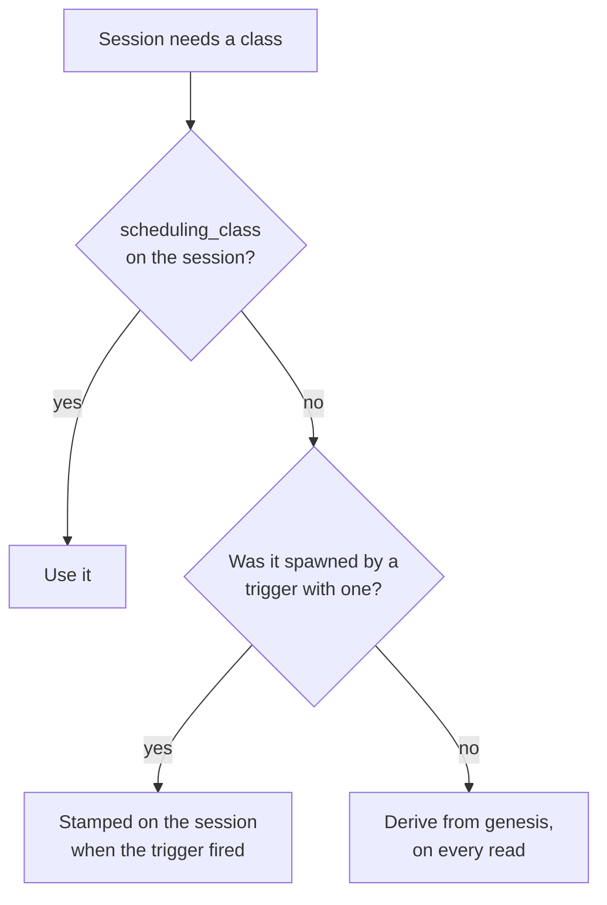
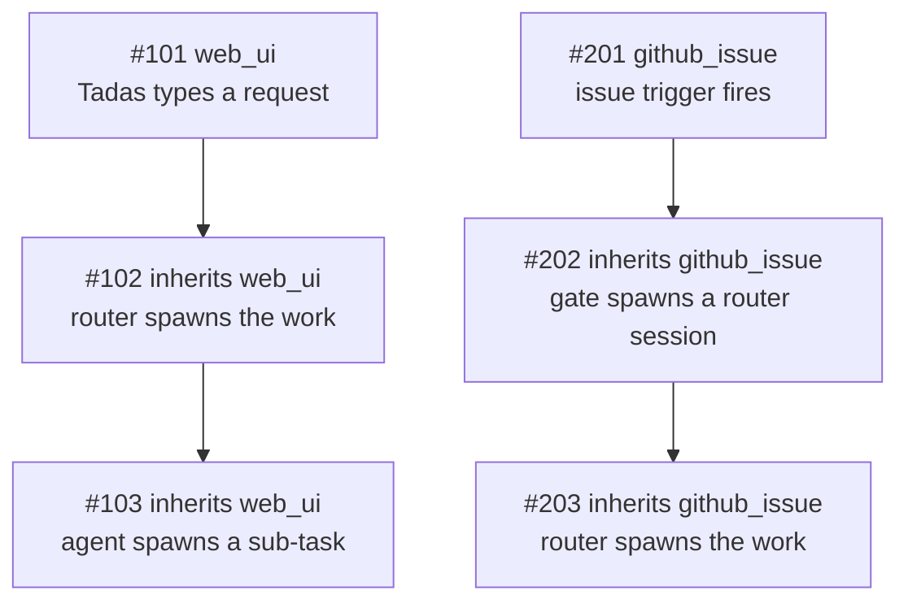

Quota is finite and the work is not. On a busy afternoon a merge gate, three scheduled sweeps and a
label poller can be spending the same 5-hour window that the thing you actually asked for needs.

Zimmer's answer is to classify sessions by where they came from, and to let the automated ones wait.

| Class | Behavior |
| --- | --- |
| **priority** | Starts whenever it is ready. Never consulted about quota or concurrency. |
| **spot** | Starts while the Claude Code account pool averages under both window targets and a session slot is free. Otherwise it waits and starts later. |

A held spot session is **deferred, never cancelled**. Nothing is lost.

The targets on `/quotas` are a **level to reach, not a line to stay clear of**. A deployment sitting
idle should be idle because its windows are at 80%, never because the gate was being careful.

## Where the class comes from

Three things can decide a session's class. The first one that speaks wins:

| Order | Source | Set it | Scope |
| --- | --- | --- | --- |
| 1 | **The session itself** — `sessions.scheduling_class` | `scheduling_class` on `start_session` / `POST /api/v1/sessions`; afterwards `action_session` (`change_scheduling_class`), `PATCH /api/v1/sessions/:id`, or the button on the hold banner | That one session, and anything it spawns |
| 2 | **The trigger that fired it** — `triggers.scheduling_class` | The trigger's edit form, or `action_trigger` | Every session that trigger spawns from now on |
| 3 | **Its genesis** — the default for where the work came from | `/quotas` (only for the origins no trigger produces) | Every deriving session of that genesis, past and future |

Most sessions never touch 1 or 2: both columns are NULL, and the class is derived. That is what keeps
the defaults live rather than frozen into history.

## Genesis

A session's **genesis** is where its line of work ultimately came from — not who physically inserted
the row. It is a column on `sessions`, assigned once at creation.

| Genesis | Means | Default class | Class set on |
| --- | --- | --- | --- |
| `web_ui` | A human typed it into the Zimmer web app: the new-session form, the dashboard quick prompt, the chat bubble, or the **Invoke** button on a trigger. | priority | `/quotas` |
| `slack` | A Slack trigger fired on a DM or a channel message. | priority | the trigger |
| `github_issue` | A `github_issue` trigger fired — the feed the issue-work gate reads. | spot | the trigger |
| `github_label` | A `github_label` trigger fired — the `ready to merge` feed the PR merge gate reads. | spot | the trigger |
| `schedule` | A cron-scheduled trigger fired. | spot | the trigger |
| `ao_event` | A session-state trigger fired because another session changed state. | spot | the trigger |
| `api` | Created over `POST /api/v1/sessions` or MCP `start_session` **with no parent session**, or fired by hand over `POST /api/v1/triggers/:id/invoke` / `action_trigger`'s `invoke`. | spot | `/quotas` |
| `unknown` | Origin could not be established — chiefly rows created before genesis was recorded. | priority | `/quotas` |

Five of the eight kinds restate a trigger condition type, so their class lives on the **trigger**, not
in a global per-kind setting: one noisy Slack trigger can be spot without demoting the eleven other
Slack triggers that have a human waiting on the answer. The three that no trigger produces keep a
per-kind setting on `/quotas`.

Two of the defaults are policy calls worth stating plainly:

- **`unknown` is priority on purpose.** A session Zimmer cannot explain is never one it throttles.
  The failure mode of the classifier is "runs anyway", not "silently held".
- **`schedule` and `ao_event` are spot** because recurring automation runs again by definition, so a
  deferred run costs little. Set the trigger to priority if that is wrong for a particular one.

### Genesis is inherited

A session created *with a parent* takes its parent's genesis verbatim. That single rule is what makes
the classification safe to act on:

Holding `#103` would strand a request Tadas is waiting on. Holding `#203` is exactly the intent. Both
fall out of the same rule, with no special-casing of agent roots — which matters, because the gate
roots (`issue-work-gate`, `pr-merge-gate`) live in a deployment's own catalog, not in Zimmer.

An **explicitly declared** genesis outranks inheritance. The chat bubble is the case that needs it: it
carries a parent so the conversation threads, but a human typed the message, so it declares `web_ui`
rather than inheriting spot from whatever session was on screen.

Forks inherit through `metadata["forked_from_session_id"]`, the only lineage edge a fork has.

An explicit `scheduling_class` is inherited the same way. A router told to run one long batch as spot
spawns children that are also spot, without every spawn call having to repeat it — and without moving
any other session that shares the genesis.

### Where you see it

Genesis appears on every node of the **Session hierarchy** panel, as a `genesis · class` pill beside
the agent-root pill — so "this whole branch is spot" is readable at a glance, and an outlier stands
out. It is also on every dashboard card, in `get_session`, and in `quick_search_sessions`.

## Stored only when someone chose it

`sessions.scheduling_class` is NULL on most sessions. When it is, `Session#priority_class` resolves
from the stored genesis on every read, through the per-genesis override map in
`AppSetting#genesis_class_overrides`.

That sparseness is the design. Promoting `web_ui` to spot reclassifies **every deriving session of
that genesis, including ones that already exist** — which is what changing a default has to mean. A
class denormalized onto every row at creation would only ever apply to sessions created after the
click, and would freeze today's defaults into all of history.

The flip side, stated plainly: **changing a trigger's class does not move sessions it already
spawned.** The trigger's selector is read once, when it fires, and stamped on the session. Sessions
already created — including ones still `waiting` behind the gate — keep the class they started with.
To move one of those, move that session: the **Make this session priority** button on its hold banner,
the **Scheduling class** selector on its detail page, `action_session` with
`change_scheduling_class`, or `PATCH /api/v1/sessions/:id`.

## The gate

With gating on, a spot session starts while **both** of these hold. Neither is a forecast: both are
statements about numbers that have already been read.

| Check | What it means | Reason when it fails |
| --- | --- | --- |
| **Under the targets** | The Claude Code account pool averages below the 5-hour *and* weekly targets, as last read. When either average reaches its target, spot work pauses until utilization comes back down. | `at_utilization_limit` |
| **A free slot** | Fewer sessions are running than **Max sessions at once**. | `fleet_at_cap` |

There is no rate, no projection and no horizon. The gate holds work when a window *has arrived* at
its target, not when it might. Utilization falls on its own — Anthropic's counters are sliding
windows — so the pause ends when the number does, on the next re-check.

### The concurrency limit

**Max sessions at once** (default 10) is what bounds how fast the quota can be spent, and its
semantics are deliberately asymmetric:

- **Priority sessions are never held by it.** A priority session starts whenever it is ready, even
  with every slot taken.
- **Priority sessions still count toward it.** The number counted is every running Claude Code
  session, whatever its class. (Codex sessions spend nothing against a Claude account, so they do not
  take a slot.)
- **So ten running priority sessions leave zero spot slots** — priority work is meant to crowd spot
  work out, and that is the intent rather than a side effect.

It is checked **when a session starts** and never again. Lowering the limit under a running fleet
holds the next start; it never interrupts work already underway.

### Read across the whole pool, not one account

Utilization is the **pool average** — every Claude Code account's latest reading, averaged. It is the
same number `/quotas` prints as **Avg 5-Hour Utilization (effective)** and **Avg 7-Day Utilization**
in its Account Pool section, computed once in `ClaudeAccountPool` and read by both, so the page's
headline figure and the gate's decision cannot disagree.

Deciding on a single account meant one account at its cap stopped the whole fleet while the rest of
the pool sat idle. Rotation moves work off a refused account onto the accounts that still have
headroom, so the quota a deployment can actually spend is the pool's, not whichever account happens
to be serving this minute.

**Every account counts, whatever its status** — `active`, `quota_exceeded` and `needs_reauth` alike.
An account in `needs_reauth` is one Zimmer cannot serve from *right now*, not one whose quota is
spent: its windows keep draining while it waits for a human, and its headroom is real again the
moment they log back in. Leaving it out would shrink the denominator to the serving accounts and make
the average jump every time an account fell out of the pool or came back.

The average carries one correction, and it is the page's rule rather than a second one invented for
the gate: an account whose **7-day window is spent counts as 100%** in the 5-hour figure, because its
5-hour headroom cannot be served. Without it, a dead account's empty 5-hour counter would read as room
to spend.

An account with no reading at all contributes nothing and is left out of the denominator too — the
decision says how many of the pool's accounts it averaged. When nothing has a readable window the
gate falls open on `no_snapshot`.

### When the pool comes back

The Account Pool section answers "we're blocked until when?" beside each average, as a wall-clock
time and a countdown. Both come off the same `ClaudeAccountPool` measure as the figures above them,
and each names the reset that actually returns capacity on its window rather than the soonest reset
of that kind anywhere in the pool:

- **Next usable 5-hour reset** is measured only over accounts whose weekly allowance is still there.
  An account whose week is spent does not start serving again when its 5-hour window rolls over, so
  including it would report the pool as recovering hours before it does — the same trap the
  *effective* qualifier on the 5-hour average exists to avoid. It names that rollover whether or not
  the pool is currently short of headroom, so on a healthy pool it reads as the next 5-hour boundary
  rather than as a wait. When every account with a reading has spent its week there is no such time,
  and the note says so instead: the pool is blocked until the 7-day reset, or — if no weekly reset
  time is recorded either — that nothing on the page says when it comes back. When the servable
  accounts simply are not waiting on a rollover, it says that too.
- **Next 7-day reset** is measured only over accounts whose week *is* spent, because those are the
  ones a weekly rollover returns to service. When no account is weekly-blocked the note says that
  rather than naming a rollover on an account that was never blocked. It reports the soonest reset
  *recorded* among the spent accounts and counts them separately, because a spent window does not
  always carry a reset timestamp — when none of them does, the note is the count alone.

Neither figure counts a reset time that has already passed. A past timestamp describes a window that
has already rolled over, which is the same rule the counters follow, so it is not something the pool
is waiting for.

The times are rendered as UTC on the server and rewritten to the reader's own clock in the browser
(the `local-time` Stimulus controller), which names the zone it converted to; the UTC reading stays
on hover, and stays on screen if JavaScript never runs.

Targets and the concurrency limit are set together on the Claude Code tab of `/quotas`, on the same
page as the windows they are measured against, and all three are settable over MCP with
`action_spot_policy` (`set_gating`).

### Fail-open

Every uncertain condition **allows** the session, and the reason is named so the UI can say which:

| Reason | Meaning |
| --- | --- |
| `gating_disabled` | The toggle is off. |
| `no_snapshot` | No Claude Code quota reading to decide on. |
| `unavailable` | The gate could not be evaluated at all. |
| `within_limits` | The pool is under both targets, with a slot free. |
| `at_utilization_limit` | **Held.** A window's pool average has reached its target; spot work waits for utilization to come down. |
| `fleet_at_cap` | **Held.** Every session slot is taken — by spot work, priority work, or both. |

A monitoring gap must not become an outage of all automated work.

### What "hold" does

A held session stays in `waiting` — the status Zimmer already uses for "created, not started" — and
`AgentSessionJob` re-enqueues itself after ten minutes plus a little jitter. GoodJob persists the
delayed job in Postgres, so the retry survives a worker restart or a deploy. When a slot frees, or
utilization falls back under the target, the same job starts the session normally.

A re-check job that a worker shutdown catches *mid-pickup* is re-enqueued verbatim rather than
treated as an interrupted session — see [`waiting` is two different situations, and neither is a
recovery](/sessions/lifecycle/#waiting-is-three-different-situations-and-none-of-them-is-a-recovery).
Only the re-check job schedules the next re-check, so anything that ends the chain strands the
session for good.

The jitter matters at a backlog: without it, sessions held in the same minute re-check in the same
minute forever, every one of them reading the same fleet size before any of them has started.

#### Consecutive holds back off

Jitter spreads a held population out. It does not make it smaller — and the size is what matters to
the queue. A flat ten-minute interval means *N* held sessions put a fixed *N* / 10 min of
`AgentSessionJob` work onto the `agents` queue for as long as the hold lasts, an arrival rate that
cannot fall when the deployment is struggling. That is what it is for: on 2026-08-20, ~80
quota-held sessions re-checking every ~11 minutes held a standing ~8 jobs/min against sixteen
`agents` threads, eleven of them occupied for hours by live sessions. When a host-latency episode
pushed each re-check into the tens of seconds, arrivals outran service and the GoodJob ready queue
grew without draining until `SystemHealthMonitorJob` paged.

So each *consecutive* hold doubles the interval — 10m, 20m, 40m — up to a ceiling that depends on
why the session is held, because the two reasons clear on very different timescales:

| Hold reason | Ceiling | Why |
| --- | --- | --- |
| `at_utilization_limit` | 1 hour | A pool window comes back down over hours. Re-checking more often than this cannot learn anything new, and this is the reason that produces the long-lived holds. |
| `fleet_at_cap` | 30 minutes | A slot frees whenever any running session ends, which is unpredictable and often soon. |

Jitter is added *after* the ceiling, so a population pinned at the ceiling still spreads out. The
ladder resets when the session gets through: `spot_hold_count` is one of the metadata keys cleared
on start, so the next outage starts again at ten minutes rather than resuming where the last one
left off.

The cost is real and is not hidden: a session can now sleep longer than it strictly had to, up to
its ceiling, if the condition clears early. That is bounded, visible as `spot_hold_retry_at` on the
session's detail page, and a human who wants it now can make the one session priority — which is
what the hold banner already says.

Refusing instead would mean the gate silently deletes work: a `github_issue` trigger that fires once
during a busy afternoon would never run at all.

### A hold lasts as long as the number does

There is no escape hatch and no deadline: while the pool average sits at a target, spot work waits. That
is the intent — the pause is meant to last exactly as long as the utilization that caused it. The
5-hour window falls on its own within hours; a weekly window pinned near its target can hold a queue
for considerably longer, which is the cost of a hard stop and is visible on `/quotas` the whole time.
Promoting one session to priority is the lever for a single piece of work that cannot wait.

**Only a session's first start is gated.** Follow-ups, monitoring resumes and clone-only setups pass
straight through. Interrupting a conversation already underway strands it half-done and wastes the
tokens already spent on it — the decision point that means something is "should this work begin".

The session detail page shows a **Held for quota headroom** banner naming the reason, the next check
time, and how to start it now.

## MCP parity

| Capability | Web UI | MCP |
| --- | --- | --- |
| Read a session's genesis and class | Hierarchy panel, dashboard card | `get_session` |
| Filter by class or genesis | Dashboard segmented control | `quick_search_sessions` (`priority_class`, `genesis`) |
| Read the windows, the concurrency limit, and the current decision | Spot gate card on the Claude Code tab of `/quotas` | `get_spot_policy` |
| Toggle gating, set the window targets, set the max sessions at once | `/quotas` | `action_spot_policy` (`set_gating`) |
| One-click promote a genesis (non-trigger kinds only) | `/quotas` | `action_spot_policy` (`promote_genesis` / `demote_genesis`) |
| Reset all genesis classes | `/quotas` | `action_spot_policy` (`reset_genesis_classes`) |
| Set a trigger's class | Trigger edit form | `action_trigger` (`scheduling_class`) |
| Read a trigger's class | Trigger page, `/triggers` badge | `search_triggers`, `get_spot_policy` |
| Choose a class when spawning | **Scheduling class** on the new-session form | `start_session` (`scheduling_class`) |
| Change one session's class | **Scheduling class** on the session detail page, or **Make this session priority** on the hold banner | `action_session` (`change_scheduling_class`) |

The page and the tool render the **same** decision — `SpotGateService.evaluate`, of which there is
exactly one — so the card's badge and the tool's answer cannot disagree.

Both MCP tools are in the **`health`** group, not `sessions`: they are about the deployment's quota
posture rather than about one session, and a `self_session` connection has no business rewriting the
global policy from inside a session it is being throttled by.
