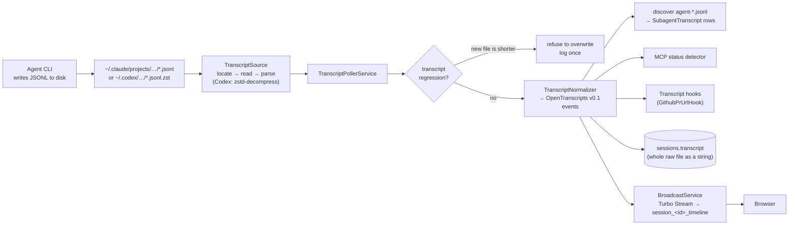

The agent writes JSONL to a file. Zimmer polls that file, normalizes it, and streams it to your
browser. That's the whole loop. Each step has a wrinkle.

## The pipeline

## OpenTranscripts — the normalization layer

Claude and Codex write completely different JSONL. Rather than teaching the UI both dialects,
Zimmer normalizes into **OpenTranscripts v0.1** (`app/services/open_transcript.rb`), a
vendor-neutral schema vendored from `pulsemcp/ai-artifacts`. Nine event types:

`UserMessage` · `AssistantMessage` · `Thinking` · `ToolCall` · `ToolResult` · `SubagentSpawn` ·
`Compaction` · `Error` · `SystemEvent`

Every one renders through a single partial (`app/views/timeline_items/_item.html.erb`), keyed on
type. One raw JSONL line can fan out into several events.

:::caution[OpenTranscripts is a hand-synced copy, and it diverges]
`docs/OPEN_TRANSCRIPTS.md` (now this page) explicitly said the vendored schema must be manually
kept in sync with upstream — a silent-drift hazard with no test guarding it. Zimmer's copy also
diverges intentionally: no secret redaction, per-line normalization with no cross-line
timestamp carry-forward, and several fields hardcoded to null.

The "no secret redaction" part matters if you ever expose a transcript outside your tailnet.
:::

## The regression guard

If the clone is recreated, the agent starts a *fresh* transcript file. Naively overwriting
`sessions.transcript` with it would wipe the session's history.

So `Session.transcript_regression?` refuses to overwrite a stored transcript with a shorter one,
and logs it once via `metadata["transcript_regression_detected"]`. If a *resume* hits an
unrepairable regression, the resume is refused outright — because resuming would silently
drop the user's prompt.

That guard existing tells you the underlying condition happens.

## Broadcast bookkeeping

The poller only broadcasts `new_messages[broadcast_count..]`, where `broadcast_count` comes from
`metadata["broadcast_message_count"]` (recomputed from the stored transcript when nil). This is
what prevents the entire transcript from replaying into your browser on every poll.

There is also an ownership guard: the poller skips if `session.running_job_id != job_id`,
which is what stops two monitoring jobs from double-broadcasting the same session.

## Subagent transcripts

When an agent spawns subagents (Claude's `Task` tool), each writes its own `agent-*.jsonl`. The
poller discovers them, stores each as a `SubagentTranscript` row, and links it back to the parent
`Task` tool call by matching `tool_use_id` against `toolUseResult.agentId` — filling in
`subagent_type`, `description`, `status`, `duration_ms`, `total_tokens`, and `tool_use_count`.

They render as a nested, collapsible accordion inside the parent's timeline row.

:::caution[Subagent transcripts assume Claude]
`SubagentTranscript#open_transcript_events` hardcodes `ClaudeTranscriptNormalizer`. Codex
subagents, if they produced discoverable transcripts, would be normalized with the wrong parser.
:::

## Transcript hooks

A small Ruby plugin system that runs inside Zimmer (not inside the agent) whenever new
transcript messages are broadcast. Sequential, error-isolated per hook, run after the transcript
is saved. Each hook writes into `session.custom_metadata`.

Exactly one ships: `GithubPrUrlHook`, which scrapes `https://github.com/{owner}/{repo}/pull/{n}`
out of tool-result content only and writes it to `custom_metadata["github_pull_request_url"]`.
That single field is what the GitHub PR poller, the comment poller, and the merge-conflict poller
all key off — so if the hook misses, none of the GitHub integration works for that session.

→ [Transcript hooks](/extend/transcript-hooks/) for the contract and how to write one.

## Archive and download

`TranscriptArchiveJob` rebuilds a `latest.zip` of all transcripts every 10 minutes (temp file +
atomic rename). It's served by `GET /api/v1/transcript_archive/download`.

## Rendering caveats

The API's `#transcript` renderer handles only `user`, `assistant`, `tool_use`, and `tool_result`
entry types and silently drops everything else — thinking blocks, system entries. It also
assumes `content` is a string.

:::danger[Transcripts have no authorization check]
`app/controllers/sessions_controller.rb:1475` carries a live TODO:
`# TODO: Add authorization check here - transcript contains sensitive conversation data`.

Since [the web UI has no authentication at all](/limitations/#the-web-ui-has-no-login-by-design-and-the-sharp-edge-that-follows),
anyone who can reach the host can read every transcript.
:::
