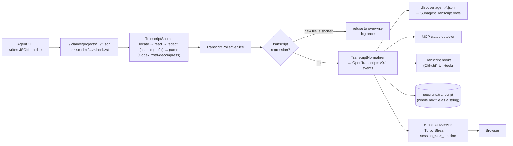

The agent writes JSONL to a file. Zimmer polls that file, normalizes it, and streams it to your
browser. That's the whole loop. Each step has a wrinkle.

## The pipeline


```mermaid
flowchart LR
    CLI["Agent CLI<br/>writes JSONL to disk"] --> F["~/.claude/projects/…/*.jsonl<br/>or ~/.codex/…/*.jsonl.zst"]
    F --> TS["TranscriptSource<br/>locate → read → redact (cached prefix) → parse<br/>(Codex: zstd-decompress)"]
    TS --> TP["TranscriptPollerService"]
    TP --> RG{"transcript<br/>regression?"}
    RG -->|"new file is shorter"| SKIP["refuse to overwrite<br/>log once"]
    RG -->|no| NM["TranscriptNormalizer<br/>→ OpenTranscripts v0.1 events"]
    NM --> SUB["discover agent-*.jsonl<br/>→ SubagentTranscript rows"]
    NM --> MCP["MCP status detector"]
    NM --> HK["Transcript hooks<br/>(GithubPrUrlHook)"]
    NM --> DB[("sessions.transcript<br/>(whole raw file as a string)")]
    NM --> BC["BroadcastService<br/>Turbo Stream → session_&lt;id&gt;_timeline"]
    BC --> UI["Browser"]
```

## OpenTranscripts — the normalization layer

Claude and Codex write completely different JSONL. Rather than teaching the UI both dialects,
Zimmer normalizes into **OpenTranscripts v0.1** (`app/services/open_transcript.rb`), a
vendor-neutral schema vendored from `pulsemcp/ai-artifacts`. Nine event types:

`UserMessage` · `AssistantMessage` · `Thinking` · `ToolCall` · `ToolResult` · `SubagentSpawn` ·
`Compaction` · `Error` · `SystemEvent`

Every one renders through a single partial (`app/views/timeline_items/_item.html.erb`), keyed on
type. One raw JSONL line can fan out into several events.

Zimmer's copy diverges from upstream on purpose: per-line normalization with no cross-line
timestamp carry-forward, several fields hardcoded to null, Zimmer-internal adornments on every
event (`sort_time`, `transcript_index`, `event_order`), and redaction applied one layer up
rather than during conversion. The divergences are listed in `vendor/open_transcripts/README.md`.

### Keeping the copy honest

A hand-written mirror drifts, and a mirror that drifts silently is how an upstream fix never
reaches Zimmer. Two checks, one per link in the chain:

| Link | Checked by | When |
| --- | --- | --- |
| Zimmer's Ruby ↔ the pinned snapshot | `test/services/open_transcript_drift_test.rb` | every CI run, offline |
| The snapshot ↔ upstream `main` | `.github/workflows/open-transcripts-drift.yml` | daily, on demand, and on PRs touching the vendored files |

`vendor/open_transcripts/` holds a byte-for-byte snapshot of the upstream files Zimmer mirrors,
plus `UPSTREAM.json` pinning the commit and a SHA-256 per file. The offline test re-derives those
digests and asserts that `OpenTranscript` still declares the nine event-type discriminators and
the schema version the snapshotted spec does. The scheduled workflow re-fetches upstream and fails
when the bytes have moved; `alert-ci-failure.yml` listens on every workflow in the repo, so that
failure lands in Slack. Refreshing the snapshot is a deliberate act with a diff to read — the
procedure is in `vendor/open_transcripts/README.md`.

### Who wrote this line

Claude Code writes lines into its own transcript that carry `type: "user"` but were never typed by
a person. Two of them show up constantly in Zimmer:

| Flag on the JSONL line | What the CLI is recording |
| --- | --- |
| `interruptedByShutdown: true` | a turn killed mid-tool-use, by a process shutdown rather than a keyboard interrupt |
| `isMeta: true` | context the CLI injected rather than a person typing — its resume scaffolding ("Continue from where you left off."), and the whole body of a skill when one fires |

In Zimmer the shutdown behind the first one is usually Zimmer: `Sessions::InterruptService`
SIGTERMs the CLI to deliver an enqueued message ahead of the running turn. Rendering the resulting
line as a `UserMessage` told the reader a human had acted — the opposite of what Zimmer knows, and
it cost the deployment's owner a full trace across the logs, the raw JSONL and the normalizer
source to establish that he had not interrupted a session he had never touched.

`ClaudeTranscriptNormalizer` routes both to `SystemEvent` under the subtype
`OpenTranscript::SystemEventSubtypes::RUNTIME_NOTICE`, and the timeline draws them as a
**Runtime Notice** — the cyan system glyph, not the indigo user one — above a line naming the flag
that marked the line machine-written. The CLI's own wording inside the text is left alone:
"[Request interrupted by user for tool use]" says "by user" and is Claude Code's string, not
Zimmer's. The attribution Zimmer wraps around it is Zimmer's, and that is what carries the
correction.

The flags are matched against a literal `true`. Anything looser — truthiness, key presence — would
relabel a turn a person really did type as machine-written, which is the same misattribution with
the sign flipped, so both directions are covered by tests.

A runtime notice stays in the `message` filter bucket and keeps its fork affordance. It is not a
message, but it sits in the conversational slot the CLI wrote it into, and "the turn was cut off
here" is context a reader on the `minimal` filter still needs. A flagged line with no text is not
made into a notice at all — there is nothing to attribute — so it stays on the message path, where
a content-less message is already suppressed at render and an image-only one still shows its image.

The timeline is not the only surface that was asserting a person. `TranscriptTextRenderer` (the
plain-text export behind `GET /api/v1/sessions/:id/transcript` and the `get_session` MCP tool's
`transcript_format: "text"`) and the session page's own copy-to-clipboard both read
`parsed_transcript` — raw JSONL, never normalized — so both apply the same discriminator directly,
via `ClaudeTranscriptNormalizer.runtime_notice_markers`. Fixing only the normalizer would have left
an agent reading the text export being told a human typed the line.

Codex gets no equivalent treatment: its rollout `response_item` message payloads carry only `role`
and `content`, with no per-line marker that distinguishes a machine-written user turn from a typed
one. There is nothing unambiguous to key off, so `CodexTranscriptNormalizer` is left alone rather
than given an invented discriminator.

#### Large notices render collapsed

`isMeta` carries more than the resume stub. It is also the flag on the line Claude Code writes
when a skill fires, and that line is an entire `SKILL.md` — the smallest one on a production
Zimmer host is 3.4k characters, the largest 690k. Printed in full, two or three of them push the
conversation off the page.

So the timeline folds them away. A collapsed notice draws one muted line — the skill's name, an
approximate token count, and a disclosure control — and the body renders unchanged as soon as it
is opened. Nothing is removed: the full text is still in the row, still what the copy button
copies, and the plain-text export never comes through this path at all.

Two things trigger the fold, and both live in `SessionsHelper#ot_runtime_notice_digest`:

| Trigger | Header label |
| --- | --- |
| a first line reading `Base directory for this skill: <path>` | the skill's name, from the path's last segment |
| anything else longer than `RUNTIME_NOTICE_COLLAPSE_CHARS` (2,000) | the notice's own first line, truncated |

Both are floored at `RUNTIME_NOTICE_FLOOR_CHARS` (400): folding a short notice away behind an
accordion is worse than leaving it alone, and that holds for a short skill dump too. The
thresholds sit far above the scaffolding the same flag carries — "Continue from where you left
off." is 33 characters. The token count is a character-count estimate at four characters per
token, labelled `approx.` in the UI: Zimmer runs no tokenizer at render time and the number is
not a billing figure.

It is a `<details>`, not a Stimulus controller, for the reason the session hierarchy is: no JS to
load, and it works under touch and keyboard. The one controller it has to tell is `auto-scroll`,
whose `ResizeObserver` watches the container this row sits in — expanding a body worth tens of
thousands of pixels is indistinguishable from new content arriving, and a reader who was tailing
would be thrown to the bottom of the transcript, past what they just opened. The `toggle` clears
tailing, the same as scrolling up does.

## Secret redaction

Zimmer hands its agents real credentials. MCP `${VAR}` values are interpolated into `.mcp.json`
inside the clone, OAuth tokens live in `~/.claude/.credentials.json`, `git` pushes over an
authenticated remote. An agent that `cat`s one of those files, echoes an environment variable, or
pastes a `curl -H "Authorization: Bearer …"` into its own reasoning puts that credential in the
transcript — and the transcript is stored, rendered, and downloadable through the
transcript-archive API.

`TranscriptRedactor` runs inside `TranscriptSource#read`, where transcript bytes are pulled off
disk. That is deliberately **on write, not on read**: Zimmer stores the whole raw transcript string
in `sessions.transcript`, so redacting at the read boundary is what keeps a credential out of the
database rather than only out of the rendered page.

Reading through that method is a requirement on callers, not a property of the code — Zimmer has
three *other* places that re-read a transcript and persist it (the manual refresh in
`SessionsController`, `Api::V1::SessionsController` and `Mcp::Tools::ActionSession`, each in a
single and a bulk form). They resolve their reader through `TranscriptRuntime.source_for(session).read`
for exactly this reason; a bare `File.read` at any of them writes an unredacted transcript over the
redacted one the poller stored. `test/contracts/transcript_redaction_contract_test.rb` pins that
structurally, so a new refresh path cannot quietly reintroduce the bypass.

It works in two tiers:

- **Known values.** Every `${VAR}` the AIR catalog's MCP servers reference, resolved through the
  same `SecretProviders` chain that injects them into a session, plus the OAuth tokens Zimmer
  holds in its own database. Exact string matches: no false positives, and they cover
  Zimmer-specific credential formats no regex could know about.
- **Shapes.** High-confidence patterns — `sk-ant-oat01…`, `ghp_…`, `xoxb-…`, JWTs, PEM blocks,
  `Authorization: Bearer …`, credentials embedded in a URL, and a value sitting immediately after
  a name that says "credential". Ported from the upstream reference redactor and extended with
  what this system actually handles.

Redaction preserves line count exactly (the regression and rotation guards below compare line
counts) and leaves no reversible fragment of the original.

### Why the patterns carry their own regexp timeout

`config.load_defaults 8.0` sets `Regexp.timeout = 1` for the whole process. That cap is sized for
request-scoped strings, and it applies to a *single* search rather than to a `gsub` as a whole — so a
transcript reaches it in two ordinary ways once it grows into the tens of megabytes. A `gsub` is a
sequence of searches, one per stretch between matches, and a rule with no literal to seek scans a
whole transcript that holds none of its shape as one search. And a single line carrying a
multi-megabyte base64 tool result is one uninterrupted run of the generic `ENV_SECRET` rule's value
class, which its greedy repeat consumes in one match.

Both were measured on a real 32 MB session transcript, at 1.0 s and 2.2 s. The resulting
`Regexp::TimeoutError` escaped `TranscriptSource#read` into `TranscriptPollerService`, which logged
`Error polling transcript for session N: regexp match timeout` and dropped the whole transcript
update — every poll, for as long as the session stayed alive
([#472](https://github.com/tadasant/zimmer/issues/472)).

Every pattern that can be handed transcript-scale input therefore carries its own
`TranscriptRedactor::SCAN_TIMEOUT` (10 s), which takes precedence over the global cap. Like the cap
it replaces it bounds one search, not a whole pass, so the figure it should be read against is the
slowest single search: 2.2 s, four times under it. It is a backstop against one runaway match rather
than a latency budget for `redact`, which takes ~7.6 s on that 32 MB transcript and is not a quantity
the timeout ever measures.

If it is reached anyway, the pattern pass retries line by line and replaces the single line it cannot
finish scanning with `[REDACTED:UNSCANNABLE_LINE]`, so a pathological line costs that line rather
than the whole update. Retrying that way finds exactly what the whole-string pass would have found,
because no pattern can match across a newline.

### Why a poll only redacts the newly appended bytes

Redaction costs roughly 245 ms per megabyte, and the poller re-reads the transcript every few seconds
for as long as the session lives. That used to mean ~7.6 s of CPU per poll on a 32 MB transcript, to
re-derive a result byte-identical to the last poll's for everything but the few kilobytes the agent
had appended — a cost that tracked session *length* rather than session *activity*, and the poller's
dominant expense once several long sessions were alive at once
([#477](https://github.com/tadasant/zimmer/issues/477)).

`TranscriptRedactionCache` sits between `TranscriptSource#read` and the redactor and keeps the
already-redacted prefix of each path, so a poll pays only for the new bytes. Measured against real
session transcripts on this host: a 22.4 MB one went from **8.5 s to 34 ms** on a warm poll, a
17.9 MB one from **2.8 s to 43 ms**, and in every case the incremental output's SHA-256 is identical
to the full re-scan's.

That is sound because redaction is **line-decomposable**: splitting the text at a newline and
redacting the halves separately gives the same bytes as redacting the whole. No pattern carries `/m`
or uses `.` at all, every value and gap class either excludes `\s` or is an explicit `[ \t]`, the
known-value tier admits only values matching `\A\S+\z`, and a UTF-8 sequence never contains a `\n`
byte. It is the same invariant the line-count guarantee and the line-by-line degradation above
already rest on.

The one exception is the multi-line PEM walk, which spans newlines by construction. So the commit
point never crosses a line that could *open* a block: the committed prefix contains no opener, so no
block can straddle the cut. A transcript that carries PEM armor simply stops advancing its commit
point and re-scans from the opener — never worse than re-scanning everything, which is what every
poll used to do.

Invalidation is explicit, because a transcript is not always append-only — it can be truncated,
rotated to a new Codex rollout, replaced by a new session reusing the path, or rewritten by the
resume restore. The cache re-checks three things on every read: the file is no shorter than the
committed prefix, the commit point still lands immediately after a newline **in the bytes being read
now**, and 16 KB fingerprints of the file's head and of the bytes just before the commit point still
match. Any mismatch falls back to a full re-scan.

The middle check is the one that carries the safety weight. A stale prefix is not a leak — the
cached prefix is itself redactor output, so re-emitting one produces a wrong transcript, never an
unredacted one. The only way an incremental scan can *under*-redact is if the tail begins mid-line,
which is exactly what re-asserting the newline rules out.

:::caution[Defense in depth, not a guarantee — transcripts are still secret material]
The redactor lowers the blast radius of a transcript that escapes. It does not make one safe to
expose. It cannot recognize a credential with no recognizable shape that Zimmer never issued: a
password an agent read out of someone else's config file, the body of an `op read`, a session
cookie from a browser automation run. Transcripts are also served by an endpoint with
[no authorization check](https://github.com/tadasant/zimmer/issues/44). Keep treating them as
secret material.

Redaction is irreversible and applies from the moment it shipped. Rows written before that still
hold whatever was captured; `bin/rails open_transcripts:redact_stored` rewrites them (it previews
by default — pass `DRY_RUN=0` to apply).
:::

## A re-clone lands where the old one was

Claude Code names its transcript directory after the cwd it was spawned from. That makes the
working directory the *identity* of a conversation's transcript directory — and clone directory
names carry a timestamp and a random suffix (`{repo}-{branch}-{timestamp}-{random}`), so a
conversation that gets a new clone gets a new slug and the whole JSONL is written out again
underneath it. The previous copy stays behind at full size.

That is not a rare event. A clone is reaped once its session is archived or has failed — and an
unarchive, a trigger following up, or a recovery then brings the same conversation back. Production
held one conversation in **23 clone directories, 18 MB each**, one per day, and 286 conversations in
more than one copy — 595 MiB of pure redundancy
([#576](https://github.com/tadasant/zimmer/issues/576)).

So a re-clone goes back to the path the session already occupied. `SessionClonePath.for_recreate`
answers that question for both callers that rebuild a clone under an existing conversation —
`AgentSessionJob`'s follow-up path and `UnarchiveSessionService` — and `GitCloneService` generates
a fresh path only when it declines.

It declines unless the stored `clone_path` is a direct child of `ClonesDirectory.base` **and there
is nothing at it**. That second condition is what makes reuse safe rather than merely tidy:

- `git clone` needs an absent or empty destination, and `create_clone`'s rollback deletes whatever
  is standing at the path it was given. Only an absent path is ever handed back.
- **There is exactly one reason a conversation gets a fresh clone mid-life: the old one is gone
  from disk.** Nothing re-clones because a tree is dirty or a branch moved — `AgentSessionJob`
  reuses a surviving clone exactly as it finds it, uncommitted changes and all, and
  `UnarchiveSessionService` takes its quick path whenever the clone and working directory are both
  still there. So there is no stale checkout to inherit at a reused path, because the reason the
  code is there at all is that there is no checkout.
- A session whose branch moved still clones `session.branch`; only the directory *name* spells the
  branch it was first cut for, which is cosmetic. A session whose agent-root subdirectory moved in
  the catalog still adopts the new subdirectory ([#921](https://github.com/tadasant/zimmer/issues/921)),
  so its cwd — and its transcript directory — legitimately move with it.

One consequence worth naming: a transcript directory can now come back to life. Before this,
deleting the clone at a path killed the transcript directory named after it for good, which is why
[`CloneReaper`](/operate/background-jobs/) reaps the two together. `AtomicCloneRemoval` renames the
clone aside and then `rm -rf`s a whole working tree, and a session resumed inside that window
re-clones at the same path. So `CloneReaper` re-asks who owns the path *after* the delete and
before the transcript reap, and leaves the transcript alone if the answer changed.

This fixes the *generation* of duplicate transcript directories, not the ones already on disk.
Those are [#434](https://github.com/tadasant/zimmer/issues/434)'s half —
`OrphanTranscriptDirectoryCleanupJob` — which now works through a backlog that stops growing.

## Writing a transcript back to disk

The stored transcript in `sessions.transcript` is the durable record; the file on disk is what the
runtime actually resumes from. Three paths re-materialize the former as the latter — resuming a
session whose clone was recreated (`AgentSessionJob#write_transcript_to_clone`), unarchiving
(`UnarchiveSessionService`), and forking (`ForkSessionService`).

None of them compute a path. They all ask the session's `TranscriptSource`:

```ruby
TranscriptRuntime.source_for(session, file_system: file_system)
  .resume_transcript_path(session: session, working_directory: working_directory)
```

For Claude Code that is `~/.claude/projects/<sanitized-cwd>/<session_id>.jsonl` — the same file
`locate` prefers, so the runtime resumes from exactly what the poller reads.

The same rule holds for *reading*: the manual-refresh paths (both controllers, the `action_session`
MCP tool) and the four process-recovery services take the directory **and** the file inside it from
the source — `transcript_directory` then `find_main_transcript`. Pairing one runtime's directory
with another's file-picker is how a Codex session ends up searched with Claude's flat
`<session_id>.jsonl` rule: it finds nothing at best, and at worst adopts an unrelated rollout that
happens to sit at the top of `~/.codex/sessions`.

**`nil` means "this runtime has no single-file restore", and it is not an error.** Codex rollouts are
date-partitioned, UUID-named and possibly Zstandard-compressed, so there is no one deterministic path
to write stored bytes to. Every caller skips the write on `nil` and carries on; a Codex fork and a
Codex unarchive both succeed, having written nothing. Writing a Claude-shaped file the runtime will
never read would not have helped, and gating the operation on that write turned a no-op into a
failure.

A write that *raises* is still a failure, and fork and unarchive still abort on it — they distinguish
"nothing to do" from "the write did not land".

:::note
A restored Codex session resumes from whatever rollout is on disk. That is the wider Codex gap
tracked in #54, not something the restore path can fix on its own.
:::

## A re-keyed transcript, and why the name is only a preference

`sessions.session_id` is the id Zimmer supplies at spawn, and Claude Code honors it — so
`<session_id>.jsonl` is normally the file, for the life of the session. Normally. A transcript can
also be **re-keyed**: a file opens with a byte-identical copy of this session's conversation and
then carries on under a *different* uuid. Preferring the recorded name when the copy is the file
being written means polling a conversation that stopped
([#1047](https://github.com/tadasant/zimmer/issues/1047)).

**Zimmer produces that shape itself, and knowing so is half the rule.** `ForkSessionService` writes
the source session's stored transcript to the *fork's* `<session_id>.jsonl`, so every fork's file
opens under the source's id and then re-keys to the fork's own. That is a different conversation
owned by a different `Session` row — following it would show a session its child's work. What is
left after excluding it is the same shape with no `Session` row behind it: a runtime that re-keys
its own transcript in place, against which selection by name has no defence at all, and whose
failure is total and silent.

So the recorded name is a preference. `TranscriptFileLocator` lets it compete with any sibling in
the same directory **proved to be this same conversation**, and the most recently written of them
wins:

```mermaid
flowchart LR
  A["&lt;session_id&gt;.jsonl<br/>(recorded)"] --> C{newest write}
  B["&lt;other-uuid&gt;.jsonl<br/>head declares OUR sessionId<br/>and no Session row owns that uuid"} --> C
  C --> D["the conversation the agent is having"]
```

Both halves of that middle box matter:

- **The head, not the mtime.** A candidate qualifies only if the first `sessionId` in its opening
  lines is this session's. That is the evidence #1047 used to tie a branch to its session, and
  requiring it keeps this from decaying into "newest `.jsonl` wins" — the rule the pre-`session_id`
  fallback is deliberately narrow to avoid, because a working directory can hold a previous
  occupant's transcript. Only a file written *more recently* than the recorded one can displace it,
  so mtime prunes the candidates before any of them is opened: the ordinary session, where the
  recorded file is also the newest, costs a glob and a stat per sibling and opens nothing.
- **Not a fork.** A **fork's** transcript is copied verbatim from its source, so its early lines
  carry the *source* session's id — the same shape a re-key has. A uuid another `Session` row
  already holds is excluded outright, so a fork that ran in this working directory can never be
  mistaken for its source's continuation. This is the same hazard that keeps
  `capture_runtime_session_id!` switched off for Claude, and it is why nothing here rewrites
  `sessions.session_id`: that column stays the durable, uniquely-indexed identity, and the live
  branch is represented separately.

Following the branch is only half the repair, because the branch is **not** a superset of what
Zimmer stored. The copy was taken at a point in the conversation; whatever the abandoned file
recorded after that point exists nowhere else. `RekeyedTranscriptBranch` merges the two — the stored
transcript, extended by whatever the branch adds — and reads as three terms in order:

| Term | What it is |
| --- | --- |
| `H` | the head the branch copied, shared with the stored transcript |
| `A` | what the abandoned file recorded after the copy — held nowhere but `sessions.transcript` |
| `T` | the branch's own tail |

`stored` is `H + A` the first time and `H + A + T` on every pass after that, so the work is to find
how much of `T` is already at the end of `stored` and append only the rest. **That is recomputed
from the two texts every time, never remembered.** A remembered split point is wrong the moment the
stored transcript stops being prefix-shaped — which is precisely what the first merge does to it —
and the error compounds on each further re-key. Recomputing also absorbs the two things that go
wrong in practice: a read taken mid-flush, whose trailing partial line is dropped and re-supplied
from the branch, and a poll that could not open the branch at all.

In the ordinary re-key the branch was seeded with the *whole* recorded file, so it already starts
with everything stored and the merge is one string comparison.

**Every writer of `sessions.transcript` goes through it**, not just the poller: both controllers'
`refresh`, `bulk_refresh`, and the `action_session` MCP tool's two paths all start from
`find_main_transcript` and then guard the write with `Session.transcript_regression?` — which
compares line *counts*, so a branch longer than the stored transcript but missing its tail passes
and takes `A` with it. One of them skipping the merge would undo it for all of them.

`metadata["transcript_branch_session_id"]` records which file a session is being polled on. It is a
breadcrumb rather than state the merge depends on — #1047's complaint is that the failure was
invisible — and it is retired only on an affirmative "the recorded file is the one being read",
which is what a resume produces: `AgentSessionJob#restore_regressed_transcript_if_needed`
re-materializes the stored transcript at `<session_id>.jsonl`, now including everything the branch
contributed, before the runtime reads it.

:::caution
Two things this does not reach. **A copy written from another cwd:** a transcript directory is a
pure function of the working directory Zimmer recorded, and enumerating every directory under
`~/.claude/projects` on every poll is not a trade worth making. That is the shape
[#1047](https://github.com/tadasant/zimmer/issues/1047)'s own sighting had, and there it was a
[status-summary fork](/sessions/status-summary/) taking a recovery nudge and continuing the
conversation it had copied — a separate session, in its own clone, whose cause was removed by
[#695](https://github.com/tadasant/zimmer/issues/695). **And a re-key of a fork:** a fork's own file
opens under its *source's* id, so a branch of a fork does too, and the head test asks for the
fork's id. A fork is short-lived by construction, so this is a narrow gap rather than a live one.
See [limitations](/limitations/).
:::

## The regression guard

If the clone is recreated, the agent starts a *fresh* transcript file. Naively overwriting
`sessions.transcript` with it would wipe the session's history.

So `Session.transcript_regression?` refuses to overwrite a stored transcript with a shorter one,
and logs it once via `metadata["transcript_regression_detected"]`. If a *resume* hits an
unrepairable regression, the resume is refused outright — because resuming would silently
drop the user's prompt.

Codex has one extra recovery case. A failed `codex exec resume` can be recovered by starting a
fresh Codex process for the same Zimmer session, which creates a new rollout beginning at line 1
with a new runtime thread id. When the poller sees that recovery rollout and it does not already
include the stored recovery boundary, it appends the new segment instead of treating it as
destructive replacement, records
`metadata["transcript_recovery_segment_appended"]`, and broadcasts from the old transcript boundary.
The same poll also repairs a stale `broadcast_message_count` that points past the new transcript,
so the recovered messages are not silently skipped.

That guard exists because the underlying condition happens.

## Rotation: when a shorter file is *new*, not lost

The guard above assumes one canonical transcript file per session, which is true for Claude Code
and false for Codex. Codex rollouts are append-only and immutable, and `codex exec` mints a **new**
rollout UUID for every run that is not a resume — so when a resume fails and Zimmer fresh-starts
the turn, the conversation continues in a brand-new, initially tiny file.

`TranscriptSource#rotates_transcript_files?` is what tells the two apart: `false` for Claude
(shorter means *lost*, refuse and repair), `true` for Codex (shorter means *next file*, carry
history forward).

On a rotation the poller folds the whole stored transcript into an immutable prefix and records
its length in `metadata["transcript_carryover_event_count"]`, alongside
`metadata["transcript_source_path"]`. Later polls re-derive the prefix as the first N lines of
what is stored — the stored transcript is always `carryover + live` — so the timeline reads as one
continuous conversation across any number of rotations. Requiring the *path* to change is what
keeps a partially flushed read of the same file from duplicating history.

### Rotation and the recovery marker overlap

A failed-resume recovery rollout is usually *both* things at once: a recovery segment and a
rotation to a new file. The two mechanisms are keyed on different signals, so which one re-attaches
the history depends on the shape of the recovery rollout:

- **Shorter than the stored transcript** — that is a regression on a new path, so rotation sees it
  and carries the history forward. It gets there first, in the same poll.
- **Longer than the stored transcript** — not a regression, so rotation re-attaches nothing (it
  still replays the prefix an *earlier* rotation recorded, and still stamps the new
  `transcript_source_path`). Only the recovery marker knows the stored history has to survive, so
  the recovery path rebuilds the transcript as `recovery boundary + live rollout`. Rebuilding from
  the live rollout rather than from what rotation handed it is what keeps an already-carried prefix
  from being counted twice.

Either way the poll records `metadata["transcript_recovery_segment_appended"]`. The marker is a
statement about the session — a recovery happened and its segment is in the stored transcript — not
about which of the two mechanisms happened to fire. Unlike `transcript_recovery_expected` and
`transcript_recovery_base_line_count`, which are turn-scoped and cleared when the turn exits, this
one is sticky and diagnostic: it stays set for the life of the session, and nothing in the app
reads it.

:::caution[This was a real freeze, not a theoretical one]
Before rotation was handled, a fresh-started Codex session went permanently silent. The live
rollout was shorter than `broadcast_message_count`, so `new_messages[broadcast_count..]` returned
`nil` and nothing broadcast; the regression guard refused to persist and flagged
`transcript_regression_detected` once, silencing the log too. Nothing cleared that state, so the
session streamed stale content until a deploy recreated the clone — which is why sessions appeared
frozen for tens of minutes and then caught up all at once.
:::

The other half of the same failure is the id the poller looks the file up by. Codex mints its own
rollout UUID, so after a fresh start the stored `session_id` names an abandoned rollout;
`ProcessLifecycleManager#release_stale_runtime_session_id!` drops it so
`CodexTranscriptSource#find_main_transcript` can find the live rollout instead. Without that, the
locator kept returning the dead file and `capture_runtime_session_id!` could never learn the new
UUID — it reads that UUID from a file the locator would never hand it.

### Codex is told its UUID; it no longer has to be inferred

That circle — the locator needs the UUID, the UUID comes from a file only the locator can find —
is why the fallback existed at all. `codex exec --json` closes it. Zimmer was already passing the
flag and discarding stdout; the adapter now captures that stream into `codex_events.jsonl` inside
the working directory, and `CodexEventStream` reads the thread UUID off its first line
(`{"type":"thread.started","thread_id":"…"}`), printed before the model is even contacted (#109).

Two consumers, and both of them are earlier than they used to be:

| Consumer | What it does with it |
| --- | --- |
| `TranscriptPollerService#capture_runtime_session_id_from_stream!` | Runs at the **top** of `poll_and_broadcast`, before the transcript is located, so `sessions.session_id` holds the real `codex exec resume` target from the first poll — including on a poll that finds no rollout at all |
| `CodexTranscriptSource#find_main_transcript` | Globs the rollout by that UUID instead of inferring it |

The clone-path inference survives as the fallback for the window before the first line is flushed,
and for a rollout Zimmer adopted without having spawned it. `capture_runtime_session_id!` likewise
survives as the second capture point. Both are now backstops rather than the primary path.

The seam is `TranscriptSource#runtime_session_id`, which defaults to `nil` — "no side channel, use
the transcript", which is the right answer for Claude and Pi, whose stored `session_id` Zimmer
supplied in the first place. `ForkSessionService` sheds the event log along with the stderr log
(`RuntimeCliAdapter.spawn_artifact_paths`), because it names the **source** session's thread.

## Rotation repairs the timeline, not the agent's memory

Carryover keeps *Zimmer's* view of the conversation whole. It does nothing for the runtime's own
view: a fresh start is a new conversation, and the new process is handed only the prompt that
triggered it. So the two halves of a lost rollout fail differently — the timeline still reads
correctly, while the agent answers as though the conversation never happened.

That makes the durability of the runtime home a correctness property, not an ops nicety.
`resume` resolves a conversation by its file on disk — `~/.claude` for Claude Code, `CODEX_HOME`
for Codex — so a runtime home on the container's writable layer is destroyed by every deploy, and
the following turn cannot resume. Both homes are mounted as durable named volumes (see
[Deploying](/operate/deploying/)); `test/config/runtime_home_volumes_test.rb` pins that for every
registered runtime and every role, because the symptom of getting it wrong is not an error — it is
an agent with amnesia and a timeline that still looks fine.

## Opening the transcript is what loads it

The Transcript disclosure on the session detail screen starts collapsed, and until a reader opens it
the server does not build it at all. Its body is a `<turbo-frame loading="lazy">` pointing at
`GET /sessions/:id/transcript_panel?filter=<level>`, and a lazy frame inside a closed `<details>` has
no layout — so Turbo never fetches it. Opening the disclosure gives it layout, which is what starts
the request; a skeleton shaped like the rows stands in until the answer lands.

The panel is where the whole cost of the transcript lives, and on a long session it is most of the
cost of the screen. Three things moved behind the frame:

- **The rows.** A hundred timeline items, and on a 2.4 MB transcript that is 594 KB of the 867 KB the
  page used to weigh — markup that was rendered, transferred and parsed for a panel nobody had opened.
- **The tail build and merge**, `build_timeline_items_tail`, which reads the last events of the
  transcript and (at `show-logs`/`verbose`) the last logs.
- **The total.** `compute_filtered_count` is the one part that cannot be a tail: an exact count of
  what the active filter would show means normalizing *every* transcript entry, so it is linear in
  transcript size — about 295 ms on 4,000 entries, and it ran on every page load and every drawer
  open to label a closed panel. The count now states itself inside the panel, once the reader has
  asked for it.

Together that is a detail response of 235 KB in ~150 ms over 20 queries, against 867 KB in ~750 ms
over 67 before; the drawer is 207 KB in ~140 ms over 19.

Three things are deliberately *not* behind the frame, and each is load-bearing:

- **The append target.** `#session_<id>_timeline` is rendered on the page, just after the frame, and
  starts empty. Turbo Stream appends target it by id (see [Broadcast
  bookkeeping](#broadcast-bookkeeping)), so a message broadcast while the panel is closed — or while
  its frame is in flight — still has somewhere to land, and lands below the batch the frame brings,
  which is where the newest items belong.
- **The log-level select**, which lives in the sticky header and has to be there to be usable.
- **The disclosure itself**, so the reader can see there is a transcript to open.

**Both containers are live at once, so one of them has to give a row up.** A message broadcast while
the panel is closed lands in the append target; opening the panel then renders the server's current
tail, which contains that same message, into the frame just above it. Nothing dedupes across the two
by itself — Turbo's `append` only compares direct children of its target, and a frame swap does no id
reconciliation at all — so `transcript-panel#dropStreamedDuplicates` runs on every `turbo:frame-load`
and removes any row from the append target whose id the frame has just brought its own copy of. It is
keyed on presence *inside the frame*, which is what makes the in-flight case safe: a row broadcast
after the server rendered its response is not in the batch, is not a duplicate, and stays where it
landed. Both copies carry the id `SessionsHelper#timeline_item_dom_id` derives, which is deliberately
identical across the broadcast and render paths — that shared id is what makes the check possible at
all.

The reconnect backfill needs the same treatment from the other side: a fetched copy of the page has an
unloaded frame and so cannot carry the rows. The recovery fetches the panel's own URL for any deferred
frame the reader had opened, grafts its batch onto the append target's id before reconciling — which
keeps a recovered row in the same container, and therefore the same order, as one that arrived over
the socket — and sweeps the panel's empty-state placeholder if the server has stopped rendering it,
which the region reconcile cannot see because it sits beside the append target rather than inside it.
See [The reopen backfill](/sessions/lifecycle/#the-reopen-backfill).

## Broadcast bookkeeping

The poller only broadcasts `new_messages[broadcast_count..]`, where `broadcast_count` comes from
`metadata["broadcast_message_count"]` (recomputed from the stored transcript when nil). This is
what prevents the entire transcript from replaying into your browser on every poll.

Note the sharp edge in that expression: Ruby returns `nil`, not `[]`, when the index is past the
end of the array. Any change that can make the parsed transcript *shorter* than `broadcast_count`
therefore stops the timeline dead rather than degrading — which is exactly how the rotation bug
above stayed invisible.

There is also an ownership guard: the poller skips if `session.running_job_id != job_id`,
which is what stops two monitoring jobs from double-broadcasting the same session.

## Subagent transcripts

When an agent spawns subagents (Claude's `Task` tool), each writes its own `agent-*.jsonl`. The
poller discovers them, stores each as a `SubagentTranscript` row, and links it back to the parent
`Task` tool call by matching `tool_use_id` against `toolUseResult.agentId` — filling in
`subagent_type`, `description`, `status`, `duration_ms`, `total_tokens`, and `tool_use_count`.

They render as a nested, collapsible accordion inside the parent's timeline row.

:::caution[Subagent transcripts assume Claude]
`SubagentTranscript#open_transcript_events` hardcodes `ClaudeTranscriptNormalizer`. Codex
subagents, if they produced discoverable transcripts, would be normalized with the wrong parser.
:::

## Transcript hooks

A small Ruby plugin system that runs inside Zimmer (not inside the agent) whenever new
transcript messages are broadcast. Sequential, error-isolated per hook, run after the transcript
is saved. Each hook writes into `session.custom_metadata`.

`GithubPrUrlHook` records the pull requests a session *opened* — read out of create output (`gh pr
create`, a REST POST to `repos/OWNER/REPO/pulls`, or an MCP `create_pull_request` tool call) or the
agent's own "opened PR `<url>`" prose — into `custom_metadata["github_pull_request_urls"]`.
That list is what the GitHub PR poller, the comment poller, and the merge-conflict poller all key
off, so a PR missing from it is invisible to Zimmer, and a PR wrongly on it sends another session's
comments here. `GithubCommentAuthorshipHook` ships alongside it, recording the comments a session
posted so the comment poller never reads one back as if a human wrote it.

→ [Transcript hooks](/extend/transcript-hooks/) for the contract and how to write one.

## Searching what was said

`GET /api/v1/sessions/search?search_contents=true` and the `quick_search_sessions` MCP tool
(`search_contents: true`) both match `sessions.transcript`, so a session can be found by a phrase
from its conversation rather than by its title. A multi-word query is matched as one literal
substring — [the words have to be adjacent and in order](/extend/rest-api/#searching-transcript-contents),
against the transcript's stored JSON.

The column is `json` with no index a substring match can use, so the scan is **bounded rather than
best-effort**: `SessionContentSearch` walks candidates newest-first in chunks, stops at the result
limit or a wall-clock budget under the proxy's timeout, and always returns. What it hands back with
the results is how far it got — `complete`, `scanned_sessions`, `candidate_sessions` and a
`next_cursor` to resume from. An empty result with `complete: false` means "not found yet", which is
a different claim from "not there", and both surfaces say which one it is. See
[Searching transcript contents](/extend/rest-api/#searching-transcript-contents).

## Archive and download

`TranscriptArchiveJob` rebuilds a `latest.zip` of all transcripts every 10 minutes (temp file +
atomic rename). It's served by `GET /api/v1/transcript_archive/download`.

The rebuild is incremental in both directions. It reads sessions one at a time rather than loading
every changed session at once — a transcript is a single large payload, so holding a whole corpus of
them is what used to run the worker out of memory
([#719](https://github.com/tadasant/zimmer/issues/719)) — and it archives at most
`MAX_SESSIONS_PER_RUN` sessions per tick, recording what it finished before it stops. A backlog
therefore drains over several ticks instead of being retried whole. Steady state is a handful of
changed sessions per tick, where neither bound is reached.

That makes the job's peak a function of the largest single transcript rather than of the corpus. Not
one copy of it: `sessions.transcript` is a `json` column, so a loaded row holds the raw database
string *and* the type-cast value, and serializing it builds a third copy before the write. Budget
about three times the largest transcript.

What counts as "changed" is the whole of a session's zip entry, not just the session row. An entry
carries the session's subagent transcripts alongside its own, and `SubagentTranscript` does not
`touch:` its parent — so writing one leaves `sessions.updated_at` exactly where it was. The job
therefore compares the sidecar against the later of `sessions.updated_at` and the session's newest
subagent-transcript `updated_at`, read for the whole corpus in one `GROUP BY`. Before that, a
subagent transcript written after its session's last archive never reached `latest.zip` until some
unrelated write happened to bump the session row
([#720](https://github.com/tadasant/zimmer/issues/720)).

A draining backlog is visible in two places, and it has to be, because a catching-up archive is
rewritten on every tick and so is never *stale* — staleness and completeness are different
questions. The job logs a `deferred to the next tick` line at WARN, the severity production ships to
its log store; and the metadata sidecar records `deferred_count`, which surfaces as `complete`,
`deferred_count` and `incomplete_reason` on `GET /api/v1/transcript_archive/status` and as a
**Complete:** line in the `get_transcript_archive` MCP tool. A reader that must not mistake a partial
export for the whole corpus should check that rather than the age.

It writes under `~/.zimmer/transcript_archives` — the `zimmer_data` named volume, mounted at the
same path in both the `web` and `worker` containers. That matters because the writer and the readers
are in different containers: cron runs only in `worker` (GoodJob starts a cron capsule only in an
`:async` webserver process, and production is `:external`), while `/api/v1/transcript_archive/*` and
the `get_transcript_archive` MCP tool are served by Puma in `web`. While the archive lived under
`Rails.root/storage` — a container overlay layer no deploy config mounts — the reader looked in its
own empty copy and could never succeed, and every deploy destroyed the writer's copy too
([#714](https://github.com/tadasant/zimmer/issues/714)).

The archive is a bulk export, not a search index: it is hundreds of megabytes and up to ten minutes
stale. To find a session by something said in it, use the content search above.

## Rendering to plain text

`TranscriptTextRenderer` turns a parsed transcript into a reading copy. One class serves both
surfaces that need one — `GET /api/v1/sessions/:id/transcript` and the `get_session` MCP tool's
`transcript_format: "text"` — because they previously carried separate copies of the same `case`
and drifted apart.

`user`, `assistant`, `tool_use` and `tool_result` get a labelled section each — and a `user` line
carrying one of the runtime-notice flags gets `--- Runtime Notice (agent runtime, not a person) ---`
instead of `--- User ---`. Every other entry type is labelled and dumped rather than dropped, so the
text never quietly disagrees with the raw transcript — this matters most for Codex, whose rollout lines are all `session_meta` /
`response_item` / `event_msg` / `turn_context` and would otherwise render as nothing at all.

Content that arrives as an array of blocks is rendered block by block: `text`, `thinking`, `image`,
`tool_use`, `tool_result`, and pretty JSON for anything unrecognized.

Two truncations keep this a summary rather than a second copy of the file: tool results at 500
characters, unrecognized entries at 1,000.

:::danger[Transcripts have no authorization check]
There is none to have. Sessions have no owner and Zimmer has no `User` model, so there is no
principal to check a transcript against — `SessionsController#transcript` says as much in place of
the TODO it used to carry.

Since [the web UI has no authentication at all](/limitations/#the-web-ui-has-no-login-by-design-and-the-sharp-edge-that-follows)
outside the `/supervisor` panel, anyone who can reach the host can read every transcript. Guarding
that is the perimeter's job.
Tracked in [#44](https://github.com/tadasant/zimmer/issues/44).
:::
