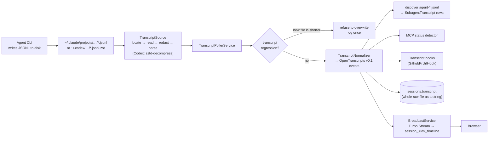

The agent writes JSONL to a file. Zimmer polls that file, normalizes it, and streams it to your
browser. That's the whole loop. Each step has a wrinkle.

## The pipeline


```mermaid
flowchart LR
    CLI["Agent CLI<br/>writes JSONL to disk"] --> F["~/.claude/projects/…/*.jsonl<br/>or ~/.codex/…/*.jsonl.zst"]
    F --> TS["TranscriptSource<br/>locate → read → redact → parse<br/>(Codex: zstd-decompress)"]
    TS --> TP["TranscriptPollerService"]
    TP --> RG{"transcript<br/>regression?"}
    RG -->|"new file is shorter"| SKIP["refuse to overwrite<br/>log once"]
    RG -->|no| NM["TranscriptNormalizer<br/>→ OpenTranscripts v0.1 events"]
    NM --> SUB["discover agent-*.jsonl<br/>→ SubagentTranscript rows"]
    NM --> MCP["MCP status detector"]
    NM --> HK["Transcript hooks<br/>(GithubPrUrlHook)"]
    NM --> DB[("sessions.transcript<br/>(whole raw file as a string)")]
    NM --> BC["BroadcastService<br/>Turbo Stream → session_&lt;id&gt;_timeline"]
    BC --> UI["Browser"]
```

## OpenTranscripts — the normalization layer

Claude and Codex write completely different JSONL. Rather than teaching the UI both dialects,
Zimmer normalizes into **OpenTranscripts v0.1** (`app/services/open_transcript.rb`), a
vendor-neutral schema vendored from `pulsemcp/ai-artifacts`. Nine event types:

`UserMessage` · `AssistantMessage` · `Thinking` · `ToolCall` · `ToolResult` · `SubagentSpawn` ·
`Compaction` · `Error` · `SystemEvent`

Every one renders through a single partial (`app/views/timeline_items/_item.html.erb`), keyed on
type. One raw JSONL line can fan out into several events.

Zimmer's copy diverges from upstream on purpose: per-line normalization with no cross-line
timestamp carry-forward, several fields hardcoded to null, Zimmer-internal adornments on every
event (`sort_time`, `transcript_index`, `event_order`), and redaction applied one layer up
rather than during conversion. The divergences are listed in `vendor/open_transcripts/README.md`.

### Keeping the copy honest

A hand-written mirror drifts, and a mirror that drifts silently is how an upstream fix never
reaches Zimmer. Two checks, one per link in the chain:

| Link | Checked by | When |
| --- | --- | --- |
| Zimmer's Ruby ↔ the pinned snapshot | `test/services/open_transcript_drift_test.rb` | every CI run, offline |
| The snapshot ↔ upstream `main` | `.github/workflows/open-transcripts-drift.yml` | daily, on demand, and on PRs touching the vendored files |

`vendor/open_transcripts/` holds a byte-for-byte snapshot of the upstream files Zimmer mirrors,
plus `UPSTREAM.json` pinning the commit and a SHA-256 per file. The offline test re-derives those
digests and asserts that `OpenTranscript` still declares the nine event-type discriminators and
the schema version the snapshotted spec does. The scheduled workflow re-fetches upstream and fails
when the bytes have moved; `alert-ci-failure.yml` listens on every workflow in the repo, so that
failure lands in Slack. Refreshing the snapshot is a deliberate act with a diff to read — the
procedure is in `vendor/open_transcripts/README.md`.

### Who wrote this line

Claude Code writes lines into its own transcript that carry `type: "user"` but were never typed by
a person. Two of them show up constantly in Zimmer:

| Flag on the JSONL line | What the CLI is recording |
| --- | --- |
| `interruptedByShutdown: true` | a turn killed mid-tool-use, by a process shutdown rather than a keyboard interrupt |
| `isMeta: true` | the CLI's own resume scaffolding — "Continue from where you left off." |

In Zimmer the shutdown behind the first one is usually Zimmer: `Sessions::InterruptService`
SIGTERMs the CLI to deliver an enqueued message ahead of the running turn. Rendering the resulting
line as a `UserMessage` told the reader a human had acted — the opposite of what Zimmer knows, and
it cost the deployment's owner a full trace across the logs, the raw JSONL and the normalizer
source to establish that he had not interrupted a session he had never touched.

`ClaudeTranscriptNormalizer` routes both to `SystemEvent` under the subtype
`OpenTranscript::SystemEventSubtypes::RUNTIME_NOTICE`, and the timeline draws them as a
**Runtime Notice** — the cyan system glyph, not the indigo user one — above a line naming the flag
that marked the line machine-written. The CLI's own wording inside the text is left alone:
"[Request interrupted by user for tool use]" says "by user" and is Claude Code's string, not
Zimmer's. The attribution Zimmer wraps around it is Zimmer's, and that is what carries the
correction.

The flags are matched against a literal `true`. Anything looser — truthiness, key presence — would
relabel a turn a person really did type as machine-written, which is the same misattribution with
the sign flipped, so both directions are covered by tests.

A runtime notice stays in the `message` filter bucket and keeps its fork affordance. It is not a
message, but it sits in the conversational slot the CLI wrote it into, and "the turn was cut off
here" is context a reader on the `minimal` filter still needs. A flagged line with no text is not
made into a notice at all — there is nothing to attribute — so it stays on the message path, where
a content-less message is already suppressed at render and an image-only one still shows its image.

The timeline is not the only surface that was asserting a person. `TranscriptTextRenderer` (the
plain-text export behind `GET /api/v1/sessions/:id/transcript` and the `get_session` MCP tool's
`transcript_format: "text"`) and the session page's own copy-to-clipboard both read
`parsed_transcript` — raw JSONL, never normalized — so both apply the same discriminator directly,
via `ClaudeTranscriptNormalizer.runtime_notice_markers`. Fixing only the normalizer would have left
an agent reading the text export being told a human typed the line.

Codex gets no equivalent treatment: its rollout `response_item` message payloads carry only `role`
and `content`, with no per-line marker that distinguishes a machine-written user turn from a typed
one. There is nothing unambiguous to key off, so `CodexTranscriptNormalizer` is left alone rather
than given an invented discriminator.

## Secret redaction

Zimmer hands its agents real credentials. MCP `${VAR}` values are interpolated into `.mcp.json`
inside the clone, OAuth tokens live in `~/.claude/.credentials.json`, `git` pushes over an
authenticated remote. An agent that `cat`s one of those files, echoes an environment variable, or
pastes a `curl -H "Authorization: Bearer …"` into its own reasoning puts that credential in the
transcript — and the transcript is stored, rendered, and downloadable through the
transcript-archive API.

`TranscriptRedactor` runs inside `TranscriptSource#read`, where transcript bytes are pulled off
disk. That is deliberately **on write, not on read**: Zimmer stores the whole raw transcript string
in `sessions.transcript`, so redacting at the read boundary is what keeps a credential out of the
database rather than only out of the rendered page.

Reading through that method is a requirement on callers, not a property of the code — Zimmer has
three *other* places that re-read a transcript and persist it (the manual refresh in
`SessionsController`, `Api::V1::SessionsController` and `Mcp::Tools::ActionSession`, each in a
single and a bulk form). They resolve their reader through `TranscriptRuntime.source_for(session).read`
for exactly this reason; a bare `File.read` at any of them writes an unredacted transcript over the
redacted one the poller stored. `test/contracts/transcript_redaction_contract_test.rb` pins that
structurally, so a new refresh path cannot quietly reintroduce the bypass.

It works in two tiers:

- **Known values.** Every `${VAR}` the AIR catalog's MCP servers reference, resolved through the
  same `SecretProviders` chain that injects them into a session, plus the OAuth tokens Zimmer
  holds in its own database. Exact string matches: no false positives, and they cover
  Zimmer-specific credential formats no regex could know about.
- **Shapes.** High-confidence patterns — `sk-ant-oat01…`, `ghp_…`, `xoxb-…`, JWTs, PEM blocks,
  `Authorization: Bearer …`, credentials embedded in a URL, and a value sitting immediately after
  a name that says "credential". Ported from the upstream reference redactor and extended with
  what this system actually handles.

Redaction preserves line count exactly (the regression and rotation guards below compare line
counts) and leaves no reversible fragment of the original.

### Why the patterns carry their own regexp timeout

`config.load_defaults 8.0` sets `Regexp.timeout = 1` for the whole process. That cap is sized for
request-scoped strings, and it applies to a *single* search rather than to a `gsub` as a whole — so a
transcript reaches it in two ordinary ways once it grows into the tens of megabytes. A `gsub` is a
sequence of searches, one per stretch between matches, and a rule with no literal to seek scans a
whole transcript that holds none of its shape as one search. And a single line carrying a
multi-megabyte base64 tool result is one uninterrupted run of the generic `ENV_SECRET` rule's value
class, which its greedy repeat consumes in one match.

Both were measured on a real 32 MB session transcript, at 1.0 s and 2.2 s. The resulting
`Regexp::TimeoutError` escaped `TranscriptSource#read` into `TranscriptPollerService`, which logged
`Error polling transcript for session N: regexp match timeout` and dropped the whole transcript
update — every poll, for as long as the session stayed alive
([#472](https://github.com/tadasant/zimmer/issues/472)).

Every pattern that can be handed transcript-scale input therefore carries its own
`TranscriptRedactor::SCAN_TIMEOUT` (10 s), which takes precedence over the global cap. Like the cap
it replaces it bounds one search, not a whole pass, so the figure it should be read against is the
slowest single search: 2.2 s, four times under it. It is a backstop against one runaway match rather
than a latency budget for `redact`, which takes ~7.6 s on that 32 MB transcript and is not a quantity
the timeout ever measures.

If it is reached anyway, the pattern pass retries line by line and replaces the single line it cannot
finish scanning with `[REDACTED:UNSCANNABLE_LINE]`, so a pathological line costs that line rather
than the whole update. Retrying that way finds exactly what the whole-string pass would have found,
because no pattern can match across a newline.

:::caution[Defense in depth, not a guarantee — transcripts are still secret material]
The redactor lowers the blast radius of a transcript that escapes. It does not make one safe to
expose. It cannot recognize a credential with no recognizable shape that Zimmer never issued: a
password an agent read out of someone else's config file, the body of an `op read`, a session
cookie from a browser automation run. Transcripts are also served by an endpoint with
[no authorization check](https://github.com/tadasant/zimmer/issues/44). Keep treating them as
secret material.

Redaction is irreversible and applies from the moment it shipped. Rows written before that still
hold whatever was captured; `bin/rails open_transcripts:redact_stored` rewrites them (it previews
by default — pass `DRY_RUN=0` to apply).
:::

## Writing a transcript back to disk

The stored transcript in `sessions.transcript` is the durable record; the file on disk is what the
runtime actually resumes from. Three paths re-materialize the former as the latter — resuming a
session whose clone was recreated (`AgentSessionJob#write_transcript_to_clone`), unarchiving
(`UnarchiveSessionService`), and forking (`ForkSessionService`).

None of them compute a path. They all ask the session's `TranscriptSource`:

```ruby
TranscriptRuntime.source_for(session, file_system: file_system)
  .resume_transcript_path(session: session, working_directory: working_directory)
```

For Claude Code that is `~/.claude/projects/<sanitized-cwd>/<session_id>.jsonl` — the same file
`locate` prefers, so the runtime resumes from exactly what the poller reads.

**`nil` means "this runtime has no single-file restore", and it is not an error.** Codex rollouts are
date-partitioned, UUID-named and possibly Zstandard-compressed, so there is no one deterministic path
to write stored bytes to. Every caller skips the write on `nil` and carries on; a Codex fork and a
Codex unarchive both succeed, having written nothing. Writing a Claude-shaped file the runtime will
never read would not have helped, and gating the operation on that write turned a no-op into a
failure.

A write that *raises* is still a failure, and fork and unarchive still abort on it — they distinguish
"nothing to do" from "the write did not land".

:::note
A restored Codex session resumes from whatever rollout is on disk. That is the wider Codex gap
tracked in #54, not something the restore path can fix on its own.
:::

## The regression guard

If the clone is recreated, the agent starts a *fresh* transcript file. Naively overwriting
`sessions.transcript` with it would wipe the session's history.

So `Session.transcript_regression?` refuses to overwrite a stored transcript with a shorter one,
and logs it once via `metadata["transcript_regression_detected"]`. If a *resume* hits an
unrepairable regression, the resume is refused outright — because resuming would silently
drop the user's prompt.

Codex has one extra recovery case. A failed `codex exec resume` can be recovered by starting a
fresh Codex process for the same Zimmer session, which creates a new rollout beginning at line 1
with a new runtime thread id. When the poller sees that recovery rollout and it does not already
include the stored recovery boundary, it appends the new segment instead of treating it as
destructive replacement, records
`metadata["transcript_recovery_segment_appended"]`, and broadcasts from the old transcript boundary.
The same poll also repairs a stale `broadcast_message_count` that points past the new transcript,
so the recovered messages are not silently skipped.

That guard exists because the underlying condition happens.

## Rotation: when a shorter file is *new*, not lost

The guard above assumes one canonical transcript file per session, which is true for Claude Code
and false for Codex. Codex rollouts are append-only and immutable, and `codex exec` mints a **new**
rollout UUID for every run that is not a resume — so when a resume fails and Zimmer fresh-starts
the turn, the conversation continues in a brand-new, initially tiny file.

`TranscriptSource#rotates_transcript_files?` is what tells the two apart: `false` for Claude
(shorter means *lost*, refuse and repair), `true` for Codex (shorter means *next file*, carry
history forward).

On a rotation the poller folds the whole stored transcript into an immutable prefix and records
its length in `metadata["transcript_carryover_event_count"]`, alongside
`metadata["transcript_source_path"]`. Later polls re-derive the prefix as the first N lines of
what is stored — the stored transcript is always `carryover + live` — so the timeline reads as one
continuous conversation across any number of rotations. Requiring the *path* to change is what
keeps a partially flushed read of the same file from duplicating history.

### Rotation and the recovery marker overlap

A failed-resume recovery rollout is usually *both* things at once: a recovery segment and a
rotation to a new file. The two mechanisms are keyed on different signals, so which one re-attaches
the history depends on the shape of the recovery rollout:

- **Shorter than the stored transcript** — that is a regression on a new path, so rotation sees it
  and carries the history forward. It gets there first, in the same poll.
- **Longer than the stored transcript** — not a regression, so rotation re-attaches nothing (it
  still replays the prefix an *earlier* rotation recorded, and still stamps the new
  `transcript_source_path`). Only the recovery marker knows the stored history has to survive, so
  the recovery path rebuilds the transcript as `recovery boundary + live rollout`. Rebuilding from
  the live rollout rather than from what rotation handed it is what keeps an already-carried prefix
  from being counted twice.

Either way the poll records `metadata["transcript_recovery_segment_appended"]`. The marker is a
statement about the session — a recovery happened and its segment is in the stored transcript — not
about which of the two mechanisms happened to fire. Unlike `transcript_recovery_expected` and
`transcript_recovery_base_line_count`, which are turn-scoped and cleared when the turn exits, this
one is sticky and diagnostic: it stays set for the life of the session, and nothing in the app
reads it.

:::caution[This was a real freeze, not a theoretical one]
Before rotation was handled, a fresh-started Codex session went permanently silent. The live
rollout was shorter than `broadcast_message_count`, so `new_messages[broadcast_count..]` returned
`nil` and nothing broadcast; the regression guard refused to persist and flagged
`transcript_regression_detected` once, silencing the log too. Nothing cleared that state, so the
session streamed stale content until a deploy recreated the clone — which is why sessions appeared
frozen for tens of minutes and then caught up all at once.
:::

The other half of the same failure is the id the poller looks the file up by. Codex mints its own
rollout UUID, so after a fresh start the stored `session_id` names an abandoned rollout;
`ProcessLifecycleManager#release_stale_runtime_session_id!` drops it so
`CodexTranscriptSource#find_main_transcript` falls back to matching on the session's clone path and
finds the live rollout. Without that, the locator kept returning the dead file and
`capture_runtime_session_id!` could never learn the new UUID — it reads that UUID from a file the
locator would never hand it.

## Rotation repairs the timeline, not the agent's memory

Carryover keeps *Zimmer's* view of the conversation whole. It does nothing for the runtime's own
view: a fresh start is a new conversation, and the new process is handed only the prompt that
triggered it. So the two halves of a lost rollout fail differently — the timeline still reads
correctly, while the agent answers as though the conversation never happened.

That makes the durability of the runtime home a correctness property, not an ops nicety.
`resume` resolves a conversation by its file on disk — `~/.claude` for Claude Code, `CODEX_HOME`
for Codex — so a runtime home on the container's writable layer is destroyed by every deploy, and
the following turn cannot resume. Both homes are mounted as durable named volumes (see
[Deploying](/operate/deploying/)); `test/config/runtime_home_volumes_test.rb` pins that for every
registered runtime and every role, because the symptom of getting it wrong is not an error — it is
an agent with amnesia and a timeline that still looks fine.

## Broadcast bookkeeping

The poller only broadcasts `new_messages[broadcast_count..]`, where `broadcast_count` comes from
`metadata["broadcast_message_count"]` (recomputed from the stored transcript when nil). This is
what prevents the entire transcript from replaying into your browser on every poll.

Note the sharp edge in that expression: Ruby returns `nil`, not `[]`, when the index is past the
end of the array. Any change that can make the parsed transcript *shorter* than `broadcast_count`
therefore stops the timeline dead rather than degrading — which is exactly how the rotation bug
above stayed invisible.

There is also an ownership guard: the poller skips if `session.running_job_id != job_id`,
which is what stops two monitoring jobs from double-broadcasting the same session.

## Subagent transcripts

When an agent spawns subagents (Claude's `Task` tool), each writes its own `agent-*.jsonl`. The
poller discovers them, stores each as a `SubagentTranscript` row, and links it back to the parent
`Task` tool call by matching `tool_use_id` against `toolUseResult.agentId` — filling in
`subagent_type`, `description`, `status`, `duration_ms`, `total_tokens`, and `tool_use_count`.

They render as a nested, collapsible accordion inside the parent's timeline row.

:::caution[Subagent transcripts assume Claude]
`SubagentTranscript#open_transcript_events` hardcodes `ClaudeTranscriptNormalizer`. Codex
subagents, if they produced discoverable transcripts, would be normalized with the wrong parser.
:::

## Transcript hooks

A small Ruby plugin system that runs inside Zimmer (not inside the agent) whenever new
transcript messages are broadcast. Sequential, error-isolated per hook, run after the transcript
is saved. Each hook writes into `session.custom_metadata`.

`GithubPrUrlHook` records the pull requests a session *opened* — read out of create output (`gh pr
create`, or a REST POST to `repos/OWNER/REPO/pulls`) or the agent's own "opened PR `<url>`" prose —
into `custom_metadata["github_pull_request_urls"]`.
That list is what the GitHub PR poller, the comment poller, and the merge-conflict poller all key
off, so a PR missing from it is invisible to Zimmer, and a PR wrongly on it sends another session's
comments here. `GithubCommentAuthorshipHook` ships alongside it, recording the comments a session
posted so the comment poller never reads one back as if a human wrote it.

→ [Transcript hooks](/extend/transcript-hooks/) for the contract and how to write one.

## Archive and download

`TranscriptArchiveJob` rebuilds a `latest.zip` of all transcripts every 10 minutes (temp file +
atomic rename). It's served by `GET /api/v1/transcript_archive/download`.

## Rendering to plain text

`TranscriptTextRenderer` turns a parsed transcript into a reading copy. One class serves both
surfaces that need one — `GET /api/v1/sessions/:id/transcript` and the `get_session` MCP tool's
`transcript_format: "text"` — because they previously carried separate copies of the same `case`
and drifted apart.

`user`, `assistant`, `tool_use` and `tool_result` get a labelled section each — and a `user` line
carrying one of the runtime-notice flags gets `--- Runtime Notice (agent runtime, not a person) ---`
instead of `--- User ---`. Every other entry type is labelled and dumped rather than dropped, so the
text never quietly disagrees with the raw transcript — this matters most for Codex, whose rollout lines are all `session_meta` /
`response_item` / `event_msg` / `turn_context` and would otherwise render as nothing at all.

Content that arrives as an array of blocks is rendered block by block: `text`, `thinking`, `image`,
`tool_use`, `tool_result`, and pretty JSON for anything unrecognized.

Two truncations keep this a summary rather than a second copy of the file: tool results at 500
characters, unrecognized entries at 1,000.

:::danger[Transcripts have no authorization check]
There is none to have. Sessions have no owner and Zimmer has no `User` model, so there is no
principal to check a transcript against — `SessionsController#transcript` says as much in place of
the TODO it used to carry.

Since [the web UI has no authentication at all](/limitations/#the-web-ui-has-no-login-by-design-and-the-sharp-edge-that-follows)
outside the `/supervisor` panel, anyone who can reach the host can read every transcript. Guarding
that is the perimeter's job.
Tracked in [#44](https://github.com/tadasant/zimmer/issues/44).
:::
