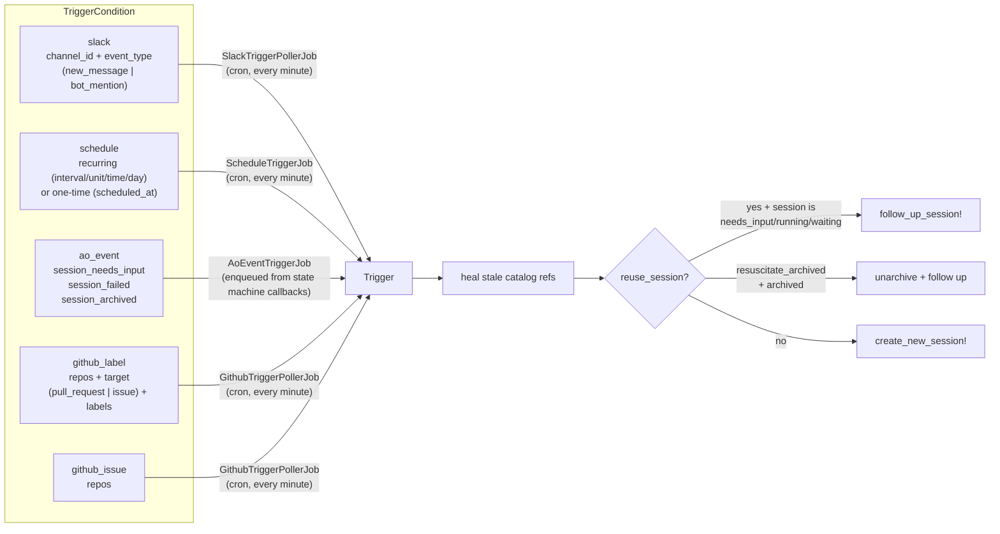
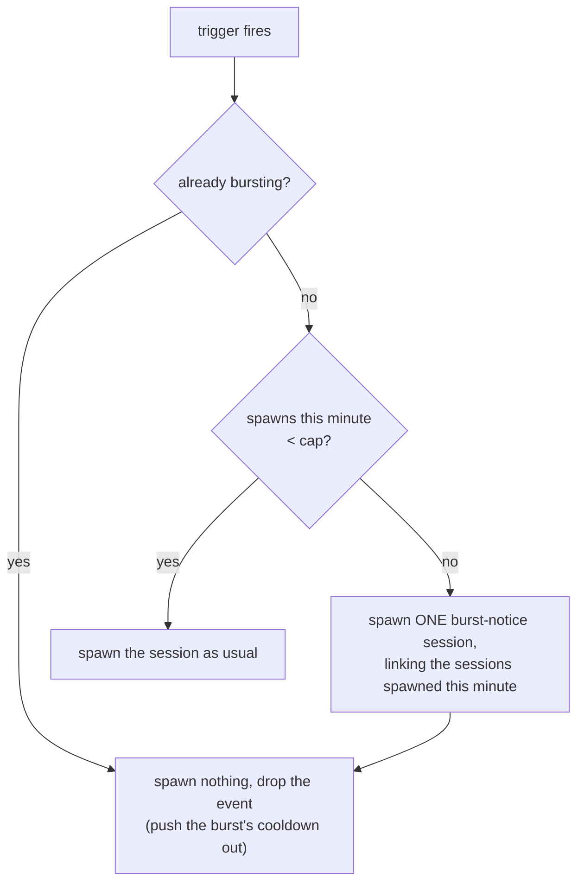

A **trigger** is a session template plus one or more conditions. When any condition fires, the
trigger creates a new session — or resumes an existing one.

Conditions on a trigger are ORed. Any one firing fires the trigger.

## The five condition types



### `slack`

Polls a channel for `new_message` or `bot_mention`. Optionally scoped to a thread (`thread_ts`)
and an allowlist of user IDs.

#### Picking the channel

In the triggers form the Slack channel is chosen from a dropdown that lazily loads the channels the
bot can see — `GET /triggers/channels`, backed by Slack's `conversations.list` — the first time a
Slack condition is shown, rather than on every page load. Selecting a channel stores its
`channel_id` (the value the poller keys on) under the hood and saves the human-readable
`channel_name` alongside it as a display cache. If the list can't be loaded — Slack unconfigured, an
API error, or a workspace the bot isn't in — the form falls back to a manual channel-ID input so a
trigger can still be created, and a saved channel that is no longer in the accessible list is kept
selected rather than silently blanked.

#### Who may trigger a `bot_mention`

Three layers, most specific first:

1. **The condition's own `allowed_user_ids`** (set from the triggers UI or the API), if present.
2. **`SLACK_BOT_MENTION_ALLOWED_USER_IDS`** — a comma-separated list of Slack user IDs, read from
   encrypted credentials (`mcp_secrets`) first and process ENV second. This is how a deployment
   narrows the default.
3. **Otherwise: everyone.** An unconfigured Zimmer lets any member of the workspace @mention or DM
   the bot.

Zimmer's own messages never trigger anything, whatever the allowlist says — it posts to Slack with
the same token (`AlertService`), and a `bot_mention` condition with no channel configured polls
*every* channel the bot is in, so without that rule an alert could trigger a session that alerts.
Messages from *other* apps do still qualify: bots are valid trigger sources.

:::caution[The open default means any workspace member can spawn an agent session]
With `SLACK_BOT_MENTION_ALLOWED_USER_IDS` unset, anyone who can DM the bot — or @mention it in a
channel it has been invited to — can start a session. That is bounded by the bot only ever seeing
channels it is invited to, but it is a real grant. Set the allowlist on any deployment where the
workspace is larger than the circle of trust.
:::

:::caution[`thread_ts` doesn't work for bot mentions]
`TriggerCondition` explicitly rejects it: *"thread_ts is not supported for bot_mention
conditions."* You can watch a thread for new messages, but not for bot mentions.
Tracked in [#78](https://github.com/tadasant/zimmer/issues/78).
:::

:::caution[`thread_ts` doesn't work for bot mentions]
`TriggerCondition` explicitly rejects it: *"thread_ts is not supported for bot_mention
conditions."* You can watch a thread for new messages, but not for bot mentions.
Tracked in [#78](https://github.com/tadasant/zimmer/issues/78).
:::

### `schedule`

Either recurring (`interval` + `unit`, or `time` + `day_of_week` + `timezone`) or one-time
(`scheduled_at`). `ScheduleTriggerJob` runs every minute — GoodJob/fugit can't do sub-minute
cron, so a schedule is minute-resolution at best.

:::danger[A failed one-time wake is unrecoverable]
`ScheduleTriggerJob` always advances `last_triggered_at` on error, to avoid an infinite retry
loop, and destroys one-time triggers even when the fire failed. If your scheduled wake-up
errors, it's gone; you have to recreate it. Nothing tells you.
Tracked in [#76](https://github.com/tadasant/zimmer/issues/76).
:::

### `ao_event`

Fires when a *watched* session transitions to `session_needs_input`, `session_failed`, or
`session_archived`. Enqueued directly from the state machine's `pause` / `fail` / `archive`
callbacks (deferred via `after_all_transactions_commit`, so the row is visible to the job).

With `watched_session_id` it's session-scoped and one-shot. Without it, it's a broadcast, and
it only fires for `is_autonomous` sessions.

### `github_label`

Fires when one of the watched labels is **added** to a pull request or an issue in one of the
watched repos.

```json
{
  "repos": ["tadasant/zimmer", "tadasant/zimmer-catalog"],
  "target": "pull_request",
  "labels": ["ready to merge"]
}
```

`target` is `pull_request` (the default) or `issue`. Any *one* of `labels` firing is enough — they
are ORed, not ANDed. Up to 20 repos.

Labels are matched **case-insensitively**, because GitHub's `label:` search qualifier is. Typing
`Ready To Merge` for a repo label named `ready to merge` works.

The motivating flow: the `pr` skill applies `ready to merge` as its terminal act, and a
`github_label` trigger on that label is what picks it up and fires the merge gate.

### `github_issue`

Fires when a new issue is opened in one of the watched repos. Repos are the only configuration.

```json
{ "repos": ["tadasant/zimmer"] }
```

### What a GitHub-triggered session receives

The prompt template can use `{{repo}}`, `{{number}}`, `{{link}}`, `{{title}}`, `{{author}}`,
`{{text}}` (the body), `{{labels}}` and `{{event}}`.

A template that names *none* of them gets the item appended as a context block instead, so a
GitHub-triggered session always knows its repo, number and URL without re-fetching them.

### The state-vs-event problem, and what Zimmer chose

"A label was added" is an **event**, but a poll can only observe **state** — the label is
*currently* there. A timestamp cursor cannot bridge that gap: a PR's `updated_at` moves for every
push and comment, so a cursor would either re-fire a still-labelled PR forever or miss a label
added during a quiet moment.

So `github_label` conditions keep a **seen-set**, not a cursor. Each tick asks GitHub for the set
of open items that currently carry a watched label, keys them as `owner/repo#number:label`, and
fires on the *difference* against the previous tick. That set then becomes the new seen-set.

A key is not dropped from the seen-set the instant it is missing, though. GitHub's search index is
eventually consistent, so a still-open, still-labelled PR can vanish from one tick's results and
return on the next. Treating that single miss as a label removal drops the key, and the reappearing
PR then looks new and re-fires a duplicate session — the label poller's version of the index lag the
`github_issue` path below guards against. So a missing key is **retained through a short grace
window** (`GithubTriggerPollerJob::REMOVAL_GRACE_TICKS` consecutive misses — roughly three minutes at
the one-minute cadence, tracked in the companion `seen_missing_counts`) before it is accepted as
genuinely unlabelled. A real removal simply takes that long to register.

The semantics that follow — all of them covered by tests:

| Situation | What happens |
| --- | --- |
| Label added to a PR | Fires **once**. |
| PR keeps the label across many ticks | Never re-fires — the key stays in the seen-set. |
| PR already carried the label when you created the trigger | **Does not fire.** The first tick records a baseline and fires nothing. |
| PR briefly drops out of the search (index blip) then returns | **Does not re-fire.** The key is held through the grace window, so the reappearance is not seen as new. |
| Label removed, then added again | Fires **again**, once the removal has persisted through the grace window. Removal eventually drops the key; re-adding makes it new. |
| Two watched labels added to one item | Two events, so two sessions. Keys are per `(item, label)`. |
| A tick is skipped (deploy, rate limit) | Harmless. The seen-set is state, not a cursor, so the next tick still sees the label. Misses are only counted on a real poll, so downtime never expires a key's grace early. |
| PR is closed or merged while labelled | Drops out of the `is:open` search; after the grace window it leaves the seen-set. If it is reopened still labelled, it fires again. |
| You add a repo or a label to the condition | The condition **re-baselines**. Items already labelled in the newly-watched scope are absorbed, not stampeded into sessions. |
| A `reuse_session` trigger *drops* the follow-up (target session busy) | Not counted as a fire. The item stays unseen and is retried next tick, rather than the event being silently consumed. |
| Session creation fails for an item | Same — the item is not recorded, so the next tick retries it. |

`github_issue` conditions are genuinely event-shaped — an issue's creation time never changes — so
those use an ordinary `created_at` cursor. Two wrinkles, both of which would otherwise lose issues
silently:

- GitHub's `created:` qualifier has only *second* granularity, so a strict `>` would drop an issue
  that shared its second with the previous tick's newest. The cursor is inclusive (`>=`).
- GitHub's search index is eventually consistent **and unordered** — of two issues opened seconds
  apart, the newer can be indexed first. A cursor that advanced to the newer one would then never
  see the older. So each tick re-queries a **30-minute window behind** the cursor
  (`GithubTriggerPollerJob::INDEX_LAG_GRACE`), and a set of already-fired keys covering that window
  is what stops the re-query from firing them twice. Observed indexing lag in practice is seconds;
  an issue indexed more than 30 minutes late is missed.


In both cases state advances only for items that actually produced a session. A failure to create
one leaves the item to be retried on the next tick rather than swallowing it.

### Rate-limit budget

Every condition costs **one** search request per tick, whatever its repo count: GitHub's search API
expresses all the watched repos and labels as a single query.

```
is:open is:pr (repo:tadasant/zimmer OR repo:tadasant/zimmer-catalog) (label:"ready to merge")
```

The search API is rate-limited **separately** from the core API — 30 requests/minute authenticated,
against core's 5,000/hour. At one tick per minute, *N* GitHub conditions cost *N* of those 30. The
existing `GithubCommentPollerJob` spends from the core bucket, so the two never contend.

Polling every minute holds comfortably: ~10 conditions is a third of the search budget, and adding
repos to a condition is free.

:::caution[The query syntax is pinned on purpose]
GitHub is migrating its issue-search API to an "advanced" query syntax, and the two syntaxes are
mutually incompatible for the multi-repo query this poller is built on — legacy wants
`repo:a repo:b` (implicit OR) and 422s on the explicit form; advanced wants `(repo:a OR repo:b)`
and *silently returns zero rows* for the implicit one.

The silent zero is the dangerous half. Under the seen-set semantics an empty result means "nothing
carries the label", so a query that quietly started being evaluated as advanced would drain the
seen-set and then re-fire every labelled item the moment the syntax was corrected.
`GithubSearchService` therefore pins `advanced_search=true` on every request, so the syntax Zimmer
builds is the syntax GitHub evaluates — whichever default the API ends up settling on.
:::

:::note[No gh credential → the poller skips, it does not storm]
The poller shells out to the `gh` CLI, which authenticates from a `gh auth login` credential or a
`GH_TOKEN`/`GITHUB_TOKEN` in the environment. On an instance whose worker has neither, every tick
would otherwise fail one API call per condition and alert on each — an every-minute error storm over
a missing credential.

So each tick preflights `GithubSearchService.configured?` (a quiet `gh auth status`) and returns early
when it is false, logging a single WARN — the same shape as `SlackTriggerPollerJob`'s
`return unless SlackService.configured?`. This is deliberately distinct from a transient API failure on
a *configured* host (a rate-limit or network blip), which still raises and alerts, because that is a
real incident rather than an unconfigured environment.
:::

## Burst control

A trigger can cap how many sessions it spawns per minute: **max sessions per minute**
(`Trigger#max_sessions_per_minute`, on the triggers form, the REST API, and the `action_trigger` MCP
tool). It is **opt-in** — unset means unbounded, which is how every trigger behaved before the
setting existed.

It exists because nothing bounded a trigger before. A burst of messages in a watched Slack channel
spawned one session per message — 50 of them, trashed by hand — and a sustained outage generating
alerts could have spawned sessions until the fleet was overwhelmed. A single Slack poll tick can
carry many messages, so the cap has to bound spawns *within* a tick, not just across ticks.

The cap is enforced at `Trigger#create_session!` — the one chokepoint every condition type funnels
through — so it covers `slack`, `schedule`, and `ao_event` triggers at once.



What each state means:

- **Under the cap:** the trigger spawns exactly as it does today.
- **Over the cap:** the trigger spawns **one** burst-notice session instead of the session the event
  asked for. Its prompt links the sessions the trigger already spawned in that window (so you can
  jump straight to them), quotes the event that tipped the cap, and asks the agent to investigate the
  burst rather than work the events. That session carries no goal — the trigger's goal describes the
  work the *event* asked for, not investigating a burst — and it never becomes the `reuse_session`
  target.
- **During the burst:** the trigger spawns **nothing at all**, and sends **no further notices**. Each
  suppressed event pushes the burst's cooldown out, so an outage that alerts for an hour keeps the
  trigger quiet for that hour and still produces exactly one notice.

A burst ends when the events stop: **five quiet minutes** (`Trigger::BURST_COOLDOWN`) with no fire at
all. The cooldown is deliberately several times the one-minute poll cadence — at one minute it would
expire exactly as the next tick's events arrive, refilling the cap and producing a fresh notice every
minute, which is the stream this control exists to prevent.

:::caution[Suppressed events are dropped, not queued]
The Slack poller advances its cursor past every message it fetched, whatever each message produced.
Messages suppressed during a burst are therefore **dropped** — not replayed when the burst ends.
That's deliberate: replaying them would spawn the very sessions the cap just prevented. The
burst-notice session is your record that they happened.
:::

Follow-ups into a **reused** session are not capped: they spawn nothing, and a `reuse_session`
trigger tops out at one session by construction. The cap counts *new session spawns*.

The state lives on the trigger row (`burst_window_started_at`, `burst_window_count`,
`burst_window_session_ids`, `burst_active_until`) and the check-and-reserve happens under a row lock,
so two jobs firing the same trigger concurrently can't both take the last slot.

## Wake-up semantics

Triggers are the backing store for two MCP tools Zimmer gives its own agents: "wake me up later"
and "wake me up when that other session changes state." Two mechanisms make this reliable:

**Auto-sleep.** `Trigger#sleep_target_session_if_applicable` runs on trigger creation. If the
target session is `needs_input`, it sleeps immediately (`needs_input → waiting`). If it's
`running`, it sets `metadata["pending_sleep"] = true` and the sleep happens on the next `pause`.
So an agent can say "wake me in an hour" mid-turn without stranding itself.

**Immediate fire on already-matched state.** `Trigger#fire_ao_event_immediately_if_state_matches`
row-locks each watched session *inside the creation transaction* and enqueues the job immediately
if the watched session is already in the target state. This closes the footgun where you
register a watcher after the transition already happened and then sleep forever.

**Sibling cleanup.** The recommended pattern is to register three `ao_event` watchers
(`needs_input`, `failed`, `archived`) plus a `wake_me_up_later` deadline backstop — whichever
fires first wins. After a successful one-time fire, `destroy_sibling_wakes!` deletes the others
pointing at the same session. Unless the follow-up was *dropped*, in which case siblings are
preserved.

:::note[Most of those siblings are dead weight]
`app/models/trigger.rb:190` says so out loud: *"backstop sibling group, and only one of them ever
fires usefully."* It's a correct design given the primitives, but it means a single logical
"wait for that session" creates four trigger rows.
:::

**Loop prevention.** A session whose `metadata["trigger_id"]` equals the trigger will never
re-fire that trigger.

## Everything is polled

Everything external is polled. There are no webhooks anywhere in Zimmer — including the GitHub
trigger types, which poll the search API rather than receiving `issues`/`pull_request` webhook
deliveries. Webhooks would need a public ingress that Zimmer's tailnet posture does not currently
offer; polling needs nothing but the outbound `gh` credential that is already there.

| Job | Cadence |
| --- | --- |
| `SlackTriggerPollerJob` | every minute |
| `ScheduleTriggerJob` | every minute |
| `GithubTriggerPollerJob` | every minute |
| `GitHubPullRequestPollerJob` | every 30 seconds |
| `GithubCommentPollerJob` | every 30 seconds |
| `GitHubMergeConflictPollerJob` | every 2 minutes |
| `SlackTriggerHealthCheckJob` | hourly at :45 |
| `CleanupStaleTriggersJob` | reaps leftovers |

:::caution[A Slack rate-limit episode stalls all polling]
`SlackService` retries up to 10 times with a fixed 1-second delay (not exponential backoff),
using blocking `sleep` inside a job thread. `SlackTriggerPollerJob`'s own comment acknowledges
this would "saturate the queue's whole thread pool," so the job is confined to a `pollers` queue
with `total_limit: 1`.

The consequence: while Slack is rate-limiting you, *all* Slack polling is stalled, and ticks are
silently dropped.
:::

:::note[Triggers have no input validation — this is a known design gap]
[Issue #18](https://github.com/tadasant/zimmer/issues/18) argues there is nothing between "event
arrived" and "agent running" except a `gsub` on a `prompt_template`. Untrusted Slack text is
interpolated straight into the prompt, and the agent is then trusted to act on identifiers it
read out of that text — making it a *trusted courier* for untrusted input. The proposal is a
third primitive (`Workflow`) between Trigger and Session.
Tracked in [#50](https://github.com/tadasant/zimmer/issues/50).
:::
