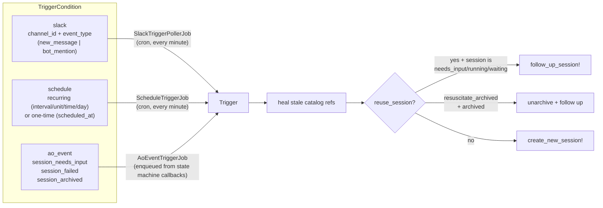

A **trigger** is a session template plus one or more conditions. When any condition fires, the
trigger creates a new session — or resumes an existing one.

Conditions on a trigger are ORed. Any one firing fires the trigger.

## The three condition types



### `slack`

Polls a channel for `new_message` or `bot_mention`. Optionally scoped to a thread (`thread_ts`)
and an allowlist of user IDs.

:::caution[Two hardcoded Slack user IDs, by name, in source]
`app/models/trigger.rb:13`:

```ruby
ALLOWED_BOT_MENTION_USER_IDS = %w[U08AENQUFBR U08AX7WMX1S] # Mike, Tadas
```

The default allowlist for who may trigger an agent via bot-mention is the author and one
colleague, compiled into the source. Single-workspace, single-team assumption. Tracked in [#52](https://github.com/tadasant/zimmer/issues/52).
:::

:::caution[`thread_ts` doesn't work for bot mentions]
`TriggerCondition` explicitly rejects it: *"thread_ts is not supported for bot_mention
conditions."* You can watch a thread for new messages, but not for bot mentions. Tracked in [#78](https://github.com/tadasant/zimmer/issues/78).
:::

### `schedule`

Either recurring (`interval` + `unit`, or `time` + `day_of_week` + `timezone`) or one-time
(`scheduled_at`). `ScheduleTriggerJob` runs every minute — GoodJob/fugit can't do sub-minute
cron, so a schedule is minute-resolution at best.

:::danger[A failed one-time wake is unrecoverable]
`ScheduleTriggerJob` always advances `last_triggered_at` on error, to avoid an infinite retry
loop, and destroys one-time triggers even when the fire failed. If your scheduled wake-up
errors, it's gone; you have to recreate it. Nothing tells you. Tracked in [#76](https://github.com/tadasant/zimmer/issues/76).
:::

### `ao_event`

Fires when a *watched* session transitions to `session_needs_input`, `session_failed`, or
`session_archived`. Enqueued directly from the state machine's `pause` / `fail` / `archive`
callbacks (deferred via `after_all_transactions_commit`, so the row is visible to the job).

With `watched_session_id` it's session-scoped and one-shot. Without it, it's a broadcast, and
it only fires for `is_autonomous` sessions.

## Wake-up semantics

Triggers are the backing store for two MCP tools Zimmer gives its own agents: "wake me up later"
and "wake me up when that other session changes state." Two mechanisms make this reliable:

**Auto-sleep.** `Trigger#sleep_target_session_if_applicable` runs on trigger creation. If the
target session is `needs_input`, it sleeps immediately (`needs_input → waiting`). If it's
`running`, it sets `metadata["pending_sleep"] = true` and the sleep happens on the next `pause`.
So an agent can say "wake me in an hour" mid-turn without stranding itself.

**Immediate fire on already-matched state.** `Trigger#fire_ao_event_immediately_if_state_matches`
row-locks each watched session *inside the creation transaction* and enqueues the job immediately
if the watched session is already in the target state. This closes the footgun where you
register a watcher after the transition already happened and then sleep forever.

**Sibling cleanup.** The recommended pattern is to register three `ao_event` watchers
(`needs_input`, `failed`, `archived`) plus a `wake_me_up_later` deadline backstop — whichever
fires first wins. After a successful one-time fire, `destroy_sibling_wakes!` deletes the others
pointing at the same session. Unless the follow-up was *dropped*, in which case siblings are
preserved.

:::note[Most of those siblings are dead weight]
`app/models/trigger.rb:190` says so out loud: *"backstop sibling group, and only one of them ever
fires usefully."* It's a correct design given the primitives, but it means a single logical
"wait for that session" creates four trigger rows.
:::

**Loop prevention.** A session whose `metadata["trigger_id"]` equals the trigger will never
re-fire that trigger.

## Everything is polled

Everything external is polled. There are no webhooks anywhere in Zimmer.

| Job | Cadence |
| --- | --- |
| `SlackTriggerPollerJob` | every minute |
| `ScheduleTriggerJob` | every minute |
| `GitHubPullRequestPollerJob` | every 30 seconds |
| `GithubCommentPollerJob` | every 30 seconds |
| `GitHubMergeConflictPollerJob` | every 2 minutes |
| `SlackTriggerHealthCheckJob` | hourly at :45 |
| `CleanupStaleTriggersJob` | reaps leftovers |

:::caution[A Slack rate-limit episode stalls all polling]
`SlackService` retries up to 10 times with a fixed 1-second delay (not exponential backoff),
using blocking `sleep` inside a job thread. `SlackTriggerPollerJob`'s own comment acknowledges
this would "saturate the queue's whole thread pool," so the job is confined to a `pollers` queue
with `total_limit: 1`.

The consequence: while Slack is rate-limiting you, *all* Slack polling is stalled, and ticks are
silently dropped.
:::

:::note[Triggers have no input validation — this is a known design gap]
[Issue #18](https://github.com/tadasant/zimmer/issues/18) argues there is nothing between "event
arrived" and "agent running" except a `gsub` on a `prompt_template`. Untrusted Slack text is
interpolated straight into the prompt, and the agent is then trusted to act on identifiers it
read out of that text — making it a *trusted courier* for untrusted input. The proposal is a
third primitive (`Workflow`) between Trigger and Session. Tracked in [#50](https://github.com/tadasant/zimmer/issues/50).
:::
