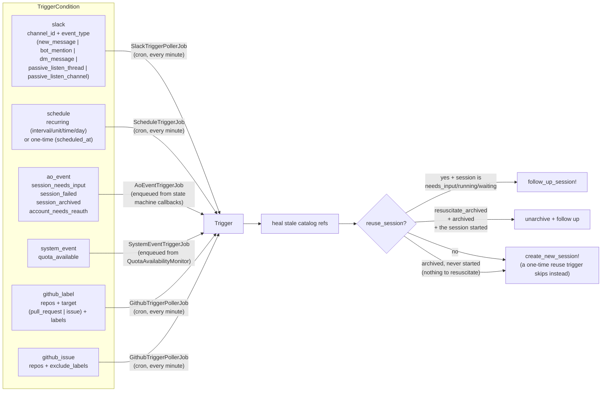
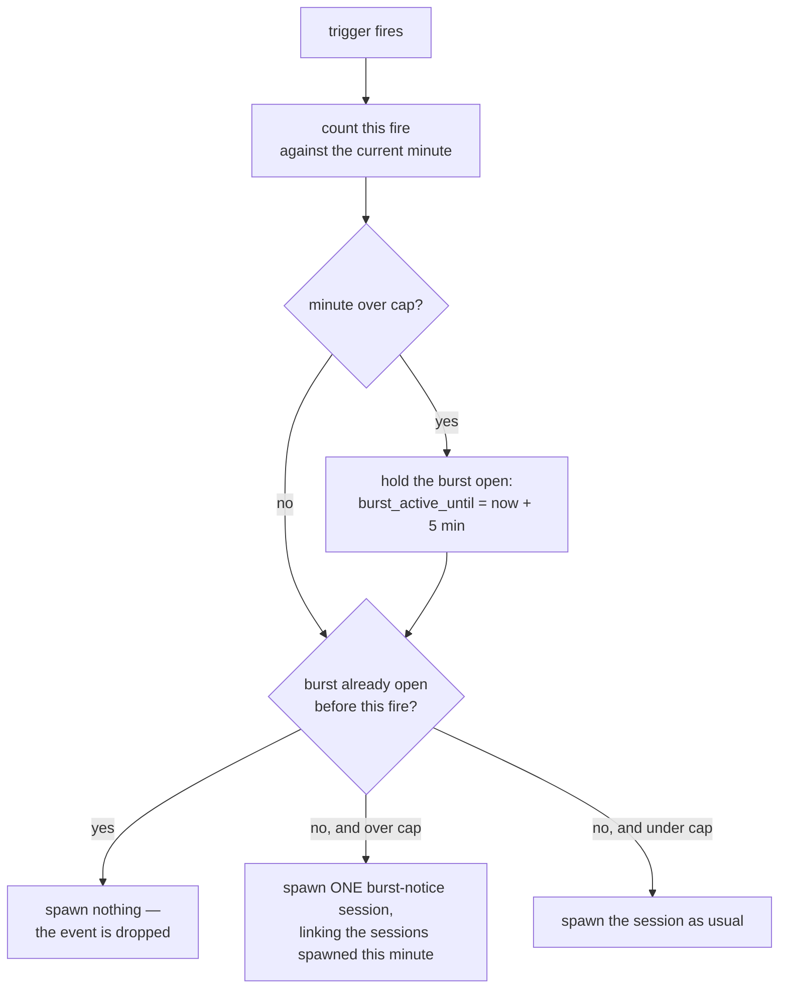

A **trigger** is a session template plus one or more conditions. When any condition fires, the
trigger creates a new session — or resumes an existing one.

Conditions on a trigger are ORed. Any one firing fires the trigger.

## The six condition types


```mermaid
flowchart LR
    subgraph conditions["TriggerCondition"]
        SL["slack<br/>channel_id + event_type<br/>(new_message | bot_mention | dm_message |<br/>passive_listen_thread | passive_listen_channel)"]
        SC["schedule<br/>recurring (interval/unit/time/day)<br/>or one-time (scheduled_at)"]
        AO["ao_event<br/>session_needs_input<br/>session_failed<br/>session_archived<br/>account_needs_reauth"]
        SE["system_event<br/>quota_available"]
        GL["github_label<br/>repos + target<br/>(pull_request | issue) + labels"]
        GI["github_issue<br/>repos + exclude_labels"]
    end

    SL -->|"SlackTriggerPollerJob<br/>(cron, every minute)"| T["Trigger"]
    SC -->|"ScheduleTriggerJob<br/>(cron, every minute)"| T
    AO -->|"AoEventTriggerJob<br/>(enqueued from state machine callbacks)"| T
    SE -->|"SystemEventTriggerJob<br/>(enqueued from QuotaAvailabilityMonitor)"| T
    GL -->|"GithubTriggerPollerJob<br/>(cron, every minute)"| T
    GI -->|"GithubTriggerPollerJob<br/>(cron, every minute)"| T

    T --> H["heal stale catalog refs"]
    H --> D{"reuse_session?"}
    D -->|"yes + session is<br/>needs_input/running/waiting"| FU["follow_up_session!"]
    D -->|"resuscitate_archived<br/>+ archived<br/>+ the session started"| RS["unarchive + follow up"]
    D -->|no| NEW["create_new_session!<br/>(a one-time reuse trigger skips instead)"]
    D -->|"archived, never started<br/>(nothing to resuscitate)"| NEW
```

### `slack`

Polls a channel for `new_message`, `bot_mention`, or one of the two passive-listening event types —
or, with `dm_message`, polls the bot's DMs instead of a channel. Optionally scoped to a thread
(`thread_ts`) and an allowlist of user IDs.

#### Picking the channel

In the triggers form the Slack channel is chosen from a dropdown that lazily loads the channels the
bot can see — `GET /triggers/channels`, backed by Slack's `conversations.list` — the first time a
Slack condition is shown, rather than on every page load. Selecting a channel stores its
`channel_id` (the value the poller keys on) under the hood and saves the human-readable
`channel_name` alongside it as a display cache. If the list can't be loaded — Slack unconfigured, an
API error, or a workspace the bot isn't in — the form falls back to a manual channel-ID input so a
trigger can still be created, and a saved channel that is no longer in the accessible list is kept
selected rather than silently blanked.

#### DMs: `dm_message`

`dm_message` fires on **every message the bot receives in a DM** from a user the condition allows.
It is the DM half of `bot_mention`, available on its own.

That split is the whole feature. `bot_mention` has always polled DMs — unconditionally, with no
mention required, because a DM is already addressed to the bot — but it polls them *as well as*
@mentions in every channel the bot is in. So a trigger that should answer your DMs and nothing else
could not be expressed: you had to accept a trigger anyone could fire from any channel. `dm_message`
is that trigger.

Mechanically it reuses the DM path `bot_mention` already had, so the semantics are the ones
documented above and below: one cursor per conversation in `configuration.dm_timestamps`, the first
poll baselines instead of replaying history, the bot's own messages never fire, and a DM with the
bot itself is skipped outright. The allow-list is applied by **enumeration** rather than filtering —
`SlackService.list_dm_channels` returns only the allowed users' conversations — which is why an
unrestricted condition passes `nil` rather than an empty array, since "everyone" cannot be written as
a list of IDs and an empty list means nobody. (It still paginates every IM and filters client-side,
so the allow-list narrows what is polled, not what is fetched. The poller memoizes the result per
run, keyed on the allow-list, so two conditions sharing one do not walk those pages twice.)

Leave the channel blank; `dm_message` ignores `channel_id` entirely, and `thread_ts` is rejected
(there is nothing for it to scope). `SlackTriggerHealthCheckJob` skips these conditions for the same
reason it skips `bot_mention` — there is no single monitored source to measure staleness against.

:::caution[A `dm_message` condition and a `bot_mention` condition both fire on the same DM]
`bot_mention` covers DMs unconditionally, and `dm_message` deliberately applies no mention filter.
Two conditions covering the same DM therefore each fire on it, spawning two sessions — and that
holds whether they sit on two triggers or on the *same* one, which is the likelier mistake:
`SlackTriggerPollerJob` iterates conditions, not triggers, and each one calls `create_session!`.
Nothing dedupes them, because Zimmer cannot tell an accidental overlap from a deliberate one. Pick
one per conversation.
:::

:::caution[The allow-list is open by default, and the form does not render it]
`dm_message` inherits the [three allow-list layers](#who-may-trigger-a-bot_mention-or-a-passive-listener)
below, including their default: **blank or unset means everyone**. No view renders
`allowed_user_ids`, so a condition created in the Triggers form falls through to
`SLACK_BOT_MENTION_ALLOWED_USER_IDS` — and if that is unset, any member of the workspace who opens a
DM with the bot spawns a session. Enumeration is the only gate on the DM path; there is no
second `user_allowed?` check behind it. Set the list through the API or the console, or set the env
var, before pointing a `dm_message` trigger at anything consequential. See
[the caveat](/limitations/#anyone-in-the-workspace-can-trigger-an-agent-via-bot-mention-by-default).
:::

#### Who may trigger a `bot_mention`, a `dm_message`, or a passive listener

Three layers, most specific first:

1. **The condition's own `allowed_user_ids`** (set from the triggers UI or the API), if present.
2. **`SLACK_BOT_MENTION_ALLOWED_USER_IDS`** — a comma-separated list of Slack user IDs, read from
   encrypted credentials (`mcp_secrets`) first and process ENV second. This is how a deployment
   narrows the default.
3. **Otherwise: everyone.** An unconfigured Zimmer lets any member of the workspace @mention or DM
   the bot.

Zimmer's own messages never trigger anything, whatever the allowlist says — it posts to Slack with
the same token (`AlertService`), and a `bot_mention` condition with no channel configured polls
*every* channel the bot is in, so without that rule an alert could trigger a session that alerts.
Messages from *other* apps do still qualify: bots are valid trigger sources.

:::caution[The open default means any workspace member can spawn an agent session]
With `SLACK_BOT_MENTION_ALLOWED_USER_IDS` unset, anyone who can DM the bot — or @mention it in a
channel it has been invited to — can start a session. That is bounded by the bot only ever seeing
channels it is invited to, but it is a real grant. Set the allowlist on any deployment where the
workspace is larger than the circle of trust.
:::

:::caution[`thread_ts` doesn't work for bot mentions]
`TriggerCondition` explicitly rejects it: *"thread_ts is not supported for bot_mention
conditions."* You can watch a thread for new messages, but not for bot mentions. The same
applies to the passive-listening types — they walk threads themselves.
Tracked in [#78](https://github.com/tadasant/zimmer/issues/78).
:::

#### Passive listening (`passive_listen_thread`, `passive_listen_channel`)

An @mention is how you *start* a conversation with Zimmer. Passive listening is how it stays in one:
it fires on messages that continue a conversation Zimmer is already part of, with no mention
required.

It is **two** event types rather than one, because a Trigger ORs its conditions. Carry one, the
other, or both:

| Event type | Fires on | Requires | Bounded by |
| --- | --- | --- | --- |
| `passive_listen_thread` | A new reply in a thread | Zimmer has spoken in that thread | Nothing time-based. `RECHECK_HORIZON` (45 days) only bounds how far back a thread whose parent has scrolled out of recent history keeps being re-visited |
| `passive_listen_channel` | A new top-level message in a channel | Zimmer has posted **at the top level** of that channel within `CHANNEL_ENGAGEMENT_WINDOW` | 6 hours |

Thread replies are deliberately *not* time-bounded. A reply to a thread you are in is addressed to
that conversation whenever it lands. A top-level message in a busy channel is not, which is why
"recently involved" there has to be bounded by something explicit — otherwise one message months ago
would make Zimmer a permanent listener on every message in the channel.

:::note[A thread reply is not channel engagement]
`passive_listen_channel` counts only Zimmer's **top-level** posts. A reply it left inside a thread
makes it party to *that thread* — which is exactly what `passive_listen_thread` follows — not to
everything else said in the channel. This is the narrower of the two readings available, chosen
because the cost of under-firing is a message Zimmer misses and the cost of over-firing is noise in
a channel nobody asked it into.
:::

Both sweep channels exactly like `bot_mention` — one channel if `channel_id` is set, otherwise every
channel the bot is a member of — and keep the same cursors: per-channel in `channel_timestamps`,
per-thread in `thread_timestamps` (`"channel_id:thread_ts" => last_reply_ts`), advanced for
everything fetched whether or not it fired, so a quiet spell never replays as a burst. Aged-out
threads are re-visited under the same `MAX_TRACKED_THREAD_RECHECKS` (20 per channel per poll) cap,
reading only the tail since each thread's cursor. What changes is the filter: participation instead
of mention.

A `passive_listen_channel` condition never reads threads at all, and a `passive_listen_thread`
condition never reads or writes the channel-engagement signal. Each pays only for the thread and
history calls its own signal needs — both still sweep top-level messages per channel per poll, since
that cursor is what a first-sight thread falls back to.

Participation is answered without ever re-reading a thread's history. The first time a thread is
seen there is no cursor, so the read returns the whole thread — that read decides participation.
After that, every reply Zimmer has not already inspected is in the tail, and a thread it has spoken
in is remembered in `participating_threads`, so the tail alone is enough from then on.

Channel engagement is learned from what the poll already fetches: Zimmer's own posts in the last 50
top-level messages. The newest is remembered per channel in `bot_activity_timestamps` and only ever
moves forward, so a channel stays engaged for the full window even through polls where nothing has
moved, and a tick that happens to observe *older* activity can't wind it back and disengage early.

The alert channel (`ENG_ALERTS_SLACK_CHANNEL_ID`) is excluded from that signal. `AlertService` posts
there with the same token and therefore the same user ID, so one automated alert would otherwise
mark the channel engaged and turn the whole window of it into a session per message — in the one
channel guaranteed to be noisy when things are going wrong. Threads there are unaffected: if Zimmer
actually replied in one, that is a conversation and `passive_listen_thread` still follows it.

A thread seen for the first time has no cursor of its own and falls back to the channel's, which
tracks *top-level* messages — in a channel whose conversation lives in threads that can be weeks
old. It is clamped to `THREAD_BACKFILL_HORIZON` (24 hours), so meeting a thread late costs at most a
day of catch-up rather than the entire backlog. That is deliberately its **own** constant and not
`CHANNEL_ENGAGEMENT_WINDOW`: it bounds a one-off backfill on discovery, which has nothing to do with
how long a channel stays engaged, and tying the two together would silently retune first-discovery
behaviour every time the channel window is adjusted.

Passive listening never fires on:

- **Zimmer's own messages**, the same self-loop rule `bot_mention` has.
- **Any other app's messages.** `bot_mention` accepts them because an @mention is an explicit
  request; a passive listener firing on every CI notification that lands in a thread it once
  replied to is exactly the noise it must not make.
- **Channel-event subtypes** — joins, leaves, topic/purpose/name changes, huddles, pins, edits
  (`PASSIVE_IGNORED_SUBTYPES`). "Sam has joined the channel" is not a conversation continuing.
  Subtypes that *are* somebody talking — `file_share`, `me_message`, `thread_broadcast` — still
  fire.
- **DMs.** Every DM to the bot is already directed at it, and a `bot_mention` condition covers DMs
  unconditionally; firing passively there would double-spawn.
- **Anything that @mentions Zimmer.** Mentions belong to `bot_mention`; the passive types own
  everything else. See below.

The allowlist is the same three layers as `bot_mention` above, including
`SLACK_BOT_MENTION_ALLOWED_USER_IDS`.

:::note[Mentions belong to `bot_mention`, on both passive types]
A mention posted inside a thread Zimmer is in is *both* a mention and a reply in a participated
thread; a mention in an engaged channel is *both* a mention and a top-level message there. Both
conditions matched, so one Slack message spawned **two concurrent sessions on identical text** —
observed in production, one per matching trigger, on every mention. `passive_candidate?` therefore
excludes any message that mentions the bot, using the same `mentions_bot?` predicate `bot_mention`
filters on; two different notions of "is a mention" would leave a gap that double-fires again.

The exclusion is unconditional: it does not check that a `bot_mention` condition would in fact pick
the message up, because conditions are polled independently and none can see the others. So a
mention falls through the gap entirely if the deployment has no `bot_mention` condition, if that
condition is disabled or scoped to a different channel than the passive one, or if the two carry
different `allowed_user_ids`. That is the intended division of labour — being addressed directly is
what `bot_mention` is for — but it is a silent drop, so the poller logs one line at `info` naming
the message and the condition that declined it.
:::

:::caution[Restraint belongs in the prompt, not just the poller]
The poller decides which messages Zimmer *sees*. It cannot decide which deserve a reply — a
teammate saying "thanks, that worked" in a thread Zimmer is in fires the trigger just as a direct
follow-up question does. A passive-listening trigger's prompt template has to make silence the
default, and it should tell the session to add its :eyes: reaction only once it has decided to
respond, so the reaction is a commitment rather than an acknowledgement. See
[the draft template](#a-passive-listening-prompt-template).
:::

:::note[`passive_listen` is deprecated, not removed]
The original single event type fired on both signals at once. It still works — a deploy of the split
must not strand a trigger that names it — and behaves as though both new conditions were present,
including the 6-hour window and the top-level-only engagement rule. The triggers form offers it only
on a condition that already carries it; the REST API still accepts it, since it is a member of
`EVENT_TYPES` like any other. Removal is tracked in
[#253](https://github.com/tadasant/zimmer/issues/253).

**Replacing it means two fresh condition rows, and a fresh condition starts with empty
bookkeeping.** Carry the old condition's cursors across, or the two new ones are worse than the one
they replace in both directions at once:

- **They over-fire.** A fresh condition baselines its *channel* cursor on the first poll, which is
  the newest top-level message — in a thread-heavy channel that can be weeks old. On the second poll
  every thread is a first-sight thread, so each replays back to `THREAD_BACKFILL_HORIZON` (24 hours).
  Every reply from the last day in every thread Zimmer is in fires at once, bounded only by the
  trigger's `max_sessions_per_minute` (above which the rest are dropped).
- **They also under-fire, permanently.** A thread is only ever discovered through its parent
  appearing in the last 50 top-level messages, or through an existing `thread_timestamps` entry. A
  thread whose parent has already scrolled past that window and has no entry is invisible — and
  stays invisible, even after Zimmer next speaks in it.

Copy `thread_timestamps` and `participating_threads` onto the thread condition,
`bot_activity_timestamps` onto the channel condition, and `channel_timestamps` onto **both** (a
first-sight thread falls back to that cursor). Editing `configuration` directly is the only way:
the trigger form does not render these keys, and `TriggerCondition::SLACK_POLL_STATE_KEYS` exists
precisely so that saving the form does not *destroy* them.
:::

:::note[No stall detection]
`SlackTriggerHealthCheckJob` skips every passive-listening event type for the same reason it skips
`bot_mention`: the condition fans out across many channels, each with its own cursor, so there is no
single "newest message" to compare against.
:::

#### A passive-listening prompt template

A starting point for the trigger's `prompt_template`, tuned for restraint. `{{text}}`, `{{author}}`,
`{{channel}}` and `{{link}}` are interpolated by `Trigger#interpolate_prompt`.

```text
A message landed in #{{channel}}, in a Slack conversation you are already part of.
Nobody @mentioned you. You are here because you have spoken in this thread before,
or you posted in this channel within the last few hours.

Author: {{author}}
Message: {{text}}
Link: {{link}}

Your default is to say nothing. Most messages in a conversation you are part of are
not for you, and a wrong guess is worse than silence.

Read the thread with the slack-workspace MCP server before deciding anything.

Respond ONLY if one of these is clearly true:
- The message asks you something, or asks for something you were doing.
- It continues a task you were working on in this thread — an answer to a question
  you asked, a review of work you delivered, a report that something you shipped is
  broken.
- It is a direct instruction that plainly lands on you given what you were doing.

Stay silent if any of these is true:
- It is two people talking to each other, even about work you did.
- It mentions a topic, repo, or PR you touched, without asking you for anything.
- It is an acknowledgement, a reaction, or small talk ("thanks", "nice", "lol").
- You are unsure. Ambiguous means silent. Do not split the difference by posting a
  short reply just in case.

If you are staying silent: add NO reaction, post NOTHING, and archive your own
session immediately. That is a successful outcome, not a failure.

If you are responding: FIRST add an :eyes: reaction to the message, so the humans
know you have picked it up. The reaction is a commitment to reply — never add it
before you have decided to. Then do the work and reply in the thread.
```

### `schedule`

Either recurring (`interval` + `unit`, or `time` + `day_of_week` + `timezone`) or one-time
(`scheduled_at`). `ScheduleTriggerJob` is scheduled `* * * * *`, so a schedule is
minute-resolution. That is the cadence chosen for the job, not a platform limit — six-field
cron with a seconds field works, and three other pollers use it
([Background jobs](/operate/background-jobs/)).

#### When a one-time fire fails

A one-time trigger whose fire raises is **not** destroyed. `ScheduleTriggerJob` parks it in
the `failed` status, records `failed_at` and `last_error` on the row, and alerts. The trigger
stays in the list at `/triggers` with a red **Failed** badge and the error that stopped it, so
"wake me at 6am to check the deploy" cannot quietly become "you are not woken, and you find out
at 9".

`failed` is a third status alongside `enabled` and `disabled`, not a flavour of `disabled`:
"you turned this off" and "this tried to run and could not" are different facts. Every firing
path filters on `status = "enabled"`, so a failed trigger fires no more often than a disabled
one — that status, not a bumped timestamp, is what closes the infinite-retry loop.

Which is why the failure path deliberately leaves the condition's `last_triggered_at` alone.
The schedule stays *due*, so pressing **Re-arm** on the trigger (or calling `action_trigger`
with `action=toggle`) clears the failure and the wake fires for real on the next minute's tick.
No edit, no re-creation. Every route off `failed` — the toggle, the edit form, the REST API,
`action_trigger` — clears `failed_at` and `last_error`, so a recovered trigger never keeps
advertising the failure it recovered from.

One failure does not re-arm, and does not pretend to. A raise from the cleanup that *follows* a
successful fire (sibling destruction, the auto-delete) arrives with the schedule already consumed
and the session already created, so re-firing would duplicate it. `Trigger#spent_one_shot_wake?`
is what the trigger page and the alert read to tell the two apart: in that case they say the
schedule was consumed and ask you to check the session rather than offering a re-arm that would
deliver nothing.

`CleanupStaleTriggersJob` skips failed triggers in both of its sweeps, and
`Trigger#destroy_sibling_wakes!` skips them too. A parked trigger is lapsed by definition, so the
lapsed-schedule heuristic matches every one of them; and in the triple-wake pattern below, a
sibling that fires successfully later would otherwise delete the record of the one that tried and
could not. Both would delete the evidence as a side effect, which is the silent loss the parking
exists to prevent. Only you clear a failed trigger — which also means nothing bounds how many
accumulate, so a systemic fault leaves a list to clear by hand
([Limitations](/limitations/#a-failed-one-time-wake-does-not-retry-itself)).

A recurring schedule behaves differently on a bad tick: it advances `last_triggered_at`, stays
enabled, and tries again on its next interval.

### `ao_event`

Fires on an internal Zimmer event. The events divide by their **subject** — what the event is about —
and the subject decides which rules apply:

| Event | Subject | Emitted by |
| --- | --- | --- |
| `session_needs_input`, `session_failed`, `session_archived` | a Session | the state machine's `pause` / `fail` / `archive` callbacks (deferred via `after_all_transactions_commit`, so the row is visible to the job) |
| `account_needs_reauth` | a `ClaudeAccount` | `ClaudeAccount`'s status-transition callback, when a runtime account's refresh token dies for good |

For a **session** event: with `watched_session_id` it's session-scoped and one-shot. Without it, it's
a broadcast, and it only fires for `is_autonomous` sessions.

#### `session_needs_input` means "came to rest", and it is settled before it fires

`failed` and `archived` are terminal: once a session is there, it stays there, and the event can be
delivered the moment the transition commits. `needs_input` is not terminal, and that asymmetry used
to be invisible.

`pause` runs at **every turn boundary**, including the boundaries a session leaves again
immediately. Two of them are routine:

- A session asleep on its own `wake_me_up_later` wakes, takes a turn and sleeps again. `pause`'s
  own `execute_pending_sleep` runs it straight back to `waiting`, *inside the same callback*, so
  the `needs_input` leg lasts microseconds.
- A session pauses with a message queued for it. `EnqueuedMessageDrainJob` resumes it a few seconds
  later.

Neither is a session that needs anything, but both emitted `session_needs_input` and woke every
watcher subscribed to it. Because a fired one-time wake destroys its siblings, each spurious wake
cost the watcher a full agent turn *and* the re-registration of every wake it still wanted — the
"flap storm" that production router session #9964 hit four times in 25 minutes while its one healthy
child cycled through the open-pr skill's bounded self-wake.

So `session_needs_input` is now **settled**:

1. `SessionStateMachine#fire_settled_needs_input_ao_event` enqueues `AoEventTriggerJob` with a
   `wait:` of `NEEDS_INPUT_SETTLE_WINDOW` (30 seconds) and a marker — the same
   `custom_metadata["needs_input_count"]` counter the debounced push notification already used.
   One `pause` bumps the counter once and hands the same marker to both consumers.
2. When the job runs, `AoEventSubject::SessionSubject#stale?` drops the event unless the session is
   still `Session#resting_in_needs_input?`, and unless the marker still matches — which is what
   supersedes an event a later transition has already replaced.

`session_failed` and `session_archived` are untouched: no delay, no re-check, because a terminal
state cannot flap.

#### `resting_in_needs_input?` asks about status, and only status

That looks too weak to do the job, and it is worth saying why it is not — and why the richer
versions are worse.

Every boundary this suppresses leaves `needs_input` for somewhere else. `execute_pending_sleep`
runs *synchronously inside the pause callback*, so a session that slept on its own wake is already
`waiting` before the job is even enqueued; a session whose queued message drained is `running`,
because `EnqueuedMessageDrainJob::DELAY` is well inside the window. Status catches both.

The two richer disqualifiers — a lingering `pending_sleep`, a still-pending enqueued message — can
only *still* be true when the window closes if the thing that was going to move the session has
failed. `sleep!` raised and left the flag behind. The drain exhausted `MAX_ATTEMPTS` and left the
rows `pending` on an idle session, or one of its three `skip_reason` refusals is holding the message
indefinitely. Those sessions are stuck at rest, and they are exactly the ones a watcher must hear
about — so treating them as "not a rest" would not delay the wake, it would **lose** it. `pause`
only fires from `running`, so once a session is at rest nothing re-emits the event; there is no
second chance.

The cost of the narrow check is an occasionally early wake — a drain whose first attempt fails
resumes the session at `DELAY + RETRY_DELAY`, just past the window. That trade is the right way
round. A wake that arrives seconds early costs a re-poll; a wake that never arrives costs a router
its whole backstop interval.

#### What is and is not covered

The **immediate-fire path** (`Trigger#fire_ao_event_immediately_if_state_matches`) is unchanged in
code but not in behaviour: it enqueues the same job, so it now runs through the same rest check.
Registering a watcher on a session sitting in `needs_input` still fires at once — but if that
session gets going again before the job runs, the fire is dropped rather than delivered against a
session that has moved on. It carries no marker and no wait, which is also how
`DISPATCH_LATENCY_WARN_THRESHOLD` tells it apart from a settled job and declines to discount its
latency.

**Broadcast (unscoped) `session_needs_input` conditions are settled too.** They ride the same job, so
a broadcast trigger no longer fires on a turn boundary either — and it inherits the 30-second delay.

`block_on_elicitation` emits through the settled path as well. An elicitation the user answers in
seconds flips the session back to `running` via `unblock_from_elicitation`, which is a turn-boundary
flap by another name; one that is still waiting on a human survives the window and wakes the
watcher, which is right, because that is a session genuinely asking for something.

The settle window is a constant, not a per-trigger option. A wake on a transition the watched
session had already left is not useful to any caller, so there is no posture to configure; the
knob would only be a way to get it wrong.

An **account** event has no session to watch, no autonomy flag to consult, and no session the trigger
could have created — so it is always broadcast, and `watched_session_id` is rejected on it outright.
It is throttled at the source instead: at most one fire per account per 12 hours, released when a
human completes a login for that account. See
[a dead account tells you so](/auth/harness/#a-dead-account-tells-you-so).

`AoEventSubject` is where that split lives. Adding a third kind of subject means adding a class there
and a name to `TriggerCondition::AO_EVENT_NAMES`; `AoEventTriggerJob` does not change.

Both kinds are creatable from the /triggers form and from the MCP `action_trigger` tool. To wake
*yourself* on a session you are waiting for, use `wake_me_up_when_session_changes_state` instead — it
creates the one-shot wake **and** puts your session to sleep.

Two guards apply to `ao_event` specifically, because a broadcast session condition fires on every
autonomous session's transition and loop prevention is only per-trigger — two of them (one on
`session_needs_input`, one on `session_archived`) would otherwise feed each other unbounded:

- **A broadcast session condition created through `action_trigger` gets a default
  `max_sessions_per_minute`** (`BROADCAST_SESSION_AO_EVENT_BURST_CAP`) when the caller names none.
  Send the value explicitly to choose your own, including no cap. Account events and session-scoped
  wakes are exempt: the first is already bounded at source, and a cap there could only drop alerts
  during the mass failure it exists to report; the second fires at most once.
- **An update that drops `watched_session_id` from a session-scoped condition is refused.**
  `configuration` replaces a condition's user-facing keys, so omitting it would silently widen a
  one-shot wake into a broadcast — including one of the rows `wake_me_up_when_session_changes_state`
  creates. Delete the condition and add a new one if a broadcast is genuinely what you want.

#### When an `ao_event` fire fails

The same two-shapes rule as schedules, drawn along the scoping line rather than the
recurring/one-time line — because for `ao_event` that *is* the line.

A **session-scoped** wake is one-shot, and it only ever fires on its watched session's
transitions. If firing it raises and it is left enabled, "it will try again on the next
transition" is a promise the event stream cannot keep: the watched session may have just made
its last transition, which is precisely the `session_failed` / `session_archived` case agents
schedule most. So `AoEventTriggerJob` parks it as `failed` — same status, same badge, same
`failed_at` / `last_error` as a failed schedule — and alerts. The condition's `last_triggered_at`
is left alone for the same reason as above: the status closes the retry loop, so re-enabling
the trigger re-arms an unspent wake. The alert says plainly that a re-arm only helps if the
watched session transitions again, and that a terminal one never will.

A **broadcast** condition is not parked. It is recurring by nature — every autonomous session's
transition fires it — so it alerts, stays enabled, and fires on the next matching transition.
Parking one would silently stop every future wake, which is the same failure this parking exists
to remove, pointed the other way.

A raise *after* the wake was delivered splits in two, and the alert distinguishes them, because
"a session was created" and "the one-shot guard was recorded" are different facts and
`condition.update!` sits between them. If the guard did persist, re-arming delivers nothing and
the alert says so — the same distinction the schedule path draws. If the guard is what failed,
the session exists *and* the condition is still armed, so re-arming would create a **second**
session; the alert warns against it rather than inviting it.

`Trigger#spent_one_shot_wake?` is the predicate behind both the alert and the trigger page, and it
covers both one-shot shapes — a one-time schedule and a session-scoped `ao_event`. A predicate that
saw only schedules would offer every parked state-change wake a "Re-arm" button with no caveat.

### `system_event`

Fires when the **deployment** changes state, rather than a session. One event today:
`quota_available`, the account pool going from serving nothing to serving something.

It is a separate condition type rather than a fourth `AO_EVENT_NAMES` entry because every decision
`ao_event` makes is about a session — watched-session scoping, the `is_autonomous` filter, the guard
that stops a trigger firing on the session it created. A fleet-wide event has no session at all.

`QuotaAvailabilityMonitor` owns the edge detection and `SystemEventTriggerJob` does the firing.
System events are broadcast and recurring by nature: every enabled trigger carrying a matching
condition fires, the condition is never spent, and the trigger is never auto-deleted. A fire that
raises alerts and stays enabled — parking it would silently stop every future recovery wake.

This is what wakes quota-parked spot sessions. The shipped trigger spawns one `fleet-maintenance`
session running the `awaken-waiting-sessions` skill, which decides — in precedence order, against the
spot thresholds and the concurrency ceiling — which `waiting` sessions start. See
[When the pool runs dry](/auth/harness/#when-the-pool-runs-dry).

### `github_label`

Fires when one of the watched labels is **added** to a pull request or an issue in one of the
watched repos.

```json
{
  "repos": ["tadasant/zimmer", "tadasant/zimmer-catalog"],
  "target": "pull_request",
  "labels": ["ready to merge"]
}
```

`target` is `pull_request` (the default) or `issue`. Any *one* of `labels` firing is enough — they
are ORed, not ANDed. Up to 20 repos.

Labels are matched **case-insensitively**, because GitHub's `label:` search qualifier is. Typing
`Ready To Merge` for a repo label named `ready to merge` works.

The motivating flow: the `open-pr` skill applies `ready to merge` as its terminal act, and a
`github_label` trigger on that label is what picks it up and fires the merge gate.

### `github_issue`

Fires when a new issue is opened in one of the watched repos.

```json
{
  "repos": ["tadasant/zimmer"],
  "exclude_labels": ["hold issue work gate"]
}
```

#### Opting an issue out, with a label

`exclude_labels` is optional, and it is an **escape hatch for the issue's author**, not a filter for
whoever configured the trigger. An issue opened carrying *any* of those labels does not fire the
condition; every other issue still does. That is what makes it usable as a default-on gate you can
step around deliberately — the motivating case being a batch of issues filed at once, none of which
should each spawn a session.

The exclusion is expressed as a negation in the search itself, one `-label:` term per entry:

```
is:issue (repo:tadasant/zimmer) created:>=… -label:"hold issue work gate"
```

Negations are ANDed, so an issue is returned only if it carries **none** of the excluded labels. An
excluded issue is never seen by the poller at all: it does not fire, and it does not advance the
cursor past itself either.

:::caution[The label has to be there when the issue is created]
The exclusion is evaluated at *search* time, and the poll runs every minute. Label the issue as you
open it —

```sh
gh issue create --label "hold issue work gate" --title "…" --body "…"
```

— rather than opening it and adding the label a moment later. A label added after the fact races the
next tick, and if the tick wins, the trigger has already fired.

*Removing* the label later is not a reliable way to un-hold an issue either. The poller re-queries a
30-minute window behind its cursor, and that cursor advances only when an issue **fires** — so the
window trails the last fired issue rather than the clock. Un-holding re-exposes the issue when
nothing else has fired past it since, and does nothing once something has. Open a fresh issue when
you want the gate.
:::

Editing `exclude_labels` does **not** re-baseline the condition — unlike `repos`, `labels` and
`target`, which do. Re-baselining exists to stop a *widened* watch from stampeding sessions for
everything already matching; an exclusion only ever narrows, and a `github_issue` condition's state
is a time cursor, so a narrowing cannot make an old issue look new. Throwing the cursor away on
every edit would instead skip the issues opened between the edit and the next tick.

### What a GitHub-triggered session receives

The prompt template can use `{{repo}}`, `{{number}}`, `{{link}}`, `{{title}}`, `{{author}}`,
`{{text}}` (the body), `{{labels}}` and `{{event}}`.

A template that names *none* of them gets the item appended as a context block instead, so a
GitHub-triggered session always knows its repo, number and URL without re-fetching them.

### The state-vs-event problem, and what Zimmer chose

"A label was added" is an **event**, but a poll can only observe **state** — the label is
*currently* there. A timestamp cursor cannot bridge that gap: a PR's `updated_at` moves for every
push and comment, so a cursor would either re-fire a still-labelled PR forever or miss a label
added during a quiet moment.

So `github_label` conditions keep a **seen-set**, not a cursor. Each tick asks GitHub for the set
of open items that currently carry a watched label, keys them as `owner/repo#number:label`, and
fires on the *difference* against the previous tick. That set then becomes the new seen-set.

A key is not dropped from the seen-set the instant it is missing, though. GitHub's search index is
eventually consistent, so a still-open, still-labelled PR can vanish from one tick's results and
return on the next. Treating that single miss as a label removal drops the key, and the reappearing
PR then looks new and re-fires a duplicate session — the label poller's version of the index lag the
`github_issue` path below guards against. So a missing key is **retained through a short grace
window** (`GithubTriggerPollerJob::REMOVAL_GRACE_TICKS` consecutive misses — roughly three minutes at
the one-minute cadence, tracked in the companion `seen_missing_counts`) before it is accepted as
genuinely unlabelled. A real removal simply takes that long to register.

The semantics that follow — all of them covered by tests:

| Situation | What happens |
| --- | --- |
| Label added to a PR | Fires **once**. |
| PR keeps the label across many ticks | Never re-fires — the key stays in the seen-set. |
| PR already carried the label when you created the trigger | **Does not fire.** The first tick records a baseline and fires nothing. |
| PR briefly drops out of the search (index blip) then returns | **Does not re-fire.** The key is held through the grace window, so the reappearance is not seen as new. |
| Label removed, then added again | Fires **again**, once the removal has persisted through the grace window. Removal eventually drops the key; re-adding makes it new. |
| Two watched labels added to one item | Two events, so two sessions. Keys are per `(item, label)`. |
| A tick is skipped (deploy, rate limit) | Harmless. The seen-set is state, not a cursor, so the next tick still sees the label. Misses are only counted on a real poll, so downtime never expires a key's grace early. |
| PR is closed or merged while labelled | Drops out of the `is:open` search; after the grace window it leaves the seen-set. If it is reopened still labelled, it fires again. |
| You add a repo or a label to the condition | The condition **re-baselines**. Items already labelled in the newly-watched scope are absorbed, not stampeded into sessions. |
| A `reuse_session` trigger *drops* the follow-up (target session busy) | Not counted as a fire. The item stays unseen and is retried next tick, rather than the event being silently consumed. |
| Session creation fails for an item | Same — the item is not recorded, so the next tick retries it. |

`github_issue` conditions are genuinely event-shaped — an issue's creation time never changes — so
those use an ordinary `created_at` cursor. Two wrinkles, both of which would otherwise lose issues
silently:

- GitHub's `created:` qualifier has only *second* granularity, so a strict `>` would drop an issue
  that shared its second with the previous tick's newest. The cursor is inclusive (`>=`).
- GitHub's search index is eventually consistent **and unordered** — of two issues opened seconds
  apart, the newer can be indexed first. A cursor that advanced to the newer one would then never
  see the older. So each tick re-queries a **30-minute window behind** the cursor
  (`GithubTriggerPollerJob::INDEX_LAG_GRACE`), and a set of already-fired keys covering that window
  is what stops the re-query from firing them twice. Observed indexing lag in practice is seconds;
  an issue indexed more than 30 minutes late is missed.


In both cases state advances only for items that actually produced a session. A failure to create
one leaves the item to be retried on the next tick rather than swallowing it.

### Rate-limit budget

Every condition costs **one** search request per tick, whatever its repo count: GitHub's search API
expresses all the watched repos and labels as a single query.

```
is:open is:pr (repo:tadasant/zimmer OR repo:tadasant/zimmer-catalog) (label:"ready to merge")
```

The search API is rate-limited **separately** from the core API — 30 requests/minute authenticated,
against core's 5,000/hour. At one tick per minute, *N* GitHub conditions cost *N* of those 30. The
existing `GithubCommentPollerJob` spends from the core bucket, so the two never contend.

Polling every minute holds comfortably: ~10 conditions is a third of the search budget, and adding
repos to a condition is free.

:::caution[The query syntax is pinned on purpose]
GitHub is migrating its issue-search API to an "advanced" query syntax, and the two syntaxes are
mutually incompatible for the multi-repo query this poller is built on — legacy wants
`repo:a repo:b` (implicit OR) and 422s on the explicit form; advanced wants `(repo:a OR repo:b)`
and *silently returns zero rows* for the implicit one.

The silent zero is the dangerous half. Under the seen-set semantics an empty result means "nothing
carries the label", so a query that quietly started being evaluated as advanced would drain the
seen-set and then re-fire every labelled item the moment the syntax was corrected.
`GithubSearchService` therefore pins `advanced_search=true` on every request, so the syntax Zimmer
builds is the syntax GitHub evaluates — whichever default the API ends up settling on.
:::

:::note[No gh credential → the poller skips, it does not storm]
The poller shells out to the `gh` CLI, which authenticates from a `gh auth login` credential or a
`GH_TOKEN`/`GITHUB_TOKEN` in the environment. On an instance whose worker has neither, every tick
would otherwise fail one API call per condition and alert on each — an every-minute error storm over
a missing credential.

So each tick preflights `GithubSearchService.configured?` (a quiet `gh auth status`) and returns early
when it is false, logging a single WARN — the same shape as `SlackTriggerPollerJob`'s
`return unless SlackService.configured?`. This is deliberately distinct from a transient API failure on
a *configured* host (a rate-limit or network blip), which still raises and alerts, because that is a
real incident rather than an unconfigured environment.
:::

:::note[A timed-out search index is refused, retried, and then skipped — not paged]
GitHub answers `incomplete_results: true` when its search index times out and returns only what it
managed to index in time. Zimmer never accepts that as the complete picture: under the seen-set
semantics a short read looks like "these items lost their label", which would drop them from the set
and re-fire every one of them on the next tick. So the read is refused — the tick keeps the seen-set
it already had, and nothing advances.

Nobody is paged for it, though. The index blip usually clears within a second, so
`GithubSearchService` re-runs the whole search (`INCOMPLETE_RESULT_RETRY_DELAYS`, 0.5s then 1.5s)
before giving up, and most occurrences never surface at all. If it is still incomplete, the narrower
`IncompleteResultsError` tells `GithubTriggerPollerJob` to skip that condition for the tick with a
WARN rather than page: the next tick re-derives the entire seen-set from scratch, so a skipped tick
is self-correcting and costs nothing. It happens on the order of once a month, and a page for it is
a page for something that has already fixed itself.

The retry re-runs the search from page 1 rather than re-fetching the page that came back short. For
a multi-page read the earlier pages came from an index that was already struggling, and splicing
them onto a page fetched seconds later — after the index changed state — can drop an item whose page
boundary moved underneath the pagination. Whole read or nothing, on every attempt.

A degradation that does *not* clear still surfaces, by two routes. One condition stuck on it —
an expensive query the index keeps timing out on — pages once its consecutive-skip streak reaches
`CONSECUTIVE_INCOMPLETE_SEARCHES_TO_ALERT` (5 ticks ≈ 5 minutes, tracked per condition in Redis and
cleared by any clean poll). Every condition stuck on it stamps no heartbeat at all, so
`GithubTriggerHealthCheckJob` pages on the stale value — see
[background jobs](/operate/background-jobs/#trigger-poll-liveness).
:::

:::note[A request that fails is retried before it pages — and pages just as loudly if it keeps failing]
The same nuance, for the request that does not come back at all. GitHub's API has bad minutes: over
one week in August 2026 the label poller's searches failed with `Bad credentials (HTTP 401)` (both
enabled conditions at once, 0.35s apart), with `HTTP 504`, and with a body that stopped mid-stream
(`unexpected end of JSON input`) — every one of them cleared on the very next tick, and every one of
them paged `#alerts` first. A page that arrives at a system which has already healed carries no
action.

So `GithubSearchService` re-runs the whole search on a failure that reads as GitHub's rather than
Zimmer's (`TRANSIENT_REQUEST_RETRY_DELAYS`, 1s then 3s), logging each intermediate attempt at INFO.
Only when the third attempt fails does a `SearchError` leave the service, and the poller then logs
ERROR and pages exactly as it always has. **Nothing is suppressed** — a revoked credential, an
unreachable API, a query GitHub will never answer all still page, about four seconds later than
before, on that tick and every tick after. A search that fails outright *and* ends on an incomplete
index raises the pageable `SearchError` too, not the quiet `IncompleteResultsError`: the quiet skip
is a promise that a slow index was all that happened.

What is *not* retried is as deliberate:

- **A failure GitHub attributes to the request.** A 4xx other than 401 and 408 — a malformed query
  (422), a repo the token cannot see (404), a permission denial (403) — fails fast, because waiting
  cannot change the answer. So does `gh` rejecting the command line itself.
- **A rate limit**, though it is transient in every other sense. The search endpoint allows 30
  requests a minute and a secondary limit's `Retry-After` is usually 60s or more, so no retry inside
  this budget can succeed — and since a retry re-runs the whole search, it would spend more of the
  very quota that produced the failure. The next tick is the retry.
- **A hang.** A request killed at `REQUEST_TIMEOUT` has already spent 15s of a 60-second tick, and a
  repeat would spend another 15s before reaching its backoff. The next tick is a better time to ask.

The classification is a deny-list — retry unless the failure is recognisably Zimmer's — because two
of the four modes production produced carry no HTTP status at all, so an allow-list of known
signatures would keep paging for the next mode nobody has seen yet. Where `gh` prints more than one
status, *every* one has to be retryable: repo and label names reach the query from the trigger's
configuration and `gh` echoes the query back in its error, so a label named `x (HTTP 503)` must not
be able to talk a permanent 422 into a retry.

Two things bound what a retry can cost. The delay lists cap the *sleeping* at 4s here plus 2s for an
incomplete index, spent per search attempt however many pages the search spans. They say nothing
about the requests a restart re-issues, so `TRANSIENT_RETRY_DEADLINE` (20s) caps that separately: no
new attempt starts once a search has been running that long. Against a healthy API — these searches
return in well under a second — neither bound is ever reached.
:::

## Reusing a session

`reuse_session` makes a trigger follow up into the session it last created instead of spawning a new
one. The candidate is `last_session_id`, and it is used when the session is alive — `needs_input`,
`running`, or `waiting` — and nobody has taken it over by hand.

`resuscitate_archived` extends that to a session already in trash: `UnarchiveSessionService`
restores its clone and its transcript, and the follow-up lands in the resumed conversation.

### The archived session that never started

Resuscitation only works when there is something to bring back. `UnarchiveSessionService` restores a
transcript so the agent can resume, and refuses a session with no `session_id` — that is the name it
would write the transcript under. A session with neither is refused on every fire, forever.

That pair is what the [spot gate](/sessions/spot-and-priority/#the-gate) produces at scale: a `spot`
session can sit at the starting line for a whole quota window without ever starting, and then be
archived. `session_id` is stamped once the spawn pipeline has the session's clone and *before* the
runtime is launched (Zimmer passes it to the CLI as `--session-id`), so a blank one means the session
never got that far — and its transcript is blank for the same reason.

Without a screen for it, such a candidate kills the trigger outright: the fire raises,
`ScheduleTriggerJob` advances `last_triggered_at` to close the retry loop, and the schedule is
consumed with nothing created — on that fire and on every one after it, since the candidate never
changes. A daily sweep dies silently and permanently on one held session.

So a never-started session is not a reuse candidate at all. The trigger logs a warning and falls
through to the paths it would take with no candidate — the same paths an archived session takes when
`resuscitate_archived` is off:

- a **recurring** trigger spawns a fresh session, which repoints `last_session_id` at it and so heals
  the trigger on that same fire;
- a **one-time reuse** trigger ("wake *this* session at 9am") skips silently, because it means that
  one session and a fresh stranger would be no use to it. As with any other undeliverable one-time
  reuse fire, the schedule is still consumed and the trigger auto-deletes along with its sibling
  wakes — it is not parked as `failed`, because nothing raised.

Every other unarchive failure still raises and alerts. A clone that will not restore, a database
error, a row that cannot leave its state — and the one case where the id and the transcript come
apart: a runtime that mints its own conversation id (codex) has that id cleared on a fresh-start
recovery, so a long-running session can be archived holding a full transcript and no id. It cannot
be restored either, but it *has* state, so abandoning it quietly and spawning a duplicate alongside
it would be the wrong answer.

## Firing a trigger by hand

A trigger does not have to wait for a condition. All three surfaces can fire one now:

- **Web UI** — the **Run Now** button on the trigger page, which opens a panel with an input per
  `{{variable}}` the template names.
- **REST** — `POST /api/v1/triggers/:id/invoke`, with an optional `variables` object.
- **MCP** — `action_trigger` with `action: "invoke"`, taking the same `variables` object.

All three go through `Triggers::ManualFire` into `Trigger#create_session!`, the same chokepoint a
poller-driven fire uses. So a manual fire is a real fire: the session is linked to the trigger,
counts toward its fire counter, heals stale catalog references, reuses the target session if the
trigger is a reuse trigger, and is subject to the [burst cap](#burst-control) — over it, you get a
burst-notice session or nothing at all, and each surface says which.

A **disabled** trigger can still be invoked by hand, from any of the three. `status` governs whether
the trigger's own conditions fire it, not whether a person or an agent may; invoking one is how you
test a trigger before enabling it, and it does not re-arm it.

The one thing that differs is the session's [genesis](/sessions/spot-and-priority/#genesis): the
button stamps `web_ui`, because a human clicked it, and the REST and MCP paths stamp `api`, because
an agent called them. Neither takes the genesis the trigger's conditions would derive — no condition
matched.

## Scheduling class

A trigger can say whether its sessions are **spot** or **priority**
(`Trigger#scheduling_class`, on the triggers form, the REST API, and the `action_trigger` MCP tool).
Leave it unset — the default — and the class comes from the trigger's condition type: `slack` is
priority, because a human is waiting on the answer; `github_issue`, `github_label`, `schedule` and
`ao_event` are spot.

The selector is on the **trigger**, not on the condition, because a trigger carries several
conditions with OR semantics and one shared session template — a mixed trigger already collapses to
one genesis via a precedence order, so a per-condition class would have to collapse the same way.

It is read once, when the trigger fires, and stamped on the session it creates. **Changing it does
not move sessions the trigger already spawned** — including ones still `waiting` behind the quota
gate. To move one of those, move that session: the button on its hold banner, the selector on its
detail page, or `action_session`'s `change_scheduling_class`.

A trigger can also predefine the **precedence** its sessions get (`Trigger#precedence`, same three
surfaces). Higher is worked first, on an absolute scale — 100000 comes before 50 — and it orders the
spot queue. Leave it blank to predefine nothing. Unlike the class it is *not* withheld from a
hand-fired Invoke: a precedence describes how this trigger's work ranks against everything else
queued, which is as true of a hand-fired run as of a scheduled one.

Full detail in [Spot and priority](/sessions/spot-and-priority/).

## Skip while a session is still pending

A trigger can refuse to spawn a second session while one it already spawned has yet to do the work:
**skip while a session is still pending** (`Trigger#skip_if_pending_session`, on the triggers form,
the trigger detail page, the REST API, and the `action_trigger` / `search_triggers` MCP tools). It is
**opt-in** and defaults to off, so no existing trigger changes behavior.

It bounds the **backlog**, where [burst control](#burst-control) bounds the **rate**, and neither
substitutes for the other. A trigger that fires every fifteen minutes never trips a rate cap and can
still pile up a dozen sessions all carrying the same prompt.

That is exactly what the seeded `quota_available` wake trigger did. It fires on every pool recovery
and spawns a fleet-maintenance session to decide who runs — but that session is itself parked by the
quota exhaustion it exists to answer, so recovery after recovery it sat in `waiting` while the
trigger spawned fresh siblings with an identical prompt. The migration that adds the column turns the
setting on for that trigger.

**Pending means `waiting` or `running`**, and deliberately nothing else:

- `waiting` is "queued, has not had its turn" — including a session parked on an exhausted pool.
  This is the case the setting exists for.
- `running` counts too: a session mid-work has not delivered its outcome, and a sibling doing the
  same job concurrently is the same duplication one tick earlier.
- `needs_input`, `archived` and `failed` do **not** count. Each has had its turn — finished, died, or
  waiting on a human — and none may block a legitimate future fire. Counting `needs_input` would let
  one session parked for a human silently disable the trigger for as long as nobody looked at it.

A burst-notice session never counts as pending: it carries "investigate this burst", not the
trigger's own intent.

The gate sits at `Trigger#create_session!`, in front of burst control, so it covers every condition
type at once, and the check and the spawn share one row lock — two jobs firing the same trigger at
once cannot both read "nothing pending" and both spawn. Follow-ups into a **reused** session are
unaffected: they spawn nothing, so there is nothing to deduplicate.

A skipped fire consumes no burst budget, does not advance `last_triggered_at`, and does not increment
the trigger's session counter — nothing happened. What it *does* mean varies by caller, because a
skip is "the work is already in hand", not "the event was dropped":

- `SystemEventTriggerJob` counts it as **handled** and does **not** re-arm the quota edge. Re-arming
  would put the edge back, so the next sweep would read the level as `false` against an available
  pool, call it a fresh recovery, fire, skip, and re-arm again — one wasted fire every sweep for as
  long as the pending session stays pending. This is the opposite of the burst-suppressed path, which
  *is* an undelivered event and *does* re-arm.
- `GithubTriggerPollerJob` leaves the item unseen, so a label or an open issue fires for real on a
  later tick once the pending session is done. A GitHub item is durable state; a broadcast event is
  not.
- `ScheduleTriggerJob` and `AoEventTriggerJob` consume the condition: the next occurrence is a fresh
  chance, and re-running this one would only ask the same question again.
- `SlackTriggerPollerJob` drops the message, exactly as burst suppression does and for the same
  reason — the poller's cursor has already moved past it.
- A hand-fired **Invoke** reports the skip and links the pending session: the web UI redirects to it,
  the REST API answers `409 Conflict` naming it, and `action_trigger` returns "Trigger Not Fired".

The trigger detail page and `search_triggers` both say when a trigger is *currently* skipping and
which session it is deferring to — without that, a trigger spawning nothing looks dead.

## Burst control

A trigger can cap how many sessions it spawns per minute: **max sessions per minute**
(`Trigger#max_sessions_per_minute`, on the triggers form, the REST API, and the `action_trigger` MCP
tool). It is **opt-in** — unset means unbounded, which is how every trigger behaved before the
setting existed.

It exists because nothing bounded a trigger before. A burst of messages in a watched Slack channel
spawned one session per message — 50 of them, trashed by hand — and a sustained outage generating
alerts could have spawned sessions until the fleet was overwhelmed. A single Slack poll tick can
carry many messages, so the cap has to bound spawns *within* a tick, not just across ticks.

The cap is enforced at `Trigger#create_session!` — the one chokepoint every condition type funnels
through — so it covers `slack`, `schedule`, and `ao_event` triggers at once.


```mermaid
flowchart TD
    F["trigger fires"] --> C["count this fire<br/>against the current minute"]
    C --> O{"minute over cap?"}
    O -->|yes| X["hold the burst open:<br/>burst_active_until = now + 5 min"]
    O -->|no| B
    X --> B{"burst already open<br/>before this fire?"}
    B -->|yes| S["spawn nothing —<br/>the event is dropped"]
    B -->|"no, and over cap"| BN["spawn ONE burst-notice session,<br/>linking the sessions spawned this minute"]
    B -->|"no, and under cap"| N["spawn the session as usual"]
```

What each state means:

- **Under the cap:** the trigger spawns exactly as it does today.
- **Over the cap:** the trigger spawns **one** burst-notice session instead of the session the event
  asked for. Its prompt links the sessions the trigger already spawned in that window (so you can
  jump straight to them), quotes the event that tipped the cap, and asks the agent to investigate the
  burst rather than work the events. That session carries no goal — the trigger's goal describes the
  work the *event* asked for, not investigating a burst — and it never becomes the `reuse_session`
  target.
- **During the burst:** the trigger spawns **nothing at all**, and sends **no further notices**. An
  outage that alerts for an hour keeps the trigger quiet for that hour and still produces exactly one
  notice.

A burst ends **five minutes** (`Trigger::BURST_COOLDOWN`) after the last minute in which the trigger
**exceeded its cap**. That "exceeded its cap" is load-bearing: the cooldown is pushed forward only by
a window that is itself over the cap, never by the individual dropped events. Extending it on every
dropped event — the obvious implementation — means a channel with any baseline chatter can never
leave a burst, because each ordinary message renews the suppression: one 50-message spike would
silently disable the trigger forever.

The cooldown is also deliberately several times the one-minute poll cadence. At one minute it would
expire exactly as the next tick's events arrive, refilling the cap and producing a fresh notice every
minute — the stream this control exists to prevent.

**Escape hatch:** re-saving a trigger's cap clears any burst in progress, so a trigger that is still
suppressing (because events really are still pouring in) can be brought back immediately rather than
waited out. Clearing the cap entirely does the same and returns the trigger to unbounded.

:::caution[Suppressed events are dropped, not queued]
The Slack poller advances its cursor past every message it fetched, whatever each message produced.
Messages suppressed during a burst are therefore **dropped** — not replayed when the burst ends.
That's deliberate: replaying them would spawn the very sessions the cap just prevented. The
burst-notice session is your record that they happened.
:::

Follow-ups into a **reused** session are not capped: they spawn nothing, and a `reuse_session`
trigger tops out at one session by construction. The cap counts *new session spawns*.

The state lives on the trigger row (`burst_window_started_at`, `burst_window_count` — fires
*attempted* in the window, not sessions spawned — `burst_window_session_ids`, and
`burst_active_until`). The check-and-reserve happens under a row lock, so two jobs firing the same
trigger concurrently can neither both take the last slot nor both open the burst. The window is
anchored at the first fire and tumbles, rather than sliding.

A fire that is burst-suppressed delivered nothing, so it does not count as a fire for the trigger's
own bookkeeping either: `ScheduleTriggerJob` leaves the schedule due (it fires for real once the
burst ends), and `AoEventTriggerJob` leaves a session-scoped condition's one-shot guard unspent.
Neither auto-deletes a one-time trigger on a suppressed fire.

## Wake-up semantics

Triggers are the backing store for two MCP tools Zimmer gives its own agents: "wake me up later"
and "wake me up when that other session changes state." Zimmer schedules the same one-time
triggers on its own behalf — `AuthOutageParkService` uses one to retry a session parked because
the login pool ran dry — and so does a human clicking **Pause Until** in the web UI. Two mechanisms
make this reliable:

**Auto-sleep.** `Trigger#sleep_target_session_if_applicable` runs on trigger creation. If the
target session is `needs_input`, it sleeps immediately (`needs_input → waiting`). If it's
`running`, it sets `metadata["pending_sleep"] = true` and the sleep happens on the next `pause`.
So an agent can say "wake me in an hour" mid-turn without stranding itself.

It also clears a stale `paused_by: "user"` from a session it is arming a wake on. That marker means
"a human has taken this session over", and `reusable_session?` refuses to deliver into a session
carrying it — so a session that was paused by hand and then given a wake-up would have had that
very wake-up dropped on arrival. Arming a wake is the moment the marker stops being true.

Two details decide where it applies. It runs on all three reachable statuses, not just the one that
sleeps immediately — a `running` session reaches `waiting` later and an already-`waiting` one is
dormant now, and both would otherwise hold an undeliverable wake. And it runs *after* the status
work rather than before: `sleep!` can raise, and a session left in `needs_input` with the marker
already gone is one the bulk refresh auto-continues, resuming work a human deliberately stopped.
Only `"user"` is cleared, and only on a status `reusable_session?` would accept; `recovery` and
`spot_quota` name sweeps still responsible for the session, and on a `failed` or `archived` session
the wake is undeliverable for reasons the marker has nothing to do with.

**Immediate fire on already-matched state.** `Trigger#fire_ao_event_immediately_if_state_matches`
row-locks each watched session *inside the creation transaction* and enqueues the job immediately
if the watched session is already in the target state. This closes the footgun where you
register a watcher after the transition already happened and then sleep forever.

**Sibling cleanup.** After a successful one-time fire, `destroy_sibling_wakes!` deletes the other
one-time wakes pointing at the same requester — they are moot, since the requester has already been
resumed. Unless the follow-up was *dropped*, in which case siblings are preserved.

**One trigger, several events.** A Trigger ORs its conditions, so
`wake_me_up_when_session_changes_state` takes `event_names` (an array) and builds **one** trigger
carrying one `ao_event` condition per event, all scoped to the same watched session.
`one_time_reuse_trigger?` already asks `all?` of the conditions and `AoEventTriggerJob` fires per
condition before destroying the trigger, so the multi-condition shape needed nothing new from
either.

That is what makes sibling-destroy cheap. The recommended pattern is now **two** rows for a whole
wait — one `event_names` watcher plus a `wake_me_up_later` deadline backstop — where it used to be
four, and a woken turn that decides to keep waiting re-registers two things rather than four. The
singular `event_name` is still accepted and still builds a single-condition trigger.

**A sleep with no trigger at all.** "Pause Until" has one choice that creates nothing: **Spot
Queue** sleeps the session and leaves it for the spot scheduler
(`Sessions::PauseIntoSpotQueue`), which is the right shape whenever the honest answer to "when
should this come back" is "whenever there is quota headroom for it" rather than a wall-clock
time. It is also what stops the trigger table filling up with guesses — the same reasoning that
replaced the per-session auth-outage retry triggers with a `quota_available` event. See
[Spot and priority](/sessions/spot-and-priority/).

**Loop prevention.** A session whose `metadata["trigger_id"]` equals the trigger will never
re-fire that trigger.

**An armed wake makes the session unstartable.** Auto-sleep puts the session in `waiting`, which is
also where every queued session sits, so nothing about the row says "leave this alone" — and the
sweeps that start `waiting` sessions used to read it as runnable. They no longer do: while a one-time
wake is still ahead of the session, `AgentSessionJob` refuses a first start and both quota sweeps skip
it, whatever its precedence or scheduling class. Without that, the ranked spot queue and
`AuthOutageParkService` would each start a paused session early — and the second would consume the
pause on the way past, since `resume!` cancels pending one-time wakes. See
[A pause outranks precedence](/sessions/spot-and-priority/#a-pause-outranks-precedence).

### Pausing a session that is still running

A human clicking **Pause Until** on a `running` session gets something an agent scheduling its own
wake-up does not: the turn is **stopped**. `Sessions::HaltRunningTurn` terminates the CLI process
and pauses the session, and the `pending_sleep` the trigger just wrote is what carries it
`needs_input → waiting` on the way through. All of it lands before the request returns, so the
badge says `waiting` on the next paint.

The deferral is still the fallback rather than the behaviour. The wake is armed *first* and the
halt attempted second, which buys two things: a rejected time costs no turn, and a halt that cannot
land (no process, a turn that ended during SIGTERM grace) leaves the session running with its
`pending_sleep` intact — degraded to the old end-of-turn sleep, never awake with nothing armed. The
panel reads the `halted_turn` and `pending_sleep` fields off the response and says which happened.

Halting costs a turn: work already written to disk survives, the tool call in flight does not. The
panel says so above the presets before the click, not after it.

The MCP side keeps the deferral as its default, and that asymmetry is deliberate. `action_session`'s
`pause_into_spot_queue` is most often a session parking **itself** — and a session that halted
itself would terminate the process waiting for the tool call to return. A caller driving somebody
*else's* running session passes `"halt": true` and gets the web UI's behaviour. `SelfSessionActionSession`
both omits the option from its schema and strips it from the arguments, so passing it anyway is a
refusal rather than a loophole.

Stopping a turn skips the queue drain that a turn allowed to end performs, so a message queued behind
the session waits with it. On the timed path the wake bounds that wait; **Spot Queue arms nothing, so
nothing bounds it** — the panel names the pending count when there is one.

### One scheduler, two front doors

`Sessions::ScheduleWakeUp` is the whole of it: validate the time, create the trigger, and let
`Trigger`'s `after_create` do the sleeping. `Mcp::Tools::WakeMeUpLater` and
`SessionsController#pause_until` are both thin wrappers over it — the tool adds a rendered
description and a markdown receipt, the controller adds JSON and a redirect.

That matters because of what the validation prevents. A `wake_at` in the past, or inside the
30-second grace window, is not merely ignored: `TriggerCondition#schedule_due?` sees it as due on
the next tick, the fire consumes the one-shot, and the session it just put to sleep is never woken.
Splitting the check across two surfaces would mean one of them eventually drifts, so neither owns it.

The web surface adds one thing the tool does not need: a **timezone**. A browser's
`datetime-local` yields a naive local wall-clock string, and "Tomorrow, 9:00 AM" means the
operator's morning. `pause_until_controller.js` sends
`Intl.DateTimeFormat().resolvedOptions().timeZone` alongside it; reading the naive value as UTC
would silently offset every pause by the operator's UTC offset.

The resume prompt defaults to `AutomatedPrompts::PAUSE_UNTIL_WAKE`, which says plainly that Zimmer
resumed the session on a schedule a human set earlier and that no human is present now. The panel
takes a replacement if the operator wants to be specific about what to come back to.

## Everything is polled

Everything external is polled. There are no webhooks anywhere in Zimmer — including the GitHub
trigger types, which poll the search API rather than receiving `issues`/`pull_request` webhook
deliveries. Webhooks would need a public ingress that Zimmer's tailnet posture does not currently
offer; polling needs nothing but the outbound `gh` credential that is already there.

| Job | Cadence |
| --- | --- |
| `SlackTriggerPollerJob` | every minute |
| `ScheduleTriggerJob` | every minute |
| `GithubTriggerPollerJob` | every minute |
| `GitHubPullRequestPollerJob` | every 30 seconds |
| `GithubCommentPollerJob` | every 30 seconds |
| `GitHubMergeConflictPollerJob` | every 2 minutes |
| `SlackTriggerHealthCheckJob` | hourly at :45 |
| `CleanupStaleTriggersJob` | reaps leftovers |

:::caution[While Slack is rate-limiting you, Slack triggers fire late]
`SlackTriggerPollerJob` is confined to a `pollers` queue with `total_limit: 1`, so while it runs it
is Slack polling for the whole instance.

It does not wait a throttle out on that slot. `SlackService` absorbs a short blip in process (three
retries, backing off 1s, 2s, 4s) and hands anything longer back; the job then reschedules itself —
30s, 60s, 120s, 240s, 480s, or Slack's own `retry_after` if that is longer — and frees the worker
thread. The cron ticks in between are still no-ops, but they are no longer landing on a run parked
in a `sleep`.

Nothing is lost — `last_message_ts` is a cursor, so the next successful poll still sees the messages
— but a trigger can fire minutes after the message that should have fired it. A throttle absorbed
this way logs at WARN, precisely because nothing was lost. After five deferrals the job logs at
ERROR, alerts, and the ordinary once-a-minute cadence takes over.
:::

:::note[Triggers have no input validation — this is a known design gap]
[Issue #18](https://github.com/tadasant/zimmer/issues/18) argues there is nothing between "event
arrived" and "agent running" except a `gsub` on a `prompt_template`. Untrusted Slack text is
interpolated straight into the prompt, and the agent is then trusted to act on identifiers it
read out of that text — making it a *trusted courier* for untrusted input. The proposal is a
third primitive (`Workflow`) between Trigger and Session.
Tracked in [#50](https://github.com/tadasant/zimmer/issues/50).
:::
