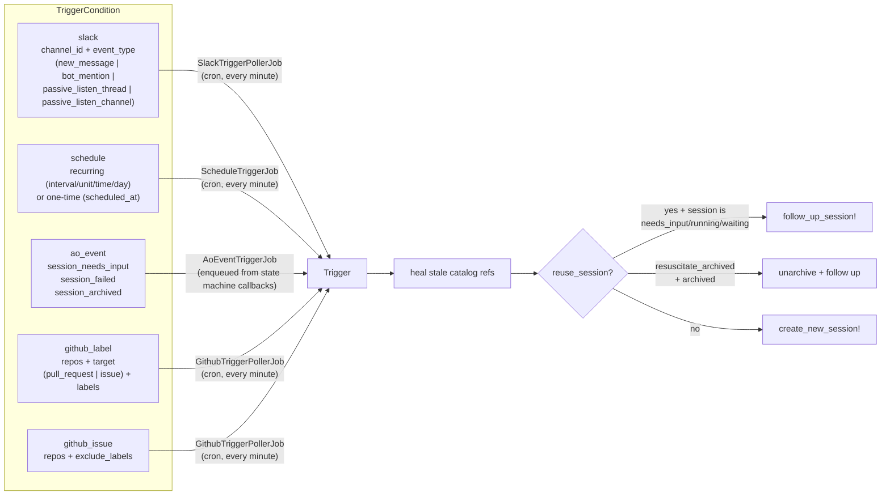
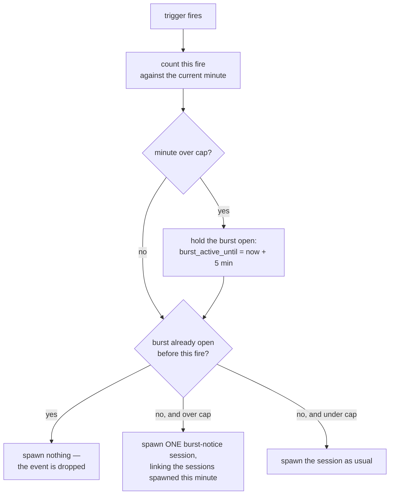

A **trigger** is a session template plus one or more conditions. When any condition fires, the
trigger creates a new session — or resumes an existing one.

Conditions on a trigger are ORed. Any one firing fires the trigger.

## The five condition types


```mermaid
flowchart LR
    subgraph conditions["TriggerCondition"]
        SL["slack<br/>channel_id + event_type<br/>(new_message | bot_mention |<br/>passive_listen_thread | passive_listen_channel)"]
        SC["schedule<br/>recurring (interval/unit/time/day)<br/>or one-time (scheduled_at)"]
        AO["ao_event<br/>session_needs_input<br/>session_failed<br/>session_archived"]
        GL["github_label<br/>repos + target<br/>(pull_request | issue) + labels"]
        GI["github_issue<br/>repos + exclude_labels"]
    end

    SL -->|"SlackTriggerPollerJob<br/>(cron, every minute)"| T["Trigger"]
    SC -->|"ScheduleTriggerJob<br/>(cron, every minute)"| T
    AO -->|"AoEventTriggerJob<br/>(enqueued from state machine callbacks)"| T
    GL -->|"GithubTriggerPollerJob<br/>(cron, every minute)"| T
    GI -->|"GithubTriggerPollerJob<br/>(cron, every minute)"| T

    T --> H["heal stale catalog refs"]
    H --> D{"reuse_session?"}
    D -->|"yes + session is<br/>needs_input/running/waiting"| FU["follow_up_session!"]
    D -->|"resuscitate_archived<br/>+ archived"| RS["unarchive + follow up"]
    D -->|no| NEW["create_new_session!"]
```

### `slack`

Polls a channel for `new_message`, `bot_mention`, or one of the two passive-listening event types.
Optionally scoped to a thread (`thread_ts`) and an allowlist of user IDs.

#### Picking the channel

In the triggers form the Slack channel is chosen from a dropdown that lazily loads the channels the
bot can see — `GET /triggers/channels`, backed by Slack's `conversations.list` — the first time a
Slack condition is shown, rather than on every page load. Selecting a channel stores its
`channel_id` (the value the poller keys on) under the hood and saves the human-readable
`channel_name` alongside it as a display cache. If the list can't be loaded — Slack unconfigured, an
API error, or a workspace the bot isn't in — the form falls back to a manual channel-ID input so a
trigger can still be created, and a saved channel that is no longer in the accessible list is kept
selected rather than silently blanked.

#### Who may trigger a `bot_mention` (or a passive listener)

Three layers, most specific first:

1. **The condition's own `allowed_user_ids`** (set from the triggers UI or the API), if present.
2. **`SLACK_BOT_MENTION_ALLOWED_USER_IDS`** — a comma-separated list of Slack user IDs, read from
   encrypted credentials (`mcp_secrets`) first and process ENV second. This is how a deployment
   narrows the default.
3. **Otherwise: everyone.** An unconfigured Zimmer lets any member of the workspace @mention or DM
   the bot.

Zimmer's own messages never trigger anything, whatever the allowlist says — it posts to Slack with
the same token (`AlertService`), and a `bot_mention` condition with no channel configured polls
*every* channel the bot is in, so without that rule an alert could trigger a session that alerts.
Messages from *other* apps do still qualify: bots are valid trigger sources.

:::caution[The open default means any workspace member can spawn an agent session]
With `SLACK_BOT_MENTION_ALLOWED_USER_IDS` unset, anyone who can DM the bot — or @mention it in a
channel it has been invited to — can start a session. That is bounded by the bot only ever seeing
channels it is invited to, but it is a real grant. Set the allowlist on any deployment where the
workspace is larger than the circle of trust.
:::

:::caution[`thread_ts` doesn't work for bot mentions]
`TriggerCondition` explicitly rejects it: *"thread_ts is not supported for bot_mention
conditions."* You can watch a thread for new messages, but not for bot mentions. The same
applies to the passive-listening types — they walk threads themselves.
Tracked in [#78](https://github.com/tadasant/zimmer/issues/78).
:::

#### Passive listening (`passive_listen_thread`, `passive_listen_channel`)

An @mention is how you *start* a conversation with Zimmer. Passive listening is how it stays in one:
it fires on messages that continue a conversation Zimmer is already part of, with no mention
required.

It is **two** event types rather than one, because a Trigger ORs its conditions. Carry one, the
other, or both:

| Event type | Fires on | Requires | Bounded by |
| --- | --- | --- | --- |
| `passive_listen_thread` | A new reply in a thread | Zimmer has spoken in that thread | Nothing time-based. `RECHECK_HORIZON` (45 days) only bounds how far back a thread whose parent has scrolled out of recent history keeps being re-visited |
| `passive_listen_channel` | A new top-level message in a channel | Zimmer has posted **at the top level** of that channel within `CHANNEL_ENGAGEMENT_WINDOW` | 6 hours |

Thread replies are deliberately *not* time-bounded. A reply to a thread you are in is addressed to
that conversation whenever it lands. A top-level message in a busy channel is not, which is why
"recently involved" there has to be bounded by something explicit — otherwise one message months ago
would make Zimmer a permanent listener on every message in the channel.

:::note[A thread reply is not channel engagement]
`passive_listen_channel` counts only Zimmer's **top-level** posts. A reply it left inside a thread
makes it party to *that thread* — which is exactly what `passive_listen_thread` follows — not to
everything else said in the channel. This is the narrower of the two readings available, chosen
because the cost of under-firing is a message Zimmer misses and the cost of over-firing is noise in
a channel nobody asked it into.
:::

Both sweep channels exactly like `bot_mention` — one channel if `channel_id` is set, otherwise every
channel the bot is a member of — and keep the same cursors: per-channel in `channel_timestamps`,
per-thread in `thread_timestamps` (`"channel_id:thread_ts" => last_reply_ts`), advanced for
everything fetched whether or not it fired, so a quiet spell never replays as a burst. Aged-out
threads are re-visited under the same `MAX_TRACKED_THREAD_RECHECKS` (20 per channel per poll) cap,
reading only the tail since each thread's cursor. What changes is the filter: participation instead
of mention.

A `passive_listen_channel` condition never reads threads at all, and a `passive_listen_thread`
condition never reads or writes the channel-engagement signal. Each pays only for the thread and
history calls its own signal needs — both still sweep top-level messages per channel per poll, since
that cursor is what a first-sight thread falls back to.

Participation is answered without ever re-reading a thread's history. The first time a thread is
seen there is no cursor, so the read returns the whole thread — that read decides participation.
After that, every reply Zimmer has not already inspected is in the tail, and a thread it has spoken
in is remembered in `participating_threads`, so the tail alone is enough from then on.

Channel engagement is learned from what the poll already fetches: Zimmer's own posts in the last 50
top-level messages. The newest is remembered per channel in `bot_activity_timestamps` and only ever
moves forward, so a channel stays engaged for the full window even through polls where nothing has
moved, and a tick that happens to observe *older* activity can't wind it back and disengage early.

The alert channel (`ENG_ALERTS_SLACK_CHANNEL_ID`) is excluded from that signal. `AlertService` posts
there with the same token and therefore the same user ID, so one automated alert would otherwise
mark the channel engaged and turn the whole window of it into a session per message — in the one
channel guaranteed to be noisy when things are going wrong. Threads there are unaffected: if Zimmer
actually replied in one, that is a conversation and `passive_listen_thread` still follows it.

A thread seen for the first time has no cursor of its own and falls back to the channel's, which
tracks *top-level* messages — in a channel whose conversation lives in threads that can be weeks
old. It is clamped to `THREAD_BACKFILL_HORIZON` (24 hours), so meeting a thread late costs at most a
day of catch-up rather than the entire backlog. That is deliberately its **own** constant and not
`CHANNEL_ENGAGEMENT_WINDOW`: it bounds a one-off backfill on discovery, which has nothing to do with
how long a channel stays engaged, and tying the two together would silently retune first-discovery
behaviour every time the channel window is adjusted.

Passive listening never fires on:

- **Zimmer's own messages**, the same self-loop rule `bot_mention` has.
- **Any other app's messages.** `bot_mention` accepts them because an @mention is an explicit
  request; a passive listener firing on every CI notification that lands in a thread it once
  replied to is exactly the noise it must not make.
- **Channel-event subtypes** — joins, leaves, topic/purpose/name changes, huddles, pins, edits
  (`PASSIVE_IGNORED_SUBTYPES`). "Sam has joined the channel" is not a conversation continuing.
  Subtypes that *are* somebody talking — `file_share`, `me_message`, `thread_broadcast` — still
  fire.
- **DMs.** Every DM to the bot is already directed at it, and a `bot_mention` condition covers DMs
  unconditionally; firing passively there would double-spawn.
- **Anything that @mentions Zimmer.** Mentions belong to `bot_mention`; the passive types own
  everything else. See below.

The allowlist is the same three layers as `bot_mention` above, including
`SLACK_BOT_MENTION_ALLOWED_USER_IDS`.

:::note[Mentions belong to `bot_mention`, on both passive types]
A mention posted inside a thread Zimmer is in is *both* a mention and a reply in a participated
thread; a mention in an engaged channel is *both* a mention and a top-level message there. Both
conditions matched, so one Slack message spawned **two concurrent sessions on identical text** —
observed in production, one per matching trigger, on every mention. `passive_candidate?` therefore
excludes any message that mentions the bot, using the same `mentions_bot?` predicate `bot_mention`
filters on; two different notions of "is a mention" would leave a gap that double-fires again.

The exclusion is unconditional: it does not check that a `bot_mention` condition would in fact pick
the message up, because conditions are polled independently and none can see the others. So a
mention falls through the gap entirely if the deployment has no `bot_mention` condition, if that
condition is disabled or scoped to a different channel than the passive one, or if the two carry
different `allowed_user_ids`. That is the intended division of labour — being addressed directly is
what `bot_mention` is for — but it is a silent drop, so the poller logs one line at `info` naming
the message and the condition that declined it.
:::

:::caution[Restraint belongs in the prompt, not just the poller]
The poller decides which messages Zimmer *sees*. It cannot decide which deserve a reply — a
teammate saying "thanks, that worked" in a thread Zimmer is in fires the trigger just as a direct
follow-up question does. A passive-listening trigger's prompt template has to make silence the
default, and it should tell the session to add its :eyes: reaction only once it has decided to
respond, so the reaction is a commitment rather than an acknowledgement. See
[the draft template](#a-passive-listening-prompt-template).
:::

:::note[`passive_listen` is deprecated, not removed]
The original single event type fired on both signals at once. It still works — a deploy of the split
must not strand a trigger that names it — and behaves as though both new conditions were present,
including the 6-hour window and the top-level-only engagement rule. The triggers form offers it only
on a condition that already carries it; the REST API still accepts it, since it is a member of
`EVENT_TYPES` like any other. Removal is tracked in
[#253](https://github.com/tadasant/zimmer/issues/253).

**Replacing it means two fresh condition rows, and a fresh condition starts with empty
bookkeeping.** Carry the old condition's cursors across, or the two new ones are worse than the one
they replace in both directions at once:

- **They over-fire.** A fresh condition baselines its *channel* cursor on the first poll, which is
  the newest top-level message — in a thread-heavy channel that can be weeks old. On the second poll
  every thread is a first-sight thread, so each replays back to `THREAD_BACKFILL_HORIZON` (24 hours).
  Every reply from the last day in every thread Zimmer is in fires at once, bounded only by the
  trigger's `max_sessions_per_minute` (above which the rest are dropped).
- **They also under-fire, permanently.** A thread is only ever discovered through its parent
  appearing in the last 50 top-level messages, or through an existing `thread_timestamps` entry. A
  thread whose parent has already scrolled past that window and has no entry is invisible — and
  stays invisible, even after Zimmer next speaks in it.

Copy `thread_timestamps` and `participating_threads` onto the thread condition,
`bot_activity_timestamps` onto the channel condition, and `channel_timestamps` onto **both** (a
first-sight thread falls back to that cursor). Editing `configuration` directly is the only way:
the trigger form does not render these keys, and `TriggerCondition::SLACK_POLL_STATE_KEYS` exists
precisely so that saving the form does not *destroy* them.
:::

:::note[No stall detection]
`SlackTriggerHealthCheckJob` skips every passive-listening event type for the same reason it skips
`bot_mention`: the condition fans out across many channels, each with its own cursor, so there is no
single "newest message" to compare against.
:::

#### A passive-listening prompt template

A starting point for the trigger's `prompt_template`, tuned for restraint. `{{text}}`, `{{author}}`,
`{{channel}}` and `{{link}}` are interpolated by `Trigger#interpolate_prompt`.

```text
A message landed in #{{channel}}, in a Slack conversation you are already part of.
Nobody @mentioned you. You are here because you have spoken in this thread before,
or you posted in this channel within the last few hours.

Author: {{author}}
Message: {{text}}
Link: {{link}}

Your default is to say nothing. Most messages in a conversation you are part of are
not for you, and a wrong guess is worse than silence.

Read the thread with the slack-workspace MCP server before deciding anything.

Respond ONLY if one of these is clearly true:
- The message asks you something, or asks for something you were doing.
- It continues a task you were working on in this thread — an answer to a question
  you asked, a review of work you delivered, a report that something you shipped is
  broken.
- It is a direct instruction that plainly lands on you given what you were doing.

Stay silent if any of these is true:
- It is two people talking to each other, even about work you did.
- It mentions a topic, repo, or PR you touched, without asking you for anything.
- It is an acknowledgement, a reaction, or small talk ("thanks", "nice", "lol").
- You are unsure. Ambiguous means silent. Do not split the difference by posting a
  short reply just in case.

If you are staying silent: add NO reaction, post NOTHING, and archive your own
session immediately. That is a successful outcome, not a failure.

If you are responding: FIRST add an :eyes: reaction to the message, so the humans
know you have picked it up. The reaction is a commitment to reply — never add it
before you have decided to. Then do the work and reply in the thread.
```

### `schedule`

Either recurring (`interval` + `unit`, or `time` + `day_of_week` + `timezone`) or one-time
(`scheduled_at`). `ScheduleTriggerJob` is scheduled `* * * * *`, so a schedule is
minute-resolution. That is the cadence chosen for the job, not a platform limit — six-field
cron with a seconds field works, and three other pollers use it
([Background jobs](/operate/background-jobs/)).

#### When a one-time fire fails

A one-time trigger whose fire raises is **not** destroyed. `ScheduleTriggerJob` parks it in
the `failed` status, records `failed_at` and `last_error` on the row, and alerts. The trigger
stays in the list at `/triggers` with a red **Failed** badge and the error that stopped it, so
"wake me at 6am to check the deploy" cannot quietly become "you are not woken, and you find out
at 9".

`failed` is a third status alongside `enabled` and `disabled`, not a flavour of `disabled`:
"you turned this off" and "this tried to run and could not" are different facts. Every firing
path filters on `status = "enabled"`, so a failed trigger fires no more often than a disabled
one — that status, not a bumped timestamp, is what closes the infinite-retry loop.

Which is why the failure path deliberately leaves the condition's `last_triggered_at` alone.
The schedule stays *due*, so pressing **Re-arm** on the trigger (or calling `action_trigger`
with `action=toggle`) clears the failure and the wake fires for real on the next minute's tick.
No edit, no re-creation.

`CleanupStaleTriggersJob` skips failed triggers in both of its sweeps. A parked trigger is
lapsed by definition, so the lapsed-schedule heuristic would otherwise delete the evidence an
hour later — reintroducing exactly the silent loss the parking exists to prevent. Only you
clear a failed trigger.

Recurring schedules are unchanged: a bad tick advances `last_triggered_at`, the trigger stays
enabled, and it tries again on its next interval.

### `ao_event`

Fires when a *watched* session transitions to `session_needs_input`, `session_failed`, or
`session_archived`. Enqueued directly from the state machine's `pause` / `fail` / `archive`
callbacks (deferred via `after_all_transactions_commit`, so the row is visible to the job).

With `watched_session_id` it's session-scoped and one-shot. Without it, it's a broadcast, and
it only fires for `is_autonomous` sessions.

### `github_label`

Fires when one of the watched labels is **added** to a pull request or an issue in one of the
watched repos.

```json
{
  "repos": ["tadasant/zimmer", "tadasant/zimmer-catalog"],
  "target": "pull_request",
  "labels": ["ready to merge"]
}
```

`target` is `pull_request` (the default) or `issue`. Any *one* of `labels` firing is enough — they
are ORed, not ANDed. Up to 20 repos.

Labels are matched **case-insensitively**, because GitHub's `label:` search qualifier is. Typing
`Ready To Merge` for a repo label named `ready to merge` works.

The motivating flow: the `open-pr` skill applies `ready to merge` as its terminal act, and a
`github_label` trigger on that label is what picks it up and fires the merge gate.

### `github_issue`

Fires when a new issue is opened in one of the watched repos.

```json
{
  "repos": ["tadasant/zimmer"],
  "exclude_labels": ["hold issue work gate"]
}
```

#### Opting an issue out, with a label

`exclude_labels` is optional, and it is an **escape hatch for the issue's author**, not a filter for
whoever configured the trigger. An issue opened carrying *any* of those labels does not fire the
condition; every other issue still does. That is what makes it usable as a default-on gate you can
step around deliberately — the motivating case being a batch of issues filed at once, none of which
should each spawn a session.

The exclusion is expressed as a negation in the search itself, one `-label:` term per entry:

```
is:issue (repo:tadasant/zimmer) created:>=… -label:"hold issue work gate"
```

Negations are ANDed, so an issue is returned only if it carries **none** of the excluded labels. An
excluded issue is never seen by the poller at all: it does not fire, and it does not advance the
cursor past itself either.

:::caution[The label has to be there when the issue is created]
The exclusion is evaluated at *search* time, and the poll runs every minute. Label the issue as you
open it —

```sh
gh issue create --label "hold issue work gate" --title "…" --body "…"
```

— rather than opening it and adding the label a moment later. A label added after the fact races the
next tick, and if the tick wins, the trigger has already fired.

*Removing* the label later is not a reliable way to un-hold an issue either. The poller re-queries a
30-minute window behind its cursor, and that cursor advances only when an issue **fires** — so the
window trails the last fired issue rather than the clock. Un-holding re-exposes the issue when
nothing else has fired past it since, and does nothing once something has. Open a fresh issue when
you want the gate.
:::

Editing `exclude_labels` does **not** re-baseline the condition — unlike `repos`, `labels` and
`target`, which do. Re-baselining exists to stop a *widened* watch from stampeding sessions for
everything already matching; an exclusion only ever narrows, and a `github_issue` condition's state
is a time cursor, so a narrowing cannot make an old issue look new. Throwing the cursor away on
every edit would instead skip the issues opened between the edit and the next tick.

### What a GitHub-triggered session receives

The prompt template can use `{{repo}}`, `{{number}}`, `{{link}}`, `{{title}}`, `{{author}}`,
`{{text}}` (the body), `{{labels}}` and `{{event}}`.

A template that names *none* of them gets the item appended as a context block instead, so a
GitHub-triggered session always knows its repo, number and URL without re-fetching them.

### The state-vs-event problem, and what Zimmer chose

"A label was added" is an **event**, but a poll can only observe **state** — the label is
*currently* there. A timestamp cursor cannot bridge that gap: a PR's `updated_at` moves for every
push and comment, so a cursor would either re-fire a still-labelled PR forever or miss a label
added during a quiet moment.

So `github_label` conditions keep a **seen-set**, not a cursor. Each tick asks GitHub for the set
of open items that currently carry a watched label, keys them as `owner/repo#number:label`, and
fires on the *difference* against the previous tick. That set then becomes the new seen-set.

A key is not dropped from the seen-set the instant it is missing, though. GitHub's search index is
eventually consistent, so a still-open, still-labelled PR can vanish from one tick's results and
return on the next. Treating that single miss as a label removal drops the key, and the reappearing
PR then looks new and re-fires a duplicate session — the label poller's version of the index lag the
`github_issue` path below guards against. So a missing key is **retained through a short grace
window** (`GithubTriggerPollerJob::REMOVAL_GRACE_TICKS` consecutive misses — roughly three minutes at
the one-minute cadence, tracked in the companion `seen_missing_counts`) before it is accepted as
genuinely unlabelled. A real removal simply takes that long to register.

The semantics that follow — all of them covered by tests:

| Situation | What happens |
| --- | --- |
| Label added to a PR | Fires **once**. |
| PR keeps the label across many ticks | Never re-fires — the key stays in the seen-set. |
| PR already carried the label when you created the trigger | **Does not fire.** The first tick records a baseline and fires nothing. |
| PR briefly drops out of the search (index blip) then returns | **Does not re-fire.** The key is held through the grace window, so the reappearance is not seen as new. |
| Label removed, then added again | Fires **again**, once the removal has persisted through the grace window. Removal eventually drops the key; re-adding makes it new. |
| Two watched labels added to one item | Two events, so two sessions. Keys are per `(item, label)`. |
| A tick is skipped (deploy, rate limit) | Harmless. The seen-set is state, not a cursor, so the next tick still sees the label. Misses are only counted on a real poll, so downtime never expires a key's grace early. |
| PR is closed or merged while labelled | Drops out of the `is:open` search; after the grace window it leaves the seen-set. If it is reopened still labelled, it fires again. |
| You add a repo or a label to the condition | The condition **re-baselines**. Items already labelled in the newly-watched scope are absorbed, not stampeded into sessions. |
| A `reuse_session` trigger *drops* the follow-up (target session busy) | Not counted as a fire. The item stays unseen and is retried next tick, rather than the event being silently consumed. |
| Session creation fails for an item | Same — the item is not recorded, so the next tick retries it. |

`github_issue` conditions are genuinely event-shaped — an issue's creation time never changes — so
those use an ordinary `created_at` cursor. Two wrinkles, both of which would otherwise lose issues
silently:

- GitHub's `created:` qualifier has only *second* granularity, so a strict `>` would drop an issue
  that shared its second with the previous tick's newest. The cursor is inclusive (`>=`).
- GitHub's search index is eventually consistent **and unordered** — of two issues opened seconds
  apart, the newer can be indexed first. A cursor that advanced to the newer one would then never
  see the older. So each tick re-queries a **30-minute window behind** the cursor
  (`GithubTriggerPollerJob::INDEX_LAG_GRACE`), and a set of already-fired keys covering that window
  is what stops the re-query from firing them twice. Observed indexing lag in practice is seconds;
  an issue indexed more than 30 minutes late is missed.


In both cases state advances only for items that actually produced a session. A failure to create
one leaves the item to be retried on the next tick rather than swallowing it.

### Rate-limit budget

Every condition costs **one** search request per tick, whatever its repo count: GitHub's search API
expresses all the watched repos and labels as a single query.

```
is:open is:pr (repo:tadasant/zimmer OR repo:tadasant/zimmer-catalog) (label:"ready to merge")
```

The search API is rate-limited **separately** from the core API — 30 requests/minute authenticated,
against core's 5,000/hour. At one tick per minute, *N* GitHub conditions cost *N* of those 30. The
existing `GithubCommentPollerJob` spends from the core bucket, so the two never contend.

Polling every minute holds comfortably: ~10 conditions is a third of the search budget, and adding
repos to a condition is free.

:::caution[The query syntax is pinned on purpose]
GitHub is migrating its issue-search API to an "advanced" query syntax, and the two syntaxes are
mutually incompatible for the multi-repo query this poller is built on — legacy wants
`repo:a repo:b` (implicit OR) and 422s on the explicit form; advanced wants `(repo:a OR repo:b)`
and *silently returns zero rows* for the implicit one.

The silent zero is the dangerous half. Under the seen-set semantics an empty result means "nothing
carries the label", so a query that quietly started being evaluated as advanced would drain the
seen-set and then re-fire every labelled item the moment the syntax was corrected.
`GithubSearchService` therefore pins `advanced_search=true` on every request, so the syntax Zimmer
builds is the syntax GitHub evaluates — whichever default the API ends up settling on.
:::

:::note[No gh credential → the poller skips, it does not storm]
The poller shells out to the `gh` CLI, which authenticates from a `gh auth login` credential or a
`GH_TOKEN`/`GITHUB_TOKEN` in the environment. On an instance whose worker has neither, every tick
would otherwise fail one API call per condition and alert on each — an every-minute error storm over
a missing credential.

So each tick preflights `GithubSearchService.configured?` (a quiet `gh auth status`) and returns early
when it is false, logging a single WARN — the same shape as `SlackTriggerPollerJob`'s
`return unless SlackService.configured?`. This is deliberately distinct from a transient API failure on
a *configured* host (a rate-limit or network blip), which still raises and alerts, because that is a
real incident rather than an unconfigured environment.
:::

## Burst control

A trigger can cap how many sessions it spawns per minute: **max sessions per minute**
(`Trigger#max_sessions_per_minute`, on the triggers form, the REST API, and the `action_trigger` MCP
tool). It is **opt-in** — unset means unbounded, which is how every trigger behaved before the
setting existed.

It exists because nothing bounded a trigger before. A burst of messages in a watched Slack channel
spawned one session per message — 50 of them, trashed by hand — and a sustained outage generating
alerts could have spawned sessions until the fleet was overwhelmed. A single Slack poll tick can
carry many messages, so the cap has to bound spawns *within* a tick, not just across ticks.

The cap is enforced at `Trigger#create_session!` — the one chokepoint every condition type funnels
through — so it covers `slack`, `schedule`, and `ao_event` triggers at once.


```mermaid
flowchart TD
    F["trigger fires"] --> C["count this fire<br/>against the current minute"]
    C --> O{"minute over cap?"}
    O -->|yes| X["hold the burst open:<br/>burst_active_until = now + 5 min"]
    O -->|no| B
    X --> B{"burst already open<br/>before this fire?"}
    B -->|yes| S["spawn nothing —<br/>the event is dropped"]
    B -->|"no, and over cap"| BN["spawn ONE burst-notice session,<br/>linking the sessions spawned this minute"]
    B -->|"no, and under cap"| N["spawn the session as usual"]
```

What each state means:

- **Under the cap:** the trigger spawns exactly as it does today.
- **Over the cap:** the trigger spawns **one** burst-notice session instead of the session the event
  asked for. Its prompt links the sessions the trigger already spawned in that window (so you can
  jump straight to them), quotes the event that tipped the cap, and asks the agent to investigate the
  burst rather than work the events. That session carries no goal — the trigger's goal describes the
  work the *event* asked for, not investigating a burst — and it never becomes the `reuse_session`
  target.
- **During the burst:** the trigger spawns **nothing at all**, and sends **no further notices**. An
  outage that alerts for an hour keeps the trigger quiet for that hour and still produces exactly one
  notice.

A burst ends **five minutes** (`Trigger::BURST_COOLDOWN`) after the last minute in which the trigger
**exceeded its cap**. That "exceeded its cap" is load-bearing: the cooldown is pushed forward only by
a window that is itself over the cap, never by the individual dropped events. Extending it on every
dropped event — the obvious implementation — means a channel with any baseline chatter can never
leave a burst, because each ordinary message renews the suppression: one 50-message spike would
silently disable the trigger forever.

The cooldown is also deliberately several times the one-minute poll cadence. At one minute it would
expire exactly as the next tick's events arrive, refilling the cap and producing a fresh notice every
minute — the stream this control exists to prevent.

**Escape hatch:** re-saving a trigger's cap clears any burst in progress, so a trigger that is still
suppressing (because events really are still pouring in) can be brought back immediately rather than
waited out. Clearing the cap entirely does the same and returns the trigger to unbounded.

:::caution[Suppressed events are dropped, not queued]
The Slack poller advances its cursor past every message it fetched, whatever each message produced.
Messages suppressed during a burst are therefore **dropped** — not replayed when the burst ends.
That's deliberate: replaying them would spawn the very sessions the cap just prevented. The
burst-notice session is your record that they happened.
:::

Follow-ups into a **reused** session are not capped: they spawn nothing, and a `reuse_session`
trigger tops out at one session by construction. The cap counts *new session spawns*.

The state lives on the trigger row (`burst_window_started_at`, `burst_window_count` — fires
*attempted* in the window, not sessions spawned — `burst_window_session_ids`, and
`burst_active_until`). The check-and-reserve happens under a row lock, so two jobs firing the same
trigger concurrently can neither both take the last slot nor both open the burst. The window is
anchored at the first fire and tumbles, rather than sliding.

A fire that is burst-suppressed delivered nothing, so it does not count as a fire for the trigger's
own bookkeeping either: `ScheduleTriggerJob` leaves the schedule due (it fires for real once the
burst ends), and `AoEventTriggerJob` leaves a session-scoped condition's one-shot guard unspent.
Neither auto-deletes a one-time trigger on a suppressed fire.

## Wake-up semantics

Triggers are the backing store for two MCP tools Zimmer gives its own agents: "wake me up later"
and "wake me up when that other session changes state." Zimmer schedules the same one-time
triggers on its own behalf — `AuthOutageParkService` uses one to retry a session parked because
the login pool ran dry. Two mechanisms make this reliable:

**Auto-sleep.** `Trigger#sleep_target_session_if_applicable` runs on trigger creation. If the
target session is `needs_input`, it sleeps immediately (`needs_input → waiting`). If it's
`running`, it sets `metadata["pending_sleep"] = true` and the sleep happens on the next `pause`.
So an agent can say "wake me in an hour" mid-turn without stranding itself.

**Immediate fire on already-matched state.** `Trigger#fire_ao_event_immediately_if_state_matches`
row-locks each watched session *inside the creation transaction* and enqueues the job immediately
if the watched session is already in the target state. This closes the footgun where you
register a watcher after the transition already happened and then sleep forever.

**Sibling cleanup.** The recommended pattern is to register three `ao_event` watchers
(`needs_input`, `failed`, `archived`) plus a `wake_me_up_later` deadline backstop — whichever
fires first wins. After a successful one-time fire, `destroy_sibling_wakes!` deletes the others
pointing at the same session. Unless the follow-up was *dropped*, in which case siblings are
preserved.

:::note[Most of those siblings are dead weight]
`app/models/trigger.rb:190` says so out loud: *"backstop sibling group, and only one of them ever
fires usefully."* It's a correct design given the primitives, but it means a single logical
"wait for that session" creates four trigger rows.
:::

**Loop prevention.** A session whose `metadata["trigger_id"]` equals the trigger will never
re-fire that trigger.

## Everything is polled

Everything external is polled. There are no webhooks anywhere in Zimmer — including the GitHub
trigger types, which poll the search API rather than receiving `issues`/`pull_request` webhook
deliveries. Webhooks would need a public ingress that Zimmer's tailnet posture does not currently
offer; polling needs nothing but the outbound `gh` credential that is already there.

| Job | Cadence |
| --- | --- |
| `SlackTriggerPollerJob` | every minute |
| `ScheduleTriggerJob` | every minute |
| `GithubTriggerPollerJob` | every minute |
| `GitHubPullRequestPollerJob` | every 30 seconds |
| `GithubCommentPollerJob` | every 30 seconds |
| `GitHubMergeConflictPollerJob` | every 2 minutes |
| `SlackTriggerHealthCheckJob` | hourly at :45 |
| `CleanupStaleTriggersJob` | reaps leftovers |

:::caution[While Slack is rate-limiting you, Slack triggers fire late]
`SlackTriggerPollerJob` is confined to a `pollers` queue with `total_limit: 1`, so while it runs it
is Slack polling for the whole instance.

It does not wait a throttle out on that slot. `SlackService` absorbs a short blip in process (three
retries, backing off 1s, 2s, 4s) and hands anything longer back; the job then reschedules itself —
30s, 60s, 120s, 240s, 480s, or Slack's own `retry_after` if that is longer — and frees the worker
thread. The cron ticks in between are still no-ops, but they are no longer landing on a run parked
in a `sleep`.

Nothing is lost — `last_message_ts` is a cursor, so the next successful poll still sees the messages
— but a trigger can fire minutes after the message that should have fired it. After five deferrals
the job alerts and the ordinary once-a-minute cadence takes over.
:::

:::note[Triggers have no input validation — this is a known design gap]
[Issue #18](https://github.com/tadasant/zimmer/issues/18) argues there is nothing between "event
arrived" and "agent running" except a `gsub` on a `prompt_template`. Untrusted Slack text is
interpolated straight into the prompt, and the agent is then trusted to act on identifiers it
read out of that text — making it a *trusted courier* for untrusted input. The proposal is a
third primitive (`Workflow`) between Trigger and Session.
Tracked in [#50](https://github.com/tadasant/zimmer/issues/50).
:::
