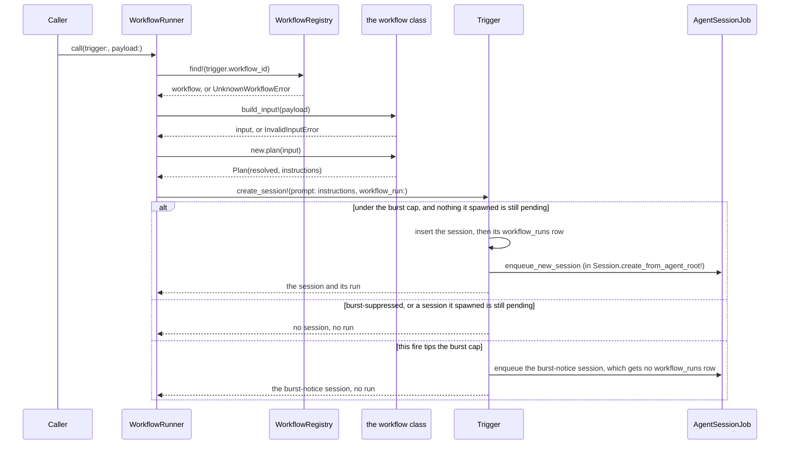

A **workflow** is a procedure written as a Ruby class in `app/workflows/`. A trigger can run one
instead of rendering its prompt template. It sits between the two primitives Zimmer already had:

**Trigger → Workflow → Session**

| Primitive | What it is | Lives in | Role |
| --- | --- | --- | --- |
| Trigger | data | Postgres | Binds an event to what should run. Editable without a deploy. |
| Workflow | code | this repo | Validates the event's payload, decides the trusted identifiers, writes the seed prompt. Never stored in the database. |
| Session | resource | the agent runtime | The agent run itself. |

A template trigger `gsub`s its event into a string and starts a session with it. Nothing checks the
payload, and every identifier the poller had in hand — a channel id, a thread timestamp — reaches
the agent only as prose, if at all. A workflow gives that path three things it lacks: a place to
reject a malformed payload before a token is spent, a place to put identifiers the model can read
but cannot rewrite, and a procedure two triggers can share and a PR can review. The full argument
is on [#18](https://github.com/tadasant/zimmer/issues/18).

:::caution[Nothing fires a workflow in production yet]
This is Phase 0 of #18: the contract, the registry, the run record and one reference workflow
(`echo`), all covered by tests. No firing site calls `WorkflowRunner`, no surface — web form, REST,
MCP or `/supervisor` — can set a trigger's `workflow_id`, and every trigger in production is a
template trigger that behaves exactly as it did before. See [What comes next](#what-comes-next).
:::

## Anatomy of a workflow

```ruby
# app/workflows/echo_workflow.rb
class EchoWorkflow < ApplicationWorkflow
  workflow_id "echo"
  title "Echo"
  description "Restate a message back, verbatim. The reference workflow: it resolves nothing and equips nothing."

  param :message, :text, required: true, label: "Message", widget: :textarea,
    help: "The text the agent restates.", example: "Hello from a workflow."

  def plan(input)
    Workflow::Plan.new(
      resolved: {},
      instructions: <<~MD
        Restate the message below back, verbatim, and do nothing else.
        ...
        <message>
        #{input.message}
        </message>
      MD
    )
  end
end
```

- **`workflow_id`** is what a trigger stores in `triggers.workflow_id`. It is opaque and permanent:
  dotted lower-snake segments (`echo`, `slack.triage_mention`), declared once, and independent of
  the class name, so a workflow can be renamed without orphaning its triggers.
- **`title`** and **`description`** are for people. The label is `title` rather than `name` because
  `name` is `Module#name`, and overriding it on a class breaks every error message and autoloader
  lookup that asks the class what it is called.
- **`param`** declares one input. It is a descriptor first — `label`, `help`, `widget`, `example`
  and `options` are what a param form will be rendered from — and the validation is derived from it.
- **`requires`** names what a run needs from the catalog: `agent_root:`, `mcp_servers:`, `skills:`
  and `goal:`. Names, not credentials. `echo` declares none.
- **`plan(input)`** turns validated input into a `Workflow::Plan`.

## The input boundary

`ApplicationWorkflow.build_input!(payload)` validates the payload against the workflow's params and
raises `Workflow::Input::InvalidInputError`, carrying every problem at once, before a session exists.
It is strict in three ways ActiveModel on its own is not:

- **An unknown key is an error.** A payload with a field the workflow does not declare is a payload
  it does not understand, so it is refused rather than dropped.
- **A value must already be its type.** ActiveModel would cast `"abc"` to `0` for an integer and to
  `true` for a boolean. The boundary accepts only the type itself or its unambiguous string spelling:

  | Type | Accepts | Becomes |
  | --- | --- | --- |
  | `string` | a String | String |
  | `text` | a String (a textarea, when forms exist) | String |
  | `integer` | an Integer, or a string of digits | Integer |
  | `boolean` | `true`, `false`, `"true"`, `"false"` | true / false |
  | `date` | a Date, or `"YYYY-MM-DD"` naming a real date | Date |

- **`required` means present.** A missing or whitespace-only value fails; `false` satisfies a
  required boolean.

A param with `options:` accepts only those values.

## `resolved` and `instructions`

`#plan` returns two outputs, kept apart because they are trusted differently:

- **`resolved`** holds the identifiers the run may act on: a reply channel id, the acting principal,
  a target repo. It is recorded on the run's `workflow_runs` row. The agent may be shown it; nothing
  the agent says can change it. It has to be JSON already — a Symbol or a Time is refused, because it
  would come back out of the column as something else.
- **`instructions`** is the seed prompt. The model is free to interpret it, which is why nothing that
  has to be trustworthy goes in it.

`#plan` may look things up, but it may not cause side effects, and it must raise rather than guess
when a lookup fails. It runs before the session exists, so a raise leaves nothing behind.

## The run record

`workflow_runs` has one row per session a workflow started: `session_id` (unique), `trigger_id`,
`workflow_id`, the validated `input` and `resolved`, both `jsonb`. It is deliberately not
`sessions.metadata`, which dozens of code paths write.

A run is written once and is read-only afterwards — `WorkflowRun#readonly?` refuses every write
through a record: `save`, `update!`, `update_columns`. (A class-level `update_all` bypasses it, as it
bypasses every model rule.) It is written the moment the session row commits and before the
session's start job is enqueued, so by the time anything spawns the agent, `resolved` is on record.
The foreign keys never block cleanup elsewhere: deleting a session deletes its run, and deleting a
trigger keeps the run and clears its `trigger_id`.

Runs are listed at `/supervisor/workflow_runs`, index and show only — the panel has no form and no
Delete button, because a run refuses both.

## Running one from a trigger

`WorkflowRunner.call(trigger:, payload:)` is the whole path:



The spawn goes through the trigger's own `create_session!`, so a workflow fire gets the
[burst cap](/sessions/triggers/#burst-control), [pending-session
dedup](/sessions/triggers/#skip-while-a-session-is-still-pending), genesis and fire counters a
template fire gets. What differs is the prompt, which is the plan's `instructions`, and the
equipment, which is the workflow's:

- **MCP servers and skills are a union** of the agent root's defaults and what the workflow declares.
- **Hooks and plugins** are the root's defaults. A workflow cannot declare them.
- **The goal** is the workflow's declared goal id, resolved to its text at spawn the same way a
  trigger's goal is. With none declared, the session has no goal.

Everything that goes wrong before the spawn fails closed — no session, no run, and the trigger's
counters do not move: an unregistered id, a payload that fails validation, a `#plan` that raises, and
a `#plan` that returns anything but a `Workflow::Plan`. A burst-suppressed fire creates nothing. A
fire that tips the burst cap spawns the usual burst-notice session, which is not a run of the
workflow and gets no `workflow_runs` row.

### What a workflow trigger gives up

A trigger has **exactly one** of `prompt_template` and `workflow_id`. The model validates it, and
the `triggers_prompt_template_xor_workflow_id` check constraint holds the database to it even for a
write that skips validations. A blank `prompt_template` on a workflow trigger is stored as NULL,
because every edit form submits the field. Beyond its template, a workflow trigger:

- **may not set `reuse_session`.** `resolved` is bound to a session when it spawns, and letting a
  later fire re-bind a conversation already running is a privilege-escalation shape nobody has
  designed yet. The model validates it, the `triggers_workflow_trigger_never_reuses_session` check
  constraint holds the database to it, and `create_session!` refuses a workflow trigger's reuse fire
  regardless. The per-session wakes are all reuse triggers, so they stay template triggers.
- **carries no equipment of its own.** Its `mcp_servers`, `catalog_skills`, `catalog_hooks` and
  `catalog_plugins` must be empty and its `goal` blank. The workflow declares them.
- **is pinned to the workflow's agent root**, when the workflow declares one. A root-agnostic
  workflow like `echo` declares none, and then the trigger's `agent_root_name` decides.
- **is never healed onto a successor root.** A template trigger whose root left the catalog is
  [repointed at a matching successor](/sessions/triggers/#an-agent-root-the-catalog-does-not-carry-yet)
  on its next fire. A workflow trigger is not: repointing it would start the run in a root nobody
  reviewed the workflow for, so an agent root the catalog does not carry raises at spawn instead.
- **names a registered workflow.**

The template firing sites still call `Trigger#interpolate_prompt` and `create_session!(prompt:)`
directly. A workflow trigger reaching either raises instead of starting a session from a prompt it
does not have.

## The registry

`WorkflowRegistry::WORKFLOWS` lists every workflow by hand, and `WorkflowRegistry.find!` raises
`UnknownWorkflowError` — a `KeyError` — for any id not on it. The list is deliberately not built by
self-registration: under Zeitwerk, a `Class.inherited` hook runs only once a class has loaded, which
is every class in production (eager loading) and only the referenced ones in test and development.
A registry filled that way would be complete in one environment and empty in another.
`test/workflows/workflow_registry_test.rb` fails if a class under `app/workflows/` is missing from
the list or two workflows claim one id.

## Catalog references are checked in CI, not healed at runtime

A trigger's catalog references are data, so they can go stale between deploys, and a fire
[heals around a name the catalog stopped resolving](/sessions/triggers/#stale-catalog-references).
A workflow's references are code. `test/workflows/workflow_catalog_references_test.rb` resolves every
registered workflow's declared agent root, MCP servers, skills and goal against the real catalog, so
the PR that removes or renames a catalog entry a workflow needs fails CI and names the workflow.

If the catalog drifts at runtime anyway, the spawn still fails closed: a session will not validate
with an MCP server or skill the catalog cannot resolve, and an unknown agent root raises.

## Decisions made so far

Phase 0 had to answer some of #18's open questions to exist. Each answer is the conservative one,
and each is open to revisiting:

- **`plan` may do I/O, for resolution only.** No side effects, and a failed lookup raises. There is
  no retry or dead-letter yet: the exception reaches whoever called `WorkflowRunner`.
- **Equipment is a union with the root's defaults**, not an override. A workflow cannot yet ask for a
  narrower tool surface than its root's.
- **Workflow ids are not versioned.** Nothing re-runs a stored input yet, so a param change cannot
  yet break one.
- **No reuse.** See above.

## What comes next

- **Phase 1** — `slack.triage_mention`, the first real workflow, with a `reply_in_thread` tool bound
  to the `resolved` reply channel so the model has no argument through which to post anywhere else.
  Alongside it, `LegacyTemplateWorkflow` and a `Trigger#fire!` refactor, so every firing site goes
  through `WorkflowRunner` and template triggers become one quarantined workflow.
- **Phase 2** — a `/workflows` index and show page, a template/workflow toggle on the trigger form,
  and `POST /workflows/:id/runs` for parameterized manual runs.
- **Phase 3** — reuse semantics for workflow triggers, and retiring the template path if no template
  triggers remain.
